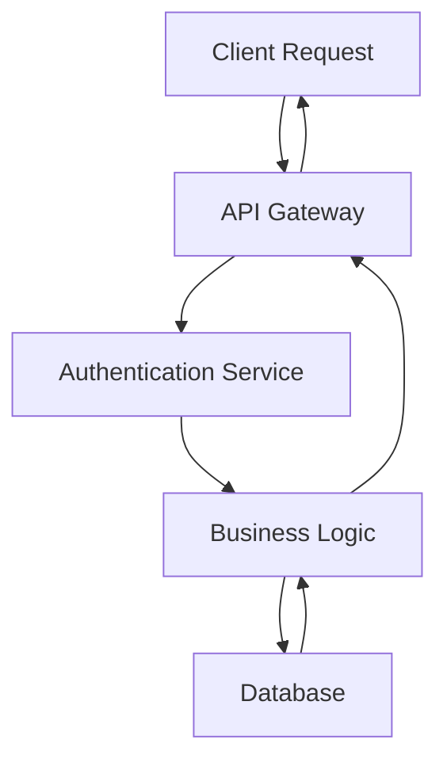

# AGENTS Guidelines

This document establishes coding and documentation standards for all code generated by Cline. All standards are based on Google's official style guides for Python, Go, and Java, ensuring industry-standard code quality, readability, and maintainability across all projects.

## Writing Style

All code and documentation must follow these principles:

- Write in a simple, concise, and professional manner
- Use direct technical communication without conversational filler
- Avoid emojis, decorative elements, or unnecessary formatting
- Focus on clarity and precision over friendliness
- Use standard technical terminology consistently

## Code Documentation Standards

### Python

Documentation is required for all functions, classes, and modules following Google Python Style Guide standards.

**Docstring Format:**
- Use triple-quoted `"""` format for all docstrings
- First line: brief summary (one line, ending with period)
- Followed by blank line if additional content exists
- Include Args, Returns, and Raises sections as needed

**Example:**
```python
def calculate_total(items: list[dict], tax_rate: float = 0.0) -> float:
    """Calculates the total cost including tax.

    Args:
        items: List of item dictionaries with 'price' keys.
        tax_rate: Tax rate as decimal (e.g., 0.08 for 8%).

    Returns:
        Total cost including tax.

    Raises:
        ValueError: If tax_rate is negative.
    """
    if tax_rate < 0:
        raise ValueError(f"Tax rate cannot be negative: {tax_rate}")
    subtotal = sum(item["price"] for item in items)
    return subtotal * (1 + tax_rate)
```

**Requirements:**
- All public functions, classes, and modules must have docstrings
- Use type hints for function parameters and return values
- Include inline comments for complex logic only
- Comments should explain "why" not "what"

### Go

Documentation follows Go's standard conventions and Google Go Style Guide.

**Comment Format:**
- Package-level documentation required at top of package files
- Function comments start with the function name
- Use complete sentences with proper punctuation
- Comments appear directly before the declaration

**Example:**
```go
// Package calculator provides utilities for financial calculations.
package calculator

// CalculateTotal computes the total cost including tax.
// Returns an error if taxRate is negative.
func CalculateTotal(items []Item, taxRate float64) (float64, error) {
    if taxRate < 0 {
        return 0, fmt.Errorf("tax rate cannot be negative: %f", taxRate)
    }
    var subtotal float64
    for _, item := range items {
        subtotal += item.Price
    }
    return subtotal * (1 + taxRate), nil
}
```

**Requirements:**
- All exported functions, types, and constants must have comments
- Comments should be complete sentences
- Package documentation required in package files
- Inline comments only for non-obvious logic

### Java

Documentation follows Google Java Style Guide using Javadoc format.

**Javadoc Format:**
- Use `/** */` for all public classes and methods
- First line: summary fragment (noun or verb phrase)
- Include `@param`, `@return`, and `@throws` tags
- Each tag description starts on same line or next line

**Example:**
```java
/**
 * Calculates the total cost including tax.
 *
 * @param items list of items with price information
 * @param taxRate tax rate as decimal (e.g., 0.08 for 8%)
 * @return total cost including tax
 * @throws IllegalArgumentException if taxRate is negative
 */
public double calculateTotal(List<Item> items, double taxRate) {
    if (taxRate < 0) {
        throw new IllegalArgumentException(
            "Tax rate cannot be negative: " + taxRate);
    }
    double subtotal = items.stream()
        .mapToDouble(Item::getPrice)
        .sum();
    return subtotal * (1 + taxRate);
}
```

**Requirements:**
- All public classes, methods, and fields must have Javadoc
- Use `@param` for each parameter
- Use `@return` for non-void methods
- Use `@throws` for declared exceptions
- Summary fragment should not be a complete sentence

## General Code Quality Standards

### Naming Conventions

**Python:**
- Functions and variables: `lower_with_under`
- Classes: `CapWords`
- Constants: `CAPS_WITH_UNDER`

**Go:**
- Exported identifiers: `CapitalizedCamelCase`
- Unexported identifiers: `lowerCamelCase`
- Acronyms: all caps (e.g., `HTTPServer`)

**Java:**
- Classes: `UpperCamelCase`
- Methods and variables: `lowerCamelCase`
- Constants: `UPPER_SNAKE_CASE`

### Project Structure and Directory Naming

Follow language-specific best practices for organizing project directories.

**Python:**
- Package/module directories: `lowercase_with_underscores`
- Standard project layout:
  ```
  project_name/
  ├── src/
  │   └── package_name/
  │       ├── __init__.py
  │       └── module_name.py
  ├── tests/
  │   └── test_module_name.py
  ├── docs/
  ├── README.md
  └── pyproject.toml
  ```
- Use `__init__.py` to mark directories as packages
- Separate source code (`src/`) from tests (`tests/`)

**Go:**
- Package directories: `lowercase` (no underscores or hyphens)
- Standard project layout:
  ```
  projectname/
  ├── cmd/
  │   └── appname/
  │       └── main.go
  ├── pkg/
  │   └── packagename/
  │       └── file.go
  ├── internal/
  │   └── internalpackage/
  │       └── file.go
  ├── README.md
  └── go.mod
  ```
- One package per directory
- Use `internal/` for private packages
- Use `cmd/` for application entry points

**Java:**
- Package directories: `lowercase` (no underscores)
- Standard Maven/Gradle layout:
  ```
  project-name/
  ├── src/
  │   ├── main/
  │   │   ├── java/
  │   │   │   └── com/example/projectname/
  │   │   │       └── ClassName.java
  │   │   └── resources/
  │   └── test/
  │       └── java/
  │           └── com/example/projectname/
  │               └── ClassNameTest.java
  ├── README.md
  └── pom.xml (or build.gradle)
  ```
- Mirror package structure in directory hierarchy
- Separate main code from test code

**General Guidelines:**
- Keep directory names short and descriptive
- Use consistent naming throughout the project
- Avoid special characters in directory names
- Document project structure in README.md
- Follow language-specific conventions strictly

**README.md Requirements:**
Every README.md file must include a project structure section that:
- Shows the directory layout
- Explains the purpose of each major directory
- Follows the same professional writing standards
- Uses clear, concise descriptions

### Function Documentation Requirements

Every function must include:

1. **Purpose**: What the function does (first line)
2. **Parameters**: Description of each parameter
3. **Return value**: What is returned (if applicable)
4. **Exceptions**: What errors can be raised/thrown
5. **Side effects**: Any state changes or external interactions

### Comment Best Practices

- Write comments for complex algorithms or business logic
- Explain "why" decisions were made, not "what" the code does
- Keep comments concise and technical
- Update comments when code changes
- Avoid redundant comments that restate obvious code
- Use TODO comments with issue references for future work

### Code Organization

- Keep functions focused and single-purpose
- Limit function length (prefer under 40-50 lines)
- Group related functionality together
- Use meaningful variable and function names
- Maintain consistent indentation and formatting

## Formatting Standards

### Python
- 4 spaces for indentation (no tabs)
- Maximum line length: 80 characters
- Use Black or similar formatter when available

### Go
- Use `gofmt` for all formatting
- Tabs for indentation
- Follow standard Go formatting conventions

### Java
- 2 spaces for indentation
- Maximum line length: 100 characters
- Use google-java-format when available

## Error Handling

- Always handle errors explicitly
- Provide clear, actionable error messages
- Include context in error messages (what failed and why)
- Use appropriate exception types
- Document all exceptions that can be raised

## Confirmation Before Retesting

After debugging or making changes to fix errors, always request explicit user confirmation before rerunning tests, commands, or validation steps.

### Requirements

**Before Retesting:**
- Summarize the changes made to address the error
- Explain what will be tested or executed
- Request explicit confirmation from the user
- Wait for user approval before proceeding

**When to Request Confirmation:**
- After fixing code errors or bugs
- Before rerunning failed tests
- Before re-executing commands that previously failed
- Before validating changes with browser_action or execute_command
- After modifying configuration files that affect execution

**Example Workflow:**

```
1. Error occurs during task execution
2. Analyze the error and identify the fix
3. Make necessary code changes
4. Summarize changes made
5. Ask: "I've made the following changes to fix the error:
   - [List specific changes]

   Would you like me to rerun [test/command/validation] to verify the fix?"
6. Wait for user confirmation
7. Proceed only after receiving approval
```

**Communication Format:**
- Be clear and concise about what was changed
- Specify exactly what will be executed upon confirmation
- Use ask_followup_question tool for confirmation requests
- Do not assume approval or proceed automatically

### Best Practices

- Always explain the reasoning behind changes
- Provide context about what the retest will verify
- Allow users to review changes before retesting
- Respect user's decision if they decline to retest
- Document the current state if retesting is declined

## Git Commit Messages

All commit messages must follow industry-standard best practices for clarity and professionalism.

### Commit Message Format

**Structure:**
```
<type>: <subject>

<body>

<footer>
```

### Subject Line

**Rules:**
- Maximum 50 characters
- Use imperative mood ("Add feature" not "Added feature")
- Capitalize first letter
- No period at the end
- Be specific and descriptive

**Type Prefixes (Optional but Recommended):**
- `feat:` New feature
- `fix:` Bug fix
- `docs:` Documentation changes
- `style:` Code style changes (formatting, no logic change)
- `refactor:` Code refactoring
- `test:` Adding or updating tests
- `chore:` Maintenance tasks

**Examples:**
```
Add user authentication module
Fix null pointer exception in data processor
Update API documentation for v2 endpoints
Refactor database connection handling
```

### Message Body

**Guidelines:**
- Separate from subject with blank line
- Wrap at 72 characters per line
- Explain what and why, not how
- Use bullet points for multiple changes
- Provide context for the change

**Example:**
```
Add user authentication module

Implement JWT-based authentication system with the following features:
- Token generation and validation
- Refresh token mechanism
- Password hashing with bcrypt

This change improves security by replacing the previous session-based
authentication with a more scalable token-based approach.
```

### Footer

**Usage:**
- Reference related issues or tickets
- Note breaking changes
- Credit co-authors

**Examples:**
```
Fixes #123
Closes #456

BREAKING CHANGE: API endpoint /auth/login now requires email instead of username

Co-authored-by: Name <email@example.com>
```

### Complete Example

```
feat: Add user authentication module

Implement JWT-based authentication system with the following features:
- Token generation and validation
- Refresh token mechanism
- Password hashing with bcrypt

This change improves security by replacing the previous session-based
authentication with a more scalable token-based approach.

Fixes #123
```

### Best Practices

- Write commits in present tense
- Keep commits atomic (one logical change per commit)
- Commit early and often
- Review your commit message before pushing
- Use the body to explain complex changes
- Reference issues and pull requests when applicable

## Security Best Practices

All code must follow security best practices to protect against common vulnerabilities.

### Input Validation

- Validate all user input before processing
- Use allowlists rather than denylists when possible
- Sanitize input to prevent injection attacks
- Validate data types, ranges, and formats
- Reject invalid input with clear error messages

### Secrets Management

- Never hardcode credentials, API keys, or secrets in code
- Use environment variables for sensitive configuration
- Use secret management services (e.g., Google Secret Manager, AWS Secrets Manager)
- Add sensitive files to `.gitignore`
- Rotate secrets regularly

**Example (.gitignore):**
```
.env
.env.local
secrets/
*.key
*.pem
credentials.json
```

### Authentication and Authorization

- Implement proper authentication mechanisms
- Use established libraries for authentication (OAuth, JWT)
- Apply principle of least privilege
- Validate permissions before granting access
- Use secure session management

### Data Protection

- Encrypt sensitive data at rest and in transit
- Use HTTPS for all network communication
- Hash passwords with strong algorithms (bcrypt, Argon2)
- Never log sensitive information (passwords, tokens, PII)
- Implement proper data retention policies

### Common Vulnerability Prevention

**SQL Injection:**
- Use parameterized queries or prepared statements
- Never concatenate user input into SQL queries
- Use ORM frameworks when appropriate

**Cross-Site Scripting (XSS):**
- Escape output in web applications
- Use Content Security Policy headers
- Validate and sanitize user-generated content

**Cross-Site Request Forgery (CSRF):**
- Use CSRF tokens for state-changing operations
- Validate origin and referrer headers
- Use SameSite cookie attributes

### Dependency Security

- Regularly scan dependencies for vulnerabilities
- Keep dependencies up to date
- Use tools like `pip-audit`, `go mod verify`, or `OWASP Dependency-Check`
- Review security advisories for used libraries

## Logging Standards

All logging must follow consistent standards for debugging, monitoring, and security.

### Log Levels

Use appropriate log levels for different types of messages:

- **DEBUG:** Detailed information for diagnosing problems
- **INFO:** General informational messages about application flow
- **WARNING:** Indication of potential issues or deprecated features
- **ERROR:** Error events that might still allow the application to continue
- **CRITICAL:** Severe errors causing application failure

### What to Log

**Do log:**
- Application startup and shutdown
- Configuration changes
- Authentication attempts (success and failure)
- Authorization failures
- Input validation failures
- Service calls and external API interactions
- Database queries (in development)
- Performance metrics
- Error stack traces

**Do NOT log:**
- Passwords or password hashes
- API keys or tokens
- Session identifiers
- Credit card numbers or PII
- Encryption keys
- Full request/response bodies with sensitive data

### Logging Format

Use structured logging with consistent format across all languages.

**Python Example:**
```python
import logging

logging.basicConfig(
    level=logging.INFO,
    format='%(asctime)s - %(name)s - %(levelname)s - %(message)s'
)

logger = logging.getLogger(__name__)

# Good logging
logger.info("User login successful", extra={"user_id": user_id})
logger.error("Database connection failed", exc_info=True)

# Bad logging - contains sensitive data
logger.info(f"User logged in with password: {password}")  # Never do this
```

**Go Example:**
```go
import "log/slog"

logger := slog.New(slog.NewJSONHandler(os.Stdout, nil))

// Good logging
logger.Info("User login successful", "user_id", userID)
logger.Error("Database connection failed", "error", err)

// Bad logging - contains sensitive data
logger.Info("User credentials", "password", password)  // Never do this
```

**Java Example:**
```java
import org.slf4j.Logger;
import org.slf4j.LoggerFactory;

private static final Logger logger = LoggerFactory.getLogger(MyClass.class);

// Good logging
logger.info("User login successful, user_id={}", userId);
logger.error("Database connection failed", exception);

// Bad logging - contains sensitive data
logger.info("User password: {}", password);  // Never do this
```

### Best Practices

- Use appropriate log levels consistently
- Include context in log messages (user ID, request ID, etc.)
- Log exceptions with stack traces
- Use structured logging for easier parsing
- Implement log rotation to manage disk space
- Centralize logs for distributed systems
- Monitor logs for security events and errors

## Dependency Management

Manage dependencies carefully to ensure security, stability, and maintainability.

### Evaluating Dependencies

Before adding a new dependency, consider:

- **Necessity:** Is this dependency truly needed?
- **Maintenance:** Is it actively maintained?
- **Security:** Does it have known vulnerabilities?
- **License:** Is the license compatible with your project?
- **Size:** Does it add significant bloat?
- **Alternatives:** Are there better alternatives?

### Version Management

**Python:**
- Use `requirements.txt` or `pyproject.toml` for dependencies
- Pin versions for reproducibility: `package==1.2.3`
- Use `pip-tools` or `poetry` for dependency resolution
- Run `pip-audit` for security scanning

**Go:**
- Use `go.mod` for dependency management
- Run `go mod tidy` to clean up dependencies
- Use `go mod verify` to check integrity
- Pin versions with specific commits when needed

**Java:**
- Use Maven (`pom.xml`) or Gradle (`build.gradle`)
- Specify exact versions for dependencies
- Use dependency management sections for version control
- Run OWASP Dependency-Check for security scanning

### Security Scanning

Regularly scan dependencies for vulnerabilities:

```bash
# Python
pip-audit

# Go
go list -json -m all | nancy sleuth

# Java
mvn dependency-check:check
```

### Update Strategy

- Review dependency updates regularly
- Test updates in development before production
- Read changelogs for breaking changes
- Use automated tools (Dependabot, Renovate) for update notifications
- Keep security patches up to date immediately

### Best Practices

- Minimize the number of dependencies
- Avoid dependencies with dependencies (deep dependency trees)
- Use lock files for reproducible builds
- Document why each dependency is needed
- Remove unused dependencies
- Prefer well-established, widely-used libraries
- Check license compatibility before adding dependencies

## Testing

All test code must follow Google's style guides and industry-standard testing practices for each language.

### Python Testing (pytest/unittest)

**Test File Structure:**
- Test file naming: `test_<module_name>.py`
- Test function naming: `test_<function_name>_<scenario>`
- Place tests in `tests/` directory mirroring source structure

**Example:**
```python
def test_calculate_total_with_valid_inputs():
    """Tests calculate_total returns correct sum with valid items."""
    items = [{"price": 10.0}, {"price": 20.0}]
    result = calculate_total(items, tax_rate=0.1)
    assert result == 33.0

def test_calculate_total_raises_error_with_negative_tax():
    """Tests calculate_total raises ValueError for negative tax rate."""
    items = [{"price": 10.0}]
    with pytest.raises(ValueError, match="Tax rate cannot be negative"):
        calculate_total(items, tax_rate=-0.1)
```

**Requirements:**
- Use descriptive test names that explain what is being tested
- Include docstrings for all test functions
- Follow AAA pattern (Arrange, Act, Assert)
- Use fixtures for setup/teardown
- One logical assertion per test (when practical)

### Go Testing (testing package)

**Test File Structure:**
- Test file naming: `<file>_test.go`
- Test function naming: `TestFunctionName` or `TestFunctionName_Scenario`
- Place tests in same package as code being tested

**Example:**
```go
func TestCalculateTotal(t *testing.T) {
    tests := []struct {
        name    string
        items   []Item
        taxRate float64
        want    float64
        wantErr bool
    }{
        {
            name:    "valid inputs",
            items:   []Item{{Price: 10.0}, {Price: 20.0}},
            taxRate: 0.1,
            want:    33.0,
            wantErr: false,
        },
        {
            name:    "negative tax rate",
            items:   []Item{{Price: 10.0}},
            taxRate: -0.1,
            want:    0,
            wantErr: true,
        },
    }
    for _, tt := range tests {
        t.Run(tt.name, func(t *testing.T) {
            got, err := CalculateTotal(tt.items, tt.taxRate)
            if (err != nil) != tt.wantErr {
                t.Errorf("CalculateTotal() error = %v, wantErr %v", err, tt.wantErr)
                return
            }
            if got != tt.want {
                t.Errorf("CalculateTotal() = %v, want %v", got, tt.want)
            }
        })
    }
}
```

**Requirements:**
- Use table-driven tests for multiple scenarios
- Use subtests with `t.Run()` for related test cases
- Include test documentation with comments
- Test error conditions explicitly

### Java Testing (JUnit)

**Test File Structure:**
- Test class naming: `<ClassName>Test`
- Test method naming: `testMethodName_scenario` or `shouldDoSomething_whenCondition`
- Place tests in `src/test/java/` mirroring package structure

**Example:**
```java
public class CalculatorTest {
    private Calculator calculator;

    @Before
    public void setUp() {
        calculator = new Calculator();
    }

    @Test
    public void testCalculateTotal_withValidInputs() {
        List<Item> items = Arrays.asList(
            new Item(10.0),
            new Item(20.0)
        );
        double result = calculator.calculateTotal(items, 0.1);
        assertEquals(33.0, result, 0.001);
    }

    @Test(expected = IllegalArgumentException.class)
    public void testCalculateTotal_withNegativeTaxRate_throwsException() {
        List<Item> items = Arrays.asList(new Item(10.0));
        calculator.calculateTotal(items, -0.1);
    }
}
```

**Requirements:**
- Use `@Test` annotations for test methods
- Use `@Before`, `@After` for setup/teardown
- Include Javadoc for test classes and complex test methods
- Use meaningful assertion messages
- Test one behavior per test method

### General Testing Best Practices

**Test Organization:**
- Keep tests independent and isolated
- Use meaningful test names that describe the scenario
- Group related tests together
- Maintain test code quality equal to production code

**Test Coverage:**
- Write tests for all public functions and methods
- Test edge cases and boundary conditions
- Test error conditions and exception handling
- Test both success and failure paths

**Test Quality:**
- One logical assertion per test (when practical)
- Use descriptive assertion messages
- Mock external dependencies
- Avoid test interdependencies
- Keep tests simple and focused

**Test Documentation:**
- Document complex test scenarios
- Explain why a test exists if not obvious
- Include setup requirements in comments
- Document any test data dependencies

## Documentation and Diagram Standards

### README and Documentation Files

All documentation files (README.md, guides, etc.) must follow the same writing standards:

- Simple, concise, and professional language
- No emojis or decorative elements
- Clear technical explanations
- Proper grammar and punctuation
- Consistent formatting and structure

### Diagrams

All diagrams must use Mermaid syntax for consistency and maintainability.

**Requirements:**
- Use Mermaid for all architectural, flow, and sequence diagrams
- Clear, descriptive labels without decorative elements
- Consistent formatting across all diagrams
- Professional appearance aligned with code standards
- Include comments in complex diagrams to explain structure

**Example:**


**Best Practices:**
- Keep diagrams focused and uncluttered
- Use meaningful node and edge labels
- Maintain consistent styling within a project
- Document diagram purpose in surrounding text
- Update diagrams when architecture changes

---

These guidelines are based on industry-standard style guides including Google's Python, Go, and Java style guides. Adherence to these standards ensures code quality, maintainability, and consistency across all projects.
