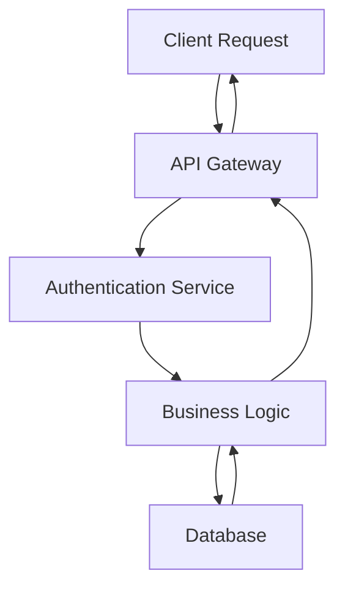

# Code Standards

This document establishes coding and documentation standards for all AI-assisted code generation. All standards are based on Google's official style guides for Python, Go, and Java, ensuring industry-standard code quality, readability, and maintainability across all projects.

## Writing Style

All code and documentation must follow these principles:

- Write in a simple, concise, and professional manner
- Use direct technical communication without conversational filler
- Avoid emojis, decorative elements, or unnecessary formatting
- Focus on clarity and precision over friendliness
- Use standard technical terminology consistently

## Quick Reference

Universal principles that apply across all languages (adapt syntax as needed):

**Documentation:**
- Document all public/exported APIs
- First line: brief summary of purpose
- Include parameters, return values, and exceptions
- Private functions: document if non-obvious

**Code Quality:**
- Explain "why" in comments, not "what"
- Keep functions focused and under 50 lines
- Use semantic naming (no abbreviations unless standard)
- One logical operation per function

**Security:**
- Never hardcode secrets or credentials
- Validate all user input
- Use parameterized queries (prevent SQL injection)
- Sanitize output (prevent XSS)
- Never log passwords, tokens, or PII

**Error Handling:**
- Handle errors explicitly
- Provide clear, actionable error messages
- Document all exceptions that can be raised

**Testing:**
- Follow AAA pattern (Arrange, Act, Assert)
- Test edge cases and error conditions
- Keep tests independent and isolated
- Mock external dependencies

## Code Documentation Standards

### Python

Documentation is required for all functions, classes, and modules following Google Python Style Guide standards.

**Docstring Format:**
- Use triple-quoted `"""` format for all docstrings
- First line: brief summary (one line, ending with period)
- Followed by blank line if additional content exists
- Include Args, Returns, and Raises sections as needed

**Example:**
```python
def calculate_total(items: list[dict], tax_rate: float = 0.0) -> float:
    """Calculates the total cost including tax.

    Args:
        items: List of item dictionaries with 'price' keys.
        tax_rate: Tax rate as decimal (e.g., 0.08 for 8%).

    Returns:
        Total cost including tax.

    Raises:
        ValueError: If tax_rate is negative.
    """
    if tax_rate < 0:
        raise ValueError(f"Tax rate cannot be negative: {tax_rate}")
    subtotal = sum(item["price"] for item in items)
    return subtotal * (1 + tax_rate)
```

**Requirements:**
- All public functions, classes, and modules must have docstrings
- Use type hints for function parameters and return values
- Include inline comments for complex logic only
- Comments should explain "why" not "what"

### Other Languages - Quick Reference

| Language | Format | When Required | Key Tags/Sections | Notes |
|----------|--------|---------------|-------------------|-------|
| **Go** | `// FuncName description` | All exported names | Start with function name | Use complete sentences |
| **Java** | `/** */` Javadoc | All public APIs | `@param`, `@return`, `@throws` | Summary fragment (not full sentence) |
| **Shell** | `#######` header block | All functions | Globals, Arguments, Outputs, Returns | File header required |

**Go Example:**
```go
// CalculateTotal computes the total cost including tax.
// Returns an error if taxRate is negative.
func CalculateTotal(items []Item, taxRate float64) (float64, error) { ... }
```

**Java Example:**
```java
/** Calculates the total cost including tax.
 * @param items list of items with price information
 * @param taxRate tax rate as decimal
 * @return total cost including tax
 * @throws IllegalArgumentException if taxRate is negative */
public double calculateTotal(List<Item> items, double taxRate) { ... }
```

**Shell Example:**
```bash
#######################################
# Cleanup files from the backup directory.
# Globals: BACKUP_DIR, ORACLE_SID
# Arguments: None
#######################################
cleanup() { rm "${BACKUP_DIR}/"*; }
```

### JavaScript/TypeScript

**JSDoc Format:**
- Use `/** */` for documentation comments
- JavaScript: Include types in JSDoc (`@param {string}`, `@return {Promise}`)
- TypeScript: Types in signature, descriptions only in JSDoc (don't duplicate type info)
- Include `@param`, `@return`, `@throws` when adding information beyond types

**TypeScript Example:**
```typescript
/**
 * Tracks a custom analytics event.
 *
 * @param eventName The name of the event to track
 * @param eventParams Optional parameters for the event
 */
function trackEvent(eventName: string, eventParams: Record<string, unknown> = {}): void {
  if (window.gtag) {
    window.gtag('event', eventName, eventParams);
  }
}
```

**Key Principle (TypeScript):** Don't duplicate type information. Only document what types don't convey.

**Modern Features to Use:**
- `const`/`let` (never `var`), arrow functions, template literals, destructuring
- `async`/`await` over Promises, optional chaining (`?.`), nullish coalescing (`??`)

### TypeScript-Specific Patterns

**Interface/Type Documentation:**
```typescript
/** Represents a user in the system. */
interface User {
  id: string;
  name: string;
  /** @defaultValue "user" */
  role?: string;
}

/** @typeParam T - The type of items */
class Collection<T> { ... }

/** @enum {string} */
enum Status { Pending = 'PENDING', Active = 'ACTIVE' }
```

**Available TSDoc Tags:**
- `@typeParam` - Generic type parameters
- `@deprecated` - Mark as deprecated with migration path
- `@internal` - Internal APIs not for external use
- `@example` - Usage examples
- `@defaultValue` - Default values for optional fields
- `@throws` - Exceptions that may be thrown
- `@see` / `@link` - Reference related APIs

## General Code Quality Standards

### Naming Conventions

**Python:**
- Functions and variables: `lower_with_under`
- Classes: `CapWords`
- Constants: `CAPS_WITH_UNDER`

**Go:**
- Exported identifiers: `CapitalizedCamelCase`
- Unexported identifiers: `lowerCamelCase`
- Acronyms: all caps (e.g., `HTTPServer`)

**Java:**
- Classes: `UpperCamelCase`
- Methods and variables: `lowerCamelCase`
- Constants: `UPPER_SNAKE_CASE`

**Shell:**
- Functions and variables: `lowercase_with_underscores`
- Constants and environment variables: `UPPERCASE_WITH_UNDERSCORES`
- Source filenames: `lowercase_with_underscores.sh`

**JavaScript/TypeScript:**
- Functions and variables: `lowerCamelCase`
- Classes and interfaces: `UpperCamelCase`
- Constants: `UPPER_SNAKE_CASE`
- Private fields: `lowerCamelCase` (optionally with trailing underscore)
- Type parameters: `UpperCamelCase` or single letter `T`

### Project Structure and Directory Naming

| Language | Dir Naming | Key Directories | Config File |
|----------|------------|-----------------|-------------|
| **Python** | `lower_with_under` | `src/`, `tests/`, `docs/` | `pyproject.toml` |
| **Go** | `lowercase` | `cmd/`, `pkg/`, `internal/` | `go.mod` |
| **Java** | `lowercase` | `src/main/java/`, `src/test/java/` | `pom.xml` or `build.gradle` |
| **JS/TS** | `lower-dash` or `lowerCamel` | `src/`, `tests/`, `public/` | `package.json`, `tsconfig.json` |

**Common Principles:**
- Separate source code from tests
- Keep directory names short and descriptive
- Use consistent naming throughout project
- Document structure in README.md

**Python Note:** Use `__init__.py` to mark package directories
**Go Note:** Use `internal/` for private packages, `cmd/` for entry points
**Java Note:** Mirror package structure in directory hierarchy

### Function Documentation Requirements

Documentation requirements vary by language and follow Google's official style guides.

**Python:**
- Required for all public functions (not prefixed with underscore)
- Optional for private functions that are short (fewer than 5 statements) and obvious
- Required for classes, modules, and methods overriding base classes (unless decorated with @override and behavior unchanged)

**Java:**
- Required for all classes and methods
- Optional for "simple, obvious" methods (e.g., getFoo()) only if nothing worthwhile beyond restating the name
- Must include if typical reader needs context (e.g., explaining "canonical name")

**Go:**
- Required for ALL exported (capitalized) names
- Optional for unexported (private) functions
- Must be complete sentences starting with the name being described

**TypeScript/JavaScript:**
- Required when purpose is not immediately obvious from name and type signature
- Do not duplicate type information already in TypeScript signatures
- @param and @return only needed when adding information beyond type system

**All documented functions should include:**

1. **Purpose**: What the function does (first line)
2. **Parameters**: Description of each parameter (when not obvious from name/type)
3. **Return value**: What is returned (when not obvious from type)
4. **Exceptions**: What errors can be raised/thrown
5. **Side effects**: Any state changes or external interactions

### Comment Best Practices

- Write comments for complex algorithms or business logic
- Explain "why" decisions were made, not "what" the code does
- Keep comments concise and technical
- Update comments when code changes
- Avoid redundant comments that restate obvious code
- Use TODO comments with issue references for future work

### Code Organization

- Keep functions focused and single-purpose
- Limit function length (prefer under 40-50 lines)
- Group related functionality together
- Use meaningful variable and function names
- Maintain consistent indentation and formatting

## Formatting Standards

### Python
- 4 spaces for indentation (no tabs)
- Maximum line length: 80 characters
- Use Black or similar formatter when available

### Go
- Use `gofmt` for all formatting
- Tabs for indentation
- Follow standard Go formatting conventions

### Java
- 2 spaces for indentation
- Maximum line length: 100 characters
- Use google-java-format when available

### Shell
- 2 spaces for indentation (no tabs)
- Maximum line length: 80 characters
- Use `#!/bin/bash` shebang
- Place `; then` and `; do` on same line as `if`/`for`/`while`
- Use `[[  ]]` over `[  ]` for tests
- Use `$(command)` over backticks
- Always quote variables: `"${var}"`
- Use arrays for lists
- Use `(( ))` for arithmetic
- Check return values explicitly
- Use `local` for function variables
- Run ShellCheck on all scripts

### JavaScript/TypeScript
- 2 spaces for indentation (no tabs)
- Maximum line length: 80 characters
- Semicolons required at end of statements
- Single quotes for strings (except to avoid escaping)
- Use Prettier or similar formatter when available
- Use `const` and `let`, never `var`
- Prefer template literals for string interpolation
- Use trailing commas in multi-line arrays and objects

## Error Handling

- Always handle errors explicitly
- Provide clear, actionable error messages
- Include context in error messages (what failed and why)
- Use appropriate exception types
- Document all exceptions that can be raised

## Confirmation Before Retesting

After fixing errors, request explicit user confirmation before rerunning tests or commands.

**Process:**
1. Make necessary code changes
2. Summarize what was changed and why
3. Ask: "I've fixed [issue]. Would you like me to rerun [test/command]?"
4. Wait for approval before proceeding

**When to request confirmation:**
- After fixing code errors or bugs
- Before rerunning failed tests or commands
- After modifying configuration files that affect execution

## Git Commit Messages

**Format:** `<type>: <subject>` (max 50 chars, imperative mood, capitalize, no period)

**Types:** `feat`, `fix`, `docs`, `style`, `refactor`, `test`, `chore`

**Complete Example:**
```
feat: Add user authentication module

Implement JWT-based authentication with token generation,
refresh mechanism, and bcrypt password hashing.

Improves security by replacing session-based auth with
scalable token-based approach.

Fixes #123
```

**Structure:**
- **Subject:** Brief summary (50 chars max)
- **Body:** Explain what and why (72 chars per line)
- **Footer:** Issue references, breaking changes, co-authors

**Best Practices:**
- Keep commits atomic (one logical change)
- Use imperative mood ("Add" not "Added")
- Reference issues when applicable
- Explain why, not how

## Security Best Practices

All code must follow security best practices to protect against common vulnerabilities.

### Input Validation

- Validate all user input before processing
- Use allowlists rather than denylists when possible
- Sanitize input to prevent injection attacks
- Validate data types, ranges, and formats
- Reject invalid input with clear error messages

### Secrets Management

- Never hardcode credentials, API keys, or secrets in code
- Use environment variables for sensitive configuration
- Use secret management services (e.g., Google Secret Manager, AWS Secrets Manager)
- Add sensitive files to `.gitignore`
- Rotate secrets regularly

**Example (.gitignore):**
```
.env
.env.local
secrets/
*.key
*.pem
credentials.json
```

### Authentication and Authorization

- Implement proper authentication mechanisms
- Use established libraries for authentication (OAuth, JWT)
- Apply principle of least privilege
- Validate permissions before granting access
- Use secure session management

### Data Protection

- Encrypt sensitive data at rest and in transit
- Use HTTPS for all network communication
- Hash passwords with strong algorithms (bcrypt, Argon2)
- Never log sensitive information (passwords, tokens, PII)
- Implement proper data retention policies

### Common Vulnerability Prevention

**SQL Injection:**
- Use parameterized queries or prepared statements
- Never concatenate user input into SQL queries
- Use ORM frameworks when appropriate

**Cross-Site Scripting (XSS):**
- Escape output in web applications
- Use Content Security Policy headers
- Validate and sanitize user-generated content

**Cross-Site Request Forgery (CSRF):**
- Use CSRF tokens for state-changing operations
- Validate origin and referrer headers
- Use SameSite cookie attributes

### Dependency Security

- Regularly scan dependencies for vulnerabilities
- Keep dependencies up to date
- Use tools like `pip-audit`, `go mod verify`, or `OWASP Dependency-Check`
- Review security advisories for used libraries

## Logging Standards

**Log Levels:** DEBUG (diagnostic) | INFO (flow) | WARNING (potential issues) | ERROR (recoverable) | CRITICAL (failure)

**What to Log:**
- Application startup/shutdown, config changes, auth attempts, API interactions, errors with stack traces

**NEVER Log:**
- Passwords, API keys, tokens, session IDs, credit cards, PII, encryption keys

**Example (Python - adapt to language-specific library):**
```python
import logging

logger = logging.getLogger(__name__)

# Good
logger.info("User login successful", extra={"user_id": user_id})
logger.error("Database connection failed", exc_info=True)

# Bad - contains sensitive data
logger.info(f"User logged in with password: {password}")  # NEVER
```

**Best Practices:**
- Use appropriate log levels consistently
- Include context (user ID, request ID)
- Log exceptions with stack traces
- Use structured logging (JSON format)
- Implement log rotation and centralization

## Dependency Management

Manage dependencies carefully to ensure security, stability, and maintainability.

### Evaluating Dependencies

Before adding a new dependency, consider:

- **Necessity:** Is this dependency truly needed?
- **Maintenance:** Is it actively maintained?
- **Security:** Does it have known vulnerabilities?
- **License:** Is the license compatible with your project?
- **Size:** Does it add significant bloat?
- **Alternatives:** Are there better alternatives?

### Version Management

**Python:**
- Use `requirements.txt` or `pyproject.toml` for dependencies
- Pin versions for reproducibility: `package==1.2.3`
- Use `pip-tools` or `poetry` for dependency resolution
- Run `pip-audit` for security scanning

**Go:**
- Use `go.mod` for dependency management
- Run `go mod tidy` to clean up dependencies
- Use `go mod verify` to check integrity
- Pin versions with specific commits when needed

**Java:**
- Use Maven (`pom.xml`) or Gradle (`build.gradle`)
- Specify exact versions for dependencies
- Use dependency management sections for version control
- Run OWASP Dependency-Check for security scanning

**JavaScript/TypeScript:**
- Use `package.json` for dependency declarations
- Use lock files: `package-lock.json` (npm), `yarn.lock` (Yarn), or `pnpm-lock.yaml` (pnpm)
- Pin versions or use semantic versioning (^1.2.3, ~1.2.3)
- Use `npm ci` or `yarn install --frozen-lockfile` for reproducible builds
- Run `npm audit` or `yarn audit` for security scanning

### Security Scanning

Regularly scan dependencies for vulnerabilities:

```bash
# Python
pip-audit

# Go
go list -json -m all | nancy sleuth

# Java
mvn dependency-check:check

# JavaScript/TypeScript
npm audit
# or
yarn audit
```

### Update Strategy

- Review dependency updates regularly
- Test updates in development before production
- Read changelogs for breaking changes
- Use automated tools (Dependabot, Renovate) for update notifications
- Keep security patches up to date immediately

### Best Practices

- Minimize the number of dependencies
- Avoid dependencies with dependencies (deep dependency trees)
- Use lock files for reproducible builds
- Document why each dependency is needed
- Remove unused dependencies
- Prefer well-established, widely-used libraries
- Check license compatibility before adding dependencies

## Testing

Follow AAA pattern (Arrange, Act, Assert) and language-specific testing frameworks.

### Python Testing (pytest/unittest)

```python
def test_format_name_with_valid_inputs():
    """Tests format_name returns properly formatted full name."""
    result = format_name("john", "doe")
    assert result == "John Doe"

def test_format_name_raises_error_with_empty_input():
    """Tests format_name raises ValueError for empty strings."""
    with pytest.raises(ValueError, match="cannot be empty"):
        format_name("", "doe")
```

**File naming:** `test_<module>.py` | **Function naming:** `test_<function>_<scenario>`
**Location:** `tests/` directory mirroring source structure

### Language-Specific Testing Patterns

| Language | Framework | Test Naming | Key Pattern |
|----------|-----------|-------------|-------------|
| **Go** | `testing` | `TestFunctionName` | Table-driven tests with `t.Run()` and Example functions (`func ExampleXxx`) |
| **Java** | JUnit | `testMethod_scenario` | `@Test`, `@Before`, `@After` annotations |
| **JS/TS** | Jest/Mocha | `describe`/`it` blocks | Mock with `jest.fn()`, async/await testing |

**Go:** Use struct slices for test cases, subtests for scenarios, and Example functions for testable documentation.
**Java:** Use `@Before` for setup, meaningful assertion messages
**JS/TS:** Use `beforeEach`/`afterEach`, mock external dependencies

### General Best Practices

- Test all public functions/methods
- Test edge cases, error conditions, and both success/failure paths
- Keep tests independent and isolated
- Mock external dependencies
- One logical assertion per test (when practical)
- Document complex test scenarios

## Documentation and Diagram Standards

### README and Documentation Files

All documentation files (README.md, guides, etc.) must follow the same writing standards:

- Simple, concise, and professional language
- No emojis or decorative elements
- Clear technical explanations
- Proper grammar and punctuation
- Consistent formatting and structure

### Diagrams

All diagrams must use Mermaid syntax for consistency and maintainability.

**Requirements:**
- Use Mermaid for all architectural, flow, and sequence diagrams
- Clear, descriptive labels without decorative elements
- Consistent formatting across all diagrams
- Professional appearance aligned with code standards
- Include comments in complex diagrams to explain structure

**Example:**


**Best Practices:**
- Keep diagrams focused and uncluttered
- Use meaningful node and edge labels
- Maintain consistent styling within a project
- Document diagram purpose in surrounding text
- Update diagrams when architecture changes

---

These guidelines are based on industry-standard style guides including Google's Python, Go, and Java style guides. Adherence to these standards ensures code quality, maintainability, and consistency across all projects.
