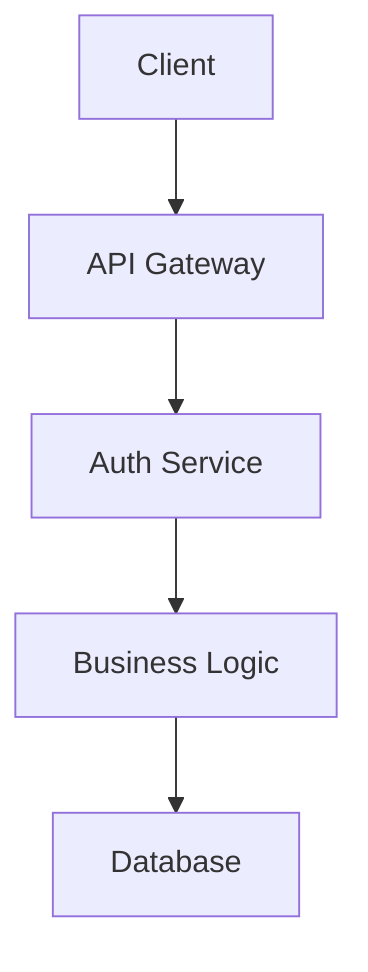

# Code Standards

Standards for AI-assisted code generation. All standards are based on Google's official style guides. Project-level rules (AGENTS.md) override these when they conflict.

## Writing Style

MANDATORY for all code and documentation:

- Simple, concise, professional language
- Direct technical communication -- no conversational filler
- No emojis, decorative elements, or unnecessary formatting
- No praise, superlatives, or emotional validation
- Standard technical terminology, used consistently
- Focus on clarity and precision over friendliness

## Python

Base: [Google Python Style Guide](https://google.github.io/styleguide/pyguide.html)

### Tooling

- **Package manager:** `uv` exclusively (no pip, pip-tools, or poetry)
  - `uv sync` -- install/sync dependencies
  - `uv add <package>` -- add a dependency
  - `uv remove <package>` -- remove a dependency
  - `uv lock` -- update lockfile
  - `uv run <command>` -- run scripts/tools in the project environment
  - `uv build --wheel` -- build distribution
- **Config:** `pyproject.toml` only (no `requirements.txt`, `setup.py`, or `setup.cfg`)
- **Formatter/Linter:** `ruff` (`ruff format` and `ruff check`)
- **Testing:** `pytest`
- **Security scanning:** `uv run pip-audit` or integrate via CI

### Formatting

- 4 spaces for indentation (no tabs)
- Maximum line length: 88 characters (ruff default)

### Type Hints

Use modern Python 3.10+ syntax exclusively. Do NOT use legacy typing imports.

| Do this | NOT this |
|---------|----------|
| `list[str]` | `List[str]` |
| `dict[str, Any]` | `Dict[str, Any]` |
| `tuple[int, ...]` | `Tuple[int, ...]` |
| `str \| None` | `Optional[str]` |
| `int \| str` | `Union[int, str]` |

Only import `Any` from `typing`. Everything else uses builtins.

### Imports

Three groups separated by blank lines: stdlib, third-party, local. Alphabetically sorted within each group.

```python
import json
import logging

import apache_beam as beam
from google.cloud import bigquery

from myproject.transforms.parser import (
    ParseMessage,
    validate_schema,
)
```

### Docstrings

Google-style with `Args:`, `Returns:`, `Yields:`, `Raises:` sections.

```python
def calculate_total(items: list[dict], tax_rate: float = 0.0) -> float:
    """Calculates the total cost including tax.

    Args:
        items: List of item dictionaries with 'price' keys.
        tax_rate: Tax rate as decimal (e.g., 0.08 for 8%).

    Returns:
        Total cost including tax.

    Raises:
        ValueError: If tax_rate is negative.
    """
    if tax_rate < 0:
        raise ValueError(f"Tax rate cannot be negative: {tax_rate}")
    subtotal = sum(item["price"] for item in items)
    return subtotal * (1 + tax_rate)
```

Required for all public functions, classes, and modules. Optional for private functions that are short (fewer than 5 statements) and obvious.

### Logging

Use `%s` lazy formatting in log calls, NOT f-strings.

```python
import logging

logger = logging.getLogger(__name__)

# Good
logger.info("User login successful: user_id=%s", user_id)
logger.error("Database connection failed", exc_info=True)

# Bad -- f-string evaluates even if log level is disabled
logger.info(f"User logged in: {user_id}")
```

### Naming

- Functions and variables: `snake_case`
- Classes: `PascalCase`
- Constants: `UPPER_SNAKE_CASE`
- Private/module-level: prefix with `_`

### Testing

- Framework: `pytest` (no unittest classes)
- File naming: `test_<module>.py`
- Function naming: `test_<function>_<scenario>` as standalone functions
- Assertions: bare `assert` statements; `pytest.raises(ValueError, match="...")` for exceptions
- No mocks unless absolutely necessary; prefer in-memory test data

```python
def test_calculate_total_with_tax():
    """Tests total calculation includes tax correctly."""
    items = [{"price": 10.0}, {"price": 20.0}]
    result = calculate_total(items, tax_rate=0.1)
    assert result == 33.0

def test_calculate_total_rejects_negative_tax():
    """Tests that negative tax rate raises ValueError."""
    with pytest.raises(ValueError, match="cannot be negative"):
        calculate_total([], tax_rate=-0.1)
```

## Go

Base: [Google Go Style Guide](https://google.github.io/styleguide/go/) and [Effective Go](https://go.dev/doc/effective_go)

### Tooling

- **Formatter:** `gofmt` (mandatory, no exceptions)
- **Dependencies:** `go.mod` with `go mod tidy` and `go mod verify`
- **Testing:** `go test ./...`
- **Linting:** `golangci-lint` when available

### Formatting

- Tabs for indentation (enforced by `gofmt`)
- No line length limit (use judgment for readability)

### Documentation

All exported (capitalized) names must have doc comments. Comments must be complete sentences starting with the name being described.

```go
// CalculateTotal computes the total cost including tax.
// It returns an error if taxRate is negative.
func CalculateTotal(items []Item, taxRate float64) (float64, error) {
    if taxRate < 0 {
        return 0, fmt.Errorf("tax rate cannot be negative: %f", taxRate)
    }
    var subtotal float64
    for _, item := range items {
        subtotal += item.Price
    }
    return subtotal * (1 + taxRate), nil
}
```

### Naming

- Exported identifiers: `CapitalizedCamelCase`
- Unexported identifiers: `lowerCamelCase`
- Acronyms: all caps (e.g., `HTTPServer`, `XMLParser`)
- Packages: short, lowercase, single word when possible

### Error Handling

- Return errors explicitly; do not panic for expected failures
- Wrap errors with context: `fmt.Errorf("failed to process item: %w", err)`
- Check errors immediately after the call that produces them

### Testing

Use table-driven tests with `t.Run()` for subtests. Use Example functions for testable documentation.

```go
func TestCalculateTotal(t *testing.T) {
    tests := []struct {
        name    string
        items   []Item
        taxRate float64
        want    float64
        wantErr bool
    }{
        {name: "with tax", items: []Item{{Price: 10}, {Price: 20}}, taxRate: 0.1, want: 33.0},
        {name: "negative tax", items: nil, taxRate: -0.1, wantErr: true},
    }
    for _, tt := range tests {
        t.Run(tt.name, func(t *testing.T) {
            got, err := CalculateTotal(tt.items, tt.taxRate)
            if (err != nil) != tt.wantErr {
                t.Errorf("error = %v, wantErr %v", err, tt.wantErr)
                return
            }
            if got != tt.want {
                t.Errorf("got %v, want %v", got, tt.want)
            }
        })
    }
}
```

### Dependencies

- Use `go.mod` for all dependency management
- Run `go mod tidy` to clean up unused dependencies
- Use `go mod verify` to check integrity
- Pin versions with specific commits when needed

## Java

Base: [Google Java Style Guide](https://google.github.io/styleguide/javaguide.html)

### Tooling

- **Formatter:** `google-java-format`
- **Build:** Maven (`pom.xml`) or Gradle (`build.gradle`)
- **Testing:** JUnit 5
- **Security scanning:** OWASP Dependency-Check

### Formatting

- 2 spaces for indentation (no tabs)
- Maximum line length: 100 characters

### Documentation

Javadoc (`/** */`) required for all public classes and methods. Use `@param`, `@return`, `@throws` tags.

```java
/**
 * Calculates the total cost including tax.
 *
 * @param items list of items with price information
 * @param taxRate tax rate as decimal (e.g., 0.08 for 8%)
 * @return total cost including tax
 * @throws IllegalArgumentException if taxRate is negative
 */
public double calculateTotal(List<Item> items, double taxRate) {
    if (taxRate < 0) {
        throw new IllegalArgumentException("Tax rate cannot be negative: " + taxRate);
    }
    double subtotal = items.stream().mapToDouble(Item::getPrice).sum();
    return subtotal * (1 + taxRate);
}
```

### Naming

- Classes: `UpperCamelCase`
- Methods and variables: `lowerCamelCase`
- Constants: `UPPER_SNAKE_CASE`
- Packages: `all.lowercase`

### Testing

JUnit 5 with `@Test`, `@BeforeEach`, `@AfterEach` annotations. Use descriptive method names.

```java
@Test
void calculateTotal_withTax_returnsCorrectTotal() {
    List<Item> items = List.of(new Item(10.0), new Item(20.0));
    double result = calculator.calculateTotal(items, 0.1);
    assertEquals(33.0, result, 0.001);
}

@Test
void calculateTotal_withNegativeTax_throwsException() {
    assertThrows(IllegalArgumentException.class, () ->
        calculator.calculateTotal(List.of(), -0.1));
}
```

### Dependencies

- Specify exact versions for all dependencies
- Use dependency management sections for version control
- Run OWASP Dependency-Check for security scanning

## JavaScript/TypeScript

Base: [Google TypeScript Style Guide](https://google.github.io/styleguide/tsguide.html)

### Tooling

- **Formatter:** Prettier
- **Linting:** ESLint
- **Package manager:** npm, yarn, or pnpm (use lock files)
- **Testing:** Jest or Vitest

### Formatting

- 2 spaces for indentation (no tabs)
- Maximum line length: 80 characters
- Semicolons required
- Single quotes for strings (except to avoid escaping)
- Trailing commas in multi-line arrays and objects

### Documentation

Use JSDoc (`/** */`). In TypeScript, do NOT duplicate type information already in the signature. Only add `@param` and `@return` when they provide information beyond the types.

```typescript
/**
 * Tracks a custom analytics event.
 *
 * @param eventName The name of the event to track
 * @param eventParams Optional parameters for the event
 */
function trackEvent(eventName: string, eventParams: Record<string, unknown> = {}): void {
  if (window.gtag) {
    window.gtag('event', eventName, eventParams);
  }
}
```

### Modern Features

Always use:
- `const`/`let` (never `var`)
- Arrow functions for callbacks
- Template literals for string interpolation
- `async`/`await` over raw Promises
- Optional chaining (`?.`) and nullish coalescing (`??`)
- Destructuring for object/array access

### Naming

- Functions and variables: `lowerCamelCase`
- Classes and interfaces: `UpperCamelCase`
- Constants: `UPPER_SNAKE_CASE`
- Type parameters: single letter `T` or `UpperCamelCase`

### Dependencies

- Use lock files (`package-lock.json`, `yarn.lock`, or `pnpm-lock.yaml`)
- Use `npm ci` or equivalent for reproducible builds
- Run `npm audit` for security scanning

## Shell

Base: [Google Shell Style Guide](https://google.github.io/styleguide/shellguide.html)

### Formatting and Conventions

- Shebang: `#!/bin/bash` with `set -e`
- 2 spaces for indentation (no tabs)
- Maximum line length: 80 characters
- Use `[[ ]]` over `[ ]` for tests
- Use `$(command)` over backticks
- Always quote variables: `"${var}"`
- Use arrays for lists
- Use `(( ))` for arithmetic
- Use `local` for function variables; separate declaration from command substitution assignment
- Place `; then` and `; do` on same line as `if`/`for`/`while`
- Send error messages to STDERR: `echo "Error: ..." >&2`
- Use `readonly` or `declare -r` for constants
- Use `main` function for scripts containing other functions; call `main "$@"` as the last line
- Run ShellCheck on all scripts

### Naming

- Functions and variables: `lowercase_with_underscores`
- Constants and environment variables: `UPPERCASE_WITH_UNDERSCORES`
- Source filenames: `lowercase_with_underscores.sh`

### Documentation

Every script must have a file header comment describing its purpose. Every function requires a header block:

```bash
#!/bin/bash
#
# Perform hot backups of Oracle databases.

set -e

#######################################
# Cleanup files from the backup directory.
# Globals:
#   BACKUP_DIR
#   ORACLE_SID
# Arguments:
#   None
# Returns:
#   0 on success, non-zero on error
#######################################
cleanup() {
  # Separate local declaration from command substitution
  # to avoid masking the exit code.
  local dir
  dir="$(get_backup_dir)"
  rm "${dir}/"*
}

main() {
  cleanup
}

main "$@"
```

## Git Commit Messages

**Format:** `<type>: <subject>` (max 50 chars, imperative mood, capitalize, no period)

**Types:** `feat`, `fix`, `docs`, `style`, `refactor`, `test`, `chore`

**Example:**
```
feat: Add user authentication module

Implement JWT-based authentication with token generation,
refresh mechanism, and bcrypt password hashing.

Improves security by replacing session-based auth with
scalable token-based approach.

Fixes #123
```

**Structure:**
- **Subject line:** brief summary (50 chars max)
- **Body:** explain what and why (72 chars per line, separated by blank line)
- **Footer:** issue references, breaking changes, co-authors

**Rules:**
- Keep commits atomic (one logical change)
- Use imperative mood ("Add" not "Added")
- Reference issues when applicable
- Explain why, not how

## Security Guardrails

NEVER:
- Hardcode credentials, API keys, or secrets in code
- Log passwords, tokens, session IDs, PII, or encryption keys
- Concatenate user input into SQL queries (use parameterized queries)
- Trust unsanitized user input in HTML output (escape or sanitize)
- Skip input validation on user-provided data

ALWAYS:
- Use environment variables or secret managers for credentials
- Add sensitive files to `.gitignore` (`.env`, `*.key`, `*.pem`, `credentials.json`)
- Validate all user input (types, ranges, formats) before processing
- Use allowlists over denylists for input validation
- Use parameterized queries or prepared statements for database access
- Use HTTPS for all network communication
- Hash passwords with strong algorithms (bcrypt, Argon2)
- Use CSRF tokens for state-changing operations in web applications
- Apply Content Security Policy headers
- Scan dependencies for vulnerabilities regularly (`pip-audit`, `npm audit`, `go mod verify`, OWASP)
- Use established libraries for authentication (OAuth, JWT)

## Logging Standards

**Log Levels:** DEBUG (diagnostic) | INFO (flow) | WARNING (potential issues) | ERROR (recoverable) | CRITICAL (failure)

**What to Log:**
- Application startup/shutdown, config changes
- Authentication attempts (success and failure)
- API interactions and errors with stack traces

**NEVER Log:**
- Passwords, API keys, tokens, session IDs, credit cards, PII, encryption keys

**Best Practices:**
- Use appropriate log levels consistently
- Include context (user ID, request ID) -- never PII
- Log exceptions with stack traces (`exc_info=True` in Python)
- Use structured logging (JSON format) in production
- Use `%s` lazy formatting in Python, not f-strings in log calls

## Dependency Management

Before adding a new dependency, evaluate:
- **Necessity:** Can this be done without adding a dependency?
- **Maintenance:** Is it actively maintained with recent releases?
- **Security:** Does it have known vulnerabilities?
- **License:** Is the license compatible with the project?
- **Size:** Does it add significant bloat or deep dependency trees?

**Per-language tooling:**

| Language | Manager | Lock File | Security Scan |
|----------|---------|-----------|---------------|
| Python | `uv` | `uv.lock` | `pip-audit` |
| Go | `go mod` | `go.sum` | `go mod verify` |
| Java | Maven/Gradle | `pom.xml`/`build.gradle` | OWASP Dependency-Check |
| JS/TS | npm/yarn/pnpm | `package-lock.json` etc. | `npm audit` |

**Rules:**
- Keep dependencies minimal
- Pin versions for reproducibility
- Use lock files for all projects
- Keep security patches up to date immediately
- Remove unused dependencies

## Testing

Follow the AAA pattern (Arrange, Act, Assert) in all languages.

| Language | Framework | Test Naming | Key Pattern |
|----------|-----------|-------------|-------------|
| Python | pytest | `test_<function>_<scenario>` | Standalone functions, bare `assert` |
| Go | testing | `TestFunctionName` | Table-driven with `t.Run()` |
| Java | JUnit 5 | `method_scenario_result` | `@Test`, `@BeforeEach` |
| JS/TS | Jest/Vitest | `describe`/`it` blocks | `expect()`, async/await |

**Rules:**
- Test all public functions/methods
- Test both success and failure paths
- Test edge cases and boundary conditions
- Keep tests independent and isolated
- One logical assertion per test (when practical)
- Mock external dependencies, prefer in-memory test data

## Documentation and Diagrams

All documentation files must follow the Writing Style rules above.

- Use Mermaid syntax for all architectural, flow, and sequence diagrams
- Keep diagrams focused and uncluttered with meaningful labels
- Update diagrams when architecture changes


