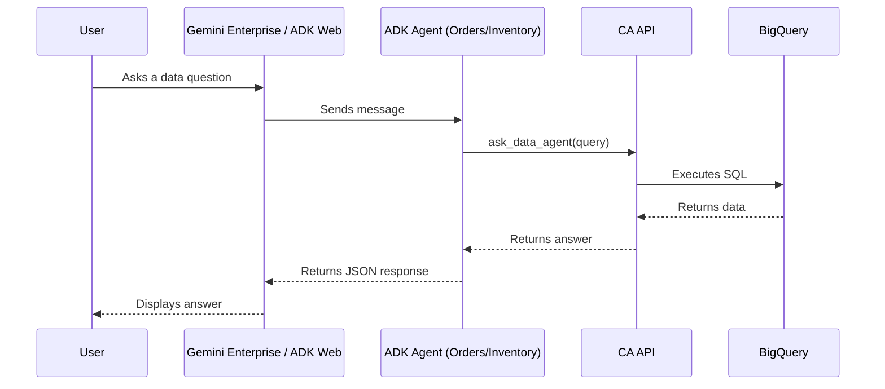

# Gemini Conversational Analytics ADK Demo

This project demonstrates how to deploy **Google ADK Agents** that bridge Google Cloud's **Conversational Analytics API** with **Gemini Enterprise**.

## Architecture Overview

The system uses standard **Google ADK Agents** that leverage the `DataAgentToolset` to communicate with backend Data Agents in BigQuery. The agents are deployed to **Vertex AI Agent Engine** and registered with **Gemini Enterprise**.



## Project Structure

```text
├── app/
│   ├── orders/             # Order Analyst Agent (ADK)
│   │   ├── agent.py        # Agent definition + DataAgentToolset
│   │   └── requirements.txt # Prod dependencies
│   └── inventory/          # Inventory Analyst Agent (ADK)
│       ├── agent.py        # Agent definition + DataAgentToolset
│       └── requirements.txt # Prod dependencies
├── scripts/
│   ├── admin_tools.py      # Data Agent lifecycle management (Backend)
│   ├── setup_auth.py       # Creates OAuth Resources for GE Registration
│   └── register_agents.py  # Registers Deployed Agents with GE
├── .env                    # Local environment variables
└── README.md               # Project documentation
```

## Prerequisites

*   Python 3.11+
*   `uv` (package manager)
*   Google Cloud Project with Gemini Data Analytics and Discovery Engine APIs enabled.
*   `gcloud` CLI installed and authenticated (`gcloud auth application-default login`).

## Setup & Local Development

1.  **Install dependencies:**
    ```bash
    uv sync
    ```

2.  **Configure Environment:**
    Copy `.env.example` to `.env` and fill in your project details.
    ```bash
    cp .env.example .env
    ```

3.  **Setup Backend Agents:**
    If you haven't created the Data Agents yet (the backend services that talk to BigQuery):
    ```bash
    uv run python scripts/admin_tools.py
    ```
    Ensure `AGENT_ORDERS_ID` and `AGENT_INVENTORY_ID` in `.env` match the output.

4.  **Run Locally:**
    Chat with the Orders agent directly in your terminal:
    ```bash
    # Ensure environment variables are loaded
    export $(cat .env | xargs)
    
    # Run the interactive CLI
    adk run app/orders
    ```

## Production Deployment Roadmap

To deploy these agents to **Gemini Enterprise**, follow these steps:

### 1. Preparation
Ensure you have exported your dependencies to the agent folders so the cloud builder can install them.
```bash
uv export --no-hashes --format requirements-txt > requirements.txt
cp requirements.txt app/orders/requirements.txt
cp requirements.txt app/inventory/requirements.txt
```

### 2. Deploy to Vertex AI Agent Engine
Deploy the agent code to the managed runtime.
```bash
# Deploy Orders Agent
uv run adk deploy agent_engine app/orders \
  --project=$GOOGLE_CLOUD_PROJECT \
  --region=$GOOGLE_CLOUD_LOCATION \
  --display_name="Orders Analyst"

# Deploy Inventory Agent
uv run adk deploy agent_engine app/inventory \
  --project=$GOOGLE_CLOUD_PROJECT \
  --region=$GOOGLE_CLOUD_LOCATION \
  --display_name="Inventory Analyst"
```
**Note:** Save the `Resource Name` output from these commands (e.g., `projects/.../reasoningEngines/...`).

### 3. Setup Authorization Resources
Create the OAuth resources required for the agents to access data on behalf of the user.
```bash
uv run python scripts/setup_auth.py
```
This script reads `OAUTH_CLIENT_ID` and `OAUTH_CLIENT_SECRET` from your `.env` and creates resources specified by `AUTH_RESOURCE_ORDERS` and `AUTH_RESOURCE_INVENTORY`.

### 4. Register with Gemini Enterprise
Register the deployed Agent Engine resources with Gemini Enterprise using the auth resources created above.

```bash
uv run python scripts/register_agents.py \
  --orders-resource <ORDERS_RESOURCE_NAME_FROM_STEP_2> \
  --inventory-resource <INVENTORY_RESOURCE_NAME_FROM_STEP_2>
```

### 5. Verification
Go to your **Gemini Enterprise** web app. You should now see "Order & User Analyst" and "Inventory & Product Analyst" in the agent selector.

## Sample Queries

You can test the specialized capabilities of each agent using the following sample questions:

### Agent A: Order & User Analyst
*   "How many orders are in the 'Complete' status?"
*   "Who are the top 5 users by total lifetime spend?"
*   "What is the average number of items per order?"
*   "Show me the distribution of order statuses for the last month."

### Agent B: Inventory & Product Analyst
*   "What is the name and price of the product with ID 1?"
*   "Which distribution center currently holds the most inventory?"
*   "How many products are in the 'Accessories' category?"
*   "List 10 products that have a retail price greater than $100."
