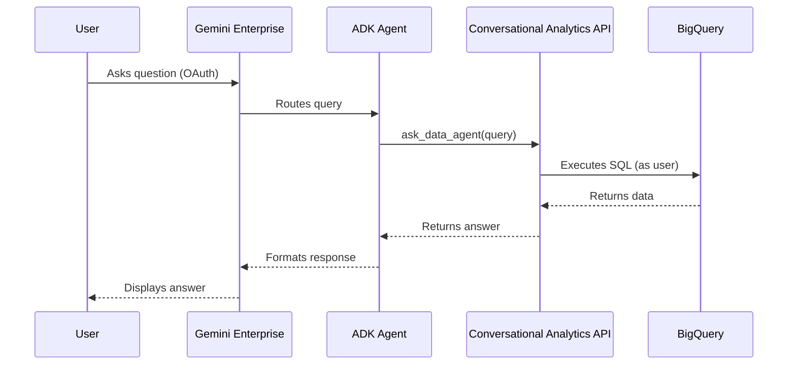

# Gemini Conversational Analytics ADK Demo

Deploy Google ADK Agents that bridge the Conversational Analytics API with Gemini Enterprise using OAuth identity passthrough.

## Architecture



**Key Feature:** OAuth identity passthrough ensures queries execute with the end user's BigQuery permissions.

## Project Structure

```text
├── app/
│   ├── orders/             # Orders Analyst Agent
│   │   ├── agent.py        # Agent definition + DataAgentToolset
│   │   └── .env            # Runtime environment variables
│   └── inventory/          # Inventory Analyst Agent
│       ├── agent.py        # Agent definition + DataAgentToolset
│       └── .env            # Runtime environment variables
├── scripts/
│   ├── admin_tools.py      # Manage Data Agents (backend)
│   ├── setup_auth.py       # Create OAuth resources
│   ├── register_agents.py  # Register with Gemini Enterprise
│   └── deploy_agents.sh    # Automated deployment
├── .env                    # Environment variables
└── README.md
```

## Prerequisites

1. Python 3.11+ with `uv` package manager
2. Google Cloud Project with APIs enabled:
   - Vertex AI API
   - Conversational Analytics API
   - Discovery Engine API
   - BigQuery API
3. OAuth 2.0 Client Credentials (Client ID + Secret)
4. gcloud CLI authenticated:
   ```bash
   gcloud auth application-default login
   gcloud auth login
   ```

## Setup

### 1. Install Dependencies

```bash
uv sync
```

### 2. Configure Environment

```bash
cp .env.example .env
```

Edit `.env` with your project details:
```bash
GOOGLE_CLOUD_PROJECT=your-project-id
GOOGLE_CLOUD_PROJECT_NUMBER=your-project-number
AGENT_ORDERS_ID=your-orders-data-agent-id
AGENT_INVENTORY_ID=your-inventory-data-agent-id
GEMINI_APP_ID=your-gemini-app-id
OAUTH_CLIENT_ID=your-oauth-client-id
OAUTH_CLIENT_SECRET=your-oauth-client-secret
```

Create per-agent `.env` files:

```bash
# app/orders/.env
cat > app/orders/.env << EOF
GOOGLE_CLOUD_PROJECT=your-project-id
AGENT_ORDERS_ID=your-orders-data-agent-id
OAUTH_CLIENT_ID=your-oauth-client-id
OAUTH_CLIENT_SECRET=your-oauth-client-secret
EOF

# app/inventory/.env
cat > app/inventory/.env << EOF
GOOGLE_CLOUD_PROJECT=your-project-id
AGENT_INVENTORY_ID=your-inventory-data-agent-id
OAUTH_CLIENT_ID=your-oauth-client-id
OAUTH_CLIENT_SECRET=your-oauth-client-secret
EOF
```

### 3. Create Backend Data Agents

```bash
uv run python scripts/admin_tools.py
```

## Deployment

### Step 1: Deploy to Agent Engine

```bash
bash scripts/deploy_agents.sh
```

Save the Reasoning Engine resource names from the output.

### Step 2: Setup OAuth Authorization

```bash
uv run python scripts/setup_auth.py
```

### Step 3: Register with Gemini Enterprise

```bash
uv run python scripts/register_agents.py \
  --orders-resource <ORDERS_RESOURCE_NAME> \
  --inventory-resource <INVENTORY_RESOURCE_NAME>
```

### Step 4: Test

Access Gemini Enterprise to see "Order & User Analyst" and "Inventory & Product Analyst" agents.

## Sample Queries

**Orders Agent:**
- "How many orders are in 'Complete' status?"
- "Who are the top 5 users by total spend?"
- "What is the average number of items per order?"

**Inventory Agent:**
- "What is the name and price of product ID 1?"
- "Which distribution center has the most inventory?"
- "How many products are in the 'Accessories' category?"

## Local Development

Test agents locally:

```bash
export $(cat .env | xargs)
uv run adk run app/orders
```

## License

Demonstration project for educational purposes.
