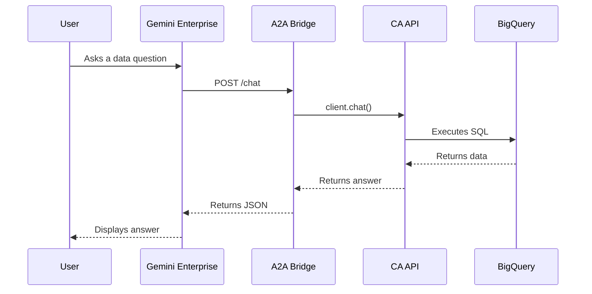

# Gemini Conversational Analytics A2A Demo

This project demonstrates how to bridge Google Cloud's **Conversational Analytics API** with **Gemini Enterprise** using the **Agent-to-Agent (A2A) Protocol**.

## Architecture Overview

The following diagram illustrates how user queries flow from the Gemini Enterprise web app to BigQuery through our A2A bridge.



## Project Structure

```text
├── app/
│   └── bridge.py          # A2A Bridge FastAPI server
├── scripts/
│   ├── admin_tools.py      # Data Agent lifecycle management
│   ├── cleanup_and_list.py # Agent cleanup and inspection utility
│   └── register_agents.py  # A2A registration utility
├── tests/
│   └── test_bridge.py      # Integration tests for the bridge
├── docs/
│   └── reference/          # API references and links
├── .env                    # Local environment variables
└── README.md               # Project documentation
```

## Core Components

### 1. Admin & Setup
*   `scripts/admin_tools.py`: Configures the backend Data Agents. It splits the `thelook_ecommerce` dataset into two specialized agents:
    *   **Agent A**: Orders & Users
    *   **Agent B**: Inventory & Products
*   `scripts/cleanup_and_list.py`: Utility to list all agents and their configurations or delete unnecessary ones.

### 2. The Bridge
*   `app/bridge.py`: A FastAPI server that implements the A2A Protocol. It exposes two virtual agents:
    *   `GET /orders`: Discovery endpoint for Agent A.
    *   `GET /inventory`: Discovery endpoint for Agent B.
    *   `POST /orders/chat` & `POST /inventory/chat`: Proxy endpoints for natural language processing.

### 3. Verification & Registration
*   `tests/test_bridge.py`: Local testing script to verify the bridge can communicate with the CA API and return correct answers.
*   `scripts/register_agents.py`: Automates the registration of the A2A Bridge endpoints into a Gemini Enterprise App.

## Getting Started

### Prerequisites
*   Python 3.11+
*   `uv` (package manager)
*   Google Cloud Project with Gemini Data Analytics and Discovery Engine APIs enabled.

### Setup

1.  **Install dependencies:**
    ```bash
    uv sync
    ```

2.  **Configure Environment:**
    Copy `.env.example` to `.env` and fill in your project details.
    ```bash
    cp .env.example .env
    ```

3.  **Setup Backend Agents:**
    ```bash
    uv run python scripts/admin_tools.py
    ```

4.  **Run the Bridge:**
    ```bash
    uv run python app/bridge.py
    ```

5.  **Expose and Register:**
    Use a tunnel (like `ngrok`) to expose port 8000 and run the registration script:
    ```bash
    uv run python scripts/register_agents.py https://<your-public-url>
    ```

## Code Standards
This project follows the Google Python Style Guide and utilizes `ruff` for linting and formatting. Documentation follows `JSDoc`/`Docstring` requirements as specified in the project's global standards.
