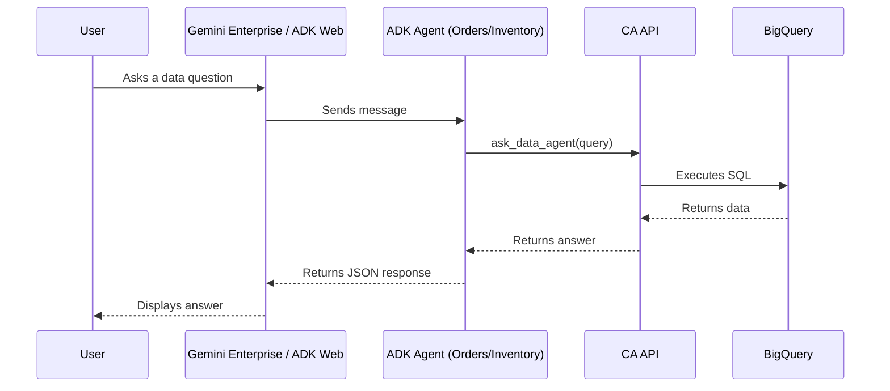

# Gemini Conversational Analytics ADK Demo

This project demonstrates how to bridge Google Cloud's **Conversational Analytics API** with **Google ADK Agents**.

## Architecture Overview

The system uses standard **Google ADK Agents** that leverage the `DataAgentToolset` to communicate with backend Data Agents in BigQuery.



## Project Structure

```text
├── app/
│   ├── orders/             # Order Analyst Agent (ADK)
│   │   └── agent.py        # Agent definition + DataAgentToolset
│   └── inventory/          # Inventory Analyst Agent (ADK)
│       └── agent.py        # Agent definition + DataAgentToolset
├── scripts/
│   ├── admin_tools.py      # Data Agent lifecycle management
│   ├── cleanup_and_list.py # Agent cleanup and inspection utility
│   └── register_agents.py  # (Pending Update) Registration utility for GE
├── docs/
│   └── reference/          # API references and links
├── .env                    # Local environment variables
└── README.md               # Project documentation
```

## Core Components

### 1. Admin & Setup
*   `scripts/admin_tools.py`: Configures the backend Data Agents. It splits the `thelook_ecommerce` dataset into two specialized agents:
    *   **Agent A**: Orders & Users
    *   **Agent B**: Inventory & Products
*   `scripts/cleanup_and_list.py`: Utility to list all agents and their configurations or delete unnecessary ones.

### 2. ADK Agents
*   `app/orders/agent.py`: A specialized `LlmAgent` equipped with `DataAgentToolset` to answer questions about orders and users.
*   `app/inventory/agent.py`: A specialized `LlmAgent` for inventory and products.
*   **Authentication**: Configured to use Application Default Credentials (ADC) with `cloud-platform` scope.

## Getting Started

### Prerequisites
*   Python 3.11+
*   `uv` (package manager)
*   Google Cloud Project with Gemini Data Analytics and Discovery Engine APIs enabled.
*   `gcloud` CLI installed and authenticated (`gcloud auth application-default login`).

### Setup

1.  **Install dependencies:**
    ```bash
    uv sync
    ```

2.  **Configure Environment:**
    Copy `.env.example` to `.env` and fill in your project details.
    ```bash
    cp .env.example .env
    ```
    Ensure `MODEL_NAME` is set to your preferred model (e.g., `gemini-3-flash-preview`).

3.  **Setup Backend Agents:**
    If you haven't created the Data Agents yet:
    ```bash
    uv run python scripts/admin_tools.py
    ```
    Otherwise, ensure `AGENT_ORDERS_ID` and `AGENT_INVENTORY_ID` in `.env` match your existing agents.

4.  **Run Locally (CLI):**
    Chat with the Orders agent directly in your terminal:
    ```bash
    # Ensure environment variables are loaded
    export $(cat .env | xargs)
    
    # Run the interactive CLI
    adk run app/orders
    ```

5.  **Run Locally (Web UI):**
    Launch the local web interface to test all agents:
    ```bash
    export $(cat .env | xargs)
    adk web app
    ```
    Open your browser at the URL provided (usually `http://localhost:8080` or similar).

## Sample Queries

You can test the specialized capabilities of each agent using the following sample questions:

### Agent A: Order & User Analyst
*   "How many orders are in the 'Complete' status?"
*   "Who are the top 5 users by total lifetime spend?"
*   "What is the average number of items per order?"
*   "Show me the distribution of order statuses for the last month."

### Agent B: Inventory & Product Analyst
*   "What is the name and price of the product with ID 1?"
*   "Which distribution center currently holds the most inventory?"
*   "How many products are in the 'Accessories' category?"
*   "List 10 products that have a retail price greater than $100."

## Deployment

Deployment is handled via the `adk deploy` command.
*(Detailed deployment instructions coming soon)*

## Code Standards
This project follows the Google Python Style Guide and utilizes `ruff` for linting and formatting.
