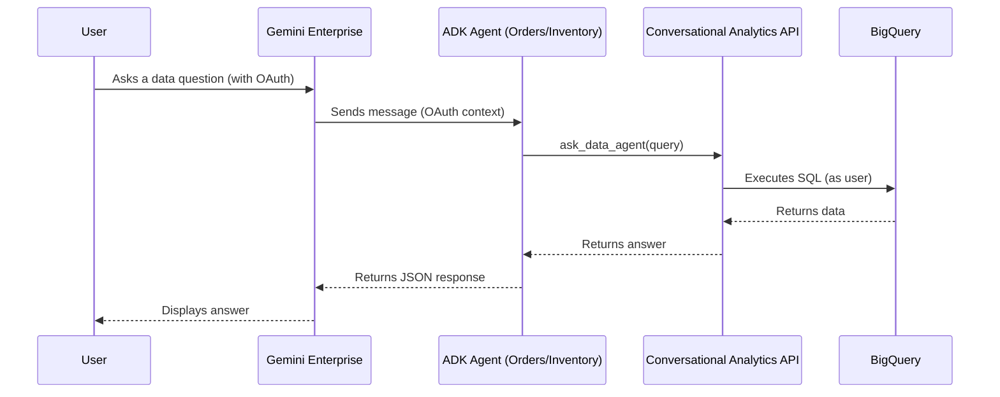

# Gemini Conversational Analytics ADK Demo

This project demonstrates how to deploy **Google ADK Agents** that bridge Google Cloud's **Conversational Analytics API** with **Gemini Enterprise** using OAuth identity passthrough.

## Architecture Overview

The system uses **Google ADK Agents** that leverage the `DataAgentToolset` to communicate with backend Data Agents in BigQuery. The agents are deployed to **Vertex AI Agent Engine** and registered with **Gemini Enterprise** for OAuth identity passthrough.



**Key Feature:** OAuth identity passthrough ensures queries execute with the end user's BigQuery permissions, not a service account.

## Project Structure

```text
├── app/
│   ├── orders/             # Order Analyst Agent (ADK)
│   │   ├── agent.py        # Agent definition + DataAgentToolset
│   │   ├── requirements.txt # Production dependencies
│   │   ├── .env            # Runtime environment variables (for deployment)
│   │   └── __init__.py
│   └── inventory/          # Inventory Analyst Agent (ADK)
│       ├── agent.py        # Agent definition + DataAgentToolset
│       ├── requirements.txt # Production dependencies
│       ├── .env            # Runtime environment variables (for deployment)
│       └── __init__.py
├── scripts/
│   ├── admin_tools.py      # Data Agent lifecycle management (Backend)
│   ├── setup_auth.py       # Creates OAuth Resources for GE Registration
│   ├── register_agents.py  # Registers Deployed Agents with GE
│   └── deploy_agents.sh    # Automated deployment script
├── .env                    # Environment variables for local development
├── .env.example            # Template for environment configuration
├── pyproject.toml          # Project dependencies
└── README.md               # This file
```

## Prerequisites

1. **Python 3.11+** and **uv** package manager
2. **Google Cloud Project** with the following APIs enabled:
   - Vertex AI API
   - Conversational Analytics API (Gemini Data Analytics)
   - Discovery Engine API
   - BigQuery API
3. **OAuth 2.0 Client Credentials:**
   - Create OAuth 2.0 credentials in Google Cloud Console
   - Note the Client ID and Client Secret
4. **gcloud CLI** installed and authenticated:
   ```bash
   gcloud auth application-default login
   gcloud auth login
   ```
5. **Gemini Enterprise App** (for registration in step 4)

## Setup & Local Development

### 1. Install Dependencies

```bash
uv sync
```

### 2. Configure Environment

Copy `.env.example` to `.env` and fill in your project details:

```bash
cp .env.example .env
```

**Required variables in `.env`:**
```bash
GOOGLE_CLOUD_PROJECT=your-project-id
GOOGLE_CLOUD_PROJECT_NUMBER=your-project-number
GOOGLE_CLOUD_LOCATION=global
BIGQUERY_DATASET_ID=thelook_ecommerce
AGENT_ORDERS_ID=your-orders-data-agent-id
AGENT_INVENTORY_ID=your-inventory-data-agent-id
GEMINI_APP_ID=your-gemini-app-id
OAUTH_CLIENT_ID=your-oauth-client-id
OAUTH_CLIENT_SECRET=your-oauth-client-secret
AUTH_RESOURCE_ORDERS=bq-caapi-oauth
AUTH_RESOURCE_INVENTORY=bq-caapi-oauth-inventory
MODEL_NAME=gemini-3-flash-preview
GOOGLE_GENAI_USE_VERTEXAI=TRUE
```

**Create per-agent `.env` files for deployment:**

Each agent directory needs its own `.env` file with runtime variables:

```bash
# app/orders/.env
cat > app/orders/.env << EOF
GOOGLE_CLOUD_PROJECT=your-project-id
AGENT_ORDERS_ID=your-orders-data-agent-id
OAUTH_CLIENT_ID=your-oauth-client-id
OAUTH_CLIENT_SECRET=your-oauth-client-secret
MODEL_NAME=gemini-3-flash-preview
EOF

# app/inventory/.env
cat > app/inventory/.env << EOF
GOOGLE_CLOUD_PROJECT=your-project-id
AGENT_INVENTORY_ID=your-inventory-data-agent-id
OAUTH_CLIENT_ID=your-oauth-client-id
OAUTH_CLIENT_SECRET=your-oauth-client-secret
MODEL_NAME=gemini-3-flash-preview
EOF
```

**Important:** These per-agent `.env` files contain secrets and are gitignored. They're required for the ADK to inject environment variables into the Agent Engine runtime.

### 3. Setup Backend Data Agents

Create the Data Agents (backend services that talk to BigQuery):

```bash
uv run python scripts/admin_tools.py
```

Ensure `AGENT_ORDERS_ID` and `AGENT_INVENTORY_ID` in `.env` match the agent IDs from the output.

### 4. Test Locally

Chat with an agent directly in your terminal:

```bash
# Load environment variables
export $(cat .env | xargs)

# Run the interactive CLI
adk run app/orders
```

## Production Deployment

Deploy agents to **Gemini Enterprise** using the following workflow:

### Step 1: Prepare Dependencies

Export dependencies to agent directories:

```bash
uv export --no-hashes --format requirements-txt > requirements.txt
cp requirements.txt app/orders/requirements.txt
cp requirements.txt app/inventory/requirements.txt
```

### Step 2: Deploy to Vertex AI Agent Engine

Use the automated deployment script:

```bash
bash scripts/deploy_agents.sh
```

This script will:
1. Read environment variables from the root `.env`
2. Deploy both agents using their respective `.env` files in `app/orders/` and `app/inventory/`
3. Output the Reasoning Engine resource names for registration

**Or deploy manually:**

```bash
# Deploy Orders Agent (uses app/orders/.env for runtime variables)
uv run adk deploy agent_engine app/orders \
  --project=your-project-id \
  --region=us-central1 \
  --display_name="Orders Analyst"

# Deploy Inventory Agent (uses app/inventory/.env for runtime variables)
uv run adk deploy agent_engine app/inventory \
  --project=your-project-id \
  --region=us-central1 \
  --display_name="Inventory Analyst"
```

**Important:** The ADK automatically discovers the `.env` file in each agent directory and injects those variables into the Agent Engine runtime. This is how OAuth credentials are passed to the deployed agents.

**Note:** Save the Resource Name from the output (e.g., `projects/123/locations/us-central1/reasoningEngines/456`).

**To update existing agents:**
```bash
uv run adk deploy agent_engine app/orders \
  --project=your-project-id \
  --region=us-central1 \
  --display_name="Orders Analyst" \
  --agent_engine_id=<EXISTING_AGENT_ID>
```

### Step 3: Setup Authorization Resources

Create OAuth resources for identity passthrough:

```bash
uv run python scripts/setup_auth.py
```

This creates authorization resources using `OAUTH_CLIENT_ID` and `OAUTH_CLIENT_SECRET` from `.env`.

### Step 4: Register with Gemini Enterprise

Register deployed agents with Gemini Enterprise:

```bash
uv run python scripts/register_agents.py \
  --orders-resource <ORDERS_RESOURCE_NAME_FROM_STEP_2> \
  --inventory-resource <INVENTORY_RESOURCE_NAME_FROM_STEP_2>
```

### Step 5: Test the Deployment

Access your **Gemini Enterprise** web app to see "Order & User Analyst" and "Inventory & Product Analyst" in the agent selector.

**To verify agents are running:**

```bash
# Check agent status
gcloud logging read \
  'resource.type="aiplatform.googleapis.com/ReasoningEngine" 
   AND resource.labels.reasoning_engine_id="<YOUR_AGENT_ID>"' \
  --project=$GOOGLE_CLOUD_PROJECT --limit=20
```

Look for "Application startup complete" messages with no errors.

## Sample Queries

Test the agents with these sample questions:

### Order & User Analyst
- "How many orders are in the 'Complete' status?"
- "Who are the top 5 users by total lifetime spend?"
- "What is the average number of items per order?"
- "Show me the distribution of order statuses for the last month."

### Inventory & Product Analyst
- "What is the name and price of the product with ID 1?"
- "Which distribution center currently holds the most inventory?"
- "How many products are in the 'Accessories' category?"
- "List 10 products that have a retail price greater than $100."

## Troubleshooting

### Common Issues

**Issue: `async_stream_query` method not found**
- **Cause:** Agent failed to initialize properly during deployment
- **Solution:** Check cloud logs for import errors or timeouts
- **Check logs:**
  ```bash
  gcloud logging read \
    'resource.type="aiplatform.googleapis.com/ReasoningEngine"' \
    --project=$GOOGLE_CLOUD_PROJECT --limit=50
  ```

**Issue: OAuth authentication errors**
- **Cause:** Missing or incorrect OAuth credentials
- **Solution:** Verify `OAUTH_CLIENT_ID` and `OAUTH_CLIENT_SECRET` in `.env`
- **Check:** Ensure OAuth client is authorized for the required scopes

**Issue: Queries fail with permission errors**
- **Cause:** User doesn't have BigQuery access
- **Solution:** OAuth passthrough requires users to have appropriate BigQuery permissions
- **Note:** The agent runs queries as the end user, not a service account

**Issue: Local testing fails with credential errors**
- **Cause:** Environment variables not loaded
- **Solution:** Always load `.env` before running locally:
  ```bash
  export $(cat .env | xargs)
  ```

### Viewing Agent Logs

**Orders Agent:**
```bash
gcloud logging read \
  'resource.type="aiplatform.googleapis.com/ReasoningEngine" 
   AND resource.labels.reasoning_engine_id="<ORDERS_AGENT_ID>"' \
  --project=$GOOGLE_CLOUD_PROJECT --limit=50
```

**Inventory Agent:**
```bash
gcloud logging read \
  'resource.type="aiplatform.googleapis.com/ReasoningEngine" 
   AND resource.labels.reasoning_engine_id="<INVENTORY_AGENT_ID>"' \
  --project=$GOOGLE_CLOUD_PROJECT --limit=50
```

### Key Architecture Notes

1. **OAuth Identity Passthrough:** The agents use OAuth client credentials to enable the Conversational Analytics API to access BigQuery as the end user. This ensures data access respects user permissions.

2. **Environment Variable Management:**
   - **Root `.env`**: Used for local development and scripts (admin_tools, setup_auth, register_agents)
   - **Per-agent `.env`**: Used by ADK to inject runtime environment variables into Agent Engine deployments
   - The per-agent `.env` files are required because the ADK reads them during deployment and configures the Agent Engine container with those variables

3. **Runtime Credentials:** OAuth credentials (`OAUTH_CLIENT_ID`, `OAUTH_CLIENT_SECRET`) must be present in the per-agent `.env` files. The ADK passes these to the Agent Engine runtime, where they're used by `DataAgentCredentialsConfig` to enable identity passthrough.

## Development

### Running Tests

```bash
# Verify agent initialization locally
export $(cat .env | xargs)
uv run python -c "from app.orders.agent import root_agent; print(root_agent.name)"
```

### Code Style

The project uses `ruff` for linting:

```bash
uv run ruff check .
uv run ruff format .
```

## License

This is a demonstration project for educational purposes.
