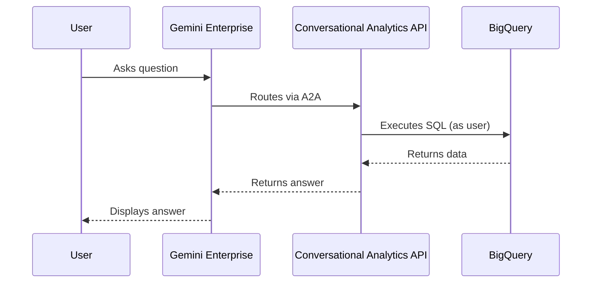

# Conversational Analytics API with Gemini Enterprise

Create BigQuery data agents using the Conversational Analytics API and publish
them to Gemini Enterprise via the built-in A2A protocol. No custom agent
runtime or deployment infrastructure required.

## Architecture


```mermaid
sequenceDiagram
    participant User
    participant GE as Gemini Enterprise
    participant CA as Conversational Analytics API
    participant BQ as BigQuery

    User->>GE: Asks question
    GE->>CA: Routes via A2A
    CA->>BQ: Executes SQL (as user)
    BQ-->>CA: Returns data
    CA-->>GE: Returns answer
    GE-->>User: Displays answer
```

**Key Feature:** OAuth identity passthrough ensures queries execute with the end user's BigQuery permissions.
Gemini Enterprise deposits the user's access token into the ADK session state; `DataAgentCredentialsConfig`
reads it directly via `external_access_token_key` on every tool call — no custom callback required.

## Project Structure

```text
├── scripts/
│   ├── enrich_bigquery_metadata.py # Run Dataplex profile and docs scans
│   ├── admin_tools.py              # Create/update CA API data agents
│   └── register_ge_agents.py       # Fetch A2A card and register in GE
├── config/
│   └── agent_definitions.py      # Minimal agent table grouping
├── advanced/                     # Custom ADK runtime (see advanced/README.md)
│   ├── app/                      # ADK agent packages
│   ├── scripts/                  # Deploy, auth, and registration scripts
│   └── test_web/                 # Flask OAuth test harness
├── docs/
│   ├── gemini-enterprise-demo.png
│   └── test-web-demo.png
├── .env.example
├── pyproject.toml
└── README.md
```

## Prerequisites

1. Python 3.11+ with [`uv`](https://docs.astral.sh/uv/) package manager
2. Google Cloud project with APIs enabled:
   - Conversational Analytics API (`geminidataanalytics.googleapis.com`)
   - Discovery Engine API (`discoveryengine.googleapis.com`)
   - BigQuery API (`bigquery.googleapis.com`)
   - Dataplex API (`dataplex.googleapis.com`)
   - Gemini for Google Cloud API (`cloudaicompanion.googleapis.com`)
3. OAuth 2.0 client credentials (Client ID + Secret) with redirect URIs:
   - `https://vertexaisearch.cloud.google.com/oauth-redirect`
   - `https://vertexaisearch.cloud.google.com/static/oauth/oauth.html`
4. A Gemini Enterprise app (for agent registration)
5. gcloud CLI authenticated:
   ```bash
   gcloud auth application-default login
   ```

## Quick Start

### 1. Install Dependencies

```bash
uv sync
```

### 2. Configure Environment

```bash
cp .env.example .env
```

Edit `.env` with your project details:

```bash
GOOGLE_CLOUD_PROJECT=your-project-id
GOOGLE_CLOUD_PROJECT_NUMBER=your-project-number
BIGQUERY_LOCATION=us
DATAPLEX_LOCATION=us
BIGQUERY_DATASET_ID=your-dataset-id
AGENT_ORDERS_ID=order_user_agent
AGENT_INVENTORY_ID=inventory_product_agent
GEMINI_APP_ID=your-gemini-app-id
OAUTH_CLIENT_ID=your-oauth-client-id
OAUTH_CLIENT_SECRET=your-oauth-client-secret
AUTH_RESOURCE_ORDERS=bq-caapi-oauth-orders
AUTH_RESOURCE_INVENTORY=bq-caapi-oauth-inventory
```

### 3. Enrich BigQuery Metadata

Run Dataplex scans to automate the same metadata generation you can trigger from
BigQuery Studio. Publishing is enabled by default so generated descriptions,
queries, profiles, and relationships are persisted to Dataplex Catalog and
Knowledge Catalog for the selected dataset and tables.

By default, data profile scans use `STANDARD` mode with `10%` sampling. Change
`DATA_PROFILE_MODE` and `DATA_PROFILE_SAMPLING_PERCENT` in `.env` if you need a
different profiling setup.

```bash
# Preview the Dataplex payloads without creating scans.
uv run python scripts/enrich_bigquery_metadata.py --dry-run

# Create and run scans asynchronously. Publishing is enabled by default.
uv run python scripts/enrich_bigquery_metadata.py

# Optional: wait for scan jobs to complete for admin/debugging workflows.
uv run python scripts/enrich_bigquery_metadata.py --wait
```

Use `--no-publish` only when you want ad hoc scan results that are not persisted
to the catalog.

After asynchronous scans finish, review the generated descriptions, suggested
queries, profiles, and relationships in BigQuery or Knowledge Catalog. Add or
adjust verified queries in the agent later if you need deterministic business
logic.

### 4. Create Data Agents

Create the CA API data agents in your project:

```bash
uv run python scripts/admin_tools.py
```

This creates or updates backend data agents with the minimal table lists from
`config/agent_definitions.py` and short scope instructions. Table descriptions,
column descriptions, data profiles, and dataset relationships are managed in
BigQuery and Knowledge Catalog, not in local agent config.

### 5. Register in Gemini Enterprise

Fetch the A2A agent cards from the CA API and register them in GE:

```bash
# Register specific agents with an OAuth authorization resource
uv run python scripts/register_ge_agents.py \
  --agents order_user_agent inventory_product_agent \
  --auth-ids bq-caapi-oauth-orders bq-caapi-oauth-inventory

# List agents registered in the GE app
uv run python scripts/register_ge_agents.py --list
```

The script:
1. Calls the CA API `getCard` endpoint to fetch the canonical A2A agent card
2. Creates an OAuth authorization resource in GE (if `--auth-id` is provided)
3. Registers each agent in GE via the Discovery Engine API

If you changed `AGENT_ORDERS_ID`, `AGENT_INVENTORY_ID`, `AUTH_RESOURCE_ORDERS`,
or `AUTH_RESOURCE_INVENTORY`, pass those values to `--agents` and `--auth-ids`.

### 6. Use in Gemini Enterprise

Open your Gemini Enterprise app in the Google Cloud console. The registered
agents appear as available data agents for users to query.

## Script Reference

### `scripts/enrich_bigquery_metadata.py`

Run Dataplex data profile and data documentation scans for the configured
dataset and agent tables.

```bash
# Run default metadata enrichment scans asynchronously and publish results.
uv run python scripts/enrich_bigquery_metadata.py

# Generate only table and column descriptions.
uv run python scripts/enrich_bigquery_metadata.py \
  --skip-profile \
  --skip-dataset-docs \
  --generation-scope TABLE_AND_COLUMN_DESCRIPTIONS

# Override standard profiling settings and export profile results.
uv run python scripts/enrich_bigquery_metadata.py \
  --profile-mode STANDARD \
  --sampling-percent 10 \
  --profile-results-table your-project.metadata.profile_results \
  --wait
```

The script runs these scan types:

- Dataset `DATA_DOCUMENTATION` scans for dataset descriptions, relationship
  insights, and cross-table query suggestions.
- Table `DATA_PROFILE` scans for null percentages, cardinality, value
  distributions, min/max/mean, quartiles, and other profile statistics.
- Table `DATA_DOCUMENTATION` scans for table descriptions, column descriptions,
  and SQL query suggestions.

The script logs Dataplex scan job IDs and returns immediately by default. Use
`--wait` when you want the command to poll until scan jobs finish.

### `scripts/admin_tools.py`

Create or update CA API data agents. Idempotent -- creates on first run,
updates existing agents on subsequent runs.

```bash
uv run python scripts/admin_tools.py
```

The script intentionally does not read Dataplex scan results or write local
semantic metadata. The agent references BigQuery tables, and generated metadata
is managed by BigQuery, Dataplex, and Knowledge Catalog.

### `scripts/register_ge_agents.py`

Register CA API data agents in Gemini Enterprise via A2A.

```bash
# Register agents
uv run python scripts/register_ge_agents.py \
  --agents agent_id_1 agent_id_2 \
  --auth-ids auth-resource-1 auth-resource-2

# Custom display names
uv run python scripts/register_ge_agents.py \
  --agents agent_id_1 agent_id_2 \
  --display-names "Orders Analyst,Inventory Analyst" \
  --auth-ids auth-resource-1 auth-resource-2

# Update existing agents
uv run python scripts/register_ge_agents.py \
  --agents agent_id_1 \
  --auth-ids my-auth-resource \
  --force

# List registered agents
uv run python scripts/register_ge_agents.py --list

# Delete an agent by GE ID
uv run python scripts/register_ge_agents.py --delete 12345678901234567890
```

## Sample Queries

**Orders Agent:**
- "How many orders are in 'Complete' status?"
- "Who are the top 5 users by total spend?"
- "What is the average number of items per order?"

**Inventory Agent:**
- "What is the name and price of product ID 1?"
- "Which distribution center has the most inventory?"
- "How many products are in the 'Accessories' category?"

## Advanced: Custom ADK Runtime

For use cases requiring custom agent orchestration, a standalone frontend,
or chart visualization support, see [`advanced/README.md`](advanced/README.md).

The advanced path includes independent Agent Engine wrappers with OAuth identity
passthrough and the local-first `semantic_analytics` context-selection workflow.
Install the additional dependencies with:

```bash
uv sync --extra advanced
```

## Demo

### Gemini Enterprise


*Data agent responding to queries in Gemini Enterprise*

## License

Demonstration project for educational purposes.
