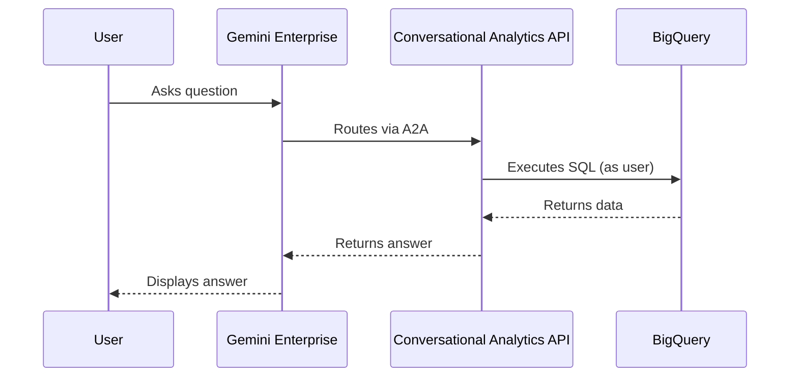
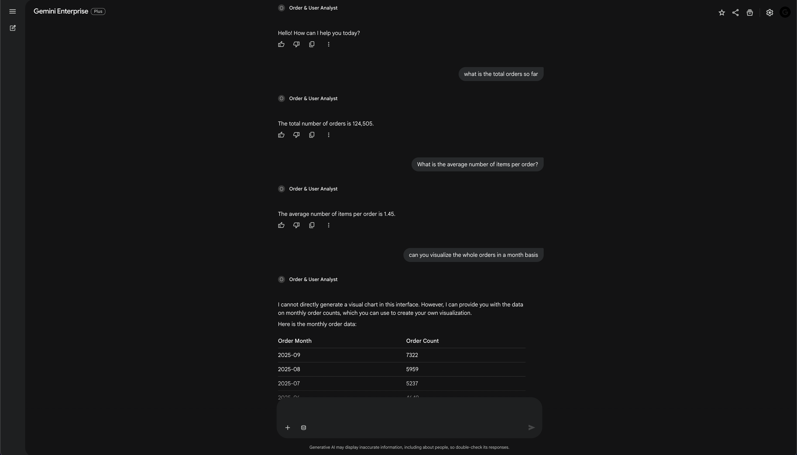

# Conversational Analytics API with Gemini Enterprise

Create BigQuery data agents using the Conversational Analytics API and publish
them to Gemini Enterprise via the built-in A2A protocol. No custom agent
runtime or deployment infrastructure required.

## Architecture


```mermaid
sequenceDiagram
    participant User
    participant GE as Gemini Enterprise
    participant CA as Conversational Analytics API
    participant BQ as BigQuery

    User->>GE: Asks question
    GE->>CA: Routes via A2A
    CA->>BQ: Executes SQL (as user)
    BQ-->>CA: Returns data
    CA-->>GE: Returns answer
    GE-->>User: Displays answer
```

**Key Feature:** OAuth identity passthrough ensures queries execute with the end user's BigQuery permissions.
Gemini Enterprise deposits the user's access token into the ADK session state; `DataAgentCredentialsConfig`
reads it directly via `external_access_token_key` on every tool call — no custom callback required.

## Project Structure

```text
├── scripts/
│   ├── admin_tools.py            # Create/update CA API data agents
│   └── register_ge_agents.py     # Fetch A2A card and register in GE
├── advanced/                     # Custom ADK runtime (see advanced/README.md)
│   ├── app/                      # ADK agent packages
│   ├── scripts/                  # Deploy, auth, and registration scripts
│   └── test_web/                 # Flask OAuth test harness
├── docs/
│   ├── gemini-enterprise-demo.png
│   └── test-web-demo.png
├── .env.example
├── pyproject.toml
└── README.md
```

## Prerequisites

1. Python 3.11+ with [`uv`](https://docs.astral.sh/uv/) package manager
2. Google Cloud project with APIs enabled:
   - Conversational Analytics API (`geminidataanalytics.googleapis.com`)
   - Discovery Engine API (`discoveryengine.googleapis.com`)
   - BigQuery API (`bigquery.googleapis.com`)
3. OAuth 2.0 client credentials (Client ID + Secret) with redirect URIs:
   - `https://vertexaisearch.cloud.google.com/oauth-redirect`
   - `https://vertexaisearch.cloud.google.com/static/oauth/oauth.html`
4. A Gemini Enterprise app (for agent registration)
5. gcloud CLI authenticated:
   ```bash
   gcloud auth application-default login
   ```

## Quick Start

### 1. Install Dependencies

```bash
uv sync
```

### 2. Configure Environment

```bash
cp .env.example .env
```

Edit `.env` with your project details:

```bash
GOOGLE_CLOUD_PROJECT=your-project-id
BIGQUERY_DATASET_ID=your-dataset-id
AGENT_ORDERS_ID=your-agent-id
GEMINI_APP_ID=your-gemini-app-id
OAUTH_CLIENT_ID=your-oauth-client-id
OAUTH_CLIENT_SECRET=your-oauth-client-secret
```

### 3. Create Data Agents

Create the CA API data agents in your project:

```bash
uv run python scripts/admin_tools.py
```

This creates (or updates) the backend data agents with BigQuery table
references and system instructions.

### 4. Register in Gemini Enterprise

Fetch the A2A agent cards from the CA API and register them in GE:

```bash
# Register specific agents with an OAuth authorization resource
uv run python scripts/register_ge_agents.py \
  --agents order_user_agent inventory_product_agent \
  --auth-id bq-caapi-oauth

# List agents registered in the GE app
uv run python scripts/register_ge_agents.py --list
```

The script:
1. Calls the CA API `getCard` endpoint to fetch the canonical A2A agent card
2. Creates an OAuth authorization resource in GE (if `--auth-id` is provided)
3. Registers each agent in GE via the Discovery Engine API

### 5. Use in Gemini Enterprise

Open your Gemini Enterprise app in the Google Cloud console. The registered
agents appear as available data agents for users to query.

## Script Reference

### `scripts/admin_tools.py`

Create or update CA API data agents. Idempotent -- creates on first run,
updates existing agents on subsequent runs.

```bash
uv run python scripts/admin_tools.py
```

### `scripts/register_ge_agents.py`

Register CA API data agents in Gemini Enterprise via A2A.

```bash
# Register agents
uv run python scripts/register_ge_agents.py \
  --agents agent_id_1 agent_id_2 \
  --auth-id my-auth-resource

# Custom display names
uv run python scripts/register_ge_agents.py \
  --agents agent_id_1 agent_id_2 \
  --display-names "Orders Analyst,Inventory Analyst" \
  --auth-id my-auth-resource

# Update existing agents
uv run python scripts/register_ge_agents.py \
  --agents agent_id_1 \
  --auth-id my-auth-resource \
  --force

# List registered agents
uv run python scripts/register_ge_agents.py --list

# Delete an agent by GE ID
uv run python scripts/register_ge_agents.py --delete 12345678901234567890
```

## Sample Queries

**Orders Agent:**
- "How many orders are in 'Complete' status?"
- "Who are the top 5 users by total spend?"
- "What is the average number of items per order?"

**Inventory Agent:**
- "What is the name and price of product ID 1?"
- "Which distribution center has the most inventory?"
- "How many products are in the 'Accessories' category?"

## Advanced: Custom ADK Runtime

For use cases requiring custom agent orchestration, a standalone frontend,
or chart visualization support, see [`advanced/README.md`](advanced/README.md).

The advanced path deploys ADK agent packages to Vertex AI Agent Engine with
custom OAuth identity passthrough. Install the additional dependencies with:

```bash
uv sync --extra advanced
```

## Demo

### Gemini Enterprise



*Data agent responding to queries in Gemini Enterprise*

## License

Demonstration project for educational purposes.
