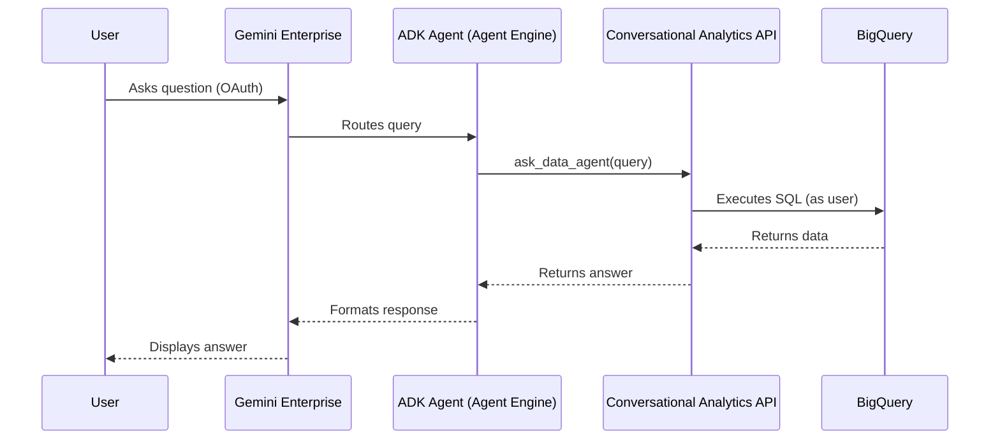

# Advanced: Custom ADK Runtime and Semantic Contract

This directory contains two parallel ADK paths:

- Legacy orders and inventory wrappers that deploy to Agent Engine and call CA
  API data agents with end-user OAuth.
- A local-first `certified_analytics` Workflow that prototypes deterministic
  semantic-contract compilation. Its current full-match selector and ADC execution
  modes are developer checkpoints and return `certified=false`.

Use this approach when you need:

- Custom agent orchestration logic beyond what CA API data agents provide
- A standalone web frontend (Flask test harness included)
- Direct control over the ADK agent runtime and tool callbacks
- Chart/visualization support via custom CA API calls

For the standard integration (no ADK runtime required), see the
[root README](../README.md).

## Legacy Agent Engine Architecture



OAuth identity passthrough ensures queries execute with the end user's
BigQuery permissions.

## Structure

```text
advanced/
├── app/
│   ├── orders/              # Orders Analyst ADK agent
│   │   ├── __init__.py
│   │   └── agent.py         # Agent definition + DataAgentToolset
│   ├── inventory/           # Inventory Analyst ADK agent
│   │   ├── __init__.py
│   │   └── agent.py         # Agent definition + DataAgentToolset
│   └── certified_analytics/ # Local semantic-contract Workflow prototype
├── scripts/
│   ├── deploy_agents.sh     # Deploy to Vertex AI Agent Engine
│   ├── setup_auth.py        # Create OAuth auth resources in GE
│   └── register_agents.py   # Register ADK agents in GE (adkAgentDefinition)
├── test_web/
│   ├── app.py               # Flask OAuth test harness
│   ├── templates/            # HTML templates
│   └── static/               # CSS
├── docs/
│   └── examples/
│       └── chart_with_ca_api.py  # Reference: direct CA API with chart support
└── README.md
```

## Prerequisites

Install the advanced dependencies:

```bash
uv sync --extra advanced
```

This adds `google-adk`, BigQuery, and Dataplex client dependencies.

## Deployment

### Step 1: Create Backend Data Agents

Run the shared admin tools from the project root (if not already done):

```bash
uv run python scripts/admin_tools.py
```

### Step 2: Configure Per-Agent Environment

Create per-agent `.env` files:

```bash
cat > advanced/app/orders/.env << EOF
GOOGLE_CLOUD_PROJECT=your-project-id
AGENT_ORDERS_ID=your-orders-data-agent-id
OAUTH_CLIENT_ID=your-oauth-client-id
OAUTH_CLIENT_SECRET=your-oauth-client-secret
EOF
```

### Step 3: Deploy to Agent Engine

```bash
bash advanced/scripts/deploy_agents.sh
```

Save the Reasoning Engine resource names from the output.

### Step 4: Setup OAuth Authorization

```bash
uv run python advanced/scripts/setup_auth.py
```

### Step 5: Register with Gemini Enterprise

```bash
uv run python advanced/scripts/register_agents.py \
  --orders-resource <ORDERS_RESOURCE_NAME> \
  --inventory-resource <INVENTORY_RESOURCE_NAME>
```

## Local Development

Test agents locally with the ADK CLI:

```bash
export $(cat .env | xargs)
uv run adk run advanced/app/orders
```

## Local Testing with OAuth

Test the OAuth passthrough flow using the Flask test harness:

```bash
cd advanced/test_web
uv venv .venv
source .venv/bin/activate
uv pip install --index-url https://pypi.org/simple/ flask requests google-auth-oauthlib python-dotenv
python app.py
```

Open http://localhost:8080, log in with Google, and query the agent.

**Prerequisites:**
- Add `http://localhost:8080/auth/callback` to OAuth client redirect URIs
- Set `ORDERS_REASONING_ENGINE_ID` in root `.env`

## Chart Visualization

The ADK's `DataAgentToolset` does not currently support chart responses from
the CA API. The API returns Vega-Lite specifications in streaming responses,
but the toolset only processes text, schema, and data messages.

See [`docs/examples/chart_with_ca_api.py`](docs/examples/chart_with_ca_api.py)
for a reference implementation showing direct CA API calls with chart support.

## Demo

### Test Web App


*Local OAuth test harness showing token passthrough*
