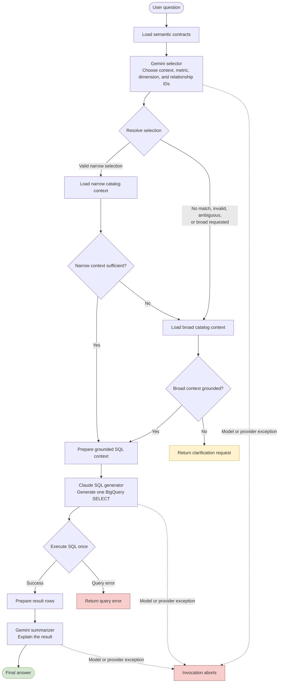
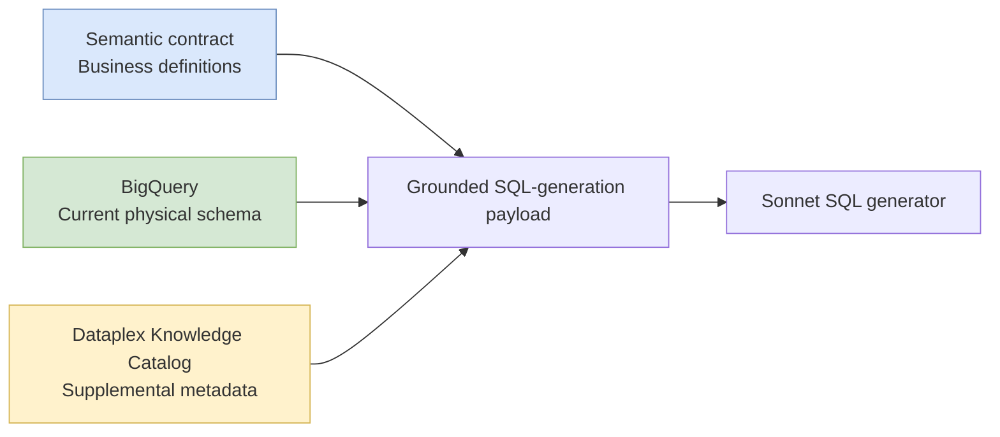
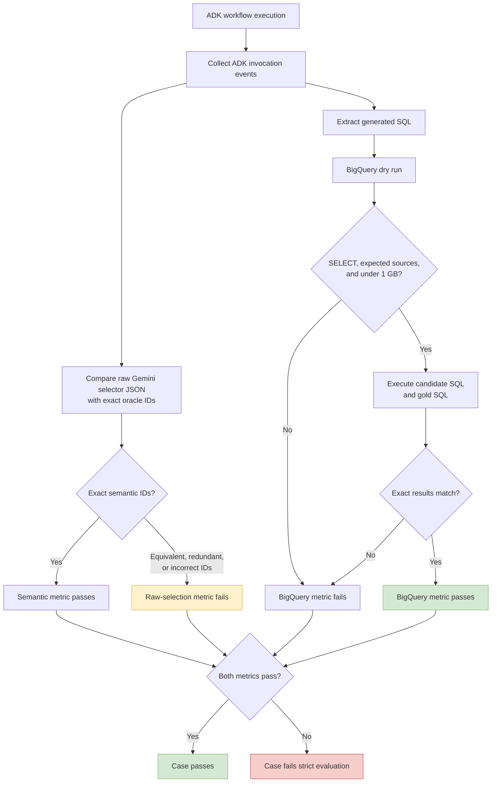
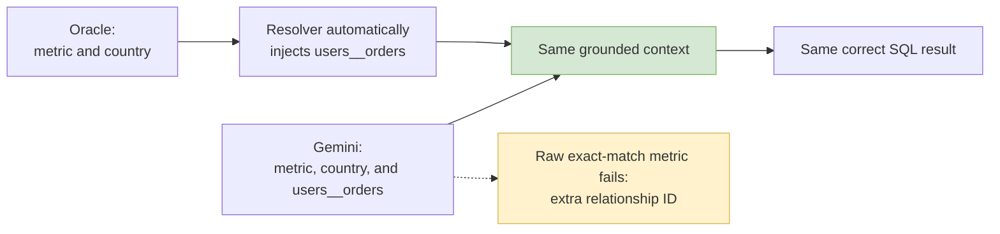
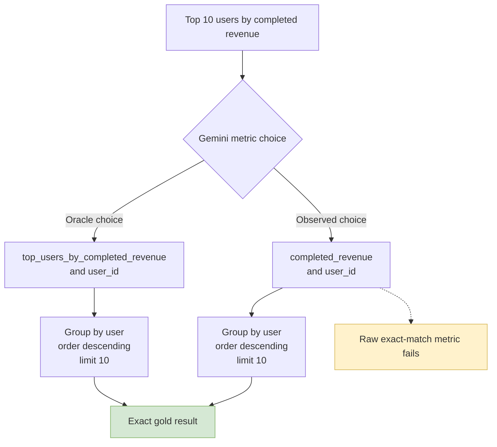

# Semantic Analytics ADK Flow

Gemini did not fail to choose the semantic workflow or domain during the
baseline evaluation. It consistently selected the relevant `thelook_orders` or
`thelook_inventory` context.

The reported `28/36` semantic-selection score measures exact agreement between
raw selector IDs and one oracle representation. It is not a semantic-correctness
score. All 36 selections were accepted by the production resolver, and all 36
generated queries returned the exact gold result.

## Runtime Flow



This is the expected V2 prototype flow. The resolver deterministically validates
the selected contract version and concept IDs, injects required dimensions, and
computes the relationship closure. Sonnet is then instructed to follow the
grounded context, but the runtime does not currently inspect the generated SQL
for semantic equivalence before executing it.

Current execution guardrails are:

- BigQuery writes are blocked.
- SQL executes once, without a repair loop.
- Results are capped at 50 rows by default.
- Broad catalog discovery is default-deny and requires explicit project or
  dataset allowlists.
- Query errors return through the error path.

The runtime does not yet enforce allowed source tables, statement type, or
maximum bytes billed before execution. The evaluation metric applies those
checks independently.

## Normal Success Path


For example:

```text
Question:
How many completed orders were placed?

Gemini selection:
context       = thelook_orders
metric        = completed_order_count
dimensions    = []
relationships = []

Claude SQL intent:
COUNT(DISTINCT order_id)
WHERE status = 'Complete'

Result:
31,132
```

This case passed semantic selection and exact BigQuery result matching.

## Context Sent To Sonnet

Three sources contribute different kinds of grounding:



The intended authority order is:

```text
Semantic contract  -> authoritative business meaning
BigQuery           -> authoritative current physical schema
Dataplex           -> supplemental catalog knowledge
```

### Semantic Contract Context

The selected contract contributes:

- Contract ID, version, owner, and description.
- Physical table names, sources, grains, primary keys, and foreign keys.
- Metric formulas, aggregation types, and required filters.
- Required and allowed dimensions.
- Join relationships and cardinality.
- Allowed filter operators.
- Default ordering and limits when defined.
- Resolver-injected dimensions and relationships.

### BigQuery Context

BigQuery supplies current metadata for the exact selected tables:

```json
{
  "source": "project.dataset.table",
  "description": "Current table description",
  "retrieved_at": "timestamp",
  "fields": [
    {
      "name": "order_id",
      "type": "INTEGER",
      "mode": "NULLABLE",
      "description": "Unique identifier for the order."
    }
  ]
}
```

This includes table descriptions and current column names, types, modes, and
descriptions. It does not include sample values, row counts, distributions, or
query-cost estimates.

### Dataplex Knowledge Catalog Context

For narrow grounding, Dataplex resolves the exact selected BigQuery tables and
calls `LookupContext`. For broad grounding, it first performs semantic table
search inside configured allowlists.

The lookup requests schemas, descriptions, relationships, guidelines, quality
status, and SQL examples while explicitly asking Dataplex to omit data values.
The returned JSON is sanitized to an allowlist that can retain:

- Business and technical descriptions.
- Owners and contacts.
- Glossary terms.
- Schema and column descriptions.
- Relationships and join conditions.
- Data-quality status.
- Refresh cadence.
- Partitioning and clustering metadata.
- Guidelines, verified queries, and SQL examples.
- Related resources and resource ancestry.

Dataplex enrichment is best effort. Narrow grounding can proceed when BigQuery
returns complete schema metadata even if Dataplex returns no additional context.

### Combined Payload

Sonnet receives a bounded object shaped approximately like this:

```json
{
  "question": "How many completed orders were placed by country?",
  "reasoning_path": "semantic_narrow",
  "semantic_context_ids": ["thelook_orders"],
  "semantic_context_versions": ["thelook_orders:v1"],
  "semantic_contexts": [],
  "catalog_route": "narrow",
  "catalog_context": [],
  "knowledge_catalog_context": [],
  "candidate_sources": [
    "project.dataset.orders",
    "project.dataset.users"
  ]
}
```

## Recovery And Failure Paths

The workflow has three business-level exits and one unhandled operational exit:

- A successful query is summarized and returned as the final answer.
- Insufficient narrow context triggers broad catalog grounding.
- Broad context that is still insufficient returns a clarification request.
- A BigQuery error returns a query-error response.
- A model or provider exception aborts the invocation before a routed response.

The initial Sonnet 5 smoke attempt followed the operational failure path. SQL
generation aborted with `404 NOT_FOUND` because `claude-sonnet-5` was not enabled
for the project. Sonnet 4.5 was enabled and completed the workflow successfully.

## Current Evaluation Flow

The ADK evaluation applies two independent metrics to each invocation.



The BigQuery metric is a semantic outcome check. The current selector metric is
only an exact raw-representation check; it does not call the production resolver
or compare the effective expanded context.

## Raw Mismatch: Equivalent Relationship Closure

For completed orders by country, the oracle expected:

```json
{
  "context_id": "thelook_orders",
  "metric_ids": ["completed_order_count"],
  "dimension_ids": ["country"],
  "relationship_ids": []
}
```

Gemini sometimes selected:

```json
{
  "context_id": "thelook_orders",
  "metric_ids": ["completed_order_count"],
  "dimension_ids": ["country"],
  "relationship_ids": ["users__orders"]
}
```

The relationship is valid. If omitted, the semantic resolver automatically
computes and injects the same join.



Both inputs produce the same effective semantic context. The difference can be
reported as selector minimality, but it should not fail semantic correctness.

## Raw Mismatch: Overlapping Metrics

For top users by completed revenue, the oracle expected:

```text
top_users_by_completed_revenue + user_id
```

Gemini consistently selected:

```text
completed_revenue + user_id
```

Both choices generated the same grouped, ordered, and limited result.



This exposes overlap in the semantic contract. The generic and specialized
metrics can answer the same question, but the exact oracle accepts only the
specialized metric ID. The result does not prove that Gemini bypassed or
misunderstood the semantic layer.

## Contract Assessment

The contracts under `config/semantic_contracts/` are structurally valid and
represent a realistic compact semantic model. They define domains, versions,
owners, table grains, keys, joins, dimensions, metric formulas, required
filters, allowed dimensions, join paths, synonyms, and default query behavior.

The inventory contract is cleanly composable. The order contract has one design
ambiguity: `completed_revenue` already supports the `user_id` dimension, while
`top_users_by_completed_revenue` repeats the same measure and filter with a
required user dimension, descending order, and limit 10.

In a fuller production model, reusable measures and query intent would normally
be separate:

```yaml
metric_ids: [completed_revenue]
dimension_ids: [user_id]
order_by:
  metric: completed_revenue
  direction: descending
limit: 10
```

The current selector schema does not model filter values, ordering, or limits,
so the specialized metric acts like a saved query preset. That is acceptable for
a prototype but creates multiple valid representations of the same question.

A mature enterprise contract would commonly add time grains, currency and unit
metadata, aggregation behavior, null handling, canonical join precedence,
filter-value typing, access classifications, lifecycle status, freshness and
quality requirements, and separate saved-query definitions.

## Recommended Evaluation Model

The current exact selector metric should be retained as a diagnostic named
`semantic_selection_exact_match`. A semantic correctness gate should instead:

1. Parse the selector output through the production `SemanticSelection` model.
2. Resolve it with `resolve_selection` and the active evaluation contracts.
3. Require a valid narrow route for these narrow cases.
4. Compare effective metrics, dimensions, relationship closure, and sources.
5. Keep unknown IDs, version mismatches, disconnected concepts, and unexpected
   broad fallback as failures.
6. Score exact BigQuery result matching independently.

## Baseline Interpretation

| Measurement | Result |
|---|---:|
| Resolver-valid semantic selections | 36/36, 100% |
| Exact BigQuery result accuracy | 36/36, 100% |
| Exact raw-selector agreement | 28/36, 77.8% |

The `28/36` result is useful for measuring selector consistency against one
chosen representation. It should not be presented as semantic correctness.
None of the eight raw mismatches failed resolver validation or produced an
incorrect BigQuery result.
