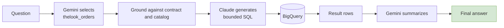
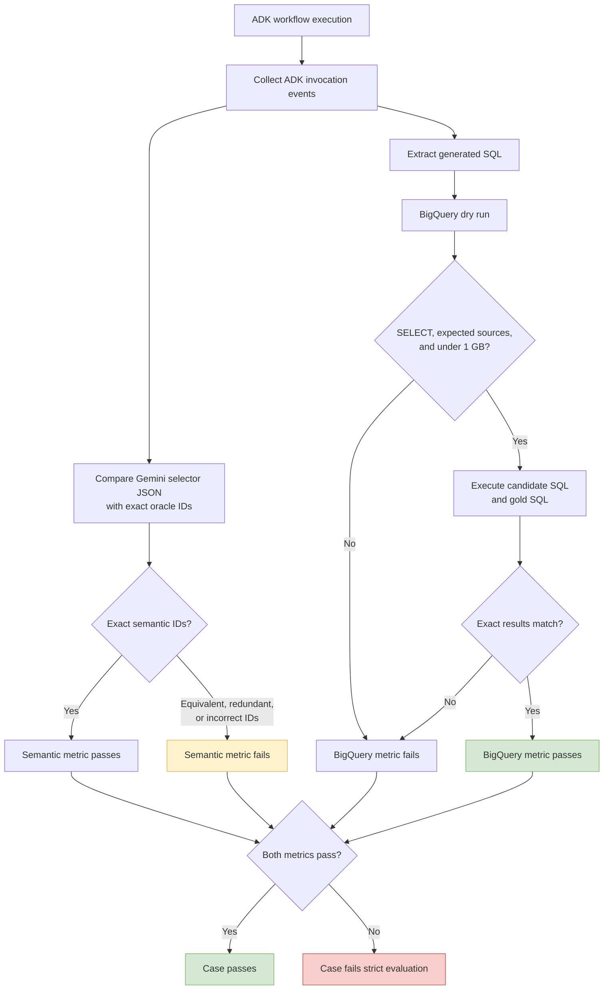
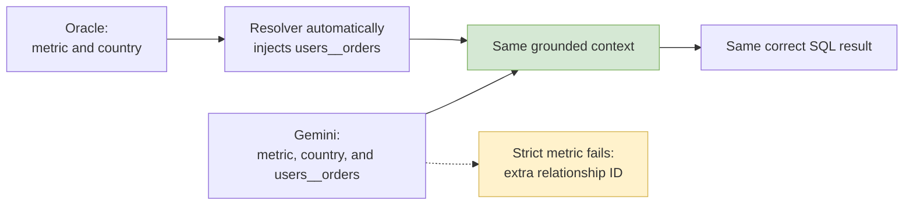
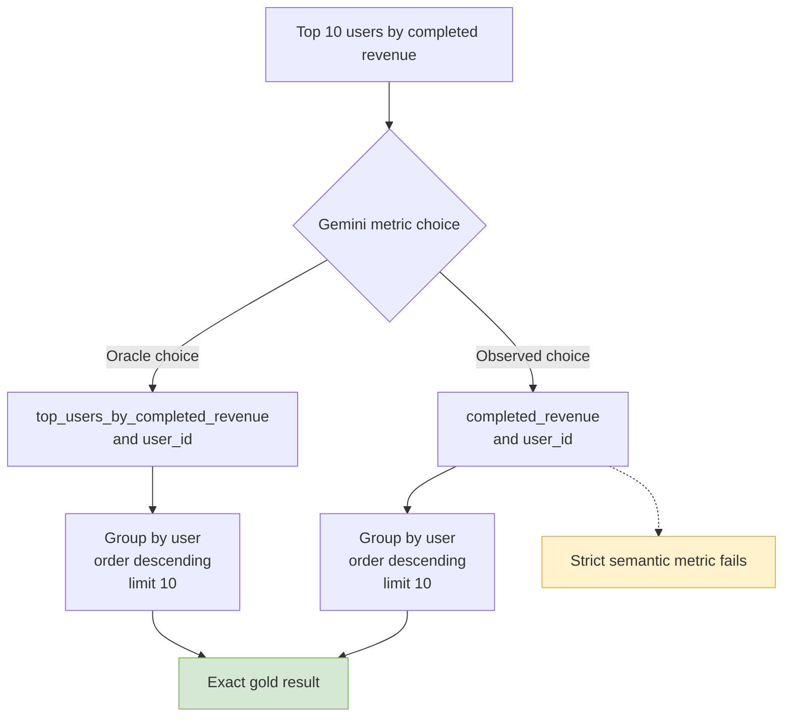

# Semantic Analytics ADK Flow

Gemini did not fail to choose the semantic workflow or domain during the
baseline evaluation. It consistently selected the relevant `thelook_orders` or
`thelook_inventory` context.

The semantic-selection score was lower because the metric requires the exact
minimal concept IDs defined by the oracle. Eight selections produced correct
SQL and exact results but contained redundant or equivalent semantic choices.

## Runtime Flow


## Normal Success Path



For example:

```text
Question:
How many completed orders were placed?

Gemini selection:
context       = thelook_orders
metric        = completed_order_count
dimensions    = []
relationships = []

Claude SQL intent:
COUNT(DISTINCT order_id)
WHERE status = 'Complete'

Result:
31,132
```

This case passed semantic selection and exact BigQuery result matching.

## Recovery And Failure Paths

The workflow has three business-level exits and one unhandled operational exit:

- A successful query is summarized and returned as the final answer.
- Insufficient narrow context triggers broad catalog grounding.
- Broad context that is still insufficient returns a clarification request.
- A BigQuery error returns a query-error response.
- A model or provider exception aborts the invocation before a routed response.

The initial Sonnet 5 smoke attempt followed the operational failure path. SQL
generation aborted with `404 NOT_FOUND` because `claude-sonnet-5` was not enabled
for the project. Sonnet 4.5 was enabled and completed the workflow successfully.

## Evaluation Flow

The ADK evaluation applies two independent metrics to each invocation.



## Selection Failure: Redundant Relationship

For completed orders by country, the oracle expected:

```json
{
  "context_id": "thelook_orders",
  "metric_ids": ["completed_order_count"],
  "dimension_ids": ["country"],
  "relationship_ids": []
}
```

Gemini sometimes selected:

```json
{
  "context_id": "thelook_orders",
  "metric_ids": ["completed_order_count"],
  "dimension_ids": ["country"],
  "relationship_ids": ["users__orders"]
}
```

The relationship is correct but unnecessary because the semantic resolver
automatically computes and injects the required join.



This is an over-selection problem, not a wrong-path problem.

## Selection Failure: Equivalent Metric

For top users by completed revenue, the oracle expected:

```text
top_users_by_completed_revenue + user_id
```

Gemini consistently selected:

```text
completed_revenue + user_id
```

Both choices generated the same grouped, ordered, and limited result.



This exposes overlap in the semantic contract. The generic and specialized
metrics can answer the same question, but the exact oracle accepts only the
specialized metric ID.

## Baseline Interpretation

| Measurement | Result |
|---|---:|
| Semantic workflow and domain selection | Working |
| Catalog grounding | Working |
| Exact BigQuery result accuracy | 36/36, 100% |
| Strict minimal semantic selection | 28/36, 77.8% |

The issue is selector consistency and contract ambiguity, not downstream SQL
correctness. None of the eight strict semantic-selection mismatches produced an
incorrect BigQuery result.
