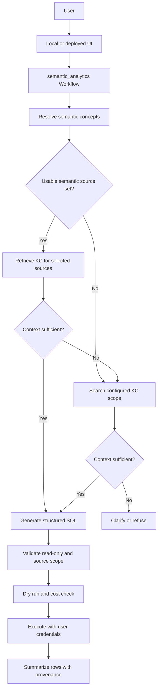

# ADK Semantic Analytics Plan

## Objective

Build and evaluate a portable ADK analytics workflow that supplies curated
business semantics before searching broader metadata.

The semantic layer is reasoning context, not a LookML-style query compiler. It
helps the model select relevant concepts, calculations, grain, relationships, and
physical sources. Knowledge Catalog will add current schema and metadata. An LLM
will then generate SQL behind explicit source, read-only, dry-run, cost, and
credential controls.

The existing BigQuery Conversational Analytics agents remain the independent
out-of-the-box baseline. The custom workflow exists to measure whether
semantic-first context improves source selection, constraint preservation,
accuracy, consistency, and explainability.

## Current Checkpoint

Current phase: **Phases 6, 7, and 8 are complete. Catalog grounding uses a live
BigQuery-backed adapter (optional Dataplex search and structural, value-free profile
enrichment behind `CATALOG_DATAPLEX_ENABLED`), and guarded read-only SQL generation,
independent source-scope policy, dry run, bounded repair, and mode-gated execution
run behind deterministic boundaries. Deferred items are the provider-backed live
catalog and execution smoke tests under Phase 10.**

The executable `semantic_analytics` flow grounds selected context against the
catalog through the adapter boundary and then generates guarded, read-only SQL:

```text
question
  -> load bounded semantic YAML registry
  -> select domain, metric, dimension, and relationship IDs with an LLM
  -> reload and validate selected IDs against current configuration
  -> expand only selected concepts and their physical source closure
  -> semantic_narrow -> load_narrow_catalog_context -> assess_context
  -> catalog_broad   -> load_broad_catalog_context  -> assess_broad_context
  -> assess_context insufficient -> load_broad_catalog_context
  -> grounded -> enter_sql_generation -> generate_sql (LLM)
  -> enforce_sql_policy -> dry_run_sql -> maybe_execute_sql -> result
  -> policy or dry-run failure -> bounded repair -> refuse when exhausted
  -> insufficient grounding -> clarify or refuse
```

Phase 7 (catalog grounding), tested with injected fakes:

- `semantic/catalog.py`: `project.dataset.table` parsing, default-deny
  `CATALOG_ALLOWED_PROJECTS` / `CATALOG_ALLOWED_DATASETS` allowlists separate from
  the compute project, bounded and profile-redacted timestamped `TableMetadata`,
  and the injectable `CatalogAdapter` protocol
- `semantic/catalog_runtime.py`: narrow and broad loading nodes, deterministic
  sufficiency assessment (no confidence score), and clarification or SQL-handoff
  terminals
- `advanced/app/semantic_analytics/agent.py`: the graph now routes through the
  catalog grounding nodes; the Phase 6 pass-through terminals are retired from the
  active graph
- `semantic/catalog.py` `BigQueryCatalogAdapter`: the live adapter reads current
  schema for narrow sources via the BigQuery metadata API and enumerates only the
  configured allowlists for broad discovery; the client is created lazily and is
  injectable for deterministic tests
- `semantic/catalog.py` `DataplexCatalogAdapter`: an optional decorator (enabled by
  `CATALOG_DATAPLEX_ENABLED`) that adds Dataplex Catalog search for broad discovery
  and structural, value-free profile enrichment (null ratio, distinct ratio, and a
  derived candidate-key flag) plus presence of a generated insight aspect. It
  re-clamps every discovery result to the allowlists, falls back to the BigQuery
  name-match search on error or when no in-scope entry is found, and never surfaces
  data values (samples, min, max, top-N, averages, quantiles). BigQuery remains the
  schema source of truth; the Dataplex client is lazy and injectable
- `tests/test_semantic_catalog.py`: parsing, redaction, bounding, narrow and broad
  grounding, sufficiency routing, scope-escape prevention, live-adapter schema
  mapping and allowlist-bounded search with a fake client, Dataplex search
  clamp/fallback, profile enrichment with strict value redaction, and workflow
  integration

`build_catalog_adapter` requires `GOOGLE_CLOUD_PROJECT` and returns the live
BigQuery-backed adapter, wrapped in `DataplexCatalogAdapter` when
`CATALOG_DATAPLEX_ENABLED` is truthy (default off). Only the provider-backed live
smoke test remains deferred to Phase 10.

Implemented:

- configurable single-file or directory registry
- fully qualified physical table references
- strict YAML shape and size validation
- portable semantic reference validation
- bounded, domain-neutral structured semantic selection
- prompt-injection guidance for configuration-derived selector data
- concept-level context and source filtering
- registry reload after selection with explicit version-drift detection
- semantic IDs, versions, sources, route, and selection provenance
- deterministic workflow integration coverage with a substituted selector
- installed `LlmAgent` structured-output coverage with a deterministic `BaseLlm`
- graph-level broad-catalog recovery from schema-invalid successful model output
- a 100,000-byte aggregate bound on expanded selected context

Implemented in the active workflow (Phase 9 Slice 1):

- per-user BigQuery execution: `SQL_AUTH_MODE=user` binds the query to a per-request
  OAuth access token read from workflow state; it fails closed to refusal when the
  token is absent and never falls back to ADC. `SQL_AUTH_MODE=adc` (default) keeps
  Application Default Credentials. Auth mode is orthogonal to `SQL_EXECUTION_MODE`.

Not implemented in the active workflow:

- Flask harness OAuth hardening and provenance UI (Phase 9 Slice 2)
- result summarization
- provider-backed structured-selector, live catalog, and live execution smoke
  tests, deferred to Phase 10 evaluation

The historical compiler, executor, join planner, and catalog-retrieval spike were
removed in the Phase 7 cleanup; they are recoverable from git history.

## Current Interfaces

### Contract Loading

`SEMANTIC_CONTRACT_PATH` may identify one `.yaml` or `.yml` file or a directory.
The default is `config/semantic_contracts/`. Relative configured paths are resolved
from the process working directory; local commands therefore run from the project
root.

The registry reloads on every request. Adding or renaming a domain, metric,
dimension, relationship, or table does not require Python or instruction changes.

Current safety bounds:

- at most 50 contract files
- at most 1 MB per contract file
- at most 100 entries in bounded YAML lists and maps
- at most 4,000 characters per semantic text field
- at most 8,000 characters in a user question
- at most 100,000 serialized characters in the selector candidate context
- at most three selected domains per request
- at most 20 metrics, 30 dimensions, and 30 relationships per selected domain
- at most 128 characters per selected ID and 4,000 characters in the selection
  reason
- at most 100,000 UTF-8 bytes in the aggregate expanded selected context

Contract, question, selector-candidate, and structured-output violations fail
explicitly or are converted into the documented invalid-selection route. An
oversized expanded selected context is discarded and routes to `catalog_broad`
with `route_cause=context_limit_exceeded`. The workflow does not silently
truncate business semantics.

### Canonical YAML Shape

The checked-in files under `config/semantic_contracts/` are canonical. This
reduced example uses the actual loadable schema:

```yaml
id: example_orders
version: 1
owner: analytics-platform
description: Order analytics.
routing_terms: [orders, sales]
examples:
  - How many completed orders were placed?

tables:
  orders:
    source:
      project: example-project
      dataset: commerce
      table: orders
    primary_key: order_id
    grain: order

joins: {}

dimensions:
  order_status:
    label: Order Status
    description: Current order state.
    table: orders
    sql: orders.status
    synonyms: [status]

metrics:
  completed_order_count:
    label: Completed Order Count
    description: Distinct completed orders.
    type: count_distinct
    base_table: orders
    sql: orders.order_id
    required_filters:
      - orders.status = 'Complete'
    allowed_dimensions: [order_status]
    join_path: []
    allowed_filters:
      order_status: ['=', IN]
```

The active portable validator (`validate_contract()`) checks schema types and
references only. The historical compiler's stricter aggregation, operator, path,
and ordering checks were removed with the compiler in the Phase 7 cleanup; a
future strict mode would reintroduce its own validation.

Compiler-era YAML fields remain because they provide useful calculation and
relationship guidance. Active model context presents `allowed_dimensions` and
`allowed_filters` as known combinations, not exhaustive coverage. Unknown needs
continue to catalog grounding rather than being refused.

### Semantic Selection

The selector receives a compact index containing IDs, descriptions, routing
terms, examples, relationship summaries, metrics, dimensions, labels, and
synonyms. It does not receive SQL expressions or physical table names.

Structured output contains:

```text
selected_contexts:
  - context_id
    context_version
    metric_ids
    dimension_ids
    relationship_ids
requires_broad_catalog
reason
```

Selected IDs are never trusted directly. The resolver reloads the configured
registry, rejects unknown or duplicate IDs and version drift, adds metric-required
dimensions, and computes a deterministic connected source closure within declared
metric relationship paths.

Configuration text is treated as untrusted data. The selector instruction tells
the model to ignore instructions embedded in descriptions, examples, labels, or
synonyms.

The `LlmAgent` applies `SemanticSelection` as its `output_schema`. An after-model
callback validates successful model text before ADK's output-schema boundary.
Schema-invalid successful output is replaced with a valid empty selection and a
request-scoped marker; the resolver then routes broad with
`route_cause=invalid_selection`. Provider, authentication, quota, and transport
errors are not converted into semantic misses. The resolver also retains
defensive schema handling for malformed input delivered by non-LLM nodes.

### Phase 6 Response

Current terminal output is an internal catalog handoff, not an analytics answer:

```text
status: semantic_context_resolved |
        semantic_context_partial |
        semantic_context_not_found
reasoning_path: semantic_narrow | catalog_broad
question: ...
semantic_context_used: true | false
semantic_context_ids: [...]
semantic_context_versions: [...]
semantic_source_names: [...]
semantic_contexts: [...]
semantic_selection: {...}
selection_reason: ...
selection_error: ...              # invalid selection or context bound
route_cause: semantic_context_resolved |
             no_semantic_match |
             model_declared_incomplete |
             invalid_selection |
             context_limit_exceeded
next_step: narrow_catalog_grounding | broad_catalog_grounding
```

`semantic_narrow` means selected concepts provide a bounded source set for narrow
catalog retrieval. `catalog_broad` means no useful context matched, selected
context is incomplete, or schema-valid selected IDs failed deterministic
validation. A semantic miss is not a refusal.

At the current checkpoint, `next_step` is informational metadata. Both routes end
in pass-through terminal functions; no catalog node consumes this field yet.

Expanded selected context is serialized as deterministic compact JSON and limited
to 100,000 UTF-8 bytes after required dimensions, relationships, tables, and
source closure are injected. The boundary is inclusive. Oversized aggregate
context is never truncated; it is discarded and routed broad with
`route_cause=context_limit_exceeded`.

## Phase 6 Exit Criteria

Status: **complete**.

Implemented code now prevents explicit relationship IDs from widening a selected
metric beyond its declared relationship paths.

Verified at Phase 6 closure commit `9a95d5b`:

- complete advanced-extra suite passes with 113 tests
- focused semantic and ADK compatibility suite passes with 37 tests
- the installed `LlmAgent` propagates structured output through a deterministic
  `BaseLlm` boundary without external credentials
- schema-invalid successful model output routes broad while provider errors remain
  hard failures
- aggregate selected context accepts the exact size limit and rejects larger
  multi-context payloads
- ADK API discovery loads `orders`, `inventory`, and `semantic_analytics`
- a fresh-process import of `semantic_analytics` loads only the active
  semantic-resolution and catalog-grounding modules

## Target End-State



Workflow ordering is structural. System instructions alone must not be trusted to
make a model read semantic and catalog context before using query tools.

## Phase 7: Knowledge Catalog Grounding

Status: **complete** (functionally). The deterministic grounding core, adapter
boundary, graph wiring, a live BigQuery-backed adapter, and the optional
Dataplex-backed search and structural profile enrichment are all implemented and
tested with injected fakes. Only the provider-backed live smoke test is deferred to
Phase 10 evaluation.

Goals:

- replace the asset-summary spike with typed schema and metadata context
- retrieve current metadata only for `semantic_source_names` on the narrow path
- search only configured projects and datasets on the broad path
- retrieve profile and insight aspects only when useful
- report context sufficiency and specific missing information
- route narrow insufficiency to broad discovery without executing SQL
- bound, redact, and timestamp every metadata payload

### Phase 7 Source Boundary

Catalog search configuration must separate the compute or billing project from
searchable data sources:

- `GOOGLE_CLOUD_PROJECT` identifies the compute or billing project and does not
  implicitly authorize catalog search in that project
- `CATALOG_ALLOWED_PROJECTS` contains comma-separated searchable project IDs for
  broad discovery
- `CATALOG_ALLOWED_DATASETS` contains comma-separated `project.dataset`
  identifiers for broad discovery
- `CATALOG_DATAPLEX_ENABLED` (default off) opts into Dataplex Catalog search and
  structural profile enrichment; when off, discovery uses BigQuery name-match
  enumeration and no profile aspects are read. Dataplex search is always re-clamped
  to the allowlists and falls back to name-match on error
- absent or invalid broad-search allowlists fail closed; they never trigger an
  organization-wide search
- narrow retrieval uses only exact fully qualified sources from validated
  semantic contracts; those curated sources form the narrow-path allowlist
- every `semantic_source_names` value is parsed as exactly
  `project.dataset.table` before catalog access

Broad results must match the configured project and dataset allowlists. Phase 8
source policy will use the exact sources returned by the selected catalog route;
it must not infer permission from the compute project.

Proposed nodes:

1. `load_narrow_catalog_context`
2. `assess_context`
3. `load_broad_catalog_context`
4. `assess_broad_context`
5. terminal clarification or Phase 8 SQL handoff

The first Phase 7 graph change replaces the current pass-through branch targets:

```text
semantic_narrow -> load_narrow_catalog_context -> assess_context
catalog_broad   -> load_broad_catalog_context  -> assess_broad_context
assess_context insufficient -> load_broad_catalog_context
```

Each loader receives the complete Phase 6 handoff payload. Narrow loading uses
`semantic_source_names`; broad loading uses the preserved question and configured
allowlists. The pass-through terminal functions can be removed after both routes
have equivalent integration coverage.

Context sufficiency must report:

- permitted physical sources
- current schema for each source
- fields needed for selection, aggregation, grouping, and filtering
- relationships needed for multi-table work
- resolved and unresolved business terms
- preserved user constraints
- missing metadata and the selected route

Phase 7 routes must not depend on an unexplained confidence score.

Exit criteria:

- narrow retrieval cannot escape selected semantic sources
- broad retrieval cannot escape configured projects and datasets
- stale semantic references are visible as missing context
- sensitive profile values are omitted or redacted
- metadata size and result counts are bounded
- both routes are tested without SQL execution

### Resume Here

Phase 6 implementation closed at commit `9a95d5b`. The active graph is
`advanced/app/semantic_analytics/agent.py`; it now routes through the catalog
grounding nodes in `semantic/catalog_runtime.py` and terminates at the grounded
SQL handoff or clarification.

Phase 7 grounding is implemented:

1. Live Knowledge Catalog schema retrieval via the BigQuery metadata API
   (`get_table` schema and description). **(done)**
2. Typed, default-deny parsing for `CATALOG_ALLOWED_PROJECTS` and
   `CATALOG_ALLOWED_DATASETS`, kept separate from the compute project. **(done)**
3. Reusable catalog adapter boundary (`CatalogAdapter`) plus the live
   `BigQueryCatalogAdapter`; unit tests inject fakes and make no live calls. **(done)**
4. Replace the two pass-through branch targets with narrow and broad loading nodes.
   **(done)**
5. Deterministic sufficiency routing with bounded, redacted, timestamped metadata
   payloads. **(done)**
6. Optional `DataplexCatalogAdapter` (behind `CATALOG_DATAPLEX_ENABLED`) adding
   Dataplex Catalog search and structural, value-free profile enrichment, both
   re-clamped to the allowlists and falling back to name-match on error. **(done)**

Structural enrichment surfaces only null ratio, distinct ratio, a derived
candidate-key flag, and the presence of a generated insight aspect. Actual data
values (samples, min, max, top-N, averages, quantiles) are never read or surfaced,
satisfying the redaction exit criterion. The `broad` payload records
`catalog_discovery_backend` (`dataplex`, `name_match`, or `name_match_fallback`)
for provenance and Phase 10 evaluation.

Remaining Phase 7 work:

- add the provider-backed live smoke test under Phase 10 evaluation (the only
  deferred item)

Phase 7 must stop before SQL generation or execution. Do not reconnect the
historical grounding, compiler, executor, or join-planner modules to the active
workflow merely because similarly named code already exists.

## Phase 8: SQL Generation And Guarded Developer Execution

Status: **complete** (functionally). Guarded SQL generation, independent policy,
dry run, bounded repair, and mode-gated execution are implemented and tested with
injected fakes. A provider-backed live execution smoke test is deferred to Phase 10.

### Catalog and execution access decision (ADR)

Catalog access uses raw Google Cloud client libraries (`google-cloud-bigquery`,
`google-cloud-dataplex`) behind the deterministic `CatalogAdapter` boundary.
Execution uses the ADK BigQuery tool (`google.adk.integrations.bigquery`)
`execute_sql` behind the deterministic `SqlExecutor` boundary. Both boundaries are
invoked programmatically from workflow nodes, not exposed to the model as tools.

- Grounding stays on the SDK because it must be deterministic, hermetically
  testable, and fully guardrailed (bounding, redaction, allowlist clamp), and
  because no ADK or MCP tool exposes Dataplex per-column profile aspects.
- Execution reuses ADK `execute_sql` + `BigQueryToolConfig` because read-only
  (`WriteMode.BLOCKED`), maximum bytes billed, maximum result rows, and dry run are
  enforced by Google-maintained code; our policy layer adds the source-scope
  guarantee ADK does not provide.
- MCP (for example, MCP Toolbox for Databases) is deferred. It is model-facing and
  requires a separate server process that would break hermetic tests; it is a
  candidate only for exposing this layer to external hosts later.

### Implemented behavior

- `semantic/sql_policy.py`: `sqlglot` (BigQuery dialect) AST validation. It rejects
  anything that is not a single read-only `SELECT`/`WITH` query, requires fully
  qualified `project.dataset.table` references, excludes CTE names, and enforces
  that every referenced source is within the sources the grounding step selected.
  This source-scope guarantee is independent of model output.
- `semantic/execution.py`: `SqlExecutor` boundary plus `AdkBigQueryExecutor`, which
  calls ADK `execute_sql` with `WriteMode.BLOCKED`, `maximum_bytes_billed`,
  `max_query_result_rows`, and `compute_project_id`. It maps results to a normalized
  `ExecResult`, exposes `dry_run` and `execute`, is injectable for tests, and fails
  closed without a compute project.
- `semantic/sql_runtime.py`: `generate_sql` (an `LlmAgent` with the `GeneratedSql`
  output schema and a schema-recovery callback), `enforce_sql_policy`, `dry_run_sql`,
  `maybe_execute_sql`, bounded `repair_sql`, and the `finish_sql_result` /
  `finish_sql_refusal` terminals, split into pure functions and thin nodes.
- `advanced/app/semantic_analytics/agent.py`: the grounded routes now continue into
  the guarded SQL chain instead of terminating.

### Execution modes

Execution is fail-safe. `SQL_EXECUTION_MODE` defaults to `plan`, which stops after a
successful dry run and returns the SQL, policy result, and estimated bytes without
executing. Setting `SQL_EXECUTION_MODE=developer` runs the query with Application
Default Credentials as the final step, still read-only and cost-capped. Related
settings: `SQL_MAX_BYTES_BILLED`, `SQL_MAX_RESULT_ROWS`, and `BIGQUERY_LOCATION`.

### Graph

```text
grounded -> enter_sql_generation -> generate_sql -> enforce_sql_policy
enforce_sql_policy allowed -> dry_run_sql | rejected -> repair_sql
dry_run_sql valid -> maybe_execute_sql | invalid -> repair_sql
repair_sql retry -> generate_sql (bounded) | exhausted -> finish_sql_refusal
maybe_execute_sql -> finish_sql_result
```

### Exit criteria

- SQL is generated only from grounded semantic and catalog context
- read-only is enforced by policy and by the execution engine
- referenced sources cannot escape the selected sources
- a dry run precedes any execution and maximum bytes are enforced
- SQL repair is bounded to one attempt and then refuses
- execution occurs with ADC only in developer mode; plan mode never executes
- SQL, policy, dry-run, and execution provenance are returned
- all paths are tested without live calls

### Phase 9: User Authentication And Local UX

Status: **Slice 1 complete; Slice 2 planned.** Split into two slices so the
functional per-user execution gap lands first (hermetic, high value) and the
dev-harness hardening second.

The semantic workflow currently executes only with Application Default Credentials
(`semantic/execution.py` `_get_credentials()` calls `google.auth.default()`;
`build_sql_executor()` never passes credentials; `maybe_execute_sql` is a plain
function with no `ctx`/session access). "Per-user execution" is therefore a real
functional gap distinct from the Flask harness polish.

#### Slice 1: User-token execution in the workflow (functional core) — implemented

- `semantic/execution.py`: `build_sql_executor(*, access_token=None, auth_mode=None)`
  builds `google.oauth2.credentials.Credentials(token=...)` for injection into
  `AdkBigQueryExecutor` (which already supports a `credentials` param). A new
  `resolve_auth_mode()` reads `SQL_AUTH_MODE` (default `adc`); `user` mode requires
  an access token and raises `SqlExecutionError` when it is absent, never falling
  back to ADC. Auth mode is orthogonal to `SQL_EXECUTION_MODE` (plan/developer).
- `semantic/sql_runtime.py`: `dry_run_sql` and `maybe_execute_sql` are now `@node`s.
  `resolve_sql_auth(state)` reads the user token from `ctx.state` under the
  configurable `ADK_OAUTH_TOKEN_STATE_KEY` (default `AUTH_RESOURCE_SEMANTIC_ANALYTICS`),
  not the orders key. The dry run is the credential gate; in `user` mode a missing
  token routes to `unauthorized` -> `finish_sql_refusal` (no ADC fallback).
- Provenance: the result payload carries an `auth` block recording `mode`
  (`adc`/`user`), `authorized`, and `source` (`application-default`/`user-token`).
- `advanced/app/semantic_analytics/agent.py`: the `dry_run_sql` branch adds the
  `unauthorized -> finish_sql_refusal` edge.
- Tests (hermetic): auth-mode resolution, token-to-credentials binding,
  fail-when-absent in user mode, ADC has no bound credentials, custom state key,
  and workflow-level user-mode refuse/execute plus ADC provenance.

Identity scope (intentional split — "Option A"). `SQL_AUTH_MODE=user` scopes only
SQL execution (the ADK `execute_sql` toolset) to the user. Catalog grounding reads
schema, dataset and table listings via the raw `google-cloud-bigquery` client, and
Dataplex search and profile enrichment via `google-cloud-dataplex`; both keep using
Application Default Credentials (the deployment identity) regardless of
`SQL_AUTH_MODE`. This is deliberate: schema and structural metadata are treated as
deployment-readable, while row data is read under the caller's identity so per-user
access controls (row-level security, authorized views, column policy) apply. A
consequence is that grounding can reveal the existence and schema of a table the
caller cannot query; execution then fails closed for that caller at the data layer.
The full-user-scoped alternative (threading the token into the catalog and Dataplex
clients, which requires the token to carry `cloud-platform` for Dataplex) is
recorded as a future option, not implemented.

#### Slice 2: Flask harness hardening, dependencies, and provenance UI

- resolve user credentials through workflow-compatible BigQuery tooling; reuse the
  OAuth client and scope configuration where appropriate
- create a distinct authorization resource for `semantic_analytics` if it is
  registered as a separate Gemini Enterprise agent, using planned
  `AUTH_RESOURCE_SEMANTIC_ANALYTICS`, because deployed GE agents require a 1:1
  agent-to-authorization-resource mapping
- request the `.../auth/bigquery` OAuth scope, which is sufficient under the Option A
  split identity (see Phase 12 "Identity and IAM model"); `cloud-platform` is needed
  only if user-scoped Dataplex is later adopted
- write the token to `ADK_OAUTH_TOKEN_STATE_KEY` (default
  `AUTH_RESOURCE_SEMANTIC_ANALYTICS`); the harness currently stores it at
  `AUTH_RESOURCE_ORDERS`
- validate OAuth state before token exchange
- validate token expiry and implement refresh or explicit reauthentication
- move access tokens out of Flask's client-side signed cookie session
- configure a stable secret and secure session-cookie settings outside source code
- reuse backend sessions instead of creating one for every query
- declare Flask and OAuth dependencies in `pyproject.toml` and `uv.lock` (a `web`
  extra); remove the manual `uv pip install` setup path
- display reasoning path and execution provenance in the test UI
- add Flask OAuth regression tests and live user-token integration coverage

The current Flask harness passes an explicit session-state key but otherwise has
legacy development behavior: it does not explicitly validate stored OAuth state,
uses Flask's client-side signed session for the access token, and creates a new
backend session for each query. Slice 2 must address those gaps; the harness is
not a production identity service.

### Phase 10: Evaluation

Status: **planned**. Locked decisions: correctness is measured as execution
accuracy against gold SQL result sets; the harness is bespoke (defer Prism and the
BigQuery Agent Analytics SDK to a later CI-gate step); the live run executes real
BigQuery in developer mode; Slice 1 (harness core plus arms 2 and 3) is built first.

Evaluate independently:

1. CA `DataAgentToolset` baseline (raw question, no grounding).
2. Custom Knowledge Catalog-only path.
3. Custom semantic-first plus Knowledge Catalog path (the recommended path; SQL
   authored and guarded by the custom workflow).
4. Grounded CA delegation: semantic selection plus narrow Knowledge Catalog
   injected as context, then handed to `DataAgentToolset.ask_data_agent`. CA
   still authors and executes the SQL; grounding is advisory prompt context, not
   a binding contract.

Arm 4 exists to answer the Phase 11 question directly: does grounding lift CA far
enough to serve as the broad / long-tail fallback rung? It is the ablation
between arm 1 (raw CA) and arm 3 (grounded plus guarded custom generation).
Because `ask_data_agent` returns only after CA has generated and executed the SQL
(no pre-execution approval boundary), arm 4 cannot enforce the pre-execution
guardrails (dry run, byte and cost caps, source-scope) that arm 3 applies, and
its provenance is limited to CA's returned SQL rather than contract-bound
generation. Score those two properties explicitly, not just answer correctness.

Measure SQL and answer correctness, source selection, constraint preservation,
routing, semantic contribution, repeated-run consistency, repair rate, latency,
query cost, and — for arm 4 specifically — provenance auditability and
pre-execution guardrail coverage. Promote arm 4 to the Phase 11 `data_agent`
fallback rung only if its silent-error rate and repeated-run consistency approach
arm 3 and its returned SQL is auditable enough for provenance; otherwise it stays
a comparison baseline.

#### Frameworks decision

The docs name Prism (OSS, CA A/B) and the BigQuery Agent Analytics SDK (trace
logging, golden-trajectory matching) but frame the comparison gate as `[Bespoke]`.
ADK's own `adk eval` scores text `response_match`, which is a poor fit for
execution-accuracy correctness and does not cover the REST CA arms. Phase 10 builds
a bespoke 4-way harness; BigQuery Agent Analytics and Prism are optional later
CI-gate wiring.

#### Harness structure (`bq_caapi_ge/eval/`)

- `eval/arms.py`: an `ArmRunner` protocol and a normalized `ArmResult` (sql,
  referenced_sources, result rows, route, status, repair_count, latency, dry-run
  bytes, provenance, guardrail_coverage). Adapters: `SemanticFirstArm` (arm 3, runs
  `agent.root_agent` via `Runner`), `KcOnlyArm` (arm 2, a Workflow that starts at
  `load_broad_catalog_context`, bypassing the selector), and later the CA REST
  adapters (arms 1 and 4). Models are injectable so tests use a scripted `BaseLlm`.
- `eval/metrics.py` (pure, unit-tested): `result_set_equal` (order-insensitive
  multiset comparison with numeric normalization) is the execution-accuracy metric;
  plus source-selection, constraint-preservation (`sqlglot`/regex against expected
  constructs such as `COUNT(DISTINCT)` and required filters), routing,
  consistency aggregation (N-run), semantic-contribution delta (arm 3 minus arm 2),
  repair rate, latency, and cost.
- `eval/golden/thelook.yaml`: golden cases over `bigquery-public-data.thelook_ecommerce`,
  each with `question`, `gold_sql`, `expected_route`, `expected_sources`,
  `expected_constraints`, and `difficulty` (simple aggregate, filtered, multi-table
  join, ratio, top-N, should-clarify, should-refuse).
- `eval/loader.py`, `eval/orchestration.py` (pure over injected runners),
  `eval/report.py` (JSON and markdown scorecard), `eval/run_eval.py` (live CLI).

#### Hermetic versus live

Harness logic (metrics, orchestration, report, arm-payload extraction) is unit
tested with fakes and scripted models; no live calls in `pytest`. The live run
(`run_eval.py`) executes real Gemini and BigQuery in developer mode and is a
separate credentialed job, including the provider-backed structured-selector smoke
case. Pytest must not assert nondeterministic LLM wording.

#### Slices

1. Harness core plus arms 2 and 3, metrics, golden set, and hermetic tests (no CA
   dependency).
2. Arms 1 and 4 (CA REST adapter reusing `advanced/docs/examples/chart_with_ca_api.py`;
   arm-4 grounding injection into the CA `query`/`system_instruction`; a thelook CA
   data agent via `scripts/admin_tools.py`) plus arm-4 provenance and guardrail
   coverage scoring.
3. Full live orchestration (N-run consistency, cost, latency), scorecard write-up,
   and this section's status update.

### Phase 11: Optional Data-Agent Delegation

The initial custom fallback remains Knowledge Catalog. Only after the custom
catalog path has been evaluated may a future configuration expose
`SEMANTIC_FALLBACK_MODE=kc|data_agent|refuse`. Delegation must be explicit and
reported as `reasoning_path=data_agent`. CA-generated SQL is not modified and
re-executed by default because CA has already executed it.

### Phase 12: Deployment

Defer deployment of `semantic_analytics` until local user-token execution and
evaluations pass. Select Agent Runtime or Cloud Run based on verified Workflow,
OAuth, observability, and operational behavior. Revisit Agents CLI deployment,
evaluation, and observability assets only after selecting the deployment target.

#### Identity and IAM model

Under the Phase 9 Slice 1 split (Option A), a deployment runs under two identities:
metadata grounding uses the deployment service account (ADC), and SQL execution
uses the caller's OAuth token when `SQL_AUTH_MODE=user`.

Application Default Credentials resolve to the attached service account on both
targets:

- Cloud Run: the service's runtime service account (assign a dedicated one; the
  default compute service account is over-privileged).
- Vertex AI Agent Engine / Agent Runtime: the Reasoning Engine service agent
  (`service-PROJECT_NUMBER@gcp-sa-aiplatform-re.iam.gserviceaccount.com`) or a
  custom service account supplied at deploy time.

The end-user token source differs by target but lands in the same session-state key
the workflow reads (`ADK_OAUTH_TOKEN_STATE_KEY`, default
`AUTH_RESOURCE_SEMANTIC_ANALYTICS`), so engine code is deployment-agnostic:

- Cloud Run with the Flask harness: the local OAuth flow (Slice 2) writes the token.
- Agent Engine behind Gemini Enterprise: GE injects the token via the authorization
  resource (the 1:1 agent-to-authorization-resource mapping).

IAM grants:

- Deployment service account (metadata only, no row data):
  `roles/bigquery.metadataViewer` on the allowlisted datasets, plus
  `roles/dataplex.catalogViewer` only when `CATALOG_DATAPLEX_ENABLED=true`. It must
  not hold `roles/bigquery.dataViewer` on source data, so an accidental ADC
  execution fallback fails closed at the data layer instead of over-permitting.
- End user (via the OAuth token): `roles/bigquery.jobUser` on the compute project
  (`GOOGLE_CLOUD_PROJECT`, where jobs are created and bytes billed) and
  `roles/bigquery.dataViewer` on the data they may read. OAuth scope
  `.../auth/bigquery` is sufficient under Option A.

Production requirement: any multi-user deployment must set `SQL_AUTH_MODE=user`.
Leaving it at the `adc` default runs every caller's query as the shared service
account and bypasses per-user data controls.

## Design Requirements

### Semantic First, Not Semantic Only

Semantic context should identify known concepts, calculations, grain,
relationships, filters, exclusions, synonyms, examples, and likely sources. It
must not require every question to be authored, block unrelated answerable
questions, compile SQL in the active runtime, or claim certification.

### Narrow Before Broad

When semantic context is relevant, catalog retrieval begins with its selected
source closure. Broadening is allowed when semantic context is absent, references
stale schema, lacks a requested relationship, omits a needed source, or leaves a
specific metadata dependency unresolved.

Broad search stays within configured project and dataset allowlists. It is not an
organization-wide search by default.

### Generic SQL Guardrails

Before execution, future safeguards must verify:

- the request is a BigQuery read query
- no DDL or DML is present
- projects, datasets, and tables are permitted
- referenced tables exist in resolved context
- dry run succeeds
- estimated bytes stay within limits
- repair attempts are bounded

Generic validation does not prove semantic correctness.

### Sensitive Metadata

Profile common values may contain sensitive data. Catalog context and logs need
field allowlists, truncation, redaction, and provenance. Raw profile payloads must
not be copied into model logs.

## Tooling Decisions

### CA Baseline

`advanced/app/orders` and `advanced/app/inventory` remain independent CA API
baselines. `DataAgentToolset` exposes agent discovery and `ask_data_agent`.
`ask_data_agent` returns only after CA has generated and executed SQL; it has no
documented pre-execution approval boundary for BigQuery sources.

Therefore `DataAgentToolset` is not the SQL planning tool for the custom path. It
remains a comparison baseline and possible future governed delegation adapter.

### Custom Workflow

The custom path uses ADK Workflow nodes to enforce context order. Candidate
boundaries include the semantic registry, Dataplex or ADK catalog retrieval,
BigQuery metadata tools, generic SQL policy, dry run, and explicit execution
adapters.

MCP tools remain possible adapters after the local path works. They must not alter
semantic-first ordering or weaken source, read-only, credential, or cost controls.

### Authentication

Target user execution uses a session-state OAuth token through a
workflow-compatible BigQuery credential boundary. The installed
`BigQueryCredentialsConfig(external_access_token_key=...)` can support local
experiments but is marked experimental by ADK and is not assumed to be the final
production interface. OAuth client and scope configuration can be shared, but
local token-state keys and deployed Gemini Enterprise authorization resources are
different concerns. A separately registered GE agent needs its own authorization
resource. ADC is acceptable only for explicit local developer mode. Missing user
credentials must not fall back silently.

## Repository Shape

```text
advanced/app/
  orders/                    # Independent CA baseline
  inventory/                 # Independent CA baseline
  semantic_analytics/
    __init__.py
    agent.py                 # Thin Workflow construction

semantic/
  types.py                  # Semantic contract dataclasses
  registry.py               # Portable contract loading and validation
  context.py                # Selector and filtered full context
  runtime.py                # Active semantic-resolution nodes and instructions
  catalog.py                # Catalog grounding boundary and adapter protocol
  catalog_runtime.py        # Narrow and broad catalog grounding nodes

config/semantic_contracts/
  thelook_orders.yaml
  thelook_inventory.yaml
```

Add modules only when they own a clear reusable boundary. The catalog grounding
boundary now exists; planned SQL planning and policy modules do not exist yet.

## ADK 2.5 Compatibility Record

The lock-resolved and tested SDK version is `google-adk==2.5.0`.
`pyproject.toml` declares the broader minimum `google-adk>=2.0.0`; that declaration
does not imply every later version is verified. Rerun compatibility and workflow
tests after every ADK lockfile upgrade.

The installed SDK behavior is covered by focused tests:

- `Workflow` imports from `google.adk.workflow`
- workflow `Context` imports from `google.adk.agents.context`
- `Event` imports from `google.adk.events.event`
- `LlmAgent` nodes can sit directly in graph edges
- structured LLM nodes use Pydantic `output_schema`
- after-model callbacks can replace malformed successful output before workflow
  output-schema validation
- routing uses `Event(route=...)`
- dynamic work uses `ctx.run_node(...)`
- `ToolContext` is compatible with workflow `Context`
- `GoogleTool.run_async(..., tool_context=ctx)` receives workflow state

The compatibility test uses a dynamic child node, not a SQL retry loop. Bounded
SQL correction remains Phase 8 work.

## Decision History

### Deterministic Compiler Direction

The original architecture was:

```text
question -> structured intent -> contract validation -> compiled SQL -> execute
```

It produced the registry, join planner, compiler, developer execution adapters,
and a sample-specific `certified_analytics` workflow. The workflow duplicated
metrics and dimensions in Python regular expressions, treated authored coverage
as a blocker, and required Python changes for semantic changes.

That workflow package was removed in Phase 6. The lower-level compiler, executor,
join planner, and catalog-retrieval spike were then removed from the repository in
the Phase 7 cleanup, along with their contract-compiler validation
(`validate_compiler_contract`) and compiler-only types. A future strict mode would
restore them from git history rather than keep dead code in the active tree.

Historical commits (restore points):

- `1f87502 feat: Add semantic contract compiler`
- `7ca0350 feat: Add guarded semantic execution`

### Phase History

| Phase | Status | Result |
|---|---|---|
| 0 | Complete | Original compiler plan |
| 1 | Superseded | Local covered/refusal Workflow skeleton |
| 2 | Removed | Registry, join planner, deterministic compiler (in git history) |
| 3 | Removed | Guarded ADC developer execution (in git history) |
| 4 | Removed | Compact catalog asset retrieval spike (in git history) |
| 5 | Complete | Portable multi-contract schema and ADK compatibility |
| 6 | Complete | Bounded concept selection and catalog handoff |
| 7 | Complete | Narrow and broad Knowledge Catalog grounding (Dataplex optional; live smoke test deferred to Phase 10) |
| 8 | Complete | Guarded read-only SQL generation and execution (ADK execute_sql; live execution smoke test deferred to Phase 10) |
| 9 | Slice 1 complete | Per-user execution via `SQL_AUTH_MODE=user` (fail-closed OAuth token binding); Slice 2 Flask/OAuth harness hardening planned |

### Certification

Certification is out of scope. Responses report concrete context and execution
provenance instead of `certified=true`.

A future stricter mode could use verified queries, deterministic compilation for a
small subset, contract-aware SQL analysis, human approval, or native semantic
query models. It must not force table-specific Python back into the active path.

## Verification Strategy

Deterministic code uses `pytest`; model behavior and SQL quality use ADK or Agents
CLI evaluations. Pytest must not assert nondeterministic LLM wording.

Run deterministic repository checks from the project root:

```bash
uv run --extra advanced pytest tests
uv run --extra advanced pytest \
  tests/test_semantic_context.py \
  tests/test_semantic_analytics_agent.py \
  tests/test_adk_workflow_compatibility.py
uv run --extra advanced ruff check .
uv run --extra advanced ruff format --check .
uv lock --check
git diff --check
```

The 113 full-suite and 37 focused-suite counts above record Phase 6 closure; later
test additions should change the counts without being treated as regressions.

Verify ADK discovery and the active import boundary in fresh processes:

```bash
uv run --extra advanced python - <<'PY'
from google.adk.cli.utils.agent_loader import AgentLoader

agents = AgentLoader("advanced/app").list_agents()
print(agents)
assert {"orders", "inventory", "semantic_analytics"}.issubset(agents)
PY

uv run --extra advanced python - <<'PY'
import sys

import advanced.app.semantic_analytics.agent

# The historical compiler/executor/grounding/join-planner modules were removed in
# the Phase 7 cleanup. This guard ensures they are never reintroduced into the
# active import graph.
forbidden = {
    "semantic.compiler",
    "semantic.executor",
    "semantic.grounding",
    "semantic.join_planner",
}
loaded = sorted(forbidden.intersection(sys.modules))
print(loaded)
assert not loaded
PY
```

Required checks across the roadmap:

- unrelated and renamed semantic concepts require no Python changes
- advanced-path tests run with the `advanced` dependency extra
- fully qualified cross-dataset sources remain intact
- selector IDs are validated before context expansion
- explicit relationships cannot widen selected metric paths
- installed `LlmAgent` structured-output propagation is tested with a deterministic
  model boundary; provider-backed behavior is evaluated separately
- semantic misses route broad rather than refuse
- narrow and broad catalog boundaries cannot escape allowlists
- sufficiency reports missing information explicitly
- SQL is read-only and source-scoped
- dry run precedes execution
- cost and repair limits are enforced
- missing credentials fail explicitly
- responses identify semantic, catalog, and credential provenance
- summarization cannot alter returned values
- CA baseline and custom paths remain independently testable

## Open Questions

- Which Knowledge Catalog aspects provide the most useful current schema,
  relationship, profile, and generated insight context?
- What metadata must be omitted because it is sensitive, noisy, or too large?
- When should broad discovery clarify rather than choose among plausible sources?
- What structured SQL output best supports source validation and dry-run repair?
- Which execution boundary exposes user credentials, dry-run control, bytes, and
  job IDs reliably?
- What evaluation threshold demonstrates improvement over KC-only and CA paths?
- Is optional data-agent delegation operationally valuable after the custom path?
- Which deployment target best supports ADK Workflow and OAuth behavior?

BigQuery Graph may be evaluated later for explicit multi-hop relationship work.
It is not a dependency for the initial semantic-first analytics workflow.
