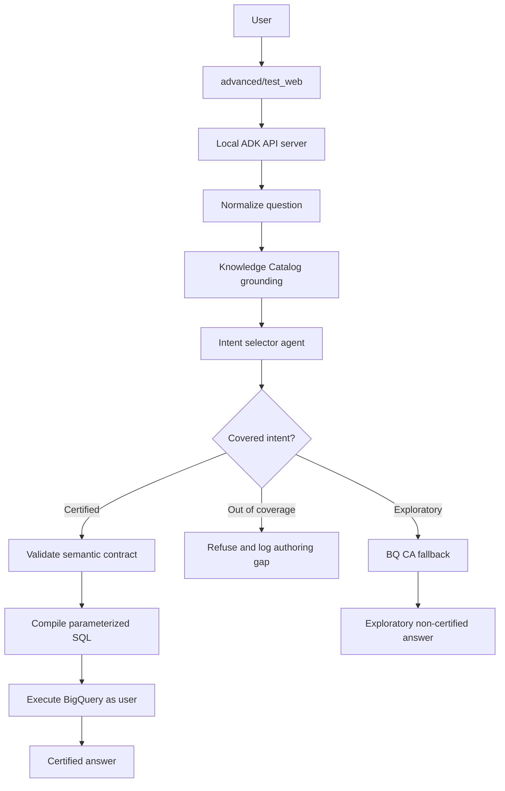

# ADK Semantic Layer Plan

## Objective

Build the `advanced/` path as a custom ADK implementation that demonstrates how
BigQuery Conversational Analytics could behave with a governed semantic layer.
The default CA API path remains the out-of-the-box baseline. The advanced path
becomes the certified analytics prototype.

The goal is not to claim unconditional 100% accuracy. The goal is to make the
number-determining step deterministic for covered business questions:

```text
Natural language question
  -> grounded intent selection
  -> semantic contract validation
  -> deterministic SQL compilation
  -> BigQuery execution
  -> certified answer with SQL, job ID, and contract version
```

Out-of-coverage questions must be refused or explicitly routed to exploratory
mode. They must not silently fall back to generated SQL while presenting the
answer as certified.

## Current State

The default path now enriches BigQuery and Knowledge Catalog context with
Dataplex scans, then creates thin CA API data agents that reference BigQuery
tables. This is the right baseline for out-of-the-box BQ CA behavior.

The current `advanced/` path is still a wrapper around CA API through ADK:

- `advanced/app/orders/agent.py` defines an ADK agent with `DataAgentToolset`.
- `advanced/app/inventory/agent.py` does the same for inventory.
- `advanced/test_web/` simulates OAuth passthrough to deployed Agent Engine.
- `advanced/scripts/register_agents.py` registers deployed ADK agents in Gemini
  Enterprise.

For this phase, we will replace the advanced runtime shape. It should no longer
be just a thin CA API toolset wrapper. It should become a minimal ADK graph-based
certified analytics agent.

## ADK 2.0 Findings

Google ADK 2.0 introduces the Workflow Runtime. Agents, tools, and deterministic
functions are evaluated as nodes in a workflow graph. This maps well to the
certified analytics flow because AI nodes can be isolated to intent selection and
summarization, while deterministic code nodes own validation and SQL compilation.

Relevant ADK 2.0 concepts:

- `Workflow` composes graph nodes.
- `Agent` nodes perform AI reasoning.
- Function nodes perform deterministic steps.
- `Event(route=...)` supports conditional routing.
- `adk api_server` exposes local agents through REST for programmatic testing.
- Graph workflows are not a live-streaming path, and some integrations might not
  be graph-compatible. The certified path should therefore avoid depending on
  `DataAgentToolset` inside the graph.

Current dependency state:

- `pyproject.toml` declares `google-adk>=2.0.0` for the advanced extra.
- `uv.lock` resolves `google-adk==2.5.0`.
- Verified ADK 2.5.0 is available through `uv`.
- Verified the ADK 2.5.0 CLI exposes `create`, `run`, `web`, `api_server`,
  `eval`, `test`, `migrate`, `optimize`, and `deploy`.
- Verified the current `DataAgentToolset` imports still load under ADK 2.5.0,
  so the existing advanced baseline can remain while the certified path is
  built.
- Phase 1 uses the installed ADK 2.5 route behavior: functions emit
  `Event(route=...)`, ADK maps that to `event.actions.route`, and routed
  workflow edges use a route-to-node mapping.

## Agents CLI Findings

Agent Platform now documents Agents CLI as the higher-level lifecycle tool for
ADK projects. The distinction matters:

- `adk` is the ADK runtime and developer CLI for running, serving, evaluating,
  and deploying ADK agents directly.
- `agents-cli` is the Agent Platform lifecycle CLI and skills package. It
  handles scaffolding, project enhancement, evaluation workflows, deployment,
  Gemini Enterprise publishing, and observability setup around ADK.

Required local prerequisites from the current Agents CLI docs:

- Python 3.11+
- `uv`
- Node.js, because skill installation uses `npx skills`

Optional deployment prerequisites:

- Google Cloud SDK
- Terraform, when using generated infrastructure workflows

Observed local prerequisite status:

- Python 3.11.14 is available through `uv run python --version`.
- Node.js v24.18.0 and npx 12.0.1 are available for skill installation.
- Google Cloud SDK 567.0.0 is available.
- Terraform is not installed. This is not blocking until generated
  infrastructure workflows are needed.
- Agents CLI 1.1.0 is installed globally.
- OpenCode can load the Agents CLI skills from `~/.agents/skills` after restart.

Safe verification commands:

```bash
uv sync --extra advanced
uv run --extra advanced adk --version
uv run --extra advanced adk --help
uv run --extra advanced adk api_server --help
uvx google-agents-cli --help
uvx google-agents-cli setup --workspace --skip-auth --dry-run
```

Do not run real Agents CLI setup automatically. The real command can install
tools and skills into global or workspace coding-agent configuration:

```bash
uvx google-agents-cli setup --workspace --skip-auth
```

Run it only when explicitly approved. In this environment, global OpenCode skill
installation was approved and run with:

```bash
uvx google-agents-cli setup --skip-auth --agent opencode
```

The dry run showed workspace setup would execute:

```text
uv tool install google-agents-cli
npx -y skills@1.4.8 add https://github.com/google/agents-cli -y
```

Local ADK development should prefer:

```bash
uv run --extra advanced adk web advanced/app --port 8080 --reload_agents
uv run --extra advanced adk api_server advanced/app --port 8000 --auto_create_session --reload_agents
```

`agents-cli info` currently reports that this directory is not an Agents CLI
project. Do not apply `agents-cli scaffold enhance .` in Phase 1. This repo
already has a demo-specific structure, so preserve it until the local certified
path is working. Revisit Agents CLI enhancement later when deployment,
evaluation, or observability assets are needed.

Deployment should remain deferred until the local certified path and evaluations
pass. When deployment starts, prefer Agents CLI for deployment skeletons and
operational assets:

```bash
agents-cli scaffold enhance --deployment-target cloud_run
agents-cli deploy
```

## Target Architecture



The key separation is:

- Knowledge Catalog grounds language and metadata.
- The semantic contract owns formulas, joins, grain, filters, and coverage.
- The compiler owns SQL generation.
- BQ CA fallback is available only as non-certified exploratory mode.

## Local-First Scope

Do not deploy to Agent Engine or register in Gemini Enterprise until the local
prototype works.

Use the existing `advanced/test_web/` UI as the local harness, but change its
backend target during implementation:

- Current behavior: OAuth login, create Agent Engine session, call
  `:streamQuery`.
- Target local behavior: OAuth login, create local ADK API server session, call
  local ADK REST endpoints.

The test web app should keep the OAuth login because user identity passthrough is
part of the architecture. During early local development, the compiled BigQuery
executor can support two modes:

- User-token mode: execute with the OAuth token captured by `advanced/test_web/`.
- ADC mode: execute with local ADC for faster developer iteration.

Any ADC result must be labeled as developer mode, not end-user certified mode.

## Certified vs Exploratory Modes

Certified mode:

- Only answers metrics and dimensions covered by a contract.
- Emits SQL from deterministic code, never from the model.
- Uses parameterized BigQuery SQL for user-provided filter values.
- Returns metadata: `certified=true`, metric name, contract version, compiled SQL,
  BigQuery job ID, and coverage status.

Out-of-coverage mode:

- Refuses with a clear explanation.
- Logs the question and missing contract element to an authoring queue.
- Does not call CA API silently.

Exploratory mode:

- Optional fallback to existing CA API data agent behavior.
- Must return `certified=false`.
- Must be visually labeled as exploratory in `advanced/test_web/`.

## Semantic Contract Shape

Start with one LookML-lite YAML contract for `thelook_ecommerce` orders. Keep it
small enough to validate manually.

Proposed file:

```text
config/semantic_contracts/thelook_orders.yaml
```

Minimum fields:

```yaml
version: 1
dataset: thelook_ecommerce
owner: analytics-platform
certified: true

tables:
  users:
    primary_key: id
    grain: user
  orders:
    primary_key: order_id
    grain: order
    foreign_keys:
      user_id: users.id

joins:
  users__orders:
    left: users
    right: orders
    on: users.id = orders.user_id
    relationship: one_to_many

dimensions:
  order_status:
    label: Order status
    description: Current lifecycle status for an order.
    table: orders
    sql: orders.status
    synonyms: [status]
  country:
    label: User country
    description: Country associated with the user profile.
    table: users
    sql: users.country
    synonyms: [market, geography]

metrics:
  completed_order_count:
    label: Completed orders
    description: Number of distinct orders with completed status.
    synonyms: [finished orders, complete orders]
    type: count_distinct
    base_table: orders
    sql: orders.order_id
    required_filters:
      - orders.status = 'Complete'
    allowed_dimensions:
      - order_status
      - country
    join_path:
      - users__orders
    allowed_filters:
      order_status: ["=", "IN"]
      country: ["=", "IN"]
```

The first contract should include only a few high-risk metrics:

- completed order count
- completed revenue
- average order value
- top users by completed revenue

These cover common failure modes: missing status filters, wrong count grain,
join fan-out, and ambiguous business wording.

The contract is the source of truth. Later phases can generate other artifacts
from it, such as CA API verified-query templates, Knowledge Catalog glossary or
aspect payloads, LookML, or a native BigQuery semantic model when available.

Validation rules should be strict:

- Every metric, dimension, table, and join reference must exist.
- Every requested dimension table must be reachable from the metric base table
  through the declared join graph.
- Join traversal can be bidirectional for compilation, but the compiler must
  derive the SQL joins from declared relationships, not from model output.
- Every user-provided filter must target an allowed dimension and operator.
- Required filters must always be injected by the compiler.
- Metrics that can fan out must declare grain and use distinct or measure-safe
  expressions.
- The same validated intent must compile to byte-stable SQL, except for
  parameter names or deterministic formatting changes.

## Knowledge Catalog Role

Knowledge Catalog is not the semantic contract. It is the grounding and metadata
plane.

Use Knowledge Catalog to provide intent-selection context:

- business glossary terms
- table and column descriptions
- Dataplex profile summaries
- relationship metadata where available
- stewarded synonyms and examples

Do not let the model use Knowledge Catalog content to invent SQL. The graph node
that reads Knowledge Catalog should output compact grounding context for the
intent selector. The compiler should read only the semantic contract.

## Proposed Advanced Folder Shape

```text
advanced/
  app/
    certified_analytics/
      __init__.py
      agent.py                 # ADK 2 graph root_agent
  test_web/
    app.py                     # local ADK API server client first
    templates/
    static/

semantic/
  __init__.py
  types.py
  registry.py
  compiler.py
  grounding.py
  executor.py
  audit.py

config/
  semantic_contracts/
    thelook_orders.yaml
```

Keep the existing `advanced/app/orders` and `advanced/app/inventory` packages
until the certified agent works. They are useful as fallback and comparison
baselines. Remove or rename them only after the local certified path is stable.

## ADK Graph Design

Initial graph nodes:

1. `normalize_question`
   - Deterministic function node.
   - Trims, captures user question, creates request context.

2. `load_grounding_context`
   - Deterministic function node.
   - Reads Knowledge Catalog metadata for the configured tables and glossary.
   - Can be stubbed with static context for the first local iteration.

3. `select_intent`
   - AI agent node with structured output.
   - Input: question, contract prompt summary, KC grounding summary.
   - Output: metric, dimensions, filters, route, reason.
   - Must not produce SQL.

4. `route_intent`
   - Deterministic function node.
   - Routes to certified, exploratory, or refusal path.

5. `validate_contract`
   - Deterministic function node.
   - Rejects unsupported metrics, dimensions, filters, and joins.

6. `compile_sql`
   - Deterministic function node.
   - Emits parameterized BigQuery SQL.

7. `execute_bigquery`
   - Deterministic function node.
   - Executes as user token or ADC developer mode.

8. `summarize_certified_answer`
   - AI or deterministic node.
   - Formats answer without changing the computed numbers.

9. `log_authoring_gap`
   - Deterministic function node.
   - Writes local JSONL in development.

## Implementation Phases

### Phase 0: Planning checkpoint

- Add this plan document.
- Do not modify runtime code yet.
- Status: complete.

### Phase 1: ADK 2 local skeleton

- Update advanced dependency to ADK 2.x.
- Verify local CLI commands:
  - `uv sync --extra advanced`
  - `uv run --extra advanced adk --help`
  - `uv run --extra advanced adk api_server advanced/app --port 8000`
- Add `advanced/app/certified_analytics/agent.py` with a minimal graph that
  returns a static certified/refusal response.
- Update `advanced/test_web/` to call local ADK API endpoints instead of Agent
  Engine when `ADK_LOCAL_BASE_URL` is set.

Phase 1 status:

- Dependency and CLI verification are complete.
- `advanced/app/certified_analytics/agent.py` exists as a function-only ADK 2
  workflow skeleton.
- `adk run` verifies both static certified and static refusal routes.
- `adk api_server advanced/app` starts successfully with the existing agents and
  the new `certified_analytics` agent discoverable.
- `advanced/test_web/` supports local ADK API server mode through
  `ADK_LOCAL_BASE_URL` while preserving Agent Engine mode.

### Phase 2: Contract registry and compiler

- Add `config/semantic_contracts/thelook_orders.yaml`.
- Add `semantic/types.py`, `semantic/registry.py`, and `semantic/compiler.py`.
- Test contract validation and byte-stable SQL compilation.
- No Knowledge Catalog dependency yet; use contract-only intent selection.

Phase 2 status:

- `config/semantic_contracts/thelook_orders.yaml` defines the first certified
  metrics: completed order count, completed revenue, average order value, and
  top users by completed revenue.
- `semantic.registry` loads and validates metric, dimension, table, join,
  allowed-filter, and reachability references.
- `semantic.compiler` emits deterministic BigQuery SQL with required filters,
  declared joins, grouping, ordering, limits, and user filters as query
  parameters.
- Tests cover stable SQL, required filters, parameterization, unsupported
  metrics, unsupported dimensions, unsupported filter operators, IN filters, and
  unreachable dimensions.
- The compiler is not wired into the ADK graph yet.

### Phase 3: Local certified query execution

- Add `semantic/executor.py`.
- Support ADC developer mode first.
- Add user-token execution after the local flow is stable.
- Return SQL, rows, job ID, and certification metadata to `advanced/test_web/`.

### Phase 4: Knowledge Catalog grounding node

- Add `semantic/grounding.py`.
- Read glossary/table/column context from Knowledge Catalog or Dataplex APIs.
- Feed compact grounding context to `select_intent` only.
- Keep contract as the source of truth for SQL.

### Phase 5: CA API fallback and verified-query outputs

- Add an explicit exploratory branch that can call the existing CA API agent.
- Label fallback responses as `certified=false`.
- Do not invoke fallback for certified-looking questions that fail validation.
- Generate CA API verified-query templates from certified contract metrics where
  practical. This helps project curated contract logic back into the out-of-the-
  box BQ CA path without making BQ CA the source of truth.

### Phase 6: Evaluation harness

- Port the three-rung evaluation pattern into this project:
  - Rung 1: BQ CA baseline.
  - Rung 2: BQ CA + Knowledge Catalog metadata.
  - Rung 3: ADK graph + semantic contract.
- Add covered and out-of-coverage question YAML files.
- Track consistency, correctness, refusal correctness, coverage gaps, intent
  confusion, and certified-vs-exploratory routing behavior.

### Phase 7: Deployment and GE registration

- Defer until local test web and evals pass.
- Revisit Agent Engine deployment only after the graph runtime, auth, and local
  certification metadata are stable.
- Revisit Gemini Enterprise registration after Agent Engine deployment works.

## Verification Strategy

Every implementation phase should include focused tests.

Minimum tests before deployment:

- Registry rejects invalid metric references.
- Compiler rejects unsupported metrics, dimensions, filters, and operators.
- Compiler produces stable SQL for the same intent.
- Compiler uses query parameters for user-provided values.
- Compiler validates dimension reachability from the metric base table.
- Covered golden questions return expected results.
- Out-of-coverage questions refuse.
- Exploratory fallback is never marked certified.
- Certified-looking failures never silently fall back to CA API.
- Test web displays certification metadata.

## Open Questions

- Should local execution default to ADC or require OAuth token mode from day one?
- What is the minimum useful Knowledge Catalog lookup for Phase 4: glossary terms,
  table descriptions, column descriptions, profile summaries, or all of them?
- Should BigQuery Graph be introduced only for relationship/path questions, or
  should it be part of the first compiler prototype?

## Position on BigQuery Graph

BigQuery Graph can help with relationship and traversal questions, and graph
measures can help with fan-out-safe aggregation. It should not replace the first
metric contract.

Use it later for:

- explicit entity relationships
- multi-hop paths
- network-style analytics
- relationship disambiguation

Do not depend on it for the first certified BI slice. The first slice should
focus on metric formulas, joins, filters, and aggregation grain.

Important limitations to account for when evaluating BigQuery Graph:

- Graph measures are a Preview feature.
- Conversational analytics can use at most one graph data source per agent or
  conversation.
- Conversational analytics cannot combine graph and table sources in the same
  agent or conversation.
- `GRAPH_EXPAND` has modeling constraints, including root-node requirements, and
  cached-result behavior must be handled carefully for correctness.
