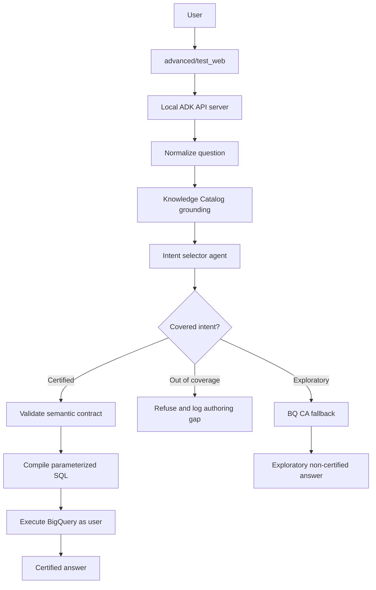

# ADK Semantic Layer Plan

## Objective

Build the `advanced/` path as a bespoke ADK semantic-contract reference
implementation and compare it with BigQuery Conversational Analytics. The
default CA API path remains the out-of-the-box baseline. The advanced path is an
Option D compiled intent-to-SQL prototype, not a claim about native BQ CA
behavior.

The goal is not to claim unconditional 100% accuracy. The goal is to make the
number-determining step deterministic for covered business questions:

```text
Natural language question
  -> grounded intent selection
  -> semantic contract validation
  -> deterministic SQL compilation
  -> BigQuery execution
  -> certified answer with SQL, job ID, and contract version
```

Out-of-coverage questions must be refused or explicitly routed to exploratory
mode. They must not silently fall back to generated SQL while presenting the
answer as certified.

## Current State

The default path now enriches BigQuery and Knowledge Catalog context with
Dataplex scans, then creates thin CA API data agents that reference BigQuery
tables. This is the right baseline for out-of-the-box BQ CA behavior.

The current `advanced/` path contains two parallel runtime shapes:

- `advanced/app/orders/agent.py` defines an ADK agent with `DataAgentToolset`.
- `advanced/app/inventory/agent.py` does the same for inventory.
- `advanced/test_web/` simulates OAuth passthrough to deployed Agent Engine.
- `advanced/scripts/register_agents.py` registers deployed ADK agents in Gemini
  Enterprise.
- `advanced/app/certified_analytics/agent.py` is a local ADK Workflow prototype
  that compiles contract-selected intents and can run developer-only BigQuery
  execution modes.
- `advanced/test_web/` supports both local ADK API server mode and the legacy
  Agent Engine mode.

The legacy wrappers remain as the BQ CA comparison baseline. The certified
workflow is being added in parallel and must not replace them until its intent,
auth, evaluation, and audit boundaries pass.

## ADK 2.0 Findings

Google ADK 2.0 introduces the Workflow Runtime. Agents, tools, and deterministic
functions are evaluated as nodes in a workflow graph. This maps well to the
certified analytics flow because AI nodes can be isolated to intent selection and
summarization, while deterministic code nodes own validation and SQL compilation.

Relevant ADK 2.0 concepts:

- `Workflow` composes graph nodes.
- `Agent` nodes perform AI reasoning.
- Function nodes perform deterministic steps.
- `Event(route=...)` supports conditional routing.
- `adk api_server` exposes local agents through REST for programmatic testing.
- Graph workflows are not a live-streaming path, and some integrations might not
  be graph-compatible. The certified path should therefore avoid depending on
  `DataAgentToolset` inside the graph.

Current dependency state:

- `pyproject.toml` declares `google-adk>=2.0.0` for the advanced extra.
- `uv.lock` resolves `google-adk==2.5.0`.
- Verified ADK 2.5.0 is available through `uv`.
- Verified the ADK 2.5.0 CLI exposes `create`, `run`, `web`, `api_server`,
  `eval`, `test`, `migrate`, `optimize`, and `deploy`.
- Verified the current `DataAgentToolset` imports still load under ADK 2.5.0,
  so the existing advanced baseline can remain while the certified path is
  built.
- Phase 1 uses the installed ADK 2.5 route behavior: functions emit
  `Event(route=...)`, ADK maps that to `event.actions.route`, and routed
  workflow edges use a route-to-node mapping.

## Agents CLI Findings

Agent Platform now documents Agents CLI as the higher-level lifecycle tool for
ADK projects. The distinction matters:

- `adk` is the ADK runtime and developer CLI for running, serving, evaluating,
  and deploying ADK agents directly.
- `agents-cli` is the Agent Platform lifecycle CLI and skills package. It
  handles scaffolding, project enhancement, evaluation workflows, deployment,
  Gemini Enterprise publishing, and observability setup around ADK.

Required local prerequisites from the current Agents CLI docs and this project:

- Python 3.11 (`pyproject.toml` currently constrains `>=3.11,<3.12`)
- `uv`
- Node.js, because skill installation uses `npx skills`

Optional deployment prerequisites:

- Google Cloud SDK
- Terraform, when using generated infrastructure workflows

Observed local prerequisite status:

- Python 3.11.14 is available through `uv run python --version`.
- Node.js v24.18.0 and npx 12.0.1 are available for skill installation.
- Google Cloud SDK 567.0.0 is available.
- Terraform is not installed. This is not blocking until generated
  infrastructure workflows are needed.
- Agents CLI 1.1.0 is installed globally.
- OpenCode can load the Agents CLI skills from `~/.agents/skills` after restart.

Safe verification commands:

```bash
uv sync --extra advanced
uv run --extra advanced adk --version
uv run --extra advanced adk --help
uv run --extra advanced adk api_server --help
uvx google-agents-cli --help
uvx google-agents-cli setup --workspace --skip-auth --dry-run
```

Do not run real Agents CLI setup automatically. The real command can install
tools and skills into global or workspace coding-agent configuration:

```bash
uvx google-agents-cli setup --workspace --skip-auth
```

Run it only when explicitly approved. In this environment, global OpenCode skill
installation was approved and run with:

```bash
uvx google-agents-cli setup --skip-auth --agent opencode
```

The dry run showed workspace setup would execute:

```text
uv tool install google-agents-cli
npx -y skills@1.4.8 add https://github.com/google/agents-cli -y
```

Local ADK development should prefer:

```bash
uv run --extra advanced adk web advanced/app --port 8080 --reload_agents
uv run --extra advanced adk api_server advanced/app --port 8000 --auto_create_session --reload_agents
```

`agents-cli info` currently reports that this directory is not an Agents CLI
project. Do not apply `agents-cli scaffold enhance .` in Phase 1. This repo
already has a demo-specific structure, so preserve it until the local certified
path is working. Revisit Agents CLI enhancement later when deployment,
evaluation, or observability assets are needed.

Deployment should remain deferred until the local path and evaluations pass.
After selecting a target, use Agents CLI for deployment skeletons and operational
assets. For example, if Cloud Run is selected:

```bash
agents-cli scaffold enhance --deployment-target cloud_run
agents-cli deploy
```

## Target Architecture



The key separation is:

- Knowledge Catalog grounds language and metadata.
- The semantic contract owns formulas, joins, grain, filters, and coverage.
- The compiler owns SQL generation.
- BQ CA fallback is available only as non-certified exploratory mode.

## Local-First Scope

Do not deploy to Agent Engine or register in Gemini Enterprise until the local
prototype works.

Use the existing `advanced/test_web/` UI as the local harness. It now selects
local ADK API server mode when `ADK_LOCAL_BASE_URL` is set and otherwise keeps
the legacy Agent Engine `:streamQuery` behavior.

The test web app should keep the OAuth login because user identity passthrough is
part of the architecture. During early local development, the compiled BigQuery
executor can support two modes:

- User-token mode: execute with the OAuth token captured by `advanced/test_web/`.
- ADC mode: execute with local ADC for faster developer iteration.

Any ADC result must be labeled as developer mode, not end-user certified mode.

## Certified vs Exploratory Modes

Target certified mode:

- Only answers metrics and dimensions covered by a contract.
- Emits SQL from deterministic code, never from the model.
- Uses parameterized BigQuery SQL for user-provided filter values.
- Returns metadata: `certified=true`, metric name, contract version, compiled SQL,
  BigQuery job ID, and coverage status.

Current checkpoint semantics:

- `contract_validated=true` means deterministic compilation succeeded against the
  current contract.
- `certified=false` remains mandatory while intent selection is the prototype
  full-match prototype selector or execution uses ADC rather than the end-user token.
- `execution_status`, `credential_mode`, and `intent_assurance` are separate from
  contract validation so one boolean does not conflate multiple guarantees.

Out-of-coverage mode:

- Refuses with a clear explanation.
- Logs the question and missing contract element to an authoring queue.
- Does not call CA API silently.

Exploratory mode:

- Optional fallback to existing CA API data agent behavior.
- Must return `certified=false`.
- Must be visually labeled as exploratory in `advanced/test_web/`.

## Semantic Contract Shape

Start with one LookML-lite YAML contract for `thelook_ecommerce` orders. Keep it
small enough to validate manually.

Proposed file:

```text
config/semantic_contracts/thelook_orders.yaml
```

Minimum fields:

```yaml
version: 1
dataset: thelook_ecommerce
owner: analytics-platform
certified: true

tables:
  users:
    primary_key: id
    grain: user
  orders:
    primary_key: order_id
    grain: order
    foreign_keys:
      user_id: users.id

joins:
  users__orders:
    left: users
    right: orders
    on: users.id = orders.user_id
    relationship: one_to_many

dimensions:
  order_status:
    label: Order status
    description: Current lifecycle status for an order.
    table: orders
    sql: orders.status
    synonyms: [status]
  country:
    label: User country
    description: Country associated with the user profile.
    table: users
    sql: users.country
    synonyms: [market, geography]

metrics:
  completed_order_count:
    label: Completed orders
    description: Number of distinct orders with completed status.
    synonyms: [finished orders, complete orders]
    type: count_distinct
    base_table: orders
    sql: orders.order_id
    required_filters:
      - orders.status = 'Complete'
    allowed_dimensions:
      - order_status
      - country
    join_path:
      - users__orders
    allowed_filters:
      order_status: ["=", "IN"]
      country: ["=", "IN"]
```

The first contract should include only a few high-risk metrics:

- completed order count
- completed revenue
- average order value
- top users by completed revenue

These cover common failure modes: missing status filters, wrong count grain,
join fan-out, and ambiguous business wording.

The contract is the source of truth. Later phases can generate other artifacts
from it, such as CA API verified-query templates, Knowledge Catalog glossary or
aspect payloads, LookML, or a native BigQuery semantic model when available.

Validation rules should be strict:

- Every metric, dimension, table, and join reference must exist.
- Every requested dimension table must be reachable from the metric base table
  through the declared join graph.
- Join traversal can be bidirectional for compilation, but the compiler must
  derive the SQL joins from declared relationships, not from model output.
- Every user-provided filter must target an allowed dimension and operator.
- Required filters must always be injected by the compiler.
- Metrics that can fan out must declare grain and use distinct or measure-safe
  expressions.
- The same validated intent must compile to byte-stable SQL, except for
  parameter names or deterministic formatting changes.

## Knowledge Catalog Role

Knowledge Catalog is not the semantic contract. It is the grounding and metadata
plane.

Use Knowledge Catalog to provide intent-selection context:

- business glossary terms
- table and column descriptions
- Dataplex profile summaries
- relationship metadata where available
- stewarded synonyms and examples

Do not let the model use Knowledge Catalog content to invent SQL. The graph node
that reads Knowledge Catalog should output compact grounding context for the
intent selector. The compiler should read only the semantic contract.

## Tooling Strategy Findings

The certified path can connect to BigQuery and Knowledge Catalog through more
than one tool boundary. The common rule is unchanged: tools provide grounding or
execution, while the semantic contract and deterministic compiler own the SQL.

ADK-native option:

- `BigQueryToolset` provides BigQuery metadata, SQL execution, job lookup, and
  `search_catalog` for Dataplex-backed catalog search.
- `BigQueryCredentialsConfig` supports ADC, service accounts, external access
  tokens, `external_access_token_key` for platform-managed session tokens, and
  interactive OAuth in `adk web`.
- This is the fastest path for a local-first ADK prototype because it keeps the
  implementation inside ADK and avoids a separate MCP integration step.
- The certified workflow must still call only deterministic code for SQL
  compilation. If `BigQueryToolset` is used for execution, it should execute the
  compiler-produced SQL rather than letting the model generate SQL.

MCP option:

- BigQuery exposes a remote MCP server at `https://bigquery.googleapis.com/mcp`.
- The preferred certified execution tool is `execute_sql_readonly`, not generic
  `execute_sql`, because certified BI queries should be read-only.
- Knowledge Catalog exposes a remote MCP server at
  `https://dataplex.googleapis.com/mcp` with discovery/context tools such as
  `search_entries`, `lookup_context`, and `lookup_entry`.
- Remote MCP gives a stronger portable tool boundary for Agent Runtime,
  non-ADK clients, centralized MCP IAM, audit, and optional Model Armor policy.
- MCP also has extra setup and constraints. For example, BigQuery
  `execute_sql_readonly` accepts SQL text, `projectId`, and `dryRun`, but does
  not expose BigQuery query parameters in the documented tool schema. A future
  MCP adapter will need deterministic literal rendering for already-validated
  filter values or another safe parameter strategy.

Decision for the next implementation step:

- Keep the lower-level ADK BigQuery ADC adapters as bounded developer prototypes,
  not as completed `BigQueryToolset` integration.
- Complete structured intent preservation and initial evaluations before adding
  credential-managed `BigQueryToolset` execution.
- Keep the MCP capability documented as the later portable/cloud-native adapter.
- Keep `DataAgentToolset` for the out-of-the-box CA API baseline and explicit
  exploratory fallback only.

OAuth/session-state findings:

- The earlier CA API data-agent agents already use the desired Gemini Enterprise
  user-token pattern:
  `DataAgentCredentialsConfig(external_access_token_key=AUTH_RESOURCE_ID)`.
- `advanced/app/orders/agent.py` reads `AUTH_RESOURCE_ORDERS` and
  `advanced/app/inventory/agent.py` reads `AUTH_RESOURCE_INVENTORY` as the ADK
  session-state keys where Gemini Enterprise or the local test harness deposits
  the user's OAuth access token.
- ADK BigQuery supports the same pattern through
  `BigQueryCredentialsConfig(external_access_token_key=...)`.
- Installed ADK 2.5.0 forwards the documented `google.adk.tools.bigquery` import
  path to the non-deprecated `google.adk.integrations.bigquery` package. New
  certified-path code should keep using `google.adk.integrations.bigquery`.
- The current executor and catalog retrieval adapters call lower-level
  `query_tool` and `search_tool` functions directly with ADC or injected test
  credentials. That bypasses the `GoogleTool` credential manager and therefore
  cannot read user OAuth tokens from ADK session state yet.
- To reuse the existing OAuth integration cleanly, user-token execution and
  catalog retrieval should run through `BigQueryToolset`/`GoogleTool` or an equivalent
  credential-resolution boundary, with the real workflow `ctx` passed through as
  the tool context.

## Proposed Advanced Folder Shape

```text
advanced/
  app/
    certified_analytics/
      __init__.py
      agent.py                 # ADK 2 graph root_agent
  test_web/
    app.py                     # local ADK API server client first
    templates/
    static/

semantic/
  __init__.py
  types.py
  registry.py
  join_planner.py
  compiler.py
  grounding.py
  executor.py
  audit.py

config/
  semantic_contracts/
    thelook_orders.yaml
```

Keep the existing `advanced/app/orders` and `advanced/app/inventory` packages
until the certified agent works. They are useful as fallback and comparison
baselines. Remove or rename them only after the local certified path is stable.

## ADK Graph Design

Initial graph nodes:

1. `normalize_question`
   - Deterministic function node.
   - Trims, captures user question, creates request context.

2. `load_grounding_context`
   - Deterministic function node.
   - Reads Knowledge Catalog metadata for the configured tables and glossary.
   - Can be stubbed with static context for the first local iteration.

3. `select_intent`
   - AI agent node with structured output.
   - Input: question, contract prompt summary, KC grounding summary.
   - Output: metric, dimensions, filters, route, reason.
   - Must not produce SQL.

4. `route_intent`
   - Deterministic function node.
   - Routes to certified, exploratory, or refusal path.

5. `validate_contract`
   - Deterministic function node.
   - Rejects unsupported metrics, dimensions, filters, and joins.

6. `compile_sql`
   - Deterministic function node.
   - Emits parameterized BigQuery SQL.

7. `execute_bigquery`
   - Deterministic function node.
   - Executes as user token or ADC developer mode.

8. `summarize_certified_answer`
   - AI or deterministic node.
   - Formats answer without changing the computed numbers.

9. `log_authoring_gap`
   - Deterministic function node.
   - Writes local JSONL in development.

## Implementation Phases

### Phase 0: Planning checkpoint

- Add this plan document.
- Do not modify runtime code yet.
- Status: complete.

### Phase 1: ADK 2 local skeleton

- Update advanced dependency to ADK 2.x.
- Verify local CLI commands:
  - `uv sync --extra advanced`
  - `uv run --extra advanced adk --help`
  - `uv run --extra advanced adk api_server advanced/app --port 8000`
- Add `advanced/app/certified_analytics/agent.py` with a minimal graph that
  returns placeholder covered/refusal responses. This was a historical skeleton,
  not an end-to-end certification claim.
- Update `advanced/test_web/` to call local ADK API endpoints instead of Agent
  Engine when `ADK_LOCAL_BASE_URL` is set.

Phase 1 status:

- Dependency and CLI verification are complete.
- `advanced/app/certified_analytics/agent.py` exists as a function-only ADK 2
  workflow skeleton.
- At that checkpoint, `adk run` verified placeholder covered and refusal routes.
- `adk api_server advanced/app` starts successfully with the existing agents and
  the new `certified_analytics` agent discoverable.
- `advanced/test_web/` supports local ADK API server mode through
  `ADK_LOCAL_BASE_URL` while preserving Agent Engine mode.

### Phase 2: Contract registry and compiler

- Add `config/semantic_contracts/thelook_orders.yaml`.
- Add `semantic/types.py`, `semantic/registry.py`, and `semantic/compiler.py`.
- Test contract validation and byte-stable SQL compilation.
- No Knowledge Catalog dependency yet; use contract-only intent selection.

Phase 2 status:

- `config/semantic_contracts/thelook_orders.yaml` defines the first certified
  metrics: completed order count, completed revenue, average order value, and
  top users by completed revenue.
- `semantic.registry` loads and validates metric, dimension, table, join,
  allowed-filter, relationship, primary-key target, reachability, and additive
  metric fan-out constraints.
- `semantic.compiler` emits deterministic BigQuery SQL with required filters,
  declared joins, grouping, ordering, limits, and user filters as query
  parameters.
- Tests cover stable SQL, required filters, parameterization, unsupported
  metrics, unsupported dimensions, unsupported filter operators, IN filters, and
  unreachable dimensions.
- At the committed Phase 2 checkpoint, the compiler was not wired into the ADK
  graph. The current working checkpoint adds that integration as Phase 3 work.

### Phase 3: Local contract-query developer execution

- Add `semantic/executor.py`.
- Support ADC developer mode first.
- Add user-token execution after the local flow is stable.
- Return SQL, rows, job ID, and certification metadata to `advanced/test_web/`.

Phase 3 status: developer checkpoint complete.

- `semantic/executor.py` executes contract-validated SQL with BigQuery using ADC
  developer mode.
- `SEMANTIC_EXECUTION_MODE=compile_only` is the safe default and returns
  contract-validated SQL without querying BigQuery.
- `SEMANTIC_EXECUTION_MODE=adc_developer` executes the compiled SQL and returns
  rows, job ID, truncation, credential mode, and contract metadata through the
  local ADK response.
- Both compile-only and ADC responses remain `certified=false` because the
  full-match intent selector is not an end-to-end certification boundary.
- Optional `SEMANTIC_MAXIMUM_BYTES_BILLED` limits BigQuery scan cost.
- User-token execution is still deferred.

### Phase 3A: Lower-level ADK BigQuery ADC adapter

Phase 3A status: developer checkpoint complete.

- Added `SEMANTIC_EXECUTION_MODE=adk_bigquery_adc` using lower-level ADK BigQuery
  query helpers with `WriteMode.BLOCKED` and ADC.
- Added an optional maximum-bytes-billed guardrail and truncation metadata.
- This is not credential-managed `BigQueryToolset` integration and is not the
  preferred deployed architecture.
- It refuses compiled parameter bindings because the ADK helper signature accepts
  SQL text but no query parameters. The direct `adc_developer` adapter remains the
  parameter-capable developer path.
- Both ADC paths return `certified=false` and identify their credential mode.
- BigQuery MCP remains a later portable adapter. Any future certified MCP path
  should prefer `execute_sql_readonly` and resolve the same parameterization gap
  without weakening validated filter handling.

### Phase 4: Catalog retrieval adapter

Phase 4 status: retrieval checkpoint complete; intent grounding is pending.

- Added `semantic/grounding.py` with disabled and `adk_bigquery_adc` catalog
  retrieval modes.
- Catalog errors are recorded in response metadata and do not block contract-only
  prototype routing.
- Retrieved assets are diagnostic metadata only and explicitly report
  `used_for_intent_selection=false`.
- Do not describe this as grounded intent selection until a contract-constrained
  selector consumes compact catalog context.
- The compiler continues to read only the semantic contract.

### Phase 4A: Structured intent safety and initial evaluation

- Replace the prototype full-match grammar with structured intent selection for
  metric, dimensions, filters, limit, route, and reason.
- Derive the selectable vocabulary from the configured contract rather than
  hardcoded sample-specific branches.
- Preserve every material user constraint. If a constraint cannot be represented,
  refuse instead of dropping it.
- Feed compact catalog context only into intent selection; never into SQL
  compilation.
- Add authoring-gap JSONL logging for unmatched intent and contract-validation
  refusals.
- Start covered, constraint-preservation, ambiguity, paraphrase, and refusal
  evaluations here. Evaluation is complementary to the contract and must not wait
  until fallback or deployment.
- Keep `certified=false` until intent assurance passes the defined evaluation gate.

Phase 4A status: planned next checkpoint.

### Phase 4B: Parameter-capable user-token BigQuery tooling

- Reuse `AUTH_RESOURCE_ORDERS`; do not create a separate authorization resource
  without a concrete scope or lifecycle requirement.
- Mirror the existing data-agent pattern with
  `BigQueryCredentialsConfig(external_access_token_key=AUTH_RESOURCE_ORDERS)`.
- Pass the real workflow context into credential-managed BigQuery tools so ADK can
  read `ctx.state[AUTH_RESOURCE_ORDERS]`.
- Use an execution boundary that preserves compiler query parameters. Do not make
  a SQL-text-only adapter the preferred certified path.
- Convert only affected workflow nodes to async functions for
  `GoogleTool.run_async(...)`.
- Missing user tokens must fail closed without exploratory fallback.
- Verify local ADK and Gemini Enterprise session-state token propagation with the
  same key.
- Require a query job ID or define an equivalent production audit identifier.

Phase 4B status: planned after Phase 4A.

### Phase 5: CA API fallback and verified-query outputs

- Add an explicit exploratory branch that can call the existing CA API agent.
- Label fallback responses as `certified=false`.
- Do not invoke fallback for certified-looking questions that fail validation.
- Generate CA API verified-query templates from certified contract metrics where
  practical. This helps project curated contract logic back into the out-of-the-
  box BQ CA path without making BQ CA the source of truth.

### Phase 6: Evaluation harness

- Expand the initial Phase 4A semantic checks into the full three-rung comparison.
- Port the three-rung evaluation pattern into this project:
  - Rung 1: BQ CA baseline.
  - Rung 2: BQ CA + Knowledge Catalog metadata.
  - Rung 3: ADK graph + semantic contract.
- Add covered and out-of-coverage question YAML files.
- Track consistency, correctness, refusal correctness, coverage gaps, intent
  confusion, and certified-vs-exploratory routing behavior.

### Phase 7: Deployment and GE registration

- Defer until local test web and evals pass.
- Treat the deployment target as undecided until graph workflow behavior,
  user-token propagation, parameter handling, and audit metadata are verified on
  Agent Runtime and Cloud Run.
- Existing deployment and registration scripts cover only the legacy orders and
  inventory agents. Do not present them as certified-agent deployment support.
- Register in Gemini Enterprise only after the selected deployment target passes.

### Phase 8: Portability and user adaptation

- Move minimum runtime portability before live evaluation or deployment:
  configurable contract path and fully qualified BigQuery table references.
- Start broader authoring portability after the local intent, auth, and evaluation
  gates are verified.
- Make the skeleton explicitly adaptable to user environments instead of only
  demonstrating the `thelook_ecommerce` sample.
- Load the semantic contract path from configuration, such as
  `SEMANTIC_CONTRACT_PATH`, instead of assuming `thelook_orders.yaml`.
- Support fully qualified BigQuery table references, including project, dataset,
  and table names, so users can target their own projects without changing
  compiler code.
- Add a concise semantic contract authoring guide that explains tables,
  dimensions, metrics, joins, required filters, allowed filters, and common
  validation failures.
- Add a minimal bring-your-own-tables sample contract that users can copy and
  adapt without touching Python code.
- Consider adding a machine-readable schema for contract validation once the
  contract shape stabilizes.
- Keep runtime metric selection contract-derived as required by Phase 4A.
- Document the supported metric types and the current extension points for new
  metric types, custom filters, and organization-specific certification rules.
- Keep all portability work subordinate to correctness: do not generalize the
  compiler in ways that weaken deterministic SQL generation, contract validation,
  or certified-vs-exploratory routing.

## Verification Strategy

Every implementation phase should include focused tests.

Minimum tests before deployment:

- Registry rejects invalid metric references.
- Compiler rejects unsupported metrics, dimensions, filters, and operators.
- Compiler produces stable SQL for the same intent.
- Compiler uses query parameters for user-provided values.
- Compiler validates dimension reachability from the metric base table.
- Covered golden questions return expected results.
- Out-of-coverage questions refuse.
- Exploratory fallback is never marked certified.
- Certified-looking failures never silently fall back to CA API.
- Test web displays certification metadata.

## Decisions and Open Questions

Decisions:

- Local execution defaults to `compile_only`. ADC modes are developer-only.
- The current catalog adapter retrieves compact asset summaries only and does not
  yet ground intent selection.
- BigQuery Graph is deferred until relationship or traversal questions justify it.
- `certified=true` is reserved for a covered, intent-assured, user-authorized,
  successfully executed answer rather than compilation alone.

Open questions:

- Which parameter-capable boundary should combine compiler bindings with ADK
  user-token credential management?
- What evaluation threshold is sufficient to promote intent assurance?
- Should catalog retrieval fail open to contract-only selection or fail closed for
  production certification?
- Is a nullable BigQuery job ID acceptable, or is another immutable audit ID
  required?
- Which deployment target supports the required Workflow and OAuth behavior with
  the smallest operational footprint?

## Position on BigQuery Graph

BigQuery Graph can help with relationship and traversal questions, and graph
measures can help with fan-out-safe aggregation. It should not replace the first
metric contract.

Use it later for:

- explicit entity relationships
- multi-hop paths
- network-style analytics
- relationship disambiguation

Do not depend on it for the first certified BI slice. The first slice should
focus on metric formulas, joins, filters, and aggregation grain.

Important limitations to account for when evaluating BigQuery Graph:

- Graph measures are a Preview feature.
- Conversational analytics can use at most one graph data source per agent or
  conversation.
- Conversational analytics cannot combine graph and table sources in the same
  agent or conversation.
- `GRAPH_EXPAND` has modeling constraints, including root-node requirements, and
  cached-result behavior must be handled carefully for correctness.
