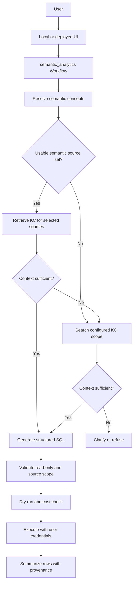

# ADK Semantic Analytics Plan

## Objective

Build and evaluate a portable ADK analytics workflow that supplies curated
business semantics before searching broader metadata.

The semantic layer is reasoning context, not a LookML-style query compiler. It
helps the model select relevant concepts, calculations, grain, relationships, and
physical sources. Knowledge Catalog will add current schema and metadata. An LLM
will then generate SQL behind explicit source, read-only, dry-run, cost, and
credential controls.

The existing BigQuery Conversational Analytics agents remain the independent
out-of-the-box baseline. The custom workflow exists to measure whether
semantic-first context improves source selection, constraint preservation,
accuracy, consistency, and explainability.

## Current Checkpoint

Current phase: **Phase 6 is complete. Phase 7 is planned next.**

The executable `semantic_analytics` flow currently stops before Knowledge Catalog
or SQL:

```text
question
  -> load bounded semantic YAML registry
  -> select domain, metric, dimension, and relationship IDs with an LLM
  -> reload and validate selected IDs against current configuration
  -> expand only selected concepts and their physical source closure
  -> return semantic_narrow or catalog_broad handoff metadata
```

Implemented:

- configurable single-file or directory registry
- fully qualified physical table references
- strict YAML shape and size validation
- portable semantic reference validation
- separate historical compiler validation
- bounded, domain-neutral structured semantic selection
- prompt-injection guidance for configuration-derived selector data
- concept-level context and source filtering
- registry reload after selection with explicit version-drift detection
- semantic IDs, versions, sources, route, and selection provenance
- deterministic workflow integration coverage with a substituted selector
- installed `LlmAgent` structured-output coverage with a deterministic `BaseLlm`
- graph-level broad-catalog recovery from schema-invalid successful model output
- a 100,000-byte aggregate bound on expanded selected context

Not implemented in the active workflow:

- Knowledge Catalog schema or profile retrieval
- narrow-context sufficiency assessment
- broad catalog discovery
- SQL generation
- SQL policy validation
- BigQuery dry run or execution
- SQL repair
- user-token BigQuery execution
- result summarization
- a provider-backed structured-selector smoke test, deferred to Phase 10 evaluation

The active runtime does not import the historical compiler, executor, or catalog
retrieval spike.

## Current Interfaces

### Contract Loading

`SEMANTIC_CONTRACT_PATH` may identify one `.yaml` or `.yml` file or a directory.
The default is `config/semantic_contracts/`. Relative configured paths are resolved
from the process working directory; local commands therefore run from the project
root.

The registry reloads on every request. Adding or renaming a domain, metric,
dimension, relationship, or table does not require Python or instruction changes.

Current safety bounds:

- at most 50 contract files
- at most 1 MB per contract file
- at most 100 entries in bounded YAML lists and maps
- at most 4,000 characters per semantic text field
- at most 8,000 characters in a user question
- at most 100,000 serialized characters in the selector candidate context
- at most three selected domains per request
- at most 20 metrics, 30 dimensions, and 30 relationships per selected domain
- at most 128 characters per selected ID and 4,000 characters in the selection
  reason
- at most 100,000 UTF-8 bytes in the aggregate expanded selected context

Contract, question, selector-candidate, and structured-output violations fail
explicitly or are converted into the documented invalid-selection route. An
oversized expanded selected context is discarded and routes to `catalog_broad`
with `route_cause=context_limit_exceeded`. The workflow does not silently
truncate business semantics.

### Canonical YAML Shape

The checked-in files under `config/semantic_contracts/` are canonical. This
reduced example uses the actual loadable schema:

```yaml
id: example_orders
version: 1
owner: analytics-platform
description: Order analytics.
routing_terms: [orders, sales]
examples:
  - How many completed orders were placed?

tables:
  orders:
    source:
      project: example-project
      dataset: commerce
      table: orders
    primary_key: order_id
    grain: order

joins: {}

dimensions:
  order_status:
    label: Order Status
    description: Current order state.
    table: orders
    sql: orders.status
    synonyms: [status]

metrics:
  completed_order_count:
    label: Completed Order Count
    description: Distinct completed orders.
    type: count_distinct
    base_table: orders
    sql: orders.order_id
    required_filters:
      - orders.status = 'Complete'
    allowed_dimensions: [order_status]
    join_path: []
    allowed_filters:
      order_status: ['=', IN]
```

The active portable validator checks schema types and references. It does not
reject a contract merely because the historical compiler lacks an aggregation,
operator, path, or ordering feature. `validate_compiler_contract()` owns those
legacy restrictions.

Compiler-era YAML fields remain because they provide useful calculation and
relationship guidance. Active model context presents `allowed_dimensions` and
`allowed_filters` as known combinations, not exhaustive coverage. Unknown needs
continue to catalog grounding rather than being refused.

### Semantic Selection

The selector receives a compact index containing IDs, descriptions, routing
terms, examples, relationship summaries, metrics, dimensions, labels, and
synonyms. It does not receive SQL expressions or physical table names.

Structured output contains:

```text
selected_contexts:
  - context_id
    context_version
    metric_ids
    dimension_ids
    relationship_ids
requires_broad_catalog
reason
```

Selected IDs are never trusted directly. The resolver reloads the configured
registry, rejects unknown or duplicate IDs and version drift, adds metric-required
dimensions, and computes a deterministic connected source closure within declared
metric relationship paths.

Configuration text is treated as untrusted data. The selector instruction tells
the model to ignore instructions embedded in descriptions, examples, labels, or
synonyms.

The `LlmAgent` applies `SemanticSelection` as its `output_schema`. An after-model
callback validates successful model text before ADK's output-schema boundary.
Schema-invalid successful output is replaced with a valid empty selection and a
request-scoped marker; the resolver then routes broad with
`route_cause=invalid_selection`. Provider, authentication, quota, and transport
errors are not converted into semantic misses. The resolver also retains
defensive schema handling for malformed input delivered by non-LLM nodes.

### Phase 6 Response

Current terminal output is an internal catalog handoff, not an analytics answer:

```text
status: semantic_context_resolved |
        semantic_context_partial |
        semantic_context_not_found
reasoning_path: semantic_narrow | catalog_broad
question: ...
semantic_context_used: true | false
semantic_context_ids: [...]
semantic_context_versions: [...]
semantic_source_names: [...]
semantic_contexts: [...]
semantic_selection: {...}
selection_reason: ...
selection_error: ...              # invalid selection or context bound
route_cause: semantic_context_resolved |
             no_semantic_match |
             model_declared_incomplete |
             invalid_selection |
             context_limit_exceeded
next_step: narrow_catalog_grounding | broad_catalog_grounding
```

`semantic_narrow` means selected concepts provide a bounded source set for narrow
catalog retrieval. `catalog_broad` means no useful context matched, selected
context is incomplete, or schema-valid selected IDs failed deterministic
validation. A semantic miss is not a refusal.

At the current checkpoint, `next_step` is informational metadata. Both routes end
in pass-through terminal functions; no catalog node consumes this field yet.

Expanded selected context is serialized as deterministic compact JSON and limited
to 100,000 UTF-8 bytes after required dimensions, relationships, tables, and
source closure are injected. The boundary is inclusive. Oversized aggregate
context is never truncated; it is discarded and routed broad with
`route_cause=context_limit_exceeded`.

## Phase 6 Exit Criteria

Status: **complete**.

Implemented code now prevents explicit relationship IDs from widening a selected
metric beyond its declared relationship paths.

Verified at Phase 6 closure commit `9a95d5b`:

- complete advanced-extra suite passes with 113 tests
- focused semantic and ADK compatibility suite passes with 37 tests
- the installed `LlmAgent` propagates structured output through a deterministic
  `BaseLlm` boundary without external credentials
- schema-invalid successful model output routes broad while provider errors remain
  hard failures
- aggregate selected context accepts the exact size limit and rejects larger
  multi-context payloads
- ADK API discovery loads `orders`, `inventory`, and `semantic_analytics`
- a fresh-process import of `semantic_analytics` does not load compiler, executor,
  grounding, or join-planner modules

## Target End-State



Workflow ordering is structural. System instructions alone must not be trusted to
make a model read semantic and catalog context before using query tools.

## Phase 7: Knowledge Catalog Grounding

Status: **planned next**.

Goals:

- replace the asset-summary spike with typed schema and metadata context
- retrieve current metadata only for `semantic_source_names` on the narrow path
- search only configured projects and datasets on the broad path
- retrieve profile and insight aspects only when useful
- report context sufficiency and specific missing information
- route narrow insufficiency to broad discovery without executing SQL
- bound, redact, and timestamp every metadata payload

### Phase 7 Source Boundary

Catalog search configuration must separate the compute or billing project from
searchable data sources:

- `GOOGLE_CLOUD_PROJECT` identifies the compute or billing project and does not
  implicitly authorize catalog search in that project
- planned `CATALOG_ALLOWED_PROJECTS` contains comma-separated searchable project
  IDs for broad discovery
- planned `CATALOG_ALLOWED_DATASETS` contains comma-separated
  `project.dataset` identifiers for broad discovery
- absent or invalid broad-search allowlists fail closed; they never trigger an
  organization-wide search
- narrow retrieval uses only exact fully qualified sources from validated
  semantic contracts; those curated sources form the narrow-path allowlist
- every `semantic_source_names` value is parsed as exactly
  `project.dataset.table` before catalog access

Broad results must match the configured project and dataset allowlists. Phase 8
source policy will use the exact sources returned by the selected catalog route;
it must not infer permission from the compute project.

Proposed nodes:

1. `load_narrow_catalog_context`
2. `assess_context`
3. `load_broad_catalog_context`
4. `assess_broad_context`
5. terminal clarification or Phase 8 SQL handoff

The first Phase 7 graph change replaces the current pass-through branch targets:

```text
semantic_narrow -> load_narrow_catalog_context -> assess_context
catalog_broad   -> load_broad_catalog_context  -> assess_broad_context
assess_context insufficient -> load_broad_catalog_context
```

Each loader receives the complete Phase 6 handoff payload. Narrow loading uses
`semantic_source_names`; broad loading uses the preserved question and configured
allowlists. The pass-through terminal functions can be removed after both routes
have equivalent integration coverage.

Context sufficiency must report:

- permitted physical sources
- current schema for each source
- fields needed for selection, aggregation, grouping, and filtering
- relationships needed for multi-table work
- resolved and unresolved business terms
- preserved user constraints
- missing metadata and the selected route

Phase 7 routes must not depend on an unexplained confidence score.

Exit criteria:

- narrow retrieval cannot escape selected semantic sources
- broad retrieval cannot escape configured projects and datasets
- stale semantic references are visible as missing context
- sensitive profile values are omitted or redacted
- metadata size and result counts are bounded
- both routes are tested without SQL execution

### Resume Here

Phase 6 implementation closed at commit `9a95d5b`. The active graph is
`advanced/app/semantic_analytics/agent.py`; it currently terminates at the two
pass-through functions in `semantic/runtime.py`.

The first Phase 7 implementation slice is:

1. Verify the lock-resolved Knowledge Catalog client operations and aspect payloads
   needed for BigQuery table schema, profile, and insight metadata.
2. Add typed, default-deny parsing for `CATALOG_ALLOWED_PROJECTS` and
   `CATALOG_ALLOWED_DATASETS`, keeping compute-project configuration separate.
3. Add a reusable catalog adapter boundary with injected fakes for deterministic
   tests; do not make live catalog calls in unit tests.
4. Replace the two pass-through branch targets with narrow and broad loading nodes.
5. Add deterministic sufficiency routing and bound, redact, and timestamp the
   metadata payload.

Phase 7 must stop before SQL generation or execution. Do not reconnect the
historical grounding, compiler, executor, or join-planner modules to the active
workflow merely because similarly named code already exists.

## Remaining Roadmap

### Phase 8: SQL Generation And Guarded Developer Execution

- generate structured BigQuery SQL from assembled semantic and catalog context
- include selected sources, interpretation, and unresolved assumptions
- enforce read-only and allowed-source policy independently of model output
- dry run before execution and enforce maximum bytes
- keep SQL repair bounded and explicit
- execute with ADC only in identified developer mode
- return SQL, policy, dry-run, execution, row, and job metadata

### Phase 9: User Authentication And Local UX

- resolve user credentials through workflow-compatible BigQuery tooling
- reuse the OAuth client and scope configuration where appropriate
- configure the local ADK session-state token key explicitly through planned
  `ADK_OAUTH_TOKEN_STATE_KEY`; the current harness uses `AUTH_RESOURCE_ORDERS` as
  a key, which does not make the semantic workflow the owner of the orders
  authorization resource
- create a distinct authorization resource for `semantic_analytics` if it is
  registered as a separate Gemini Enterprise agent, using planned
  `AUTH_RESOURCE_SEMANTIC_ANALYTICS`, because deployed GE agents require a 1:1
  agent-to-authorization-resource mapping
- fail explicitly when a required user token is absent
- never silently switch to ADC in a user-facing mode
- validate OAuth state before token exchange
- validate token expiry and implement refresh or explicit reauthentication
- move access tokens out of Flask's client-side signed cookie session
- configure a stable secret and secure session-cookie settings outside source code
- reuse backend sessions instead of creating one for every query
- declare Flask and OAuth dependencies in `pyproject.toml` and `uv.lock`; remove
  the manual `uv pip install` setup path
- display reasoning path and execution provenance in the test UI
- add Flask OAuth regression tests and live user-token integration coverage

The current Flask harness passes an explicit session-state key but otherwise has
legacy development behavior: it does not explicitly validate stored OAuth state,
uses Flask's client-side signed session for the access token, and creates a new
backend session for each query. Phase 9 must address those gaps; the harness is
not a production identity service.

### Phase 10: Evaluation

Evaluate independently:

1. CA `DataAgentToolset` baseline.
2. Custom Knowledge Catalog-only path.
3. Custom semantic-first plus Knowledge Catalog path.

Begin with a provider-backed structured-selector smoke case. It verifies live
Gemini schema behavior and credentials, but remains an evaluation or manual
integration check rather than a deterministic `pytest` test or a Phase 7 blocker.

Measure SQL and answer correctness, source selection, constraint preservation,
routing, semantic contribution, repeated-run consistency, repair rate, latency,
and query cost.

### Phase 11: Optional Data-Agent Delegation

The initial custom fallback remains Knowledge Catalog. Only after the custom
catalog path has been evaluated may a future configuration expose
`SEMANTIC_FALLBACK_MODE=kc|data_agent|refuse`. Delegation must be explicit and
reported as `reasoning_path=data_agent`. CA-generated SQL is not modified and
re-executed by default because CA has already executed it.

### Phase 12: Deployment

Defer deployment of `semantic_analytics` until local user-token execution and
evaluations pass. Select Agent Runtime or Cloud Run based on verified Workflow,
OAuth, observability, and operational behavior. Revisit Agents CLI deployment,
evaluation, and observability assets only after selecting the deployment target.

## Design Requirements

### Semantic First, Not Semantic Only

Semantic context should identify known concepts, calculations, grain,
relationships, filters, exclusions, synonyms, examples, and likely sources. It
must not require every question to be authored, block unrelated answerable
questions, compile SQL in the active runtime, or claim certification.

### Narrow Before Broad

When semantic context is relevant, catalog retrieval begins with its selected
source closure. Broadening is allowed when semantic context is absent, references
stale schema, lacks a requested relationship, omits a needed source, or leaves a
specific metadata dependency unresolved.

Broad search stays within configured project and dataset allowlists. It is not an
organization-wide search by default.

### Generic SQL Guardrails

Before execution, future safeguards must verify:

- the request is a BigQuery read query
- no DDL or DML is present
- projects, datasets, and tables are permitted
- referenced tables exist in resolved context
- dry run succeeds
- estimated bytes stay within limits
- repair attempts are bounded

Generic validation does not prove semantic correctness.

### Sensitive Metadata

Profile common values may contain sensitive data. Catalog context and logs need
field allowlists, truncation, redaction, and provenance. Raw profile payloads must
not be copied into model logs.

## Tooling Decisions

### CA Baseline

`advanced/app/orders` and `advanced/app/inventory` remain independent CA API
baselines. `DataAgentToolset` exposes agent discovery and `ask_data_agent`.
`ask_data_agent` returns only after CA has generated and executed SQL; it has no
documented pre-execution approval boundary for BigQuery sources.

Therefore `DataAgentToolset` is not the SQL planning tool for the custom path. It
remains a comparison baseline and possible future governed delegation adapter.

### Custom Workflow

The custom path uses ADK Workflow nodes to enforce context order. Candidate
boundaries include the semantic registry, Dataplex or ADK catalog retrieval,
BigQuery metadata tools, generic SQL policy, dry run, and explicit execution
adapters.

MCP tools remain possible adapters after the local path works. They must not alter
semantic-first ordering or weaken source, read-only, credential, or cost controls.

### Authentication

Target user execution uses a session-state OAuth token through a
workflow-compatible BigQuery credential boundary. The installed
`BigQueryCredentialsConfig(external_access_token_key=...)` can support local
experiments but is marked experimental by ADK and is not assumed to be the final
production interface. OAuth client and scope configuration can be shared, but
local token-state keys and deployed Gemini Enterprise authorization resources are
different concerns. A separately registered GE agent needs its own authorization
resource. ADC is acceptable only for explicit local developer mode. Missing user
credentials must not fall back silently.

## Repository Shape

```text
advanced/app/
  orders/                    # Independent CA baseline
  inventory/                 # Independent CA baseline
  semantic_analytics/
    __init__.py
    agent.py                 # Thin Workflow construction

semantic/
  types.py                  # Contract and historical query types
  registry.py               # Portable loading and separate validations
  context.py                # Selector and filtered full context
  runtime.py                # Active semantic-resolution nodes and instructions
  grounding.py              # Historical asset-summary retrieval spike
  join_planner.py           # Historical deterministic join planning
  compiler.py               # Historical deterministic compiler
  executor.py               # Historical guarded developer execution

config/semantic_contracts/
  thelook_orders.yaml
  thelook_inventory.yaml
```

Add modules only when they own a clear reusable boundary. Planned catalog context,
SQL planning, and policy modules do not exist yet.

## ADK 2.5 Compatibility Record

The lock-resolved and tested SDK version is `google-adk==2.5.0`.
`pyproject.toml` declares the broader minimum `google-adk>=2.0.0`; that declaration
does not imply every later version is verified. Rerun compatibility and workflow
tests after every ADK lockfile upgrade.

The installed SDK behavior is covered by focused tests:

- `Workflow` imports from `google.adk.workflow`
- workflow `Context` imports from `google.adk.agents.context`
- `Event` imports from `google.adk.events.event`
- `LlmAgent` nodes can sit directly in graph edges
- structured LLM nodes use Pydantic `output_schema`
- after-model callbacks can replace malformed successful output before workflow
  output-schema validation
- routing uses `Event(route=...)`
- dynamic work uses `ctx.run_node(...)`
- `ToolContext` is compatible with workflow `Context`
- `GoogleTool.run_async(..., tool_context=ctx)` receives workflow state

The compatibility test uses a dynamic child node, not a SQL retry loop. Bounded
SQL correction remains Phase 8 work.

## Decision History

### Deterministic Compiler Direction

The original architecture was:

```text
question -> structured intent -> contract validation -> compiled SQL -> execute
```

It produced the registry, join planner, compiler, developer execution adapters,
and a sample-specific `certified_analytics` workflow. The workflow duplicated
metrics and dimensions in Python regular expressions, treated authored coverage
as a blocker, and required Python changes for semantic changes.

That workflow package was removed in Phase 6. The lower-level compiler and
executor remain research for a possible future strict mode. They share registry
and type modules with the active path but are unreachable from the active workflow
import graph and do not define active runtime capabilities.

Historical commits:

- `1f87502 feat: Add semantic contract compiler`
- `7ca0350 feat: Add guarded semantic execution`

### Phase History

| Phase | Status | Result |
|---|---|---|
| 0 | Complete | Original compiler plan |
| 1 | Superseded | Local covered/refusal Workflow skeleton |
| 2 | Historical | Registry, join planner, deterministic compiler |
| 3 | Historical | Guarded ADC developer execution |
| 4 | Historical | Compact catalog asset retrieval spike |
| 5 | Complete | Portable multi-contract schema and ADK compatibility |
| 6 | Complete | Bounded concept selection and catalog handoff |
| 7 | Planned | Narrow and broad Knowledge Catalog grounding |

### Certification

Certification is out of scope. Responses report concrete context and execution
provenance instead of `certified=true`.

A future stricter mode could use verified queries, deterministic compilation for a
small subset, contract-aware SQL analysis, human approval, or native semantic
query models. It must not force table-specific Python back into the active path.

## Verification Strategy

Deterministic code uses `pytest`; model behavior and SQL quality use ADK or Agents
CLI evaluations. Pytest must not assert nondeterministic LLM wording.

Run deterministic repository checks from the project root:

```bash
uv run --extra advanced pytest tests
uv run --extra advanced pytest \
  tests/test_semantic_context.py \
  tests/test_semantic_analytics_agent.py \
  tests/test_adk_workflow_compatibility.py
uv run --extra advanced ruff check .
uv run --extra advanced ruff format --check .
uv lock --check
git diff --check
```

The 113 full-suite and 37 focused-suite counts above record Phase 6 closure; later
test additions should change the counts without being treated as regressions.

Verify ADK discovery and the active import boundary in fresh processes:

```bash
uv run --extra advanced python - <<'PY'
from google.adk.cli.utils.agent_loader import AgentLoader

agents = AgentLoader("advanced/app").list_agents()
print(agents)
assert {"orders", "inventory", "semantic_analytics"}.issubset(agents)
PY

uv run --extra advanced python - <<'PY'
import sys

import advanced.app.semantic_analytics.agent

forbidden = {
    "semantic.compiler",
    "semantic.executor",
    "semantic.grounding",
    "semantic.join_planner",
}
loaded = sorted(forbidden.intersection(sys.modules))
print(loaded)
assert not loaded
PY
```

Required checks across the roadmap:

- unrelated and renamed semantic concepts require no Python changes
- advanced-path tests run with the `advanced` dependency extra
- fully qualified cross-dataset sources remain intact
- selector IDs are validated before context expansion
- explicit relationships cannot widen selected metric paths
- installed `LlmAgent` structured-output propagation is tested with a deterministic
  model boundary; provider-backed behavior is evaluated separately
- semantic misses route broad rather than refuse
- narrow and broad catalog boundaries cannot escape allowlists
- sufficiency reports missing information explicitly
- SQL is read-only and source-scoped
- dry run precedes execution
- cost and repair limits are enforced
- missing credentials fail explicitly
- responses identify semantic, catalog, and credential provenance
- summarization cannot alter returned values
- CA baseline and custom paths remain independently testable

## Open Questions

- Which Knowledge Catalog aspects provide the most useful current schema,
  relationship, profile, and generated insight context?
- What metadata must be omitted because it is sensitive, noisy, or too large?
- When should broad discovery clarify rather than choose among plausible sources?
- What structured SQL output best supports source validation and dry-run repair?
- Which execution boundary exposes user credentials, dry-run control, bytes, and
  job IDs reliably?
- What evaluation threshold demonstrates improvement over KC-only and CA paths?
- Is optional data-agent delegation operationally valuable after the custom path?
- Which deployment target best supports ADK Workflow and OAuth behavior?

BigQuery Graph may be evaluated later for explicit multi-hop relationship work.
It is not a dependency for the initial semantic-first analytics workflow.
