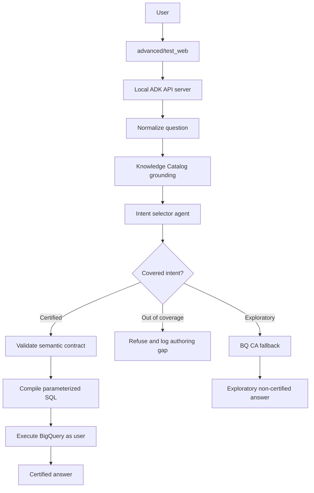

# ADK Semantic Layer Plan

## Objective

Build the `advanced/` path as a custom ADK implementation that demonstrates how
BigQuery Conversational Analytics could behave with a governed semantic layer.
The default CA API path remains the out-of-the-box baseline. The advanced path
becomes the certified analytics prototype.

The goal is not to claim unconditional 100% accuracy. The goal is to make the
number-determining step deterministic for covered business questions:

```text
Natural language question
  -> grounded intent selection
  -> semantic contract validation
  -> deterministic SQL compilation
  -> BigQuery execution
  -> certified answer with SQL, job ID, and contract version
```

Out-of-coverage questions must be refused or explicitly routed to exploratory
mode. They must not silently fall back to generated SQL while presenting the
answer as certified.

## Current State

The default path now enriches BigQuery and Knowledge Catalog context with
Dataplex scans, then creates thin CA API data agents that reference BigQuery
tables. This is the right baseline for out-of-the-box BQ CA behavior.

The current `advanced/` path is still a wrapper around CA API through ADK:

- `advanced/app/orders/agent.py` defines an ADK agent with `DataAgentToolset`.
- `advanced/app/inventory/agent.py` does the same for inventory.
- `advanced/test_web/` simulates OAuth passthrough to deployed Agent Engine.
- `advanced/scripts/register_agents.py` registers deployed ADK agents in Gemini
  Enterprise.

For this phase, we will replace the advanced runtime shape. It should no longer
be just a thin CA API toolset wrapper. It should become a minimal ADK graph-based
certified analytics agent.

## ADK 2.0 Findings

Google ADK 2.0 introduces the Workflow Runtime. Agents, tools, and deterministic
functions are evaluated as nodes in a workflow graph. This maps well to the
certified analytics flow because AI nodes can be isolated to intent selection and
summarization, while deterministic code nodes own validation and SQL compilation.

Relevant ADK 2.0 concepts:

- `Workflow` composes graph nodes.
- `Agent` nodes perform AI reasoning.
- Function nodes perform deterministic steps.
- `Event(route=...)` supports conditional routing.
- `adk api_server` exposes local agents through REST for programmatic testing.
- Graph workflows are not a live-streaming path, and some integrations might not
  be graph-compatible. The certified path should therefore avoid depending on
  `DataAgentToolset` inside the graph.

Current dependency state:

- `pyproject.toml` declares `google-adk>=1.28.1` for the advanced extra.
- `uv.lock` currently resolves `google-adk==1.33.0`.
- The next implementation phase should upgrade the advanced extra to ADK 2.x and
  verify `uv run adk --help`, `uv run adk run ...`, and
  `uv run adk api_server ...` locally.

No OpenCode skill is required for this task. The work is application design and
implementation, not OpenCode configuration.

## Target Architecture



The key separation is:

- Knowledge Catalog grounds language and metadata.
- The semantic contract owns formulas, joins, grain, filters, and coverage.
- The compiler owns SQL generation.
- BQ CA fallback is available only as non-certified exploratory mode.

## Local-First Scope

Do not deploy to Agent Engine or register in Gemini Enterprise until the local
prototype works.

Use the existing `advanced/test_web/` UI as the local harness, but change its
backend target during implementation:

- Current behavior: OAuth login, create Agent Engine session, call
  `:streamQuery`.
- Target local behavior: OAuth login, create local ADK API server session, call
  local ADK REST endpoints.

The test web app should keep the OAuth login because user identity passthrough is
part of the architecture. During early local development, the compiled BigQuery
executor can support two modes:

- User-token mode: execute with the OAuth token captured by `advanced/test_web/`.
- ADC mode: execute with local ADC for faster developer iteration.

Any ADC result must be labeled as developer mode, not end-user certified mode.

## Certified vs Exploratory Modes

Certified mode:

- Only answers metrics and dimensions covered by a contract.
- Emits SQL from deterministic code, never from the model.
- Uses parameterized BigQuery SQL for user-provided filter values.
- Returns metadata: `certified=true`, metric name, contract version, compiled SQL,
  BigQuery job ID, and coverage status.

Out-of-coverage mode:

- Refuses with a clear explanation.
- Logs the question and missing contract element to an authoring queue.
- Does not call CA API silently.

Exploratory mode:

- Optional fallback to existing CA API data agent behavior.
- Must return `certified=false`.
- Must be visually labeled as exploratory in `advanced/test_web/`.

## Semantic Contract Shape

Start with one LookML-lite YAML contract for `thelook_ecommerce` orders. Keep it
small enough to validate manually.

Proposed file:

```text
config/semantic_contracts/thelook_orders.yaml
```

Minimum fields:

```yaml
version: 1
dataset: thelook_ecommerce

tables:
  orders:
    primary_key: order_id
    grain: order

joins:
  users__orders:
    left: users
    right: orders
    on: users.id = orders.user_id
    relationship: one_to_many

dimensions:
  order_status:
    table: orders
    sql: orders.status
  country:
    table: users
    sql: users.country

metrics:
  completed_order_count:
    label: Completed orders
    type: count_distinct
    base_table: orders
    sql: orders.order_id
    required_filters:
      - orders.status = 'Complete'
    allowed_dimensions:
      - order_status
      - country
    join_path:
      - users__orders
```

The first contract should include only a few high-risk metrics:

- completed order count
- completed revenue
- average order value
- top users by completed revenue

These cover common failure modes: missing status filters, wrong count grain,
join fan-out, and ambiguous business wording.

## Knowledge Catalog Role

Knowledge Catalog is not the semantic contract. It is the grounding and metadata
plane.

Use Knowledge Catalog to provide intent-selection context:

- business glossary terms
- table and column descriptions
- Dataplex profile summaries
- relationship metadata where available
- stewarded synonyms and examples

Do not let the model use Knowledge Catalog content to invent SQL. The graph node
that reads Knowledge Catalog should output compact grounding context for the
intent selector. The compiler should read only the semantic contract.

## Proposed Advanced Folder Shape

```text
advanced/
  app/
    certified_analytics/
      __init__.py
      agent.py                 # ADK 2 graph root_agent
  test_web/
    app.py                     # local ADK API server client first
    templates/
    static/

semantic/
  __init__.py
  types.py
  registry.py
  compiler.py
  grounding.py
  executor.py
  audit.py

config/
  semantic_contracts/
    thelook_orders.yaml
```

Keep the existing `advanced/app/orders` and `advanced/app/inventory` packages
until the certified agent works. They are useful as fallback and comparison
baselines. Remove or rename them only after the local certified path is stable.

## ADK Graph Design

Initial graph nodes:

1. `normalize_question`
   - Deterministic function node.
   - Trims, captures user question, creates request context.

2. `load_grounding_context`
   - Deterministic function node.
   - Reads Knowledge Catalog metadata for the configured tables and glossary.
   - Can be stubbed with static context for the first local iteration.

3. `select_intent`
   - AI agent node with structured output.
   - Input: question, contract prompt summary, KC grounding summary.
   - Output: metric, dimensions, filters, route, reason.
   - Must not produce SQL.

4. `route_intent`
   - Deterministic function node.
   - Routes to certified, exploratory, or refusal path.

5. `validate_contract`
   - Deterministic function node.
   - Rejects unsupported metrics, dimensions, filters, and joins.

6. `compile_sql`
   - Deterministic function node.
   - Emits parameterized BigQuery SQL.

7. `execute_bigquery`
   - Deterministic function node.
   - Executes as user token or ADC developer mode.

8. `summarize_certified_answer`
   - AI or deterministic node.
   - Formats answer without changing the computed numbers.

9. `log_authoring_gap`
   - Deterministic function node.
   - Writes local JSONL in development.

## Implementation Phases

### Phase 0: Planning checkpoint

- Add this plan document.
- Do not modify runtime code yet.

### Phase 1: ADK 2 local skeleton

- Update advanced dependency to ADK 2.x.
- Verify local CLI commands:
  - `uv sync --extra advanced`
  - `uv run adk --help`
  - `uv run adk api_server advanced/app --port 8000`
- Add `advanced/app/certified_analytics/agent.py` with a minimal graph that
  returns a static certified/refusal response.
- Update `advanced/test_web/` to call local ADK API endpoints instead of Agent
  Engine when `ADK_LOCAL_BASE_URL` is set.

### Phase 2: Contract registry and compiler

- Add `config/semantic_contracts/thelook_orders.yaml`.
- Add `semantic/types.py`, `semantic/registry.py`, and `semantic/compiler.py`.
- Test contract validation and byte-stable SQL compilation.
- No Knowledge Catalog dependency yet; use contract-only intent selection.

### Phase 3: Local certified query execution

- Add `semantic/executor.py`.
- Support ADC developer mode first.
- Add user-token execution after the local flow is stable.
- Return SQL, rows, job ID, and certification metadata to `advanced/test_web/`.

### Phase 4: Knowledge Catalog grounding node

- Add `semantic/grounding.py`.
- Read glossary/table/column context from Knowledge Catalog or Dataplex APIs.
- Feed compact grounding context to `select_intent` only.
- Keep contract as the source of truth for SQL.

### Phase 5: CA API fallback comparison

- Add an explicit exploratory branch that can call the existing CA API agent.
- Label fallback responses as `certified=false`.
- Do not invoke fallback for certified-looking questions that fail validation.

### Phase 6: Evaluation harness

- Port the internal DBS rung idea into this project:
  - Rung 1: BQ CA baseline.
  - Rung 2: BQ CA + Knowledge Catalog metadata.
  - Rung 3: ADK graph + semantic contract.
- Add covered and out-of-coverage question YAML files.
- Track consistency, correctness, refusal correctness, and coverage gaps.

### Phase 7: Deployment and GE registration

- Defer until local test web and evals pass.
- Revisit Agent Engine deployment only after the graph runtime, auth, and local
  certification metadata are stable.
- Revisit Gemini Enterprise registration after Agent Engine deployment works.

## Verification Strategy

Every implementation phase should include focused tests.

Minimum tests before deployment:

- Registry rejects invalid metric references.
- Compiler rejects unsupported metrics, dimensions, filters, and operators.
- Compiler produces stable SQL for the same intent.
- Compiler uses query parameters for user-provided values.
- Covered golden questions return expected results.
- Out-of-coverage questions refuse.
- Exploratory fallback is never marked certified.
- Test web displays certification metadata.

## Open Questions

- Which exact ADK 2.x version should be pinned after local verification?
- Should local execution default to ADC or require OAuth token mode from day one?
- What is the minimum useful Knowledge Catalog lookup for Phase 4: glossary terms,
  table descriptions, column descriptions, profile summaries, or all of them?
- Should the contract generate CA API verified queries as an output later?
- Should BigQuery Graph be introduced only for relationship/path questions, or
  should it be part of the first compiler prototype?

## Position on BigQuery Graph

BigQuery Graph can help with relationship and traversal questions, but it should
not replace the metric contract.

Use it later for:

- explicit entity relationships
- multi-hop paths
- network-style analytics
- relationship disambiguation

Do not depend on it for the first certified BI slice. The first slice should
focus on metric formulas, joins, filters, and aggregation grain.
