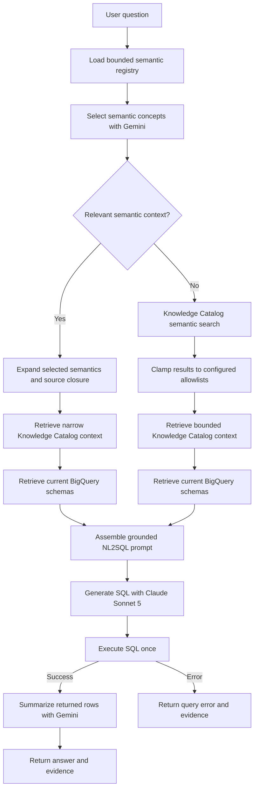

# ADK Semantic Analytics Plan V2

## Status

Status: **proposed; implementation has not started**.

This document is the review checkpoint for simplifying the
`semantic_analytics` workflow. No implementation should begin until this plan is
approved.

## Objective

Build the smallest useful semantic-first analytics workflow that can answer a
question end to end:

1. Use portable YAML semantic contracts to narrow known business questions.
2. Use Knowledge Catalog directly when no semantic contract applies.
3. Ground the selected tables against current BigQuery schemas.
4. Ask an LLM to generate SQL from the grounded context.
5. Execute the generated SQL once.
6. Summarize the returned rows and expose the supporting evidence.

The purpose of this iteration is to observe whether semantic-first context and
Knowledge Catalog grounding produce useful SQL. It is not yet a production SQL
governance system.

## Why V2 Exists

The repository has tested several increasingly controlled designs:

- A deterministic semantic compiler and join planner.
- A contract-covered versus refusal workflow.
- A guarded SQL workflow with AST policy, explicit dry run, cost checks, and
  bounded repair.
- A dataset-wide Conversational Analytics fallback.
- Deployment and evaluation designs built around the guarded workflow.

Those iterations produced useful code and design knowledge, but the active
workflow became complex before the core semantic-first hypothesis was validated.
Git history preserves the removed and superseded implementations, so V2 favors a
small active code path instead of retaining inactive compatibility layers.

Historical restore points already recorded in the original plan include:

- `1f87502`: deterministic semantic contract compiler.
- `7ca0350`: guarded semantic execution.

The Git commit immediately before the V2 simplification will preserve the current
Phase 8 and Phase 11 implementation.

## Scope

V2 includes:

- Semantic contract loading and validation.
- Compact semantic concept selection.
- Deterministic validation of selected semantic IDs and versions.
- Exact physical source closure for selected concepts.
- Narrow Knowledge Catalog context retrieval.
- Broad Knowledge Catalog semantic search.
- Current BigQuery schema retrieval.
- Metadata-only catalog sanitization.
- Stage-specific Gemini and Claude model configuration.
- One-shot SQL generation and execution.
- Per-user OAuth execution support.
- Bounded query results.
- Natural-language result summarization.
- SQL, rows, sources, route, and credential evidence.

V2 does not include:

- Custom SQL AST policy.
- Explicit workflow dry-run routing.
- Query cost estimation or maximum-bytes policy.
- SQL repair.
- Plan mode.
- Dataset-wide CA fallback.
- Deterministic semantic SQL compilation.
- Deployment.
- Comparative evaluation.
- Certification claims.

## Target Workflow



The workflow contains no policy, explicit dry-run, repair, or delegation branch.

## Route Behavior

### Semantic Narrow Route

Use this route when the selector finds relevant concepts in
`config/semantic_contracts/`.

The route performs these steps:

1. Reload contracts after model selection.
2. Validate context IDs, versions, metrics, dimensions, and relationships.
3. Add metric-required dimensions.
4. Resolve only relationships allowed by selected metric paths.
5. Compute the exact physical source closure.
6. Retrieve Knowledge Catalog context for those exact sources.
7. Retrieve current BigQuery schemas for those exact sources.
8. Pass full selected semantic definitions to SQL generation.

The SQL prompt must include the selected definitions, not only their source
tables. Relevant fields include:

- Metric expressions.
- Numerator and denominator expressions.
- Required filters.
- Required dimensions.
- Known dimensions and filters.
- Table grain and primary keys.
- Relationship conditions and cardinality.
- Join paths.
- Default ordering and limits.
- Fully qualified physical sources.

Semantic context is reasoning guidance. V2 does not compile these fields into SQL
or claim that generated SQL is certified.

### Knowledge Catalog Broad Route

Use this route when:

- No semantic contract applies.
- The selector reports material ambiguity.
- The question needs sources not represented by the contracts.
- Selected context is invalid or exceeds configured bounds.
- Narrow source metadata cannot be resolved.

The route performs these steps:

1. Call Knowledge Catalog `SearchEntries` with `semantic_search=True`.
2. Attribute searches to the configured compute project.
3. Scope searches only to configured allowed projects.
4. Clamp every returned BigQuery table to the configured project and dataset
   allowlists.
5. Retrieve bounded context with `LookupContext`.
6. Retrieve current BigQuery schemas for the surviving candidates.
7. Pass the question, catalog context, schemas, and candidate sources to SQL
   generation.

Search results are candidates, not an exhaustive statement that matching data
does or does not exist. If no in-scope candidate has a current schema, the workflow
returns a clarification response.

## Knowledge Catalog Integration

### APIs

V2 uses the `google-cloud-dataplex` client for the current Knowledge Catalog API:

- `SearchEntries` for broad semantic discovery and exact-entry resolution.
- `LookupContext` for compact LLM-ready metadata.

The product name is Knowledge Catalog. The implementation continues to use the
Dataplex API and `google.cloud.dataplex_v1` package.

### Search Scope

Broad search remains default-deny:

- `GOOGLE_CLOUD_PROJECT` identifies the request-attribution and compute project.
- `CATALOG_ALLOWED_PROJECTS` identifies projects that broad search may inspect.
- `CATALOG_ALLOWED_DATASETS` identifies `project.dataset` values that broad search
  may return.
- At least one search allowlist must be configured for the broad route.
- Results are checked again after Knowledge Catalog returns them.

The workflow must never perform an implicit organization-wide search.

### Context Retrieval

`LookupContext` requests use:

- JSON output for deterministic parsing.
- A fixed context budget.
- At most ten resources per request.
- Separate requests when resources belong to different locations.
- The entry resource names returned by `SearchEntries`.

V2 must not construct every BigQuery entry under a hard-coded `global` entry
group. Search results provide the actual regional entry names.

### Metadata Policy

Only metadata is allowed into model prompts and logs.

Allowed context includes:

- Resource names and types.
- Table and column names.
- Column types and descriptions.
- Table and dataset descriptions.
- Business definitions and glossary context.
- Relationships and join guidance.
- Guidelines and ownership metadata.
- Partitioning and clustering information.
- Data-quality status.
- Verified or suggested SQL examples.

Excluded context includes:

- Sample row values.
- Common or top values.
- Minimum and maximum values.
- Quantiles and quartiles.
- Value distributions.
- Raw data-profile payloads.
- Any unknown value-bearing section.

The sanitizer uses an allowlisted output structure. If a `LookupContext` response
cannot be parsed into the known metadata structure, the workflow discards that
response and continues with current BigQuery schema and descriptions only. Raw
context responses must not be logged.

## BigQuery Schema Grounding

BigQuery schema retrieval validates that candidate tables currently exist and
provides the physical fields used for SQL generation.

Narrow behavior:

- Query exactly the physical sources resolved from semantic contracts.
- Do not add tables discovered outside that source closure.
- Route broad if required narrow sources cannot be resolved.

Broad behavior:

- Query only Knowledge Catalog candidates that pass allowlist checks.
- Remove candidates that are missing or inaccessible.
- Continue only when at least one candidate has a current schema.

Knowledge Catalog supplies business and relationship context. BigQuery supplies
the current physical schema used by the initial implementation.

## Model Strategy

### Stage Configuration

Models are configurable independently:

```text
SEMANTIC_SELECTOR_MODEL=gemini-3.5-flash
SQL_GENERATOR_MODEL=claude-sonnet-5
RESULT_SUMMARIZER_MODEL=gemini-3.5-flash
```

Initial defaults:

| Stage | Model | Purpose |
|---|---|---|
| Semantic selector | `gemini-3.5-flash` | Select bounded semantic IDs or route broad |
| SQL generator | `claude-sonnet-5` | Generate SQL from grounded context |
| Result summarizer | `gemini-3.5-flash` | Summarize bounded returned rows |

`claude-opus-4-8` remains an optional SQL-generation experiment through
`SQL_GENERATOR_MODEL`.

### Claude Integration

V2 adds `anthropic[vertex]>=0.78` to the advanced dependency set.

The model factory returns an explicit ADK `Claude` model object for Claude model
IDs. This avoids relying on ADK 2.5 automatic model-name matching, which does not
recognize every Claude 5 identifier.

V2 does not implement Claude structured output. The SQL generator returns plain
SQL text only, which avoids adding a custom ADK response-schema adapter before the
basic flow is proven.

The SQL instruction requires:

- BigQuery Standard SQL.
- SQL text only.
- No Markdown explanation.
- Use of only the supplied tables and fields.
- Preservation of selected semantic formulas, required filters, and relationships.
- A bounded result appropriate for user-facing summarization.

A small normalizer may remove one outer `sql` Markdown fence before execution.
It does not parse, validate, rewrite, or repair SQL.

### Selector Output

The Gemini semantic selector retains the current Pydantic `SemanticSelection`
output schema and validation boundary. Claude is not used for semantic selection
in the initial V2 implementation.

### Result Summary

The result summarizer receives only:

- The original question.
- Generated SQL.
- Bounded returned rows.
- Row count and truncation status.
- Semantic and catalog route provenance.

It must answer from the returned rows and must not invent missing values. Raw rows
remain in the final evidence so users can inspect the source of the summary.

## SQL Execution

### One-Shot Behavior

V2 executes generated SQL once:

```text
generated SQL -> execute -> success or error
```

There is no:

- Custom SQL AST validation.
- Explicit dry-run node.
- Cost-estimate branch.
- Repair prompt.
- Retry.
- Plan mode.
- SQL-triggered CA fallback.

### Execution Adapter

The existing execution boundary is reduced to one `execute(sql)` operation.

Retained behavior:

- Fixed compute project.
- Configured BigQuery location.
- ADC execution for local development.
- Optional user OAuth execution through workflow state.
- A maximum number of rows returned to the agent.
- Normalized success and error results.

The ADK BigQuery integration remains configured with `WriteMode.BLOCKED`. In ADK
2.5 this library performs internal query validation before execution to reject
non-`SELECT` statements. V2 does not expose that internal validation as a workflow
node, branch, dry-run result, repair trigger, or cost-control feature.

This distinction is intentional: custom policy is removed, while the underlying
execution library retains basic write protection.

### Credentials

Retained environment variables:

- `SQL_AUTH_MODE=adc|user`
- `ADK_OAUTH_TOKEN_STATE_KEY`
- `BIGQUERY_LOCATION`
- `SQL_MAX_RESULT_ROWS`, or a fixed equivalent result bound

Removed environment variables:

- `SQL_EXECUTION_MODE`
- `SQL_MAX_BYTES_BILLED`
- `SEMANTIC_FALLBACK_MODE`
- `AGENT_SEMANTIC_CA_ID`

In `user` mode, a missing access token returns an execution error. It must not fall
back to ADC.

### Prototype Limitations

Removing source policy and cost controls creates known limitations:

- Generated SQL is not independently checked against the grounded source list.
- A model can generate a query against another table available to the execution
  identity.
- Query cost is not estimated or capped by the workflow.
- Invalid SQL fails without repair.
- Read-only behavior depends on ADK `WriteMode.BLOCKED` and IAM.

V2 is therefore a local experimental workflow, not a production multi-user
deployment. Local credentials should use the least privileges practical for the
target data and compute project.

## Result Contract

### Success

```json
{
  "status": "answered",
  "answer": "There were 31,132 completed orders.",
  "question": "How many orders were completed?",
  "reasoning_path": "semantic_narrow",
  "semantic_context_ids": ["thelook_orders"],
  "semantic_context_versions": ["thelook_orders:v1"],
  "catalog_route": "narrow",
  "catalog_sources": [
    "bigquery-public-data.thelook_ecommerce.orders"
  ],
  "sql": "SELECT ...",
  "rows": [
    {"completed_orders": 31132}
  ],
  "row_count": 1,
  "truncated": false,
  "auth": {
    "mode": "user",
    "source": "user-token"
  }
}
```

### Execution Error

```json
{
  "status": "query_error",
  "question": "How many orders were completed?",
  "reasoning_path": "semantic_narrow",
  "catalog_route": "narrow",
  "sql": "SELECT ...",
  "error": "BigQuery error text",
  "next_step": "return_error"
}
```

Execution errors are returned directly. They are not repaired or delegated.

### Grounding Failure

```json
{
  "status": "catalog_context_insufficient",
  "question": "Show the best performers",
  "reasoning_path": "catalog_broad",
  "catalog_route": "broad",
  "reason": "No in-scope Knowledge Catalog candidate had a current schema.",
  "next_step": "clarify"
}
```

## Simplified Graph Wiring

The intended ADK graph is:

```text
START
  -> load_semantic_registry
  -> semantic_selector
  -> resolve_semantic_selection

resolve_semantic_selection semantic_narrow
  -> load_narrow_catalog_context
  -> assess_context

resolve_semantic_selection catalog_broad
  -> load_broad_catalog_context
  -> assess_broad_context

assess_context sufficient
  -> enter_sql_generation

assess_context insufficient
  -> load_broad_catalog_context

assess_broad_context grounded
  -> enter_sql_generation

assess_broad_context clarify
  -> finish_clarification

enter_sql_generation
  -> sql_generator
  -> execute_sql_once

execute_sql_once success
  -> prepare_result_summary
  -> result_summarizer
  -> finish_answer

execute_sql_once error
  -> finish_query_error
```

## File-Level Plan

### `advanced/app/semantic_analytics/agent.py`

- Remove `DataAgentToolset` and CA fallback configuration.
- Remove fallback model injection.
- Remove policy, dry-run, repair, refusal, and SQL fallback imports.
- Configure selector, SQL generator, and summarizer independently.
- Add a small model factory for explicit Claude model objects.
- Replace the guarded SQL graph with one-shot execution and summarization edges.

### `semantic/runtime.py`

- Keep registry loading, selection validation, version checks, and source closure.
- Remove retired Phase 6 pass-through terminals.
- Preserve expanded semantic context for downstream SQL generation.

### `semantic/context.py`

- Keep selected semantic expansion and relationship closure.
- Remove the test-only full-contract serializer if it has no retained consumer.
- Ensure all selected metric and relationship guidance is represented in the
  downstream context.

### `semantic/registry.py`

- Keep the multi-contract loader and portable validator.
- Remove the historical single-contract loader and its hard-coded default if tests
  no longer require it.

### `semantic/catalog.py`

- Keep catalog source parsing, bounds, allowlists, and BigQuery schema retrieval.
- Replace keyword-only broad search with Knowledge Catalog semantic search.
- Add `LookupContext` retrieval using actual entry names and locations.
- Add metadata-only context parsing and sanitization.
- Remove heuristic profile-aspect parsing and hard-coded global entry lookup.
- Remove unused timestamp parameters and fields.
- Remove BigQuery name-match broad fallback unless a concrete provider failure
  demonstrates that it is needed.

### `semantic/catalog_runtime.py`

- Keep narrow and broad loading nodes.
- Narrow sufficiency means all required semantic sources have current schemas.
- Broad sufficiency means at least one allowlisted candidate has a current schema.
- Preserve the question, semantic context, catalog context, and source provenance.
- Remove unused timestamp parameters.

### `semantic/sql_runtime.py`

- Remove `GeneratedSql` structured output and recovery callback.
- Remove policy, dry-run, repair, plan-mode, and refusal code.
- Build the complete SQL-generation prompt from semantic and catalog context.
- Normalize plain SQL output without parsing or rewriting it.
- Execute once through the simplified executor.
- Route success to summarization and failure to an error terminal.
- Assemble final answer and evidence.

Renaming this module to `semantic/query_runtime.py` is allowed if it reduces stale
guarded-SQL terminology. No compatibility module should remain after a rename.

### `semantic/execution.py`

- Replace `dry_run()` and `execute()` protocol methods with only `execute()`.
- Remove plan/developer mode resolution.
- Remove maximum-bytes configuration.
- Retain user-token credential construction and ADC support.
- Retain BigQuery location and result-row bounds.
- Retain ADK `WriteMode.BLOCKED`.
- Return a normalized success or error payload.

### `semantic/sql_policy.py`

- Delete the module.

### `semantic/delegation_runtime.py`

- Delete the module.

### `config/agent_definitions.py`

- Remove the dataset-wide `semantic_ca` fallback agent.
- Keep orders and inventory as independent CA baselines.

### `pyproject.toml`

- Remove `sqlglot`.
- Add `anthropic[vertex]>=0.78` to the advanced extra.
- Consolidate duplicate BigQuery and `python-dotenv` declarations where safe.

### `.env.example`

- Add stage-specific model settings.
- Remove `AGENT_SEMANTIC_CA_ID`.
- Remove `SEMANTIC_FALLBACK_MODE`.
- Remove `SQL_EXECUTION_MODE`.
- Remove `SQL_MAX_BYTES_BILLED`.
- Retain execution auth, token-state key, BigQuery location, result bound, and
  catalog allowlists.
- Use current `GOOGLE_GENAI_USE_ENTERPRISE` terminology, noting that the older
  Vertex AI variable is equivalent for compatible SDK versions.

### Web Harness

- Remove plan-mode instructions.
- Remove SQL policy and dry-run provenance fields.
- Display the natural answer first.
- Display SQL, rows, sources, route, and auth evidence separately.
- Preserve OAuth token injection and backend session reuse.

### Documentation

- Update the root and advanced READMEs to describe the V2 prototype accurately.
- Keep `docs/adk_semantic_layer_plan.md` as historical context.
- Make this V2 document the active implementation plan.
- Remove current-state claims that policy, dry run, repair, or CA fallback remain
  active after V2 lands.

## Test Plan

### Retained Tests

- Contract shape and reference validation.
- Duplicate YAML key rejection.
- Multi-contract loading.
- Selector bounds and invalid-output recovery.
- Version-drift detection.
- Required dimension injection.
- Relationship path restrictions.
- Exact semantic source closure.
- Narrow and broad route selection.
- Catalog allowlist parsing and scope checks.
- BigQuery schema mapping.
- OAuth state handling and user-token session injection.
- ADK Workflow compatibility.

### New or Rewritten Tests

- Selected semantic metric expressions reach the SQL-generation input.
- Required semantic filters reach the SQL-generation input.
- Narrow catalog lookup uses exact selected sources.
- Broad search sets `semantic_search=True`.
- Broad results are clamped to project and dataset allowlists.
- `LookupContext` requests use actual entry locations.
- Context requests respect resource and character bounds.
- Metadata sanitizer keeps allowed metadata.
- Metadata sanitizer removes all value-bearing fields.
- Unparseable context fails closed to schema-only grounding.
- Claude SQL output is normalized and executed once.
- Execution errors do not trigger retries or delegation.
- User auth binds the access token to BigQuery credentials.
- Missing user credentials return an error without ADC fallback.
- Returned rows are bounded.
- Successful rows reach the result summarizer.
- Final output includes answer, SQL, rows, sources, route, and auth evidence.
- Orders and inventory remain the only CA baseline definitions.

### Removed Tests

- SQL AST extraction and source policy.
- Multi-statement policy rejection.
- Explicit dry-run routing.
- Maximum-bytes policy.
- SQL repair attempts.
- Plan mode.
- SQL refusal routing.
- CA fallback decision matrices.
- Dataset-wide `semantic_ca` coverage.

Pytest must validate deterministic code and workflow routing. It must not assert
nondeterministic wording from live Gemini or Claude responses.

## Local Verification

After implementation, deterministic checks will include:

```bash
uv sync --extra advanced --extra web
uv run --extra advanced --extra web pytest tests
uv run --extra advanced ruff check .
uv run --extra advanced ruff format --check .
uv lock --check
git diff --check
```

Credentialed smoke checks will be separate from hermetic pytest:

1. Gemini semantic selection against the checked-in contracts.
2. Claude Sonnet 5 SQL generation through Vertex AI Model Garden.
3. Narrow Knowledge Catalog context lookup.
4. Broad Knowledge Catalog semantic search and context lookup.
5. BigQuery execution using ADC.
6. BigQuery execution using the local OAuth harness.
7. Natural-language summarization of returned rows.

These smoke checks establish provider compatibility. They are not comparative
evaluation.

## Definition Of Working

V2 is functionally complete when all of these conditions are met:

1. A known orders question follows the semantic-narrow route.
2. The selected metric formula and required filters reach SQL generation.
3. A question outside the contracts follows Knowledge Catalog broad search.
4. Broad search cannot escape configured source allowlists.
5. Knowledge Catalog context contains no row values or value distributions.
6. Claude Sonnet 5 returns executable SQL text.
7. BigQuery executes the SQL exactly once.
8. Invalid SQL returns an execution error without retry or delegation.
9. Successful rows are summarized into a natural-language answer.
10. The final result includes answer, SQL, rows, sources, route, and auth evidence.
11. No active code imports `semantic.sql_policy`.
12. No active code imports `semantic.delegation_runtime`.
13. `sqlglot`, fallback configuration, plan mode, and repair configuration are
    absent from the active project.
14. Orders and inventory remain independently runnable CA baselines.

## Deferred Capabilities

The following capabilities may be restored only after observing the simple flow:

- SQL source-scope policy.
- Explicit read-only AST validation.
- Dry-run provenance.
- Maximum bytes billed.
- Query cost reporting.
- SQL repair.
- Plan mode.
- CA fallback.
- Contract-aware semantic SQL checks.
- Deterministic compilation for selected metrics.
- Human approval.
- Agent Engine deployment.
- Gemini Enterprise registration.
- Comparative CA evaluation.
- Custom workflow golden-result evaluation.
- Claude structured output.

Restoration should respond to observed failures, not anticipated complexity.

## Known Risks Accepted For V2

- SQL is not independently checked against grounded sources.
- Query cost is not estimated or capped by the workflow.
- Invalid SQL fails on its first execution attempt.
- SQL quality depends on prompt grounding and model behavior.
- Result summaries can be wrong even when rows are correct; raw rows remain visible.
- Knowledge Catalog search is not exhaustive.
- Local ADC metadata access can expose schemas the eventual end user cannot query.
- The workflow is not production-ready until security and cost controls are
  reconsidered from observed behavior.

These risks are explicit and acceptable for the local semantic-first experiment.

## Review Checkpoint

Implementation must not begin until the user approves this document. Review should
confirm:

- The simplified workflow is the intended first iteration.
- The removal list is acceptable.
- `LookupContext` belongs in V2.
- Gemini selector plus Claude Sonnet 5 SQL generation is correct.
- One-shot execution is acceptable.
- The retained basic `WriteMode.BLOCKED` behavior is acceptable.
- Dataset-wide CA fallback removal is acceptable.
- Deployment and evaluation remain deferred.

After approval, implementation should proceed in small verified slices rather than
as one large rewrite.

## Official References

- [ADK graph workflows](https://adk.dev/graphs/)
- [ADK Claude models](https://adk.dev/agents/models/anthropic/)
- [ADK BigQuery integration](https://adk.dev/integrations/bigquery/)
- [Claude Sonnet 5](https://docs.cloud.google.com/gemini-enterprise-agent-platform/models/partner-models/claude/sonnet-5)
- [Claude Opus 4.8](https://docs.cloud.google.com/gemini-enterprise-agent-platform/models/partner-models/claude/opus-4-8)
- [Knowledge Catalog search](https://docs.cloud.google.com/dataplex/docs/search-assets)
- [Knowledge Catalog context retrieval](https://docs.cloud.google.com/dataplex/docs/retrieve-data-context)
- [BigQuery query execution](https://docs.cloud.google.com/bigquery/docs/running-queries)
