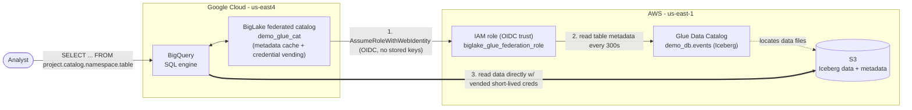

# Cross-Cloud Lakehouse: query AWS Glue Iceberg from BigQuery

Query an Apache **Iceberg** table that lives in **AWS (S3 + Glue)** directly from
**BigQuery** — no data copy, no ETL, and no AWS keys stored in Google Cloud.

This is a minimal, low-cost, reproducible demo of Google Cloud's
[**cross-cloud Lakehouse**](https://docs.cloud.google.com/lakehouse/docs/about-cross-cloud-lakehouse)
(BigLake Iceberg REST catalog).

> **Preview feature.** Cross-cloud Lakehouse is pre-GA; your GCP project must be
> allowlisted. Preview support: biglake-help@google.com

## Architecture



## How it works

- **Metadata discovery, not migration.** BigLake connects to the remote AWS Glue
  Iceberg REST catalog and syncs table metadata — the underlying files stay in S3.
- **Keyless auth (OIDC).** GCP's BigLake service account assumes an AWS IAM role via
  `sts:AssumeRoleWithWebIdentity`, with Google as the OIDC identity provider. No
  long-lived AWS access keys are stored in Google Cloud.
- **Credential vending.** At query time the catalog hands BigQuery short-lived,
  downscoped S3 credentials scoped to just the files the query needs.
  ([credential vending](https://docs.cloud.google.com/lakehouse/docs/credential-vending))
- **Local caching.** Data segments read from S3 are cached in Google Cloud, which
  avoids repeated cross-cloud egress on subsequent queries.
- **Freshness.** A background refresh (`--refresh-interval=300s`) keeps the synced
  metadata current.

## Quick start

Prereqs: `gcloud` (with `alpha`), `bq`, AWS CLI v2, an allowlisted GCP project, and
AWS credentials. Full run takes ~10 minutes (mostly IAM propagation).

```bash
cd bq_cross_cloud_lakehouse

# 0. one-time setup
gcloud services enable biglake.googleapis.com bigquery.googleapis.com
cp config.example.env config.local.env    # edit with your real values
aws configure                             # stores keys in ~/.aws (region us-east-1)

# 1. AWS: bucket + Glue DB + Iceberg table + IAM role
./aws/01_verify.sh
./aws/10_s3_glue.sh
./aws/11_iceberg_table_athena.sh
./aws/20_iam_role.sh

# 2. GCP: create catalog, then finalize the AWS trust with the printed SA ID
SA_ID=$(./gcp/10_create_federated_catalog.sh | tail -1)
./aws/30_update_trust_policy.sh "$SA_ID"
sleep 120                                  # wait for AWS IAM to propagate

# 3. turn on refresh, verify, and query
./gcp/20_enable_refresh.sh
./gcp/30_verify.sh                         # expect namespace: demo_db
./gcp/40_query.sh                          # queries AWS data from BigQuery
```

## Prerequisites

- `gcloud` (with the `alpha` component), `bq`, and AWS CLI v2.
- A GCP project **allowlisted for the cross-cloud Lakehouse Preview**, with
  `roles/biglake.admin` (plus `roles/bigquery.jobUser`, `roles/bigquery.dataViewer`,
  and `roles/biglake.viewer` to query).
- An AWS account + an IAM identity able to create S3, Glue, Athena, and IAM resources.

## Setup

```bash
# Enable the required Google Cloud APIs (once per project).
gcloud services enable biglake.googleapis.com bigquery.googleapis.com

cp config.example.env config.local.env   # then edit with your real values
aws configure                            # stores keys in ~/.aws, region us-east-1
```

`config.local.env` holds your real IDs and is git-ignored. AWS credentials live only
in `~/.aws/` — never in this repo.

## Run order

| Step | Script | What it does | ~Time |
|------|--------|--------------|-------|
| 1 | `aws/01_verify.sh` | Confirm CLI auth + account matches config | 5s |
| 2 | `aws/10_s3_glue.sh` | Create S3 bucket + Glue database | 10s |
| 3 | `aws/11_iceberg_table_athena.sh` | Create + populate a small Iceberg table | 30s |
| 4 | `aws/20_iam_role.sh` | Create IAM role (placeholder trust) + scoped policy | 10s |
| 5 | `gcp/10_create_federated_catalog.sh` | Create catalog; prints BigLake SA ID | 10s |
| 6 | `aws/30_update_trust_policy.sh <SA_ID>` | Finalize AWS trust policy | 5s |
| 7 | `gcp/20_enable_refresh.sh` | Enable 300s metadata refresh (after propagation) | 5s |
| 8 | `gcp/30_verify.sh` | Confirm refresh OK + namespaces synced | ~2m |
| 9 | `gcp/40_query.sh` | Query the AWS table from BigQuery | 10s |

## What you'll see

`gcp/40_query.sh` runs standard BigQuery SQL against the AWS-resident table:

```sql
SELECT * FROM `PROJECT.demo_glue_cat.demo_db.events` LIMIT 10;
```

```
+---------+----------+------------+
| user_id |  action  | event_date |
+---------+----------+------------+
|       1 | login    | 2026-04-01 |
|       2 | purchase | 2026-04-01 |
|     ... |   ...    |    ...     |
+---------+----------+------------+
```

## Cost

Essentially free for a small demo: Glue Data Catalog free tier, a few KB in S3, tiny
public-internet egress, and Athena (~$5/TB scanned → fractions of a cent). Metadata
refresh makes lightweight Glue API calls every 5 minutes while the catalog exists.

## Security / this is a public repo

- **Never committed:** `config.local.env` (real IDs) and `.env` are git-ignored.
- AWS credentials live only in `~/.aws/` (via `aws configure`) — never in the repo.
- Committed files use placeholders (`config.example.env`) and templates
  (`aws/policies/*.template.json`, rendered into the git-ignored `.generated/`).
- The AWS IAM policy is scoped to only this demo's bucket and Glue resources.

## Teardown

Not required until you want to stop spend. When you're done:

```bash
./gcp/90_teardown.sh
./aws/90_teardown.sh   # also prints commands to delete the demo IAM user
```

## References

- [About cross-cloud Lakehouse](https://docs.cloud.google.com/lakehouse/docs/about-cross-cloud-lakehouse)
- [Set up cross-cloud Lakehouse for AWS Glue](https://docs.cloud.google.com/lakehouse/docs/set-up-cross-cloud-lakehouse-aws-glue)
- [Use cross-cloud Lakehouse (query)](https://docs.cloud.google.com/lakehouse/docs/use-cross-cloud-lakehouse)
- [Supported regions & capabilities](https://docs.cloud.google.com/lakehouse/docs/regions-capabilities-cross-cloud-lakehouse)
- [Credential vending](https://docs.cloud.google.com/lakehouse/docs/credential-vending)
- [Lakehouse locations](https://docs.cloud.google.com/lakehouse/docs/locations)
- Alternative (not used here): [BigQuery Omni AWS Glue federated datasets](https://docs.cloud.google.com/bigquery/docs/glue-federated-datasets)

See [`docs/runbook.md`](docs/runbook.md) for the full narrative, setup sequence
diagram, and demo talk-track.
