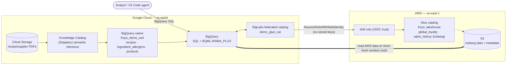

# Froyo cross-cloud lakehouse: raw data → forecasting, with an AWS twist

A **self-contained** version of the Google Cloud Next '26 keynote demo
**"Raw data to forecasting in seconds with AI agents"** — with the **AWS
cross-cloud arm the public codelab leaves out**.

The [public codelab](https://codelabs.developers.google.com/next26/gen-keynote/raw-data-forecasting)
is GCP-only; the keynote architecture also reads data that physically lives in
**AWS S3 (Apache Iceberg / Glue)**. This repo restores that arm using Google
Cloud's [**cross-cloud Lakehouse / catalog federation**](https://docs.cloud.google.com/lakehouse/docs/about-cross-cloud-lakehouse)
(BigLake Iceberg REST catalog) — keyless OIDC, no Databricks, no Cross-Cloud
Interconnect. Everything runs from this one repo; the codelab is credited as
inspiration, not a dependency.

> **Preview features.** Cross-cloud Lakehouse / catalog federation are pre-GA;
> your GCP project must be allowlisted. Preview support: biglake-help@google.com

## The story (Froyo "Midnight Swirl")

1. **Dark data → knowledge.** Recipe & supplier PDFs sit in Cloud Storage. The
   Knowledge Catalog extracts structured allergen/ingredient data into BigQuery —
   revealing that *Midnight Base 204* (an ingredient of Midnight Swirl) hides a
   **Soy** allergen, buried in a supplier datasheet.
2. **Cross-cloud target list.** BigQuery joins that native allergen knowledge with
   **customer-loyalty data that physically lives in AWS S3/Glue** to build a
   Midnight Swirl campaign list — excluding soy-sensitive customers — in a single
   query, with no data movement and no AWS keys stored in Google Cloud.
3. **Forecast.** BigQuery ML `ARIMA_PLUS`, trained directly on the **AWS-resident**
   `sales_history` Iceberg table, projects Q3 revenue per region.

Beat 1 uses Knowledge Catalog (no Spark). Beats 2–3 run entirely in BigQuery.
The Serverless Spark / Lightning Engine version of the pipeline + forecast is a
later fidelity upgrade — see [Roadmap](#roadmap).

## Architecture



- **Metadata discovery, not migration** — BigLake syncs Glue/Iceberg metadata; files stay in S3.
- **Keyless auth (OIDC)** — GCP's BigLake SA assumes an AWS IAM role via `sts:AssumeRoleWithWebIdentity`; no long-lived AWS keys in Google Cloud.
- **Credential vending** — the catalog hands BigQuery short-lived, downscoped S3 creds at query time.
- **Single query surface** — native BQ tables and AWS-federated Iceberg tables join in one `us-east4` query (BigQuery can't join across regions, so the native side is co-located in `us-east4`).
- **No Databricks, no Cross-Cloud Interconnect** — managed catalog federation plus credential vending delivers the cross-cloud read directly, replacing what would otherwise require a Databricks Unity Catalog integration or a private Cross-Cloud Interconnect link.

## Quick start

Prereqs: `gcloud` (with `alpha`), `bq`, AWS CLI v2, `python3`, an allowlisted GCP
project, and AWS credentials in `~/.aws`. Full run ~10–15 min (mostly IAM +
metadata propagation). Cost < $5.

```bash
cd bq_cross_cloud_lakehouse
cp config.example.env config.local.env     # edit with your real values
gcloud services enable biglake.googleapis.com bigquery.googleapis.com

# AWS: bucket + Glue DB + two Iceberg tables (global_loyalty, sales_history) + IAM role
./aws/01_verify.sh
./aws/10_s3_glue.sh
./aws/11_iceberg_tables_athena.sh
./aws/20_iam_role.sh

# GCP: create federated catalog, finalize AWS trust with the printed SA id
SA_ID=$(./gcp/10_create_federated_catalog.sh | tail -1)
./aws/30_update_trust_policy.sh "$SA_ID"
sleep 120                                   # let AWS IAM propagate

# GCP: refresh, verify, seed native knowledge, then run the demo
./gcp/20_enable_refresh.sh
./gcp/30_verify.sh                          # expect namespace: froyo_lakehouse + both tables
./gcp/05_seed_native_bq.sh                  # allergen/recipe/product knowledge (deterministic)
# ./gcp/06_knowledge_catalog.sh             # OPTIONAL: real Dataplex PDF extraction
./gcp/40_query_froyo.sh                     # allergen find + cross-cloud target list
./gcp/50_forecast_bqml.sh                   # BQML ARIMA_PLUS Q3 forecast on AWS data
```

## Run order

| Step | Script | What it does | ~Time |
|------|--------|--------------|-------|
| 1 | `aws/01_verify.sh` | Confirm CLI auth + account matches config | 5s |
| 2 | `aws/10_s3_glue.sh` | Create S3 bucket + `froyo_lakehouse` Glue database | 10s |
| 3 | `aws/11_iceberg_tables_athena.sh` | Create + seed `global_loyalty` + `sales_history` Iceberg tables | ~40s |
| 4 | `aws/20_iam_role.sh` | Create IAM role (placeholder trust) + scoped policy | 10s |
| 5 | `gcp/10_create_federated_catalog.sh` | Create catalog; prints BigLake SA id | 10s |
| 6 | `aws/30_update_trust_policy.sh <SA_ID>` | Finalize AWS trust policy | 5s |
| 7 | `gcp/20_enable_refresh.sh` | Enable 300s metadata refresh (after propagation) | 5s |
| 8 | `gcp/30_verify.sh` | Confirm refresh + `froyo_lakehouse` tables queryable | ~2m |
| 9 | `gcp/05_seed_native_bq.sh` | Seed native allergen/recipe/product knowledge | 15s |
| 10 | `gcp/06_knowledge_catalog.sh` | **Optional:** real Dataplex PDF extraction (no Spark) | ~20m |
| 11 | `gcp/40_query_froyo.sh` | Allergen find + cross-cloud target list | 15s |
| 12 | `gcp/50_forecast_bqml.sh` | BQML `ARIMA_PLUS` Q3 revenue forecast | ~1m |

> Script number prefixes group related steps (`aws/*`, `gcp/*`); the table above is
> the actual execution order. `gcp/05` intentionally runs after `gcp/30` (federation
> must be live before the native side is joined against it).

## What you'll see

`gcp/40_query_froyo.sh` (Q3) — one BigQuery query spanning GCP + AWS:

```
+-------------+--------+--------------+-------------------+
| customer_id | region | loyalty_tier | avg_monthly_spend |
+-------------+--------+--------------+-------------------+
|        1006 | EMEA   | Platinum     |              96.0 |   ← soy-sensitive Midnight Swirl
|        1009 | AMER   | Platinum     |              88.3 |     fans are excluded
|        ...  |  ...   |   ...        |              ...  |
```

`gcp/50_forecast_bqml.sh` — projected Midnight Swirl revenue per region, forecast
by BQML on the AWS-resident `sales_history` table.

## Data model

| Layer | Location | Tables |
|-------|----------|--------|
| Knowledge (native BQ, `us-east4`) | Google Cloud | `products`, `recipes`, `ingredient_allergens`, `product_allergens` (view) |
| Loyalty + sales (Iceberg, federated) | **AWS S3 + Glue** (`us-east-1`) | `global_loyalty`, `sales_history` |
| Raw PDFs | Cloud Storage | `assets/pdfs/recipes/*`, `assets/pdfs/suppliers/*` (vendored from the codelab) |

The seeded knowledge tables mirror the vendored PDFs (e.g. Midnight Base 204 →
Soy from `suppliers/midnight_base_204_manual.pdf`), so the deterministic demo and
the optional live Knowledge Catalog extraction tell the same story.

## Roadmap

- **Serverless Spark / Lightning Engine** for the join + forecast (keynote beat 6/7
  fidelity), with the `iceberg-federation-template` session template.
- **`AI.PARSE_DOCUMENT`** (BigQuery, preview) as a one-SQL-function replacement for
  the Dataplex extraction, once it's GA / allowlisted in your region. Today the
  repo uses Knowledge Catalog (beat-faithful) + a deterministic seed; GA
  `ML.PROCESS_DOCUMENT` is the SQL-native alternative.
- **Semantic "Extract with SQL"** is a console step that is region-gated in
  preview. `gcp/06` reliably publishes the BigLake **object table** over the PDFs,
  but in some regions (e.g. `us-east4` today) the Insights tab exposes only
  *Manage discovery scan settings* / *Generate insights* — the *Extract with SQL*
  action isn't offered yet. The `gcp/05` seed stands in for that extracted output
  until it lands.
- **VS Code Data Agent Kit** agentic flow — see `assets/copilot-instructions.md`.

## Cost

< $5 for a small run: Glue free tier, a few MB in S3, tiny egress, Athena
(~$5/TB scanned → fractions of a cent), and a small BQML training job. Metadata
refresh makes lightweight Glue API calls every 5 minutes while the catalog exists.

## Security / this is a public repo

- **Never committed:** `config.local.env` (real IDs) and `.env` are git-ignored.
- AWS credentials live only in `~/.aws/` — never in the repo.
- No AWS keys in Google Cloud: federation uses OIDC + short-lived vended credentials.
- The AWS IAM policy is scoped to this demo's bucket and Glue account.

## Teardown

```bash
./gcp/90_teardown.sh   # native dataset + BQML model, DataScan, connection, PDF bucket, catalog
./aws/90_teardown.sh   # Iceberg tables, Glue DB, S3 bucket, IAM role (+ prints IAM user cleanup)
```

## References

- [Codelab: Raw data to forecasting in seconds with AI agents](https://codelabs.developers.google.com/next26/gen-keynote/raw-data-forecasting)
- [About cross-cloud Lakehouse](https://docs.cloud.google.com/lakehouse/docs/about-cross-cloud-lakehouse) · [Set up for AWS Glue](https://docs.cloud.google.com/lakehouse/docs/set-up-cross-cloud-lakehouse-aws-glue) · [Catalog federation](https://docs.cloud.google.com/lakehouse/docs/use-catalog-federation)
- [Credential vending](https://docs.cloud.google.com/lakehouse/docs/credential-vending)
- [Knowledge Catalog: insights for unstructured data](https://docs.cloud.google.com/dataplex/docs/data-insights-unstructured-data)
- [BigQuery ML ARIMA_PLUS](https://docs.cloud.google.com/bigquery/docs/reference/standard-sql/bigqueryml-syntax-create-time-series) · [ML.FORECAST](https://docs.cloud.google.com/bigquery/docs/reference/standard-sql/bigqueryml-syntax-forecast)

See [`docs/runbook.md`](docs/runbook.md) for the full setup sequence and demo talk-track.
