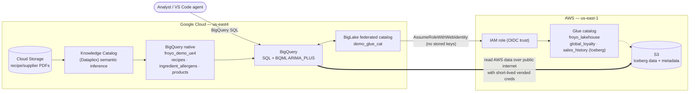

# Froyo cross-cloud lakehouse: raw data → forecasting, with an AWS twist

A **self-contained** version of the Google Cloud Next '26 keynote demo
**"Raw data to forecasting in seconds with AI agents"** — with the **AWS
cross-cloud arm the public codelab leaves out**.

The [public codelab](https://codelabs.developers.google.com/next26/gen-keynote/raw-data-forecasting)
is GCP-only; the keynote architecture also reads data that physically lives in
**AWS S3 (Apache Iceberg / Glue)**. This repo restores that arm using Google
Cloud's [**cross-cloud Lakehouse / catalog federation**](https://docs.cloud.google.com/lakehouse/docs/about-cross-cloud-lakehouse)
(BigLake Iceberg REST catalog) — keyless OIDC, no Databricks, no Cross-Cloud
Interconnect. Everything runs from this one repo; the codelab is credited as
inspiration, not a dependency.

> **Preview features.** Cross-cloud Lakehouse / catalog federation are pre-GA;
> your GCP project must be allowlisted. Preview support: biglake-help@google.com

## The story (Froyo "Midnight Swirl")

1. **Dark data → knowledge.** Recipe and supplier PDFs sit in Cloud Storage. The
   reliable scripted path seeds PDF-grounded allergen data into BigQuery; the
   optional Knowledge Catalog path catalogs the PDFs and runs semantic inference.
   Both reveal that *Midnight Base 204* hides a **Soy** allergen.
2. **Cross-cloud target list.** BigQuery joins that native allergen knowledge with
   **customer-loyalty data that physically lives in AWS S3/Glue** to build a
   Midnight Swirl campaign list — excluding soy-sensitive customers — in a single
   query, with no persistent replication and no AWS keys stored in Google Cloud.
3. **Forecast.** BigQuery ML `ARIMA_PLUS`, trained directly on the **AWS-resident**
   `sales_history` Iceberg table, projects next-quarter revenue per region.

The reliable Beat 1 path uses PDF-grounded seed tables; Knowledge Catalog is an
optional preview path. Beats 2–3 run entirely in BigQuery.
The Serverless Spark / Lightning Engine version of the pipeline + forecast is a
later fidelity upgrade — see [Roadmap](#roadmap).

## Architecture


```mermaid
flowchart LR
    USER([Analyst / VS&nbsp;Code agent]) -->|BigQuery SQL| BQ
    subgraph GCP["Google Cloud — us-east4"]
        PDFS[("Cloud Storage<br/>recipe/supplier PDFs")]
        KC["Knowledge Catalog<br/>(Dataplex) semantic inference"]
        NATIVE["BigQuery native<br/>froyo_demo_ue4<br/>recipes · ingredient_allergens · products"]
        BQ["BigQuery<br/>SQL + BQML ARIMA_PLUS"]
        CAT["BigLake federated catalog<br/>demo_glue_cat"]
        PDFS --> KC --> NATIVE --> BQ
        BQ <--> CAT
    end
    subgraph AWS["AWS — us-east-1"]
        ROLE["IAM role (OIDC trust)"]
        GLUE["Glue catalog<br/>froyo_lakehouse<br/>global_loyalty · sales_history (Iceberg)"]
        S3[("S3<br/>Iceberg data + metadata")]
    end
    CAT -->|"AssumeRoleWithWebIdentity (no stored keys)"| ROLE --> GLUE -.-> S3
    BQ ==>|"read AWS data over public internet<br/>with short-lived vended creds"| S3
```

- **Metadata discovery, not migration** — BigLake syncs Glue/Iceberg metadata;
  files stay in S3, while query bytes cross clouds over the public internet.
- **Keyless auth (OIDC)** — GCP's BigLake SA assumes an AWS IAM role via `sts:AssumeRoleWithWebIdentity`; no long-lived AWS keys in Google Cloud.
- **Credential vending** — the catalog hands BigQuery short-lived, downscoped S3 creds at query time.
- **Single query surface** — native BQ tables and AWS-federated Iceberg tables join in one `us-east4` query (BigQuery can't join across regions, so the native side is co-located in `us-east4`).
- **No Databricks, no Cross-Cloud Interconnect** — managed catalog federation plus credential vending delivers the cross-cloud read directly, replacing what would otherwise require a Databricks Unity Catalog integration or a private Cross-Cloud Interconnect link.

## Quick start

Prereqs: `gcloud` with the `alpha` component, `bq`, AWS CLI v2, `python3`, an
allowlisted and billed GCP project, and temporary AWS credentials from AWS IAM
Identity Center (`aws configure sso` then `aws sso login`), or any `~/.aws`
profile. The GCP operator needs BigLake Admin, BigQuery Data Editor,
BigQuery Job User, Dataplex DataScan Editor, Dataplex Catalog Editor, and Service
Usage Admin. Query users need BigLake Viewer, BigQuery Data Viewer, and BigQuery
Job User. Full run is approximately 10–15 minutes. Cost is less than $5.

```bash
cd bq_cross_cloud_lakehouse
cp config.example.env config.local.env     # edit with your real values
source config.local.env
aws sso login                              # temporary creds (after: aws configure sso)
gcloud services enable --project="$GCP_PROJECT" \
  biglake.googleapis.com bigquery.googleapis.com

# AWS: bucket + Glue DB + two Iceberg tables (global_loyalty, sales_history) + IAM role
./aws/01_verify.sh
./aws/10_s3_glue.sh
./aws/11_iceberg_tables_athena.sh
./aws/20_iam_role.sh
./aws/21_readonly_user.sh                   # create read-only console user (demo_user) for Glue/Athena Web UI

# GCP: create federated catalog, finalize AWS trust with the printed SA id
SA_ID=$(./gcp/10_create_federated_catalog.sh)
./aws/30_update_trust_policy.sh "$SA_ID"
sleep 120                                   # let AWS IAM propagate

# GCP: refresh, verify, seed native knowledge, then run the demo
./gcp/20_enable_refresh.sh
./gcp/30_verify.sh                          # expect namespace: froyo_lakehouse + both tables
./gcp/05_seed_native_bq.sh                  # allergen/recipe/product knowledge (deterministic)
# ./gcp/06_knowledge_catalog.sh             # OPTIONAL: preview semantic inference
./gcp/40_query_froyo.sh                     # allergen find + cross-cloud target list
./gcp/50_forecast_bqml.sh 92                # BQML ARIMA_PLUS 92-day forecast on AWS data
```

## Run order

| Step | Script | What it does | ~Time |
|------|--------|--------------|-------|
| 1 | `aws/01_verify.sh` | Confirm CLI auth + account matches config | 5s |
| 2 | `aws/10_s3_glue.sh` | Create S3 bucket + `froyo_lakehouse` Glue database | 10s |
| 3 | `aws/11_iceberg_tables_athena.sh` | Create + seed `global_loyalty` + `sales_history` Iceberg tables | ~40s |
| 4 | `aws/20_iam_role.sh` | Create IAM role (placeholder trust) + scoped policy | 10s |
| 5 | `aws/21_readonly_user.sh` | Create read-only IAM user (`demo_user`) for Athena & Glue Web UI | 5s |
| 6 | `gcp/10_create_federated_catalog.sh` | Create catalog; prints BigLake SA id | 10s |
| 7 | `aws/30_update_trust_policy.sh <SA_ID>` | Finalize AWS trust policy | 5s |
| 8 | `gcp/20_enable_refresh.sh` | Enable 300s metadata refresh (after propagation) | 5s |
| 9 | `gcp/30_verify.sh` | Confirm refresh + `froyo_lakehouse` tables queryable | ~2m |
| 10 | `gcp/05_seed_native_bq.sh` | Seed native allergen/recipe/product knowledge | 15s |
| 11 | `gcp/06_knowledge_catalog.sh` | **Optional:** PDF discovery + semantic inference | ~20m |
| 12 | `gcp/40_query_froyo.sh` | Allergen find + cross-cloud target list | 15s |
| 13 | `gcp/50_forecast_bqml.sh` | BQML `ARIMA_PLUS` 92-day revenue forecast | ~1m |

> Script number prefixes group related steps (`aws/*`, `gcp/*`); the table above is
> the actual execution order. `gcp/05` intentionally runs after `gcp/30` (federation
> must be live before the native side is joined against it).

## What you'll see

`gcp/40_query_froyo.sh` (Q3) — one BigQuery query spanning GCP + AWS:

```
+-------------+--------+--------------+-------------------+
| customer_id | region | loyalty_tier | avg_monthly_spend |
+-------------+--------+--------------+-------------------+
|        1006 | EMEA   | Platinum     |              96.0 |   ← soy-sensitive Midnight Swirl
|        1009 | AMER   | Platinum     |              88.3 |     fans are excluded
|        ...  |  ...   |   ...        |              ...  |
```

`gcp/50_forecast_bqml.sh` — projected Midnight Swirl revenue per region, forecast
by BQML on the AWS-resident `sales_history` table.

## Conversational agent (Gemini Enterprise)

[`agent/`](agent/) is a self-contained BigQuery **Conversational Analytics API**
data agent that spans the native knowledge tables **and** the AWS-federated
Iceberg tables in one query surface, published to **Gemini Enterprise**. It turns
the Midnight Swirl storyline into a natural-language experience (allergen find →
cross-cloud soy-safe target list → regional revenue). See
[`agent/README.md`](agent/README.md) to deploy and
[`agent/DEMO_RUNDOWN.md`](agent/DEMO_RUNDOWN.md) for the talk-track. Based on the
`bq_caapi_ge` project.

## Data model

| Layer | Location | Tables |
|-------|----------|--------|
| Knowledge (native BQ, `us-east4`) | Google Cloud | `products`, `recipes`, `ingredient_allergens`, `product_allergens` (view) |
| Loyalty + sales (Iceberg, federated) | **AWS S3 + Glue** (`us-east-1`) | `global_loyalty`, `sales_history` |
| Raw PDFs | Cloud Storage | `assets/pdfs/recipes/*`, `assets/pdfs/suppliers/*` (vendored from the codelab) |

The seeded knowledge tables mirror the vendored PDFs (e.g. Midnight Base 204 →
Soy from `suppliers/midnight_base_204_manual.pdf`). This keeps the event demo
reliable even when the optional Knowledge Catalog preview is unavailable.

## Roadmap

- **Serverless Spark / Lightning Engine** for the join + forecast (keynote beat 6/7
  fidelity), with the `iceberg-federation-template` session template.
- **`AI.PARSE_DOCUMENT`** (BigQuery, preview) as a one-SQL-function replacement for
  the Dataplex extraction, once it's GA / allowlisted in your region. Today the
  repo uses Knowledge Catalog (beat-faithful) + a deterministic seed; GA
  `ML.PROCESS_DOCUMENT` is the SQL-native alternative.
- **Semantic "Extract with SQL"** is a console step that is region-gated in
  preview. `gcp/06` reliably publishes the BigLake **object table** over the PDFs,
  but in some regions (e.g. `us-east4` today) the Insights tab exposes only
  *Manage discovery scan settings* / *Generate insights* — the *Extract with SQL*
  action isn't offered yet. The `gcp/05` seed stands in for that extracted output
  until it lands.
- **VS Code Data Agent Kit** agentic flow — see `assets/copilot-instructions.md`.

## Cost

< $5 for a small run: Glue free tier, a few MB in S3, tiny egress, Athena
(~$5/TB scanned → fractions of a cent), and a small BQML training job. Metadata
refresh makes lightweight Glue API calls every 5 minutes while the catalog exists.

## Security / this is a public repo

- **Never committed:** `config.local.env` (real IDs) and `.env` are git-ignored.
- Use temporary AWS CLI credentials from AWS IAM Identity Center (`aws sso login`) over long-lived keys.
- No AWS keys in Google Cloud: federation uses OIDC + short-lived vended credentials.
- The AWS IAM policy is scoped to this demo's bucket and Glue account.

## Teardown

```bash
./gcp/90_teardown.sh --dry-run
./aws/90_teardown.sh --dry-run

# Destructive execution requires an explicit flag after reviewing the dry run:
./gcp/90_teardown.sh --execute
./aws/90_teardown.sh --execute
```

With `S3_BUCKET_MODE=shared`, AWS teardown removes only the two Froyo warehouse
prefixes and never deletes the bucket or unrelated prefixes. Always review the
dry-run output before using `--execute`. If the optional discovery path was run,
set `DISCOVERY_DATASET` in `config.local.env` to the generated BigQuery dataset
name so teardown can remove it without guessing.

## License

Apache-2.0 — see [`LICENSE`](LICENSE). Provided as a self-contained baseline you
can fork and adapt; the linked Google Cloud codelab is credited as inspiration,
not a dependency.

## References

- [Codelab: Raw data to forecasting in seconds with AI agents](https://codelabs.developers.google.com/next26/gen-keynote/raw-data-forecasting)
- [About cross-cloud Lakehouse](https://docs.cloud.google.com/lakehouse/docs/about-cross-cloud-lakehouse) · [Set up for AWS Glue](https://docs.cloud.google.com/lakehouse/docs/set-up-cross-cloud-lakehouse-aws-glue) · [Catalog federation](https://docs.cloud.google.com/lakehouse/docs/use-catalog-federation)
- [Credential vending](https://docs.cloud.google.com/lakehouse/docs/credential-vending)
- [Knowledge Catalog: insights for unstructured data](https://docs.cloud.google.com/dataplex/docs/data-insights-unstructured-data)
- [BigQuery ML ARIMA_PLUS](https://docs.cloud.google.com/bigquery/docs/reference/standard-sql/bigqueryml-syntax-create-time-series) · [ML.FORECAST](https://docs.cloud.google.com/bigquery/docs/reference/standard-sql/bigqueryml-syntax-forecast)

See [`docs/runbook.md`](docs/runbook.md) for the full setup sequence and demo talk-track.
