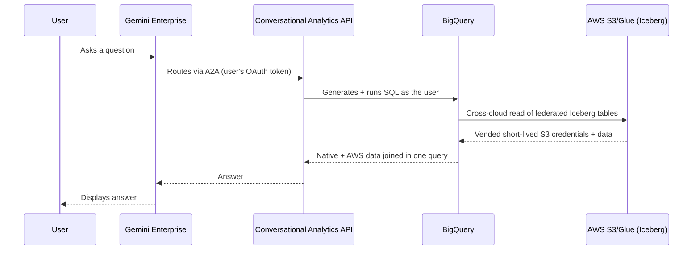

# Froyo Lakehouse — Conversational Analytics agent for Gemini Enterprise

A **self-contained** BigQuery data agent for the Froyo cross-cloud lakehouse
demo. It creates one Conversational Analytics (CA) API data agent that spans the
demo's native BigQuery knowledge tables **and** the AWS-federated Apache Iceberg
tables in a single query surface, then publishes it to **Gemini Enterprise** over
the built-in A2A protocol. No custom agent runtime or deployment infrastructure.

> **Based on `bq_caapi_ge`.** This package is extracted from and adapted from the
> `bq_caapi_ge` project (Conversational Analytics API + Gemini Enterprise
> integration). It is trimmed to a single, fully self-contained deployment for
> this demo: no ADK/advanced runtime, no shared parent package, and it reuses the
> lakehouse's own `config.local.env` for infrastructure values.

For the business narrative and demo talk-track, see [`DEMO_RUNDOWN.md`](DEMO_RUNDOWN.md).

## Architecture



**Cross-cloud in one agent.** The agent references six objects:

| Object | `dataset_id` | `table_id` | Location |
|---|---|---|---|
| products | `froyo_demo_ue4` | `products` | native `us-east4` |
| recipes | `froyo_demo_ue4` | `recipes` | native `us-east4` |
| ingredient_allergens | `froyo_demo_ue4` | `ingredient_allergens` | native `us-east4` |
| product_allergens (view) | `froyo_demo_ue4` | `product_allergens` | native `us-east4` |
| global_loyalty | `demo_glue_cat.froyo_lakehouse` | `global_loyalty` | **AWS S3/Glue** |
| sales_history | `demo_glue_cat.froyo_lakehouse` | `sales_history` | **AWS S3/Glue** |

The AWS-federated Iceberg tables are referenced with the CA API's four-part
**P.C.N.T** syntax for Lakehouse / external-catalog tables: the `dataset_id` is
`<catalog>.<namespace>` (`demo_glue_cat.froyo_lakehouse`) and the `table_id` is
the table name. No BigQuery views or copies are needed — the agent's generated
SQL reads AWS data directly at query time.

**OAuth identity passthrough.** Gemini Enterprise routes each request with the
signed-in user's OAuth token, so the CA API executes SQL with that user's
BigQuery/BigLake permissions.

## Prerequisites

1. The lakehouse pipeline already deployed, so the datasets/tables exist. From
   `bq_cross_cloud_lakehouse/`, run the `aws/*` and `gcp/*` steps in the main
   [README](../README.md) (through at least `gcp/05_seed_native_bq.sh` and the
   federated catalog refresh). This also creates `config.local.env`, which this
   agent reads for infrastructure values.
2. An allowlisted, billed GCP project (cross-cloud Lakehouse + CA API Lakehouse
   support are preview features).
3. Tooling: [`uv`](https://docs.astral.sh/uv/), the `gcloud` CLI, and `curl`.
4. APIs enabled: `geminidataanalytics.googleapis.com`,
   `discoveryengine.googleapis.com`, `bigquery.googleapis.com`,
   `biglake.googleapis.com`, `cloudaicompanion.googleapis.com`.
5. A Gemini Enterprise app and OAuth 2.0 client credentials (Client ID + Secret)
   with redirect URIs:
   - `https://vertexaisearch.cloud.google.com/oauth-redirect`
   - `https://vertexaisearch.cloud.google.com/static/oauth/oauth.html`
6. Authenticated ADC:
   ```bash
   gcloud auth application-default login
   ```

### Query-user IAM (OAuth passthrough)

Because queries run as the signed-in user, each end user needs, on the demo
project: `roles/biglake.viewer`, `roles/bigquery.dataViewer`, and
`roles/bigquery.jobUser`. **No AWS access is required for end users** — the
cross-cloud S3 read uses the BigLake connection's OIDC trust and short-lived
vended credentials (provisioned by `aws/20_iam_role.sh` + `gcp/10_create_federated_catalog.sh`).

## Preflight checklist

Confirm all of the following before deploying (this is the equivalent of the
`bq_caapi_ge` demos' "data-gen" stage plus the CA/GE prerequisites):

- [ ] **Data exists.** The lakehouse pipeline has been run through
      `gcp/30_verify.sh` and `gcp/05_seed_native_bq.sh`, so **both** a native
      table and the federated (P.C.N.T) table return rows:
      ```bash
      cd ..            # bq_cross_cloud_lakehouse/
      source ./config.local.env
      bq --location="${GCP_REGION}" query --use_legacy_sql=false \
        "SELECT COUNT(*) FROM \`${GCP_PROJECT}.${FROYO_NATIVE_DATASET}.product_allergens\`"
      bq --location="${GCP_REGION}" query --use_legacy_sql=false \
        "SELECT COUNT(*) FROM \`${GCP_PROJECT}.${FEDERATED_CATALOG}.${GLUE_DATABASE}.${FROYO_LOYALTY_TABLE}\`"
      ```
- [ ] **Project allowlisted + billed** (cross-cloud Lakehouse and CA API
      Lakehouse support are preview).
- [ ] **APIs enabled:**
      ```bash
      gcloud services enable --project="$GCP_PROJECT" \
        geminidataanalytics.googleapis.com discoveryengine.googleapis.com \
        bigquery.googleapis.com biglake.googleapis.com cloudaicompanion.googleapis.com
      ```
- [ ] **GE app created** and an **OAuth 2.0 client** exists with the redirect URIs
      listed under [Prerequisites](#prerequisites).
- [ ] `config.local.env` present (from the pipeline) and `agent/.env` filled.
- [ ] `gcloud`, `curl`, `uv` installed; ADC logged in
      (`gcloud auth application-default login`).

### Operator IAM (the identity running these scripts)

The ADC identity deploying the agent needs, on the project:
`roles/geminidataanalytics.dataAgentEditor` (create/update CA agents),
`roles/discoveryengine.editor` (register in GE), `roles/bigquery.dataViewer`,
`roles/bigquery.jobUser`, and `roles/biglake.viewer` (for `validate_agent.py`).
End users querying via GE need only the [query-user roles](#query-user-iam-oauth-passthrough).

## Quick start

Run from this `agent/` directory. The `GOOGLE_API_USE_CLIENT_CERTIFICATE=false`
prefix matches the `bq_caapi_ge` demos and avoids mTLS/client-certificate issues
on some machines.

```bash
# 1. Install dependencies (isolated from the rest of the repo)
uv sync

# 2. Configure the Gemini Enterprise / OAuth / agent settings.
#    Infrastructure values (project, region, catalog, tables) come from
#    ../config.local.env automatically.
cp .env.example .env        # then edit GEMINI_APP_ID, OAUTH_*, project number

# 3. Create (or update) the CA API data agent
GOOGLE_API_USE_CLIENT_CERTIFICATE=false uv run python scripts/create_agent.py

# 4. Register it in Gemini Enterprise (creates the OAuth auth resource + A2A agent)
GOOGLE_API_USE_CLIENT_CERTIFICATE=false uv run python scripts/register_ge_agent.py --force

# 5. Validate SQL generation + the cross-cloud join against the storyline
GOOGLE_API_USE_CLIENT_CERTIFICATE=false uv run python scripts/validate_agent.py
```

Open your Gemini Enterprise app; the **Froyo Lakehouse Analyst** agent is now
available to query. Use the questions in [`DEMO_RUNDOWN.md`](DEMO_RUNDOWN.md).

### Deployment gotchas

- **CA agent location vs data region.** Data lives in `us-east4` (regional); the
  agent defaults to `global`. If `global` rejects the regional Lakehouse data,
  set `GOOGLE_CLOUD_LOCATION=us-east4` in `.env` — the scripts automatically use
  the matching regional CA API endpoint.
- **GE app location is separate.** `GEMINI_APP_LOCATION` (default `global`)
  controls the Gemini Enterprise / Discovery Engine endpoints independently of
  the CA agent location, so you can run the agent in `us-east4` while GE stays
  `global`. Leave it at `global` unless your GE app is regional.

## Configuration

Infrastructure values are **not** duplicated. Scripts load `../config.local.env`
first (single source of truth), then this directory's `.env` (which overrides and
adds the GE/OAuth settings).

| From `../config.local.env` | Purpose |
|---|---|
| `GCP_PROJECT` | Project that owns the datasets + federated catalog |
| `GCP_REGION` | Lakehouse/BigQuery region (`us-east4`) |
| `FEDERATED_CATALOG`, `GLUE_DATABASE` | Build the `catalog.namespace` P.C.N.T dataset id |
| `FROYO_NATIVE_DATASET` | Native knowledge dataset |
| `FROYO_LOYALTY_TABLE`, `FROYO_SALES_TABLE` | Federated Iceberg table names |

| From `agent/.env` | Purpose |
|---|---|
| `GOOGLE_CLOUD_LOCATION` | CA API resource location (`global`; set `us-east4` to use the regional endpoint) |
| `AGENT_ID` | CA API data agent id |
| `GEMINI_APP_ID` | Target Gemini Enterprise app |
| `GEMINI_APP_LOCATION` | GE / Discovery Engine app location (`global`; independent of the CA agent location) |
| `GOOGLE_CLOUD_PROJECT_NUMBER` | Builds the GE authorization resource path |
| `OAUTH_CLIENT_ID`, `OAUTH_CLIENT_SECRET` | Create the GE OAuth authorization resource |
| `AUTH_RESOURCE` | Authorization resource id (1:1 with the agent) |

## Scripts

| Script | What it does |
|---|---|
| `scripts/create_agent.py` | Idempotently creates/updates the CA API data agent over the six native + federated tables. Endpoint-aware for `global` vs regional locations. |
| `scripts/register_ge_agent.py` | Fetches the A2A card (`getCard`), creates the OAuth authorization resource, and registers/updates the agent in GE. Also `--list` and `--delete`. |
| `scripts/validate_agent.py` | Streams the storyline questions through the CA API `:chat` endpoint and prints text, generated SQL, and row counts. |
| `scripts/enrich_bigquery_metadata.py` | **Showcase:** runs Dataplex data profile + data documentation scans on the agent's tables (see [Metadata enrichment](#metadata-enrichment-showcase)). Not required to run the agent. |

```bash
# List agents registered in the GE app
uv run python scripts/register_ge_agent.py --list

# Delete a registered agent by its GE id (from --list)
uv run python scripts/register_ge_agent.py --delete <GE_AGENT_ID>

# Register without attaching an OAuth resource (not recommended for multi-user)
uv run python scripts/register_ge_agent.py --no-auth --force
```

## Adapting this agent for your own data

This package is deliberately structured so the two scripts that talk to the CA
API and Gemini Enterprise are **fully generic** — you never edit them. All
domain-specific content is concentrated in one config module plus the validation
questions. To repurpose this for a different dataset:

| Edit | File | What to change |
|---|---|---|
| **Required** | `config/agent_definition.py` | The `tables` tuple (your `(dataset_id, table_id, description)` entries) and `_system_instruction()` (your business scope, join keys, and rules). |
| Recommended | `scripts/validate_agent.py` | The `QUESTIONS` list — your storyline prompts. |
| Recommended | `tests/test_agent_definition.py` | Expected table names / rule assertions. |
| Optional | `.env.example` | Defaults for `AGENT_ID` / `AUTH_RESOURCE` and the infra variable names your project uses. |
| Optional | `README.md`, `DEMO_RUNDOWN.md` | Your narrative. |

Notes:

- **Infrastructure is env-driven, not hardcoded.** Project, region, dataset,
  catalog, and table names resolve from `../config.local.env` (or your own `.env`)
  via `load_lakehouse_config()`. If your data is not a lakehouse, point these at
  any BigQuery project/dataset.
- **All-native or all-federated data works too.** The `tables` tuple accepts any
  mix. For native BigQuery tables use `dataset_id="your_dataset"`; for Lakehouse /
  external-catalog tables use the P.C.N.T form `dataset_id="<catalog>.<namespace>"`.
- `scripts/create_agent.py` and `scripts/register_ge_agent.py` require **no
  changes** — they read the definition and env for everything.

## Development

```bash
uv sync
uv run ruff check .
uv run ruff format --check .
uv run pytest
```

## Metadata enrichment (showcase)

`scripts/enrich_bigquery_metadata.py` runs Dataplex **data profile** and **data
documentation** scans over the agent's tables so BigQuery and Knowledge Catalog
hold generated profiles, table/column descriptions, and dataset insights. It
demonstrates for the selling motion that these components already exist — the
only remaining step is wiring that metadata into the agent's context.

> **Intentionally not wired in.** This script does **not** modify the agent's
> `system_instruction` or `create_agent.py`. The point is to show that the
> metadata is generated and available in BigQuery *regardless of whether the CA
> agent consumes it today*. The CA API reads authored context (schema
> descriptions/synonyms/example queries passed at agent-create time), not the
> Knowledge Catalog directly — so surfacing catalog metadata to the agent is a
> separate, deliberate step.

### What works where (native vs cross-cloud)

The scan resource is always addressed as
`//bigquery.googleapis.com/projects/P/datasets/D/tables/T`, which drives what is
possible on each side:

| Capability | Native `froyo_demo_ue4.*` | AWS-federated `demo_glue_cat.*` |
|---|---|---|
| Data profile (null/distinct stats) | Yes | Yes (Iceberg REST Catalog profiling, `biglake.viewer`) |
| Data documentation → Knowledge Catalog aspects | Yes | Read-only aspects only |
| Lineage | Yes | Yes |
| **Column descriptions written to the table schema** | Yes (`ALTER COLUMN SET OPTIONS`) | **No** — DDL is prohibited on the external Iceberg REST catalog schema |

This is why, in the BigQuery console, a federated Glue-catalog table can show a
profile, insights, and lineage but **no column descriptions**: writing
descriptions to a table is DDL, and the federated Iceberg schema is owned by the
external catalog (AWS Glue), so BigQuery can't modify it. That gap is the
cross-cloud governance frontier the showcase makes visible. Accordingly, the
script fully enriches the **native** tables (profile + documentation + publish
back to the table so descriptions appear on the Studio **Insights** tab) and
runs **profile-only** (best-effort) on the **federated** tables.

### Prerequisites

- Enable the API: `gcloud services enable dataplex.googleapis.com --project="$GCP_PROJECT"`.
- Create the Knowledge Catalog service identity and grant it read (+ export)
  access:
  ```bash
  gcloud beta services identity create --service=dataplex.googleapis.com \
    --project="$GCP_PROJECT"
  # Grant the returned service-<PROJECT_NUMBER>@... account:
  #   roles/bigquery.dataViewer   (read native tables)
  #   roles/biglake.viewer        (read federated Iceberg REST catalog tables)
  ```
- Operator (the ADC identity running the script): `roles/dataplex.dataScanAdmin`,
  `roles/bigquery.dataEditor` (to publish documentation labels back to the
  native tables), and `roles/bigquery.jobUser`.

### Run it

```bash
# Preview every scan payload without calling Dataplex
uv run python scripts/enrich_bigquery_metadata.py --dry-run

# Create + run the scans and wait for completion
GOOGLE_API_USE_CLIENT_CERTIFICATE=false \
  uv run python scripts/enrich_bigquery_metadata.py --wait
```

Useful flags: `--tables ...` (limit native tables), `--skip-federated`,
`--skip-profile`, `--skip-table-docs`, `--skip-dataset-docs`, `--no-publish`,
`--profile-mode LIGHTWEIGHT`. After it finishes, view results on each native
table's **Insights** tab in BigQuery Studio, or search Knowledge Catalog.

> This script mirrors `bq_caapi_ge/scripts/enrich_bigquery_metadata.py` (same
> generic Dataplex REST plumbing) so the two are easy to keep in sync; the
> lakehouse-specific parts are marked in the source.

## License

Apache-2.0 — see [`../LICENSE`](../LICENSE).
