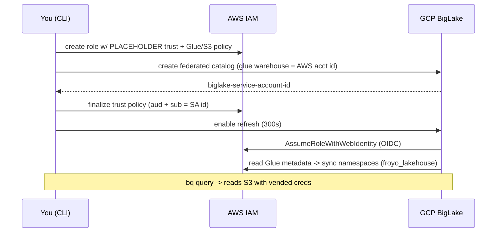

# Runbook — Froyo cross-cloud lakehouse demo

End-to-end steps, timing, and the demo talk-track. All commands assume you are in
the `bq_cross_cloud_lakehouse/` directory and have created `config.local.env`.

This is the self-contained, AWS-extended version of the Next '26 keynote demo
*"Raw data to forecasting in seconds with AI agents"*. It runs entirely from this
repo (BigQuery-only; Serverless Spark is an optional later upgrade).

## How the setup works (OIDC bootstrap)

The AWS role must trust a GCP service account that **doesn't exist until the
catalog is created**. So we create the role with a placeholder trust, create the
catalog to mint the service-account ID, finalize the trust, then enable refresh.



## Phase 1 — Tooling + guardrails (prep)

- Install AWS CLI v2, `aws configure` (region `us-east-1`, output `json`).
- `./aws/01_verify.sh` → confirms account + region.
- AWS guardrails (console, as root): root MFA, a **Zero-spend** budget, a **$1**
  monthly budget with email alerts, and **Cost Anomaly Detection** enabled.
- GCP guardrails: a budget + alert; enable APIs with
  `gcloud services enable biglake.googleapis.com bigquery.googleapis.com`;
  confirm Preview access with
  `gcloud alpha biglake iceberg catalogs list --project=<PROJECT>`.

## Phase 2 — AWS Iceberg dataset

```bash
./aws/10_s3_glue.sh                 # bucket + froyo_lakehouse Glue database
./aws/11_iceberg_tables_athena.sh   # global_loyalty + sales_history (Iceberg) + seed data
./aws/20_iam_role.sh
```

## Phase 3 — Federation

```bash
./gcp/10_create_federated_catalog.sh          # note the printed BigLake SA ID
./aws/30_update_trust_policy.sh <BIGLAKE_SA_ID>
sleep 120                                      # let AWS IAM trust propagate
./gcp/20_enable_refresh.sh
./gcp/30_verify.sh                             # expect namespace: froyo_lakehouse + both tables
```

The first metadata refresh can take a minute or two — re-run `./gcp/30_verify.sh`
until `froyo_lakehouse` and both tables appear.

## Phase 4 — Native knowledge + demo

```bash
./gcp/05_seed_native_bq.sh          # deterministic allergen/recipe/product knowledge
# ./gcp/06_knowledge_catalog.sh     # OPTIONAL: real Dataplex PDF extraction (no Spark, ~20m)
./gcp/40_query_froyo.sh             # allergen find + cross-cloud target list
./gcp/50_forecast_bqml.sh           # BQML ARIMA_PLUS Q3 forecast on AWS-resident data
```

## Demo talk-track (~6 min)

1. **The problem — dark data.** "Midnight Swirl is trending. Is it safe? Search
   the recipe PDF for *soy* → nothing. But the allergen is hidden in a *supplier*
   datasheet, buried across hundreds of PDFs."
2. **Knowledge Catalog.** Run `gcp/05` (or the live `gcp/06`). "AI extracted the
   supplier datasheets into BigQuery. `Q2` shows Midnight Base 204 → **Soy**, with
   the exact source document — knowledge no keyword search would surface."
3. **Cross-cloud target list (`Q3`).** "Now the payoff: our customer-loyalty data
   physically lives in **AWS S3** as Iceberg. This is a single BigQuery query
   joining GCP-native allergen knowledge with AWS-resident loyalty data — building
   a Midnight Swirl campaign list that **excludes soy-sensitive customers**."
   - "No data moved. No AWS keys in Google Cloud — BigLake assumes an AWS IAM role
     over OIDC and reads S3 with short-lived vended credentials."
4. **Forecast (`gcp/50`).** "Finally, BigQuery ML `ARIMA_PLUS` — trained *directly
   on the AWS-resident* `sales_history` — projects Q3 revenue per region. Raw,
   multi-cloud data to a forecast, in SQL."
5. **Close.** "Hidden risk found in dark data, multi-cloud data joined with zero
   ETL, and a forecast built with zero manual code — all from BigQuery."

## Phase 5 — Teardown (optional; only when you want to stop spend)

```bash
./gcp/90_teardown.sh   # native dataset + BQML model, DataScan, connection, PDF bucket, catalog
./aws/90_teardown.sh   # Iceberg tables, Glue DB, S3 bucket, IAM role
```

Then, to fully stop spend / rotate the demo credential: delete the demo IAM user
(commands printed by `aws/90_teardown.sh`), keep the AWS budget + anomaly alerts a
few days, and confirm `$0` in AWS Cost Explorer the next day.

## Troubleshooting

- **`froyo_lakehouse` not listed after refresh** — expected while IAM propagates;
  re-run `./gcp/20_enable_refresh.sh` then `./gcp/30_verify.sh`. A dropped/recreated
  Iceberg table also needs one refresh cycle before BigQuery sees the new metadata.
- **`AccessDenied` on refresh** — recheck the trust policy `aud`/`sub` both equal
  the BigLake SA ID, and that the permissions policy covers the bucket + Glue.
- **BQML forecast fails to read the federated table** — confirm the catalog is
  synced (Phase 3) and everything is in `us-east4`; as a fallback, `SELECT` the
  `sales_history` rows into a `us-east4` staging table and train on that.
- **DataScan rejects the payload (`gcp/06`)** — preview API shapes vary. The live
  v1 discovery API expects `bigqueryPublishingConfig.tableType=BIGLAKE` +
  `storageConfig.unstructuredDataOptions.semanticInferenceEnabled=true` (not
  `OBJECT_TABLE` / `unstructuredDataEventsConfig`, and not `entity_inference_enabled`).
- **`datascans run` fails with `INVALID_ARGUMENT: ... does not exist` (`gcp/06`)** —
  create is async; the scan is `state=CREATING` for a bit and `describe` succeeds
  before it's runnable. Wait until `state=ACTIVE` (the script now polls for this)
  before running.
- **Discovery job fails "unable to acquire necessary resources" (`gcp/06`)** —
  transient regional capacity error; just rerun. The script auto-retries once.
- **No "Extract with SQL" in the Insights tab (`gcp/06`)** — semantic extraction is
  console-only and region-gated in preview (e.g. `us-east4` shows only *Manage
  discovery scan settings* / *Generate insights*). The object table is still
  published; use the `gcp/05` seed as the grounded stand-in until it's available.
- Preview support: biglake-help@google.com

## References

- [About cross-cloud Lakehouse](https://docs.cloud.google.com/lakehouse/docs/about-cross-cloud-lakehouse)
- [Set up cross-cloud Lakehouse for AWS Glue](https://docs.cloud.google.com/lakehouse/docs/set-up-cross-cloud-lakehouse-aws-glue)
- [Use catalog federation](https://docs.cloud.google.com/lakehouse/docs/use-catalog-federation)
- [Credential vending](https://docs.cloud.google.com/lakehouse/docs/credential-vending)
- [Knowledge Catalog: insights for unstructured data](https://docs.cloud.google.com/dataplex/docs/data-insights-unstructured-data)
- [BigQuery ML ARIMA_PLUS](https://docs.cloud.google.com/bigquery/docs/reference/standard-sql/bigqueryml-syntax-create-time-series)
