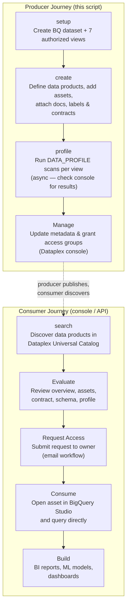

# Dataplex Data Product Demo — TheLook E-Commerce

Automates the creation of three [Dataplex Data Products](https://cloud.google.com/dataplex/docs/data-products-overview)
backed by the public `bigquery-public-data.thelook_ecommerce` dataset.

---

## What is a Dataplex Data Product?

A **Dataplex Data Product** (Preview) packages BigQuery tables and views into a
logical, curated unit in Dataplex Universal Catalog. Key capabilities:

| Capability | What it means |
|---|---|
| **Discoverable** | Searchable via Universal Catalog with keywords or natural language |
| **Trusted** | Contracts define refresh cadence so consumers know when data is updated |
| **Accessible** | Access groups map Google Groups to IAM roles for self-service access |
| **Documented** | Rich-text documentation and sample queries embedded in the catalog |

### Key concepts

| Term | Description |
|------|-------------|
| **Data Product** | Logical grouping of assets solving a specific business problem |
| **Asset** | Pointer to a BigQuery table or view (max 10 per product) |
| **Access Group** | Google Group mapped to IAM roles (max 3 per product) |
| **Contract** | SLA aspect defining refresh cadence and threshold |
| **Aspect** | Structured metadata block (overview, refresh-cadence, geo-context, etc.) |

### Limitations (Preview)

- Assets and data product must be in the same GCP location
- Max 10 assets per data product
- Max 50 data products per project per region
- Max 3 access groups per data product
- The asset creator must hold `getIamPolicy` and `setIamPolicy` on the BQ resource

---

## Critical User Journey



> The producer journey is fully automated by this script. The consumer journey
> starts at `search` — either via `uv run create_data_products.py search` or
> directly in the [Dataplex Universal Catalog](https://console.cloud.google.com/dataplex/dp-search).

---

## Why authorized views?

The Dataplex API requires `getIamPolicy` and `setIamPolicy` on every BigQuery
resource added as an asset. These permissions cannot be granted on
`bigquery-public-data` tables.

This demo solves that by creating **authorized views** in your own project that
are thin `SELECT *` wrappers over the public tables. You own the IAM on the
views; queries still read from the public dataset — zero data is copied, no
storage cost.

```
bigquery-public-data.thelook_ecommerce   ← source (public, read-only)
        │  SELECT *
        ▼
YOUR_PROJECT.thelook_ecommerce_demo      ← authorized views (you own IAM)
        │  asset resource name
        ▼
Dataplex Data Products                   ← discoverable, governed, documented
```

---

## Demo dataset: TheLook E-Commerce

`bigquery-public-data.thelook_ecommerce` — a fictitious online store (location: **US**).

### Three data products created by this demo

| Data Product | ID | Views (assets) | Refresh contract |
|---|---|---|---|
| **E-Commerce Sales** | `thelook-ecommerce-sales` | `orders`, `order_items` | Daily |
| **Product Catalog** | `thelook-product-catalog` | `products`, `inventory_items`, `distribution_centers` | Weekly |
| **Customer Analytics** | `thelook-customer-analytics` | `users`, `events` | Daily |

Each data product is provisioned with:
- Display name, description, and owner email
- Labels: `domain=ecommerce`, `team=data-platform`, `source=bigquery-public-data`
- BigQuery view assets linked via full resource names
- Rich-text documentation with sample SQL queries (ready to run in BigQuery Studio)
- Refresh-cadence contract aspect (`frequency`, `refresh_time`, `threshold`, `cron_schedule`)

---

## Prerequisites

| Requirement | Notes |
|-------------|-------|
| Python 3.10+ | Script uses modern type hint syntax |
| [`uv`](https://docs.astral.sh/uv/) | `brew install uv` |
| `gcloud` CLI | [Install guide](https://cloud.google.com/sdk/docs/install) |
| Dataplex & BigQuery APIs enabled | See [Required IAM roles](#required-iam-roles) |

### Required IAM roles

Grant these on your GCP project:

| Role | Purpose |
|------|---------|
| `roles/dataplex.dataProductsAdmin` | Create, update, delete data products and assets |
| `roles/dataplex.entryOwner` | Attach aspects (documentation, contract) |
| `roles/dataplex.catalogViewer` | Search and browse catalog assets |
| `roles/dataplex.catalogEditor` | Edit system aspects (overview, refresh-cadence) |
| `roles/bigquery.dataEditor` | Create the views dataset and views |

---

## Setup

```bash
# 1. Clone / navigate to the project
cd bq_data_product

# 2. Install dependencies
uv sync

# 3. Configure your project
cp .env.example .env
# Edit .env and fill in PROJECT_ID, PROJECT_NUMBER, LOCATION, SCAN_LOCATION, OWNER_EMAIL

# 4. Authenticate with Application Default Credentials
gcloud auth application-default login
```

### `.env` reference

```dotenv
# GCP project where data products will be created
PROJECT_ID=your-gcp-project-id

# Numeric project number (not the string ID)
# gcloud projects describe YOUR_PROJECT_ID --format="value(projectNumber)"
PROJECT_NUMBER=123456789012

# Dataplex location — must match the BQ dataset location
# bigquery-public-data.thelook_ecommerce is US multi-region → use "us"
LOCATION=us

# Location for DataScan resources (profile command).
# Must be a region — the DataScan API does not support multi-region endpoints.
# A regional scan can still scan US multi-region BQ resources.
SCAN_LOCATION=us-central1

# Owner email shown in Dataplex Universal Catalog
OWNER_EMAIL=you@example.com
```

> `.env` is listed in `.gitignore` and is never committed.

---

## Usage

### Full demo flow

```bash
# Phase 1: BigQuery views + Dataplex Data Products
uv run create_data_products.py setup create

# Phase 2: Data profile scans (async — check console for results)
uv run create_data_products.py profile

# Phase 3: Search the catalog (consumer discovery)
uv run create_data_products.py search

# Inspect deployed products
uv run create_data_products.py list

# Tear down data products + BQ views
uv run create_data_products.py cleanup

# Tear down profile scans (separately — scans take time to complete)
uv run create_data_products.py cleanup-scans
```

### Commands

| Command | Description |
|---|---|
| `setup` | Create the `thelook_ecommerce_demo` BigQuery dataset and 7 authorized views |
| `create` | Provision 3 Dataplex Data Products with assets, documentation, labels, and contracts |
| `profile` | Create and trigger 7 `DATA_PROFILE` DataScans (one per view) at `SCAN_LOCATION` |
| `search` | Search the Dataplex catalog for data products (demonstrates consumer discovery) |
| `list` | List data products in the configured project/location |
| `cleanup` | Delete data products and the BigQuery dataset/views |
| `cleanup-scans` | Delete all `thelook-profile-*` DataScans |

Multiple commands can be chained: `uv run create_data_products.py setup create`.

### Explore the results

After running commands, open these URLs (replace `YOUR_PROJECT`):

| Destination | URL |
|---|---|
| Dataplex Data Products | `https://console.cloud.google.com/dataplex/govern/data-products?project=YOUR_PROJECT` |
| Dataplex Data Scans | `https://console.cloud.google.com/dataplex/govern/data-scans?project=YOUR_PROJECT` |
| BigQuery Studio | `https://console.cloud.google.com/bigquery?project=YOUR_PROJECT` |

The script prints console URLs on completion of each command.

---

## Script design

```
create_data_products.py
│
├── Configuration (.env via python-dotenv)
│   └── PROJECT_ID, PROJECT_NUMBER, LOCATION, SCAN_LOCATION, OWNER_EMAIL
│
├── Auth
│   └── _get_access_token()       gcloud auth print-access-token (ADC)
│
├── LRO polling
│   └── _wait_for_lro()           exponential back-off, 120 s timeout
│
├── BigQuery helpers (REST)
│   ├── _create_bq_dataset()      POST /bigquery/v2/projects/.../datasets
│   ├── _create_bq_view()         POST .../tables  (authorized view)
│   └── _delete_bq_dataset()      DELETE ...?deleteContents=true
│
├── Dataplex Data Product helpers (REST)
│   ├── _create_data_product()    POST /v1/.../dataProducts  (with labels)
│   ├── _add_asset()              POST .../dataAssets
│   ├── _add_documentation()      PATCH .../entryGroups/@dataplex/entries (overview aspect)
│   ├── _add_contract()           PATCH .../entryGroups/@dataplex/entries (refresh-cadence aspect)
│   └── _delete_data_product()    DELETE assets first, then product (no cascading delete)
│
├── DataScan helpers (REST)
│   ├── _create_data_scan()       POST /v1/.../dataScans?data_scan_id=thelook-profile-{table}
│   ├── _trigger_data_scan()      POST .../dataScans/{id}:run
│   ├── _list_scan_ids()          GET /v1/.../dataScans  (filtered by prefix)
│   └── _delete_data_scan()       DELETE .../dataScans/{id}
│
└── Commands: setup | create | profile | search | list | cleanup | cleanup-scans
```

### LRO polling

Dataplex returns a long-running operation (LRO) for `create` and `delete` calls.
The script polls with exponential back-off (3 s → 6 s → 12 s → max 15 s) up to
a 120 s timeout.

### Cascading delete

The Dataplex API does not support cascading delete. `cleanup` removes each
asset individually (each as its own LRO), then deletes the now-empty product,
then drops the BigQuery dataset with `deleteContents=true`.

### Aspects and the entry URL

Documentation and the refresh-cadence contract are attached via the Dataplex
Universal Catalog entry that backs each data product. The entry ID uses
`PROJECT_NUMBER` (numeric), not `PROJECT_ID` (string):

```
projects/{PROJECT_NUMBER}/locations/{LOCATION}/dataProducts/{PRODUCT_ID}
```

---

## API reference

| Operation | Method | Endpoint |
|-----------|--------|----------|
| Create data product | `POST` | `/v1/projects/{p}/locations/{l}/dataProducts?data_product_id={id}` |
| Add asset | `POST` | `.../dataProducts/{id}/dataAssets?data_asset_id={aid}` |
| Attach aspect (docs / contract) | `PATCH` | `.../entryGroups/@dataplex/entries/{entry_id}?updateMask=aspects` |
| List data products | `GET` | `/v1/projects/{p}/locations/{l}/dataProducts` |
| Delete asset | `DELETE` | `.../dataAssets/{aid}` |
| Delete data product | `DELETE` | `.../dataProducts/{id}` |
| Create DataScan | `POST` | `/v1/projects/{p}/locations/{sl}/dataScans?data_scan_id={id}` |
| Trigger DataScan run | `POST` | `.../dataScans/{id}:run` |
| List DataScans | `GET` | `/v1/projects/{p}/locations/{sl}/dataScans` |
| Delete DataScan | `DELETE` | `.../dataScans/{id}` |
| Search catalog entries | `POST` | `/v1/projects/{p}/locations/global:searchEntries` |
| Poll LRO | `GET` | `/v1/{operation_name}` |

- `{l}` = `LOCATION` (e.g. `us`); `{sl}` = `SCAN_LOCATION` (e.g. `us-central1`)

Full reference: https://cloud.google.com/dataplex/docs/reference/rest/v1/projects.locations.dataProducts

---

## Customisation

To adapt this demo to a different dataset:

1. Update `.env` with your `PROJECT_ID`, `PROJECT_NUMBER`, `LOCATION`, `SCAN_LOCATION`, and `OWNER_EMAIL`.
2. Edit `_TABLES` and `DATA_PRODUCTS` in `create_data_products.py`.
3. Update `_SOURCE_PROJECT` / `_SOURCE_DATASET` to point at your source dataset.
4. Run `uv run create_data_products.py setup create`.
