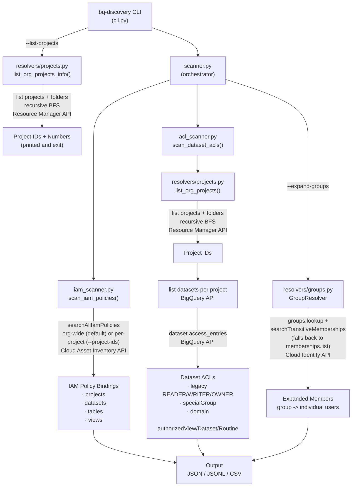

# bq-discovery

Audit who has access to what in BigQuery across your GCP organization —
individual users, groups, service accounts, and their specific roles — in a
single command.

## How it works

- Discovers all projects in your GCP organization (or scans a specific
  allowlist via `--project-ids`)
- Scans project-level, dataset-level, and table/view-level IAM policies via
  Cloud Asset Inventory — org-wide in a single call, or per-project when
  `--project-ids` is specified (avoids org-wide rate limits)
- Scans dataset legacy ACLs (READER/WRITER/OWNER, special groups, domains,
  authorized views) via the BigQuery API
- Optionally expands Google Group memberships to individual users via
  Cloud Identity
- Outputs JSON, JSONL, or CSV — ready for BigQuery import via `bq load`

## What it captures

| Source | Level | What's captured | Examples |
|--------|-------|-----------------|----------|
| Cloud Asset Inventory | Project | All IAM bindings on each project | `roles/owner`, `roles/editor`, `roles/bigquery.admin`, service agent roles |
| Cloud Asset Inventory | Dataset | IAM bindings on datasets | `roles/bigquery.dataViewer`, `roles/bigquery.dataOwner` |
| Cloud Asset Inventory | Table / View | IAM bindings on tables and views | `roles/bigquery.dataViewer` on a specific table |
| BigQuery API | Dataset ACLs | Legacy access control entries | `READER`, `WRITER`, `OWNER`, `specialGroup:projectOwners`, `domain:example.com`, authorized views/datasets/routines |
| Cloud Identity API | Group members | Individual users and service accounts inside Google Groups (opt-in via `--expand-groups`) | `group:team@corp.com` expanded to `user:alice@corp.com`, `serviceAccount:bot@project.iam.gserviceaccount.com` |

**Member types identified:** `user`, `group`, `serviceAccount`, `domain`,
`specialGroup` (allUsers, allAuthenticatedUsers, projectOwners, etc.),
`projectEditor`, `projectOwner`, `projectViewer`, `iamMember`,
`authorizedView`, `authorizedDataset`, `authorizedRoutine`

> **Note:** Project-level IAM captures *all* roles bound to the project, not
> just BigQuery-specific ones. Users and service accounts with `roles/editor`
> or `roles/owner` have implicit BigQuery access. Filter by role name in your
> analysis if you only need BigQuery-relevant bindings.

## Architecture



### Known Limitations

- Cloud Asset Inventory **cannot distinguish TABLE from VIEW** — both are
  indexed as `bigquery.googleapis.com/Table`. The `resource_type` field in
  output will show `table` for all table-level resources.
- Dataset ACL scan time scales linearly with the number of datasets. For large
  organizations, use `--skip-acls` to return IAM-only results in seconds.

## Prerequisites

### APIs to enable

| API | When required |
|-----|--------------|
| `cloudresourcemanager.googleapis.com` | Always (project/folder discovery) |
| `cloudasset.googleapis.com` | Always (IAM policy scan) |
| `bigquery.googleapis.com` | Unless `--skip-acls` |
| `cloudidentity.googleapis.com` | Only with `--expand-groups` |

Enable all at once:

```bash
gcloud services enable \
  cloudresourcemanager.googleapis.com \
  cloudasset.googleapis.com \
  bigquery.googleapis.com \
  cloudidentity.googleapis.com \
  --project=YOUR_PROJECT_ID
```

### IAM roles required

#### Org-wide scan (default)

All roles granted at the **organization level**:

| Role | Purpose |
|------|---------|
| `roles/cloudasset.viewer` | Search IAM policies org-wide (includes project-level IAM) |
| `roles/browser` | List projects and folders |
| `roles/bigquery.metadataViewer` | List datasets and read dataset ACLs |
| `roles/cloudidentity.groupsViewer` | Resolve group memberships (`--expand-groups` only) |

```bash
ORG_ID=YOUR_ORG_ID
MEMBER=user:you@example.com

gcloud organizations add-iam-policy-binding $ORG_ID \
  --member=$MEMBER --role=roles/cloudasset.viewer

gcloud organizations add-iam-policy-binding $ORG_ID \
  --member=$MEMBER --role=roles/browser

gcloud organizations add-iam-policy-binding $ORG_ID \
  --member=$MEMBER --role=roles/bigquery.metadataViewer
```

#### Single-project scan (`--project-ids`)

When scanning specific projects, `roles/cloudasset.viewer` and
`roles/bigquery.metadataViewer` can be granted at the **project level**
instead of org level. `roles/browser` is not required (project discovery
is skipped when `--project-ids` is specified).

| Role | Level | Purpose |
|------|-------|---------|
| `roles/cloudasset.viewer` | Project | Search IAM policies within the project |
| `roles/bigquery.metadataViewer` | Project | List datasets and read dataset ACLs |
| `roles/serviceusage.serviceUsageConsumer` | Project | Required by Python client libraries for API quota |

```bash
PROJECT_ID=YOUR_PROJECT_ID
MEMBER=user:you@example.com

gcloud projects add-iam-policy-binding $PROJECT_ID \
  --member=$MEMBER --role=roles/cloudasset.viewer

gcloud projects add-iam-policy-binding $PROJECT_ID \
  --member=$MEMBER --role=roles/bigquery.metadataViewer

gcloud projects add-iam-policy-binding $PROJECT_ID \
  --member=$MEMBER --role=roles/serviceusage.serviceUsageConsumer
```

## Installation

Requires Python 3.12+ and [uv](https://docs.astral.sh/uv/).

```bash
git clone <repo>
cd bq_discovery
uv sync
```

## Usage

### Recommended workflows

Follow this progression — start broad to understand scope, then narrow and
deepen as needed:

```
Step 0: Discover projects        --list-projects
Step 1: Quick IAM audit          --skip-acls
Step 2: Full audit (recommended) (default, no flags)
Step 3: Resolve group members    --expand-groups
```

| Step | Scenario | Flags | What you get | Time |
|------|----------|-------|--------------|------|
| 0 | **Discover projects** — find all project IDs/numbers in the org | `--list-projects` | Printed table of project IDs and numbers; use to build `--project-ids` allowlist | ~3-5s |
| 1 | **Quick IAM audit** — who has IAM access? | `--skip-acls` | IAM policy bindings for projects, datasets, tables, and views via Cloud Asset Inventory (org-wide, or per-project when `--project-ids` is set — avoids rate limits) | ~1-2s |
| 2 | **Full audit** — complete picture | *(default)* | Step 1 + dataset ACLs: legacy READER/WRITER/OWNER, specialGroups, domains, authorized views/datasets/routines | ~1 min per 50 datasets |
| 3 | **Full audit + group resolution** — see actual humans behind groups | `--expand-groups` | Step 2 + each `group:` entry expanded to individual `user:` entries via Cloud Identity | Adds ~1s per group |

#### Scoping options

Combine with any step above to narrow the scan:

| Option | Flags | Use case |
|--------|-------|----------|
| Specific projects only | `--project-ids proj-a,proj-b,proj-c` | Run Step 0 first to find IDs, then pass them here |
| Skip project-level IAM | `--resource-types dataset,table,view` | Exclude broad project roles (editor/owner), focus on BQ-specific permissions |
| Datasets only | `--resource-types dataset` | Focus on dataset-level permissions only |

### Examples

```bash
# Step 0: Discover all projects in the org
env -u GOOGLE_APPLICATION_CREDENTIALS \
  uv run bq-discovery --org-id YOUR_ORG_ID --list-projects

# Step 1: Quick IAM audit (~1-2 seconds)
env -u GOOGLE_APPLICATION_CREDENTIALS \
  uv run bq-discovery --org-id YOUR_ORG_ID --skip-acls -v -o reports/results.jsonl --format jsonl

# Step 2: Full audit — IAM policies + dataset ACLs (recommended)
env -u GOOGLE_APPLICATION_CREDENTIALS \
  uv run bq-discovery --org-id YOUR_ORG_ID -v -o reports/results.json

# Step 3: Full audit + expand group memberships to individual users
env -u GOOGLE_APPLICATION_CREDENTIALS \
  uv run bq-discovery --org-id YOUR_ORG_ID --expand-groups -v -o reports/results.csv --format csv

# Scoped: scan specific projects only (use Step 0 output to build this list)
env -u GOOGLE_APPLICATION_CREDENTIALS \
  uv run bq-discovery --org-id YOUR_ORG_ID \
  --project-ids proj-a,proj-b,proj-c \
  -v -o reports/results.jsonl --format jsonl

# Scoped: BigQuery-specific permissions only (exclude project-level IAM)
env -u GOOGLE_APPLICATION_CREDENTIALS \
  uv run bq-discovery --org-id YOUR_ORG_ID \
  --resource-types dataset,table,view -v -o reports/results.json
```

### Loading into BigQuery

The JSONL and CSV formats are designed for direct `bq load` import. By
convention, name the table after the JSONL file with hyphens replaced by
underscores (e.g., `my-project-id.jsonl` → table `my_project_id`).

```bash
# Create the dataset (first time only)
bq mk --project_id=MY_PROJECT MY_DATASET

# Load JSONL into BigQuery (auto-detect schema)
bq load \
  --project_id=MY_PROJECT \
  --source_format=NEWLINE_DELIMITED_JSON \
  --autodetect \
  --replace \
  MY_PROJECT:MY_DATASET.my_project_id \
  reports/my-project-id.jsonl

# Load CSV into BigQuery (auto-detect schema, skip header row)
bq load \
  --project_id=MY_PROJECT \
  --source_format=CSV \
  --autodetect \
  --replace \
  --skip_leading_rows=1 \
  MY_PROJECT:MY_DATASET.my_project_id \
  reports/my-project-id.csv
```

### Sample queries

Replace `MY_PROJECT.MY_DATASET.my_project_id` with your actual table reference.

```sql
-- Permission summary by resource type and source
SELECT resource_type, source, COUNT(*) AS cnt
FROM `MY_PROJECT.MY_DATASET.my_project_id`
GROUP BY 1, 2
ORDER BY 1, 2;

-- All human users with direct access (excludes service accounts and groups)
SELECT DISTINCT member, role, resource_type, dataset_id, resource_id
FROM `MY_PROJECT.MY_DATASET.my_project_id`
WHERE member_type = 'user'
ORDER BY member, resource_type;

-- Datasets accessible by external domains or allUsers/allAuthenticatedUsers
SELECT dataset_id, member, member_type, role
FROM `MY_PROJECT.MY_DATASET.my_project_id`
WHERE member_type IN ('domain', 'specialGroup')
  AND resource_type = 'dataset'
ORDER BY dataset_id;

-- Who has broad project-level access (owner/editor/admin)?
SELECT member, member_type, role
FROM `MY_PROJECT.MY_DATASET.my_project_id`
WHERE resource_type = 'project'
  AND role IN ('roles/owner', 'roles/editor', 'roles/bigquery.admin')
ORDER BY role, member;
```

### Understanding the results

The output is a **complete list of every principal that can read data from
the scanned project's BigQuery resources**. Critically, BigQuery separates
*data access* from *compute*: a user only needs to appear in this list to
query the data — they can run that query job from **any** GCP project where
they have `bigquery.jobs.create` (e.g. `roles/bigquery.user` or
`roles/bigquery.jobUser`). They do not need to be a member of the scanned
project to issue queries against it.

BigQuery IAM follows a hierarchy: **project → dataset → table**.
Access granted at a higher level cascades to all resources below it.

| `resource_type` | `resource_id` | What it means |
|-----------------|---------------|---------------|
| `project` | null | Roles bound to the project — cascades to all datasets and tables |
| `dataset` | null | Roles/ACLs on the dataset — cascades to all tables within |
| `table` | table or view ID | Roles granted directly on a specific table or view |

A project with hundreds of tables but only a few `table`-level entries is
normal — most access is granted at the project or dataset level. To see
how many actual tables exist compared to direct table-level grants:

```sql
-- Count actual tables/views in the scanned project
-- Replace SCANNED_PROJECT and REGION (e.g. region-eu, region-us)
SELECT table_schema AS dataset_id, table_type, COUNT(*) AS cnt
FROM `SCANNED_PROJECT`.`REGION`.INFORMATION_SCHEMA.TABLES
GROUP BY 1, 2
ORDER BY 1, 2;

-- Compare with direct table-level grants from the scan
SELECT resource_id, dataset_id, role, member
FROM `MY_PROJECT.MY_DATASET.my_project_id`
WHERE resource_type = 'table'
ORDER BY dataset_id, resource_id;
```

### CLI reference

| Flag | Default | Description |
|------|---------|-------------|
| `--org-id` | required | GCP organization ID (numeric) |
| `--list-projects` | false | List all projects (ID + number) and exit; no scan performed |
| `--skip-acls` | false | Skip dataset ACL scan; return IAM policies only |
| `--resource-types` | `project,dataset,table,view` | Comma-separated resource types to scan |
| `--project-ids` | discover from org | Comma-separated project IDs to limit scope (allowlist) |
| `--expand-groups` | false | Expand group memberships to individual users |
| `--format` | `json` | Output format: `json`, `jsonl`, or `csv` |
| `--output`, `-o` | stdout | Output file path |
| `--verbose`, `-v` | warning | `-v` INFO, `-vv` DEBUG |

## Output formats

### JSON (default)

Pretty-printed with a metadata block and entries array. Best for human
inspection.

```json
{
  "metadata": {
    "organization_id": "750756831972",
    "strategy": "hybrid",
    "scanned_at": "2026-03-09T12:00:00+00:00",
    "projects_scanned": 2,
    "datasets_scanned": 53,
    "resources_scanned": 3,
    "groups_expanded": 0,
    "errors": []
  },
  "entries": [
    {
      "project_id": "my-project",
      "dataset_id": "",
      "resource_id": null,
      "resource_type": "project",
      "role": "roles/editor",
      "member": "user:alice@example.com",
      "member_type": "user",
      "source": "iam_policy",
      "inherited_from_group": null
    },
    {
      "project_id": "my-project",
      "dataset_id": "my_dataset",
      "resource_id": null,
      "resource_type": "dataset",
      "role": "READER",
      "member": "group:analysts@example.com",
      "member_type": "group",
      "source": "dataset_acl",
      "inherited_from_group": null
    }
  ]
}
```

### JSONL (`--format jsonl`)

One JSON object per line. `organization_id` and `scanned_at` are denormalized
into every row. Compatible with `bq load --source_format=NEWLINE_DELIMITED_JSON`.

```
{"organization_id": "750756831972", "scanned_at": "2026-03-09T12:00:00+00:00", "project_id": "my-project", "dataset_id": "", "resource_id": null, "resource_type": "project", "role": "roles/editor", "member": "user:alice@example.com", "member_type": "user", "source": "iam_policy", "inherited_from_group": null}
{"organization_id": "750756831972", "scanned_at": "2026-03-09T12:00:00+00:00", "project_id": "my-project", "dataset_id": "my_dataset", "resource_id": null, "resource_type": "dataset", "role": "READER", "member": "group:analysts@example.com", "member_type": "group", "source": "dataset_acl", "inherited_from_group": null}
```

### CSV (`--format csv`)

Standard CSV with header row. `organization_id` and `scanned_at` are
denormalized into every row. Compatible with
`bq load --source_format=CSV --skip_leading_rows=1`.

```
organization_id,scanned_at,project_id,dataset_id,resource_id,resource_type,role,member,member_type,source,inherited_from_group
750756831972,2026-03-09T12:00:00+00:00,my-project,,,project,roles/editor,user:alice@example.com,user,iam_policy,
750756831972,2026-03-09T12:00:00+00:00,my-project,my_dataset,,dataset,READER,group:analysts@example.com,group,dataset_acl,
```

### Field reference

| Field | Description |
|-------|-------------|
| `project_id` | GCP project ID |
| `dataset_id` | BigQuery dataset ID; empty string for project-level IAM entries |
| `resource_id` | Table or view ID; null for dataset/project-level entries |
| `resource_type` | `project`, `dataset`, `table`, or `view` (see known limitations for table vs view) |
| `role` | IAM role (e.g. `roles/bigquery.dataViewer`) or ACL role (`READER`, `WRITER`, `OWNER`) |
| `member` | IAM member string or formatted ACL identity |
| `member_type` | `user`, `group`, `serviceAccount`, `domain`, `specialGroup`, `authorizedView`, `authorizedDataset`, `authorizedRoutine` |
| `source` | `iam_policy` (from Cloud Asset Inventory) or `dataset_acl` (from BigQuery ACL) |
| `inherited_from_group` | Group email if expanded from a group; null otherwise (only with `--expand-groups`) |

## Troubleshooting

**Linked/external datasets**

Some datasets (e.g. Analytics Hub linked datasets) may behave unexpectedly.
The ACL scanner reads dataset-level access entries via `get_dataset`, which
works for linked datasets. If a dataset returns errors, it is logged as a
warning and skipped.

**Large organizations are slow with `--expand-groups`**

Group resolution uses the Cloud Identity API and makes one API call per group.
With many groups, this adds significant latency. Run without `--expand-groups`
first to get a baseline.

**External groups return 403 on group expansion**

Groups outside your organization's Cloud Identity domain (e.g. `@google.com`
groups in a non-Google org) will return a 403 permission denied error during
group lookup. This is expected and logged as a warning; those groups are skipped
and their members are not expanded.

## Development

```bash
# Format and lint
uv run ruff format bq_discovery/ tests/
uv run ruff check bq_discovery/ tests/

# Run tests
uv run pytest
```
