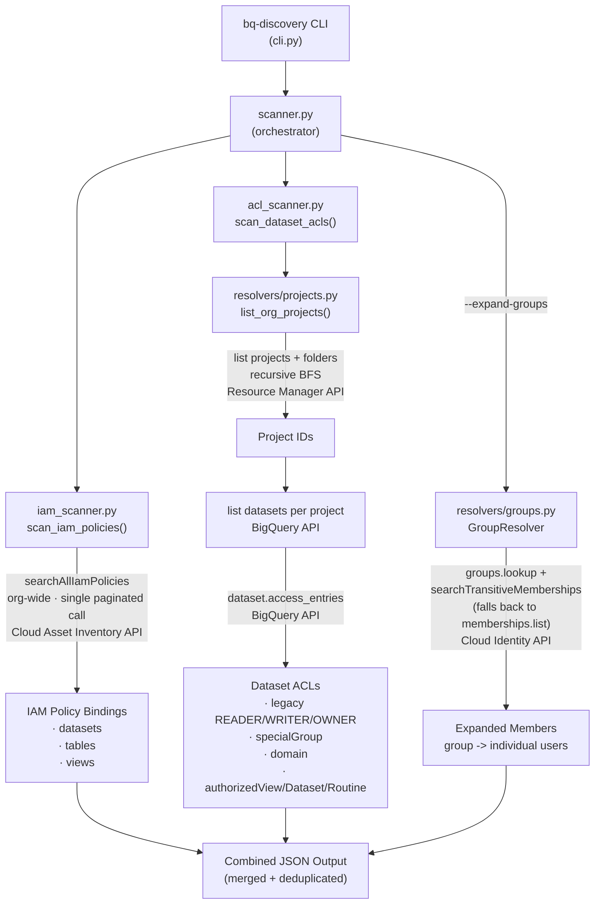

# bq-discovery

Scans BigQuery permission access (datasets, tables, views) across all projects
in a GCP organization. Combines two complementary data sources for complete
coverage:

- **Cloud Asset Inventory** — fast, org-wide IAM policy scan in a single API
  call.
- **Direct BigQuery API** — dataset ACL scan covering legacy bindings, special
  groups, domains, and authorized views/datasets/routines that Cloud Asset
  Inventory does not expose.

## Architecture



### Known Limitations

- Cloud Asset Inventory **cannot distinguish TABLE from VIEW** — both are
  indexed as `bigquery.googleapis.com/Table`. The `resource_type` field in
  output will show `table` for all table-level resources.
- Dataset ACL scan time scales linearly with the number of datasets. For large
  organizations, use `--skip-acls` to return IAM-only results in seconds.

## Prerequisites

### APIs to enable

| API | When required |
|-----|--------------|
| `cloudresourcemanager.googleapis.com` | Always (project/folder discovery) |
| `cloudasset.googleapis.com` | Always (IAM policy scan) |
| `bigquery.googleapis.com` | Unless `--skip-acls` |
| `cloudidentity.googleapis.com` | Only with `--expand-groups` |

Enable all at once:

```bash
gcloud services enable \
  cloudresourcemanager.googleapis.com \
  cloudasset.googleapis.com \
  bigquery.googleapis.com \
  cloudidentity.googleapis.com \
  --project=YOUR_PROJECT_ID
```

### IAM roles required

All roles must be granted at the **organization level**.

| Role | Purpose |
|------|---------|
| `roles/cloudasset.viewer` | Search IAM policies org-wide |
| `roles/browser` | List projects and folders |
| `roles/bigquery.metadataViewer` | List datasets and read dataset ACLs |
| `roles/cloudidentity.groupsViewer` | Resolve group memberships (`--expand-groups` only) |

Grant at org level:

```bash
ORG_ID=YOUR_ORG_ID
MEMBER=user:you@example.com

gcloud organizations add-iam-policy-binding $ORG_ID \
  --member=$MEMBER --role=roles/cloudasset.viewer

gcloud organizations add-iam-policy-binding $ORG_ID \
  --member=$MEMBER --role=roles/browser

gcloud organizations add-iam-policy-binding $ORG_ID \
  --member=$MEMBER --role=roles/bigquery.metadataViewer
```

### Authentication

Use Application Default Credentials (ADC) authenticated as a principal with
the roles above:

```bash
gcloud auth application-default login
```

> **Important:** If `GOOGLE_APPLICATION_CREDENTIALS` is set to a service
> account key that lacks org-level roles, unset it before running:
>
> ```bash
> env -u GOOGLE_APPLICATION_CREDENTIALS bq-discovery --org-id YOUR_ORG_ID
> ```

## Installation

Requires Python 3.12+ and [uv](https://docs.astral.sh/uv/).

```bash
git clone <repo>
cd bq_discovery
uv sync
```

## Usage

### Recommended workflows

Start narrow and expand as needed:

```
Step 1: Quick IAM audit          --skip-acls
Step 2: Full audit (recommended) (default, no flags)
Step 3: Resolve group members    --expand-groups
```

| Step | Scenario | Flags | What you get | Time |
|------|----------|-------|--------------|------|
| 1 | **Quick audit** — who has IAM access? | `--skip-acls` | IAM policy bindings for all datasets, tables, and views org-wide via Cloud Asset Inventory | ~1-2s |
| 2 | **Full audit** — complete picture | *(default)* | Step 1 + dataset ACLs: legacy READER/WRITER/OWNER, specialGroups, domains, authorized views/datasets/routines | ~1 min per 50 datasets |
| 3 | **Full audit + group resolution** — see actual humans behind groups | `--expand-groups` | Step 2 + each `group:` entry expanded to individual `user:` entries via Cloud Identity | Adds ~1s per group |

#### Scoping options

Combine with any step above to narrow the scan:

| Option | Flags | Use case |
|--------|-------|----------|
| Specific projects only | `--project-ids proj-a,proj-b` | Large org, only care about certain projects |
| Datasets only | `--resource-types dataset` | Skip table/view-level IAM, focus on dataset permissions |

### Examples

```bash
# Step 1: Quick IAM audit (~1-2 seconds)
env -u GOOGLE_APPLICATION_CREDENTIALS \
  uv run bq-discovery --org-id YOUR_ORG_ID --skip-acls -v -o results_iam.json

# Step 2: Full audit — IAM policies + dataset ACLs (recommended)
env -u GOOGLE_APPLICATION_CREDENTIALS \
  uv run bq-discovery --org-id YOUR_ORG_ID -v -o results.json

# Step 3: Full audit + expand group memberships to individual users
env -u GOOGLE_APPLICATION_CREDENTIALS \
  uv run bq-discovery --org-id YOUR_ORG_ID --expand-groups -v -o results.json

# Scoped: scan specific projects only
env -u GOOGLE_APPLICATION_CREDENTIALS \
  uv run bq-discovery --org-id YOUR_ORG_ID \
  --project-ids proj-a,proj-b -v -o results.json

# Scoped: dataset permissions only (skip table/view IAM)
env -u GOOGLE_APPLICATION_CREDENTIALS \
  uv run bq-discovery --org-id YOUR_ORG_ID \
  --resource-types dataset -v
```

### CLI reference

| Flag | Default | Description |
|------|---------|-------------|
| `--org-id` | required | GCP organization ID (numeric) |
| `--skip-acls` | false | Skip dataset ACL scan; return IAM policies only |
| `--resource-types` | `dataset,table,view` | Comma-separated resource types to scan |
| `--project-ids` | discover from org | Comma-separated project IDs to limit scope |
| `--expand-groups` | false | Expand group memberships to individual users |
| `--output`, `-o` | stdout | Output file path for JSON |
| `--verbose`, `-v` | warning | `-v` INFO, `-vv` DEBUG |

## Output format

```json
{
  "metadata": {
    "organization_id": "750756831972",
    "strategy": "hybrid",
    "scanned_at": "2026-03-09T12:00:00+00:00",
    "projects_scanned": 2,
    "datasets_scanned": 53,
    "resources_scanned": 419,
    "groups_expanded": 0,
    "errors": []
  },
  "entries": [
    {
      "project_id": "my-project",
      "dataset_id": "my_dataset",
      "resource_id": null,
      "resource_type": "dataset",
      "role": "READER",
      "member": "group:analysts@example.com",
      "member_type": "group",
      "source": "dataset_acl",
      "inherited_from_group": null
    }
  ]
}
```

### Field reference

| Field | Description |
|-------|-------------|
| `resource_type` | `dataset`, `table`, or `view` (see known limitations) |
| `role` | IAM role (`roles/bigquery.dataViewer`) or ACL role (`READER`, `WRITER`, `OWNER`) |
| `member` | IAM member string or formatted ACL identity |
| `member_type` | `user`, `group`, `serviceAccount`, `domain`, `specialGroup`, `authorizedView`, `authorizedDataset`, `authorizedRoutine` |
| `source` | `iam_policy` or `dataset_acl` |
| `inherited_from_group` | Group email if this entry was expanded from a group (only with `--expand-groups`) |

## Troubleshooting

**`GOOGLE_APPLICATION_CREDENTIALS` overrides ADC**

If the env var points to a service account key without org-level roles, all
org-level API calls will fail with 403. Unset it:

```bash
env -u GOOGLE_APPLICATION_CREDENTIALS uv run bq-discovery --org-id ...
```

**Linked/external datasets**

Some datasets (e.g. Analytics Hub linked datasets) may behave unexpectedly.
The ACL scanner reads dataset-level access entries via `get_dataset`, which
works for linked datasets. If a dataset returns errors, it is logged as a
warning and skipped.

**Large organizations are slow with `--expand-groups`**

Group resolution uses the Cloud Identity API and makes one API call per group.
With many groups, this adds significant latency. Run without `--expand-groups`
first to get a baseline.

## Development

```bash
# Format and lint
uv run ruff format src/
uv run ruff check src/

# Run tests (if present)
uv run pytest
```
