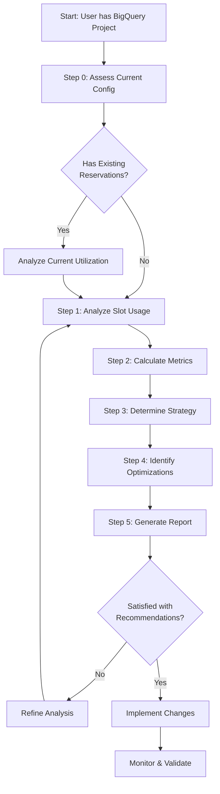
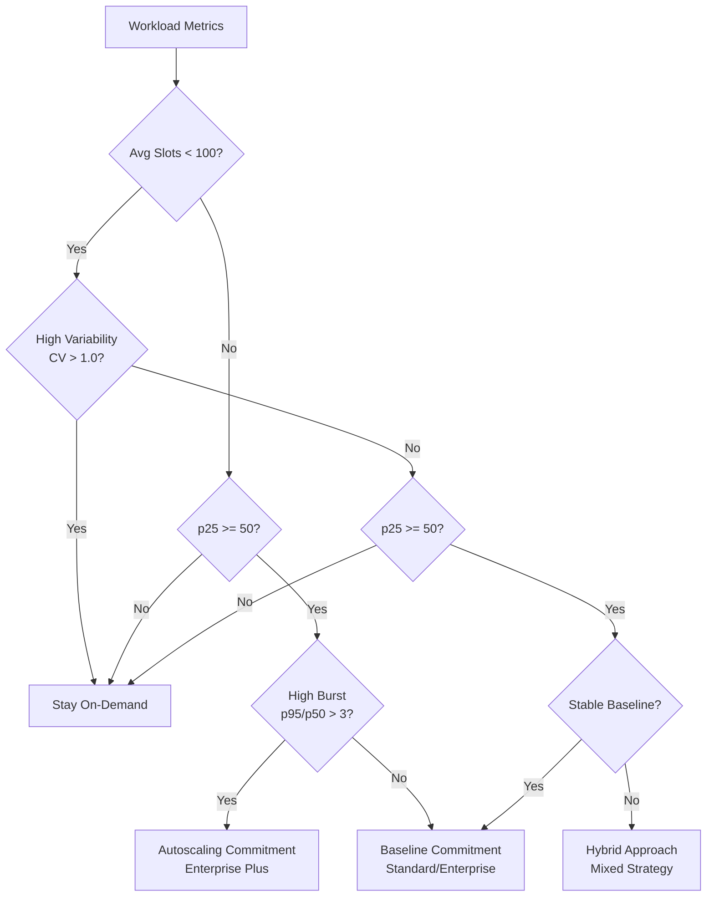

# BigQuery Slot Optimization Framework

A comprehensive framework for analyzing BigQuery slot utilization and optimizing workload performance.

## Overview

This framework helps BigQuery administrators and data platform teams make data-driven decisions about workload management strategies. By analyzing historical usage patterns, it recommends the optimal approach: staying on-demand, committing to baseline slots, using autoscaling, or implementing a hybrid strategy.

### What This Framework Does

- Analyzes 30 days of BigQuery slot usage patterns
- Assesses current reservation configurations (if any)
- Calculates workload stability and burstiness metrics
- Recommends optimal workload management strategy based on performance characteristics
- Identifies specific performance optimization opportunities
- Generates detailed reports for stakeholder review

### Who Should Use This

- BigQuery administrators managing multi-project environments
- Data platform engineers planning capacity
- Performance optimization teams
- Organizations with significant BigQuery compute workloads

### Expected Outcomes

- Clear understanding of current slot utilization patterns
- Data-backed recommendation for workload management strategy
- Identification of performance optimization opportunities
- Actionable implementation plan with specific commands
- Baseline for ongoing monitoring and optimization

## Thought Process

### Why Slot Optimization Matters

BigQuery offers multiple workload management models:
- **On-Demand (PAYG):** Flexible capacity, scales automatically
- **Flat-Rate Commitments:** Dedicated capacity, predictable performance
- **Autoscaling:** Dynamic capacity adjustment (Enterprise Plus edition)

Choosing the wrong model can result in:
- **Resource Waste:** Paying for committed slots that sit idle
- **Performance Issues:** Insufficient capacity during peak loads causing query slowdowns
- **Slot Contention:** Queries competing for limited resources

### Analysis Methodology

The framework follows a systematic approach:



### Decision Framework Logic

The recommendation engine uses two key metrics:

**1. Coefficient of Variation (CV) = stddev / avg**
- Measures workload stability
- Low CV (<0.5): Stable, predictable workload
- High CV (>1.0): Variable, unpredictable workload

**2. Burst Ratio = p95 / p50**
- Measures peak intensity
- Low ratio (<2): Consistent usage
- High ratio (>4): Significant spikes

These metrics drive the decision tree:



## How to Use

### Prerequisites

Before starting the analysis, ensure you have:

- [ ] BigQuery Resource Viewer role (`roles/bigquery.resourceViewer`)
- [ ] Access to `INFORMATION_SCHEMA.JOBS_BY_PROJECT` and `INFORMATION_SCHEMA.JOBS_TIMELINE_BY_PROJECT`
- [ ] Project ID where compute occurs
- [ ] Region where compute occurs (e.g., `us`, `eu`, `asia-northeast1`)
- [ ] AI assistant with MCP server access (bigquery-data-analytics, bigquery-conversational-analytics)

### Step-by-Step Instructions

**Step 1: Prepare Your Request**

Provide your AI assistant with the following information:

```
Based on the guidance in 'bq_finops_cookbook/finops_prompt.md', please help me analyze
my project [YOUR_PROJECT_ID], which has compute and storage in the [YOUR_REGION] region.

Please list your plan before execution.
```

**Step 2: Review the Analysis Plan**

The AI assistant will outline the analysis steps:
- Step 0: Assess current configuration
- Step 1: Analyze slot usage patterns
- Step 2: Calculate workload metrics
- Step 3: Recommend strategy
- Step 4: Identify optimizations
- Step 5: Generate reports

**Step 3: Execute the Analysis**

The AI assistant will:
1. Run SQL queries against your project's INFORMATION_SCHEMA
2. Calculate stability and burstiness metrics
3. Analyze current reservations (if any)
4. Identify optimization opportunities
5. Generate detailed reports

**Step 4: Review Generated Reports**

Reports will be created in the `analysis_results/` directory:
- `00_current_configuration.md` - Current reservation setup (if applicable)
- `01_slot_metrics.md` - Percentiles, variability, burstiness
- `02_top_consumers.md` - Project breakdown
- `03_usage_patterns.md` - Hourly/daily patterns
- `04_optimization_opportunities.md` - Contention, expensive queries, performance insights
- `05_final_recommendation.md` - Strategy and implementation plan

**Step 5: Implement Recommendations**

Follow the implementation steps in the final recommendation report. This typically includes:
- Creating or modifying reservations
- Assigning projects to reservations
- Setting up monitoring queries
- Validating the changes

## Quick Start Example

### Scenario

Analyze project `your-project-id` in the `us` region.

### User Request

```
Based on the guidance in 'bq_finops_cookbook/finops_prompt.md', please help me analyze
my project your-project-id, which has compute and storage in the US region.

Please list your plan before execution.
```

### AI Assistant Response

The assistant will:

1. **Plan the Analysis**
   - Outline the 5-step process
   - Confirm project ID and region
   - List queries to be executed

2. **Execute Step 0: Current Configuration**
   - Check for existing reservations
   - Analyze current assignments
   - Calculate current utilization

3. **Execute Step 1: Slot Usage Analysis**
   - Query 1.1: System-wide slot percentiles
   - Query 1.2: Top slot consumers
   - Query 1.3: Usage patterns by time

4. **Execute Step 2: Workload Characterization**
   - Calculate Coefficient of Variation
   - Calculate Burst Ratio
   - Classify workload type

5. **Execute Step 3: Strategy Recommendation**
   - Evaluate against decision tree
   - Recommend optimal strategy
   - Provide configuration details

6. **Execute Step 4: Optimization Opportunities**
   - Check for slot contention
   - Identify expensive queries
   - Suggest scheduling improvements

7. **Execute Step 5: Generate Reports**
   - Create individual report files
   - Compile final recommendation
   - Provide implementation commands

### Example Output

```markdown
### Current State
- Slot Metrics: p10=0.0, p25=0.0, p50=0.0, p95=1.4, max=190.7, avg=2.7
- Variability: CV=7.52 (Highly Variable)
- Burstiness: Ratio=Infinite (High burst)
- Top Project: your-project-id (387 slot-hours)
- Peak Hours: Day 2 (2:00-4:00), Day 7 (18:00-20:00)

### Recommended Strategy
Choice: Stay On-Demand (PAYG)

Reasoning: Workload shows very low average usage (2.7 slots) with extremely
high variability (CV > 7.0). Usage is sporadic with long idle periods followed
by short bursts. On-demand model provides optimal flexibility for this pattern.

### Implementation Steps
1. Continue current operations (no changes needed)
2. Monitor slot utilization patterns
3. Re-run analysis quarterly to detect pattern changes
```

## Output Structure

The `analysis_results/` directory contains:

```
analysis_results/
├── 00_current_configuration.md (if reservations exist)
│   ├── Existing reservation details
│   ├── Current utilization metrics
│   ├── Idle capacity analysis
│   └── On-demand spillover tracking
│
├── 01_slot_metrics.md
│   ├── Percentile distribution (p10, p25, p50, p75, p95, max)
│   ├── Average and standard deviation
│   ├── Coefficient of Variation calculation
│   └── Burst Ratio calculation
│
├── 02_top_consumers.md
│   ├── Top 10 projects by slot consumption
│   ├── Slot-hours per project
│   └── Query count per project
│
├── 03_usage_patterns.md
│   ├── Hourly usage by day of week
│   ├── Peak usage identification
│   ├── Off-peak hours identification
│   └── Trend analysis (week-over-week)
│
├── 04_optimization_opportunities.md
│   ├── Slot contention analysis
│   ├── Expensive queries (>1TB scanned)
│   ├── Slow query identification
│   ├── Reservation utilization simulation
│   └── Scheduling recommendations
│
└── 05_final_recommendation.md
    ├── Current state summary
    ├── Recommended strategy with reasoning
    ├── Configuration details
    ├── Implementation commands
    ├── Monitoring setup
    └── Validation criteria
```

## Best Practices

### When to Re-Run Analysis

- **Quarterly:** Regular check-ins for stable workloads
- **Monthly:** For rapidly growing or changing workloads
- **After Major Changes:** New projects, data migrations, architecture changes
- **Performance Issues:** Query slowdowns, slot contention, or failures
- **Capacity Planning:** Before committing to reservations or changing capacity

### How to Interpret Results

**Low Average, High Variability**
- Indicates sporadic, unpredictable usage
- On-demand provides optimal flexibility
- Focus on query optimization to reduce peaks

**High Average, Low Variability**
- Indicates stable, consistent usage
- Baseline commitment provides predictable performance
- Ensures dedicated capacity for consistent workloads

**High Average, High Burstiness**
- Indicates stable baseline with predictable peaks
- Autoscaling commitment ideal (if available)
- Hybrid approach as alternative

**Idle Slots in Existing Reservations**
- Indicates over-provisioned capacity
- Reduce baseline or reassign projects
- Consider switching to on-demand for variable projects

### Common Pitfalls to Avoid

1. **Committing Too Early**
   - Don't commit based on a single peak week
   - Analyze at least 30 days of data
   - Account for seasonal variations

2. **Ignoring Growth Trends**
   - Review week-over-week trends
   - Plan for expected growth
   - Leave headroom for expansion

3. **Over-Optimizing**
   - Don't chase 100% utilization
   - Target 70-85% for healthy buffer
   - Allow room for unexpected spikes

4. **Forgetting to Monitor**
   - Set up ongoing monitoring queries
   - Create alerts for utilization thresholds
   - Review quarterly at minimum

5. **Mixing Workload Types**
   - Separate production from dev/test
   - Use hybrid approach for mixed environments
   - Don't assign variable workloads to commitments

## Troubleshooting

### Common Errors and Solutions

**Error: "Access Denied" on INFORMATION_SCHEMA queries**

Solution: Ensure you have `roles/bigquery.resourceViewer` role:
```bash
gcloud projects add-iam-policy-binding [PROJECT_ID] \
  --member="user:[YOUR_EMAIL]" \
  --role="roles/bigquery.resourceViewer"
```

**Error: "Table not found: INFORMATION_SCHEMA.JOBS_TIMELINE_BY_PROJECT"**

Solution: Verify region qualifier is correct:
- Use `` `region-us` `` for multi-region US
- Use `` `region-eu` `` for multi-region EU
- Use `` `region-asia-northeast1` `` for specific regions

**Error: "Query returned 0 rows" for all queries**

Solution: Check data availability:
```sql
-- Verify jobs exist in the time range
SELECT COUNT(*) as job_count
FROM `region-us`.INFORMATION_SCHEMA.JOBS_BY_PROJECT
WHERE creation_time >= TIMESTAMP_SUB(CURRENT_TIMESTAMP(), INTERVAL 30 DAY)
```

**Error: "Division by zero" in metric calculations**

Solution: This indicates zero or near-zero usage. The workload is likely:
- Very new with minimal history
- Inactive or rarely used
- Better suited for on-demand billing

### Permission Requirements

Minimum required permissions:
- `bigquery.jobs.list`
- `bigquery.jobs.get`
- `bigquery.reservations.list`
- `bigquery.reservations.get`
- `bigquery.capacityCommitments.list`

Recommended role: `roles/bigquery.resourceViewer`

### Data Availability Issues

**INFORMATION_SCHEMA retention:**
- `JOBS_BY_PROJECT`: 180 days
- `JOBS_TIMELINE_BY_PROJECT`: 180 days
- `RESERVATIONS_BY_PROJECT`: Current state only

**Best practices:**
- Export historical data for long-term analysis
- Run analysis before data ages out
- Archive reports for trend comparison

## Additional Resources

### Official Documentation
- [BigQuery Reservations Introduction](https://cloud.google.com/bigquery/docs/reservations-intro)
- [INFORMATION_SCHEMA.JOBS View](https://cloud.google.com/bigquery/docs/information-schema-jobs)
- [INFORMATION_SCHEMA.JOBS_TIMELINE View](https://cloud.google.com/bigquery/docs/information-schema-jobs-timeline)
- [Workload Management Best Practices](https://cloud.google.com/bigquery/docs/best-practices-performance-compute)
- [BigQuery Editions](https://cloud.google.com/bigquery/docs/editions-intro)

### Related Guides
- `finops_prompt.md` - Detailed analysis guide with all SQL queries
- `analysis_results/` - Generated reports from your analysis

### Support
For issues or questions:
1. Review the troubleshooting section above
2. Check official Google Cloud documentation
3. Consult with your organization's FinOps or data platform team

---

**Last Updated:** October 2024
**Framework Version:** 1.0
**Compatibility:** BigQuery Standard, Enterprise, and Enterprise Plus editions
