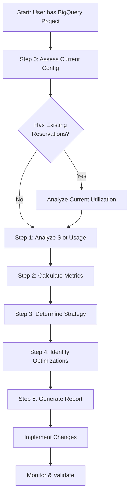
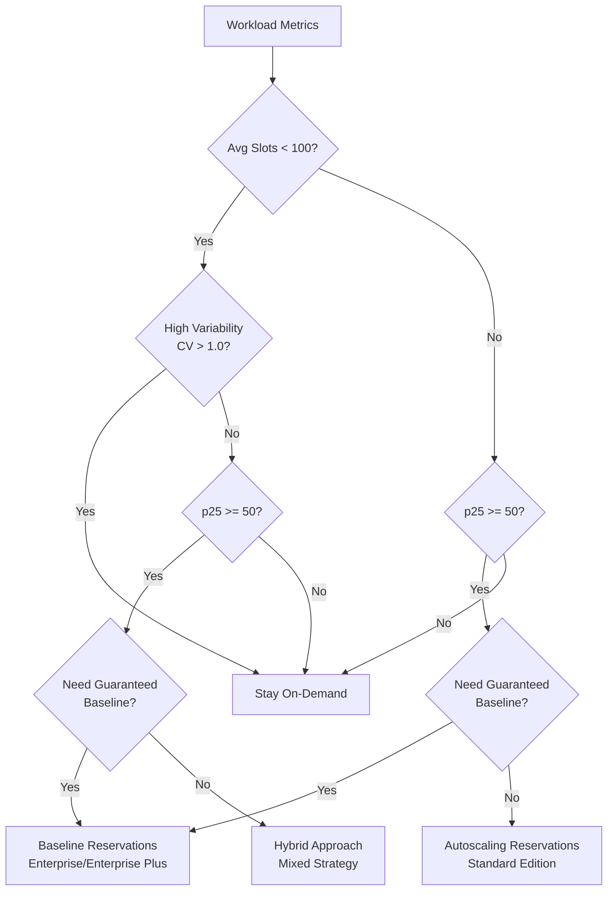

# BigQuery Slot Optimization Framework

A comprehensive framework for analyzing BigQuery slot utilization and optimizing workload performance.

**Note:** This framework integrates proven queries and patterns from [Google Cloud's BigQuery Utils](https://github.com/GoogleCloudPlatform/bigquery-utils/tree/master/dashboards/system_tables) to provide enhanced historical analysis and granular utilization insights.

## Overview

This framework helps BigQuery administrators and data platform teams make data-driven decisions about workload management strategies. By analyzing historical usage patterns, it recommends the optimal approach: staying on-demand, committing to baseline slots, using autoscaling, or implementing a hybrid strategy.

## Quick Reference

### When to Stay On-Demand (PAYG)
- Average slots < 100
- High variability (CV > 1.0)
- Sporadic, unpredictable usage
- Development/testing environments

### When to Use Autoscaling Reservations (Standard Edition)
- High burst ratio (p95/p50 > 3)
- Bursty workloads without baseline needs
- Pay slot-hours (no commitments available)

### When to Use Baseline Reservations (Enterprise/Enterprise Plus)
- p25 slots ≥ 50 (meets minimum)
- Stable workloads needing guaranteed capacity
- Choose: Pay slot-hours OR purchase commitments (1-year/3-year for discounts)
- Can add autoscaling on top (always pay-as-you-go)

### When to Use Hybrid Approach
- Multiple distinct workload types
- Some projects stable (prod), others variable (dev/test)
- Can separate workloads by project

### What This Framework Does

- Analyzes 30 days of slot usage patterns
- Calculates workload stability and burstiness metrics
- Recommends optimal workload management strategy
- Identifies optimization opportunities
- Generates detailed reports

### Who Should Use This

- BigQuery administrators managing multi-project environments
- Data platform engineers planning capacity
- Performance optimization teams
- Organizations with significant BigQuery compute workloads

### Expected Outcomes

- Clear understanding of current slot utilization patterns
- Data-backed recommendation for workload management strategy
- Identification of performance optimization opportunities
- Actionable implementation plan with specific commands
- Baseline for ongoing monitoring and optimization

## Thought Process

### Why Slot Optimization Matters

BigQuery offers multiple workload management models:
- **On-Demand (PAYG):** Flexible capacity, pay per query
- **Reservations:** Dedicated capacity with different pricing options
  - **Standard Edition:** Autoscaling only, pay slot-hours
  - **Enterprise/Enterprise Plus:** Baseline (+ optional autoscaling), choose slot-hours or commitments

Choosing the wrong model can result in:
- **Resource Waste:** Paying for committed slots that sit idle
- **Performance Issues:** Insufficient capacity during peak loads causing query slowdowns
- **Slot Contention:** Queries competing for limited resources

### Analysis Methodology

The framework follows a systematic approach:



### Decision Framework Logic



## How to Use

### Prerequisites

Before starting the analysis, ensure you have:

- [ ] BigQuery Resource Viewer role (`roles/bigquery.resourceViewer`)
- [ ] Access to `INFORMATION_SCHEMA.JOBS_BY_PROJECT` and `INFORMATION_SCHEMA.JOBS_TIMELINE_BY_PROJECT`
- [ ] Project ID where compute occurs
- [ ] Region where compute occurs (e.g., `us`, `eu`, `asia-northeast1`)
- [ ] AI assistant with MCP server access (bigquery-data-analytics)

### Tool Priority: MCP First

This agent is designed to use **MCP Tools** (`bigquery-data-analytics`) as the primary execution method for safety and structured output.
- **Primary**: MCP Tools (`execute_sql`, `get_table_info`)
- **Fallback**: `bq` CLI (if MCP is unavailable)

### Pricing Configuration

The agent uses a default On-Demand pricing of **$6.25 per TB** (US Multi-region).
If your project is in a different region, you can customize this rate by editing `.agents/agents/finops_agent.md` and modifying the constant in **Query 4.2**.

## 🚀 Quick Start (Demo)

Use this prompt to run a complete analysis on your project.

### Prerequisites
1.  **OpenCode Agent** running **Gemini 3 Pro**.
2.  **Authentication**: `gcloud auth login` or valid MCP credentials.
3.  **Permissions**: `bigquery.resourceViewer` on the target project.

### Execution
Ask the agent:
> "Follow the workflow in .agents/commands/optimize_slots.md to analyze project <YOUR_PROJECT_ID> in <REGION>"

**Example:**
> "Follow the workflow in .agents/commands/optimize_slots.md to analyze project my-playground-123 in region-us"

### Expected Output
The agent will generate 7 reports in `analysis_results/` covering usage, cost, storage, and a final strategy recommendation.

### Step-by-Step Instructions

**Step 1: Execute the Analysis**

Ask the agent:
> "Follow the workflow in .agents/commands/optimize_slots.md to analyze project <PROJECT_ID> in <REGION>"

**Example**:
> "Follow the workflow in .agents/commands/optimize_slots.md to analyze project my-gcp-project in region-us"

The agent will automatically:
1.  Run SQL queries against your project's INFORMATION_SCHEMA
2.  Calculate stability and burstiness metrics
3.  Analyze current reservations (if any)
4.  Identify optimization opportunities
5.  Generate detailed reports in the `analysis_results/` directory

**Step 2: Review Generated Reports**

Reports will be created in the `analysis_results/` directory:
- `00_current_configuration.md` - Current reservation setup (if applicable)
- `01_slot_metrics.md` - Percentiles, variability, burstiness
- `02_top_consumers.md` - Project breakdown
- `03_usage_patterns.md` - Hourly/daily patterns
- `04_optimization_opportunities.md` - Contention, expensive queries, performance insights
- `05_storage_and_cost.md` - Storage analysis and on-demand cost estimation
- `06_final_recommendation.md` - Strategy and implementation plan

**Step 3: Implement Recommendations**

Follow the implementation steps in the final recommendation report. This typically includes:
- Creating or modifying reservations
- Assigning projects to reservations
- Setting up monitoring queries
- Validating the changes

## Output Structure

The `analysis_results/` directory contains:

```
analysis_results/
├── 00_current_configuration.md (if reservations exist)
├── 01_slot_metrics.md
├── 02_top_consumers.md
├── 03_usage_patterns.md
├── 04_optimization_opportunities.md
├── 05_storage_and_cost.md
└── 06_final_recommendation.md
```

Each report provides detailed analysis and actionable recommendations. See the generated files for complete details.

## Additional Resources

### Official Documentation
- [BigQuery Reservations Introduction](https://cloud.google.com/bigquery/docs/reservations-intro)
- [INFORMATION_SCHEMA.JOBS View](https://cloud.google.com/bigquery/docs/information-schema-jobs)
- [INFORMATION_SCHEMA.JOBS_TIMELINE View](https://cloud.google.com/bigquery/docs/information-schema-jobs-timeline)
- [Workload Management Best Practices](https://cloud.google.com/bigquery/docs/best-practices-performance-compute)
- [BigQuery Editions](https://cloud.google.com/bigquery/docs/editions-intro)

### Related Guides
- `finops_prompt.md` - Detailed analysis guide with all SQL queries
- `analysis_results/` - Generated reports from your analysis
