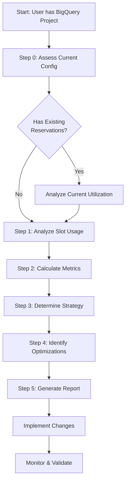
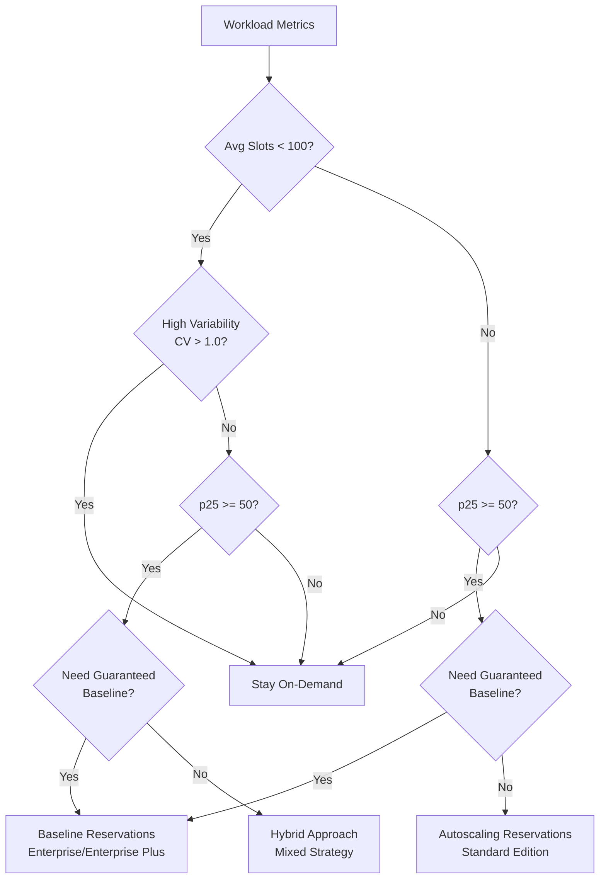

# BigQuery Slot Optimization Framework

A comprehensive framework for analyzing BigQuery slot utilization and optimizing workload performance.

**Note:** This framework integrates proven queries and patterns from [Google Cloud's BigQuery Utils](https://github.com/GoogleCloudPlatform/bigquery-utils/tree/master/dashboards/system_tables) to provide enhanced historical analysis and granular utilization insights.

## Overview

This framework helps BigQuery administrators and data platform teams make data-driven decisions about workload management strategies. By analyzing historical usage patterns, it recommends the optimal approach: staying on-demand, committing to baseline slots, using autoscaling, or implementing a hybrid strategy.

## Quick Reference

### When to Stay On-Demand (PAYG)
- Average slots < 100
- High variability (CV > 1.0)
- Sporadic, unpredictable usage
- Development/testing environments

### When to Use Autoscaling Reservations (Standard Edition)
- High burst ratio (p95/p50 > 3)
- Bursty workloads without baseline needs
- Pay slot-hours (no commitments available)
- Note: Billed per second with a **1-minute minimum**, in multiples of 50 slots. You are charged for *scaled* slots, not *used* slots.

### When to Use Baseline Reservations (Enterprise/Enterprise Plus)
- p25 slots ≥ 50 (meets minimum)
- Stable workloads needing guaranteed capacity
- Choose: Pay slot-hours OR purchase commitments (1-year/3-year for discounts)
- Can add autoscaling on top (always pay-as-you-go)

### When to Use Hybrid Approach
- Multiple distinct workload types
- Some projects stable (prod), others variable (dev/test)
- Can separate workloads by project

### Scaling Ceiling
- BigQuery allows up to **1,000 queued interactive queries per project per region** (hard limit, cannot be increased). If your workload approaches this limit, consider distributing queries across multiple projects (project sharding).

### What This Framework Does

- Analyzes 30 days of slot usage patterns
- Calculates workload stability and burstiness metrics
- Recommends optimal workload management strategy
- Identifies optimization opportunities (including queue pressure and streaming ingestion)
- Generates detailed reports

### Who Should Use This

- BigQuery administrators managing multi-project environments
- Data platform engineers planning capacity
- Performance optimization teams
- Organizations with significant BigQuery compute workloads

### Expected Outcomes

- Clear understanding of current slot utilization patterns
- Data-backed recommendation for workload management strategy
- Identification of performance optimization opportunities
- Actionable implementation plan with specific commands
- Baseline for ongoing monitoring and optimization

## Thought Process

### Why Slot Optimization Matters

BigQuery offers multiple workload management models:
- **On-Demand (PAYG):** Flexible capacity, pay per query
- **Reservations:** Dedicated capacity with different pricing options
  - **Standard Edition:** Autoscaling only, pay slot-hours
  - **Enterprise/Enterprise Plus:** Baseline (+ optional autoscaling), choose slot-hours or commitments

Choosing the wrong model can result in:
- **Resource Waste:** Paying for committed slots that sit idle
- **Performance Issues:** Insufficient capacity during peak loads causing query slowdowns
- **Slot Contention:** Queries competing for limited resources

### Analysis Methodology

The framework follows a systematic approach:


```mermaid
graph TD
    A[Start: User has BigQuery Project] --> B[Step 0: Assess Current Config]
    B --> C{Has Existing<br/>Reservations?}
    C -->|Yes| D[Analyze Current Utilization]
    C -->|No| E[Step 1: Analyze Slot Usage]
    D --> E
    E --> F[Step 2: Calculate Metrics]
    F --> G[Step 3: Determine Strategy]
    G --> H[Step 4: Identify Optimizations]
    H --> I[Step 5: Generate Report]
    I --> J[Implement Changes]
    J --> K[Monitor & Validate]
```

### Decision Framework Logic


```mermaid
graph TD
    A[Workload Metrics] --> B{Avg Slots < 100?}
    B -->|Yes| C{High Variability<br/>CV > 1.0?}
    B -->|No| D{p25 >= 50?}
    C -->|Yes| E[Stay On-Demand]
    C -->|No| F{p25 >= 50?}
    D -->|Yes| G{Need Guaranteed<br/>Baseline?}
    D -->|No| E
    F -->|Yes| H{Need Guaranteed<br/>Baseline?}
    F -->|No| E
    G -->|Yes| I[Baseline Reservations<br/>Enterprise/Enterprise Plus]
    G -->|No| J[Autoscaling Reservations<br/>Standard Edition]
    H -->|Yes| I
    H -->|No| K[Hybrid Approach<br/>Mixed Strategy]
```

## How to Use

### Prerequisites

Before starting the analysis, ensure you have:

- [ ] BigQuery Resource Viewer role (`roles/bigquery.resourceViewer`)
- [ ] Access to `INFORMATION_SCHEMA.JOBS_BY_PROJECT` and `INFORMATION_SCHEMA.JOBS_TIMELINE_BY_PROJECT`
- [ ] Project ID where compute occurs
- [ ] Region where compute occurs (e.g., `us`, `eu`, `asia-northeast1`)
- [ ] AI assistant (such as **Antigravity**) with MCP server access (`bigquery-data-analytics` or equivalent)

### Tool Priority: MCP First

This framework uses **MCP Tools** (`bigquery-data-analytics`) as the primary execution method for safety, speed, and structured output.
- **Primary**: MCP Tools (`execute_sql`, `get_table_info`, etc.)
- **Fallback**: `bq` CLI (if MCP tools are unavailable, restricted, or return insufficient details)

### Pricing Configuration

The agent uses a default On-Demand pricing of **$6.25 per TB** (US Multi-region).
If your project is in a different region, you can customize this rate by editing `.agents/skills/bq_finops_analyst/resources/finops_agent.md` and modifying the constant in **Query 4.2**.

---

## 🚀 Quick Start & How to Run

This framework is natively compatible with **Antigravity (agy) Desktop 2.0 / CLI**, utilizing **Gemini 3.5 Flash (Medium/High)** for rapid and precise execution.

### Prerequisites
1.  **AI Workspace Environment**: Opened in **Antigravity (agy) Desktop / CLI** with Gemini 3.5 Flash (Medium/High) selected.
2.  **Authentication**: `gcloud auth login` or valid MCP credentials configured in your environment.
3.  **Permissions**: `bigquery.resourceViewer` on the target project.

---

### 💻 Setup and Execution (Antigravity `agy` - Recommended)

For any user cloning this repository, follow these simple steps:

#### Step 1: Clone the Repository
Go to your local terminal and run:
```bash
git clone https://github.com/johanesalxd/random-stuff.git
cd random-stuff/bq_finops_cookbook
```

#### Step 2: Open in Antigravity
*   **Agy Desktop:** Open the `bq_finops_cookbook` folder in your `agy` Desktop application as your active workspace.
*   **Agy CLI:** Execute your commands within the `bq_finops_cookbook/` directory.

#### Step 3: Custom Skill Discovery
Upon opening, the `agy` harness automatically scans the `.agents/skills/` directory, discovers the custom skill definition in `.agents/skills/bq_finops_analyst/SKILL.md`, and registers the `bq-finops-analyst` capability workspace-wide.

#### Step 4: Run the Analyst Subagent
Instruct the main assistant:
```markdown
Create/run a subagent with the `bq-finops-analyst` skill to analyze project [YOUR_PROJECT_ID] in [YOUR_REGION].
```

**Example:**
```markdown
Create/run a subagent with the `bq-finops-analyst` skill to analyze project my-gcp-project in region-us.
```

---

## 📋 Step-by-Step Analysis Flow

### Step 1: Execute the Analysis
Once triggered via `agy`, the assistant will automatically:
1.  Verify the targeted region and resolve any schema inconsistencies (such as omitted optional fields).
2.  Run SQL queries against your project's `INFORMATION_SCHEMA` using MCP tools.
3.  Calculate slot percentiles, Coefficient of Variation (CV) for stability, and Burst Ratio.
4.  Examine active/long-term storage splits, streaming ingestion modes, and evaluate Logical vs. Physical storage billing model optimization opportunities.
5.  Audit actively read tables to identify missing partitioning or clustering configurations, and extract native engine-generated query performance insights (such as slot contention, partition skew, and BI Engine disabled reasons).
6.  Check for capacity-related error rates and queuing limits (interactive query queues).
7.  Generate structured reports in the `analysis_results/` directory.

### Step 2: Review Generated Reports
Reports are written directly into `bq_finops_cookbook/analysis_results/`:
- `00_current_configuration.md` - Current reservation setup (if applicable)
- `01_slot_metrics.md` - Percentiles, variability classification, and burstiness
- `02_top_consumers.md` - Multi-project resource breakdown and concentration rankings
- `03_usage_patterns.md` - Weekly trends, hourly peaks, and off-peak scheduling recommendations
- `04_optimization_opportunities.md` - Job slot contention, queues, capacity errors, BI Engine acceleration diagnostics, partition skew/skewed joins, and simulation results
- `05_storage_and_cost.md` - Storage size analysis, cleanup candidates, streaming write API migration opportunities, and Logical vs. Physical billing model savings with executable DDL
- `06_final_recommendation.md` - Executive summary, recommended capacity strategy, and verified proposed CLI commands

### Step 3: Implement Recommendations
Review the proposed commands in `06_final_recommendation.md`. Under manual validation from an administrator, these commands can be used to create, resize, or assign reservations.

## Output Structure

The `analysis_results/` directory contains:

```
analysis_results/
├── 00_current_configuration.md (if reservations exist)
├── 01_slot_metrics.md
├── 02_top_consumers.md
├── 03_usage_patterns.md
├── 04_optimization_opportunities.md
├── 05_storage_and_cost.md
└── 06_final_recommendation.md
```

Each report provides detailed analysis and actionable recommendations. See the generated files for complete details.

## Additional Resources

### Official Documentation
- [BigQuery Reservations Introduction](https://cloud.google.com/bigquery/docs/reservations-intro)
- [INFORMATION_SCHEMA.JOBS View](https://cloud.google.com/bigquery/docs/information-schema-jobs)
- [INFORMATION_SCHEMA.JOBS_TIMELINE View](https://cloud.google.com/bigquery/docs/information-schema-jobs-timeline)
- [Workload Management Best Practices](https://cloud.google.com/bigquery/docs/best-practices-performance-compute)
- [BigQuery Editions](https://cloud.google.com/bigquery/docs/editions-intro)

### Related Guides
- `.agents/skills/bq_finops_analyst/resources/finops_agent.md` - Detailed analysis guide with all SQL queries
- `.agents/skills/bq_finops_analyst/resources/REFERENCES.md` - Official documentation links and query sources
- `analysis_results/` - Generated reports from your analysis
