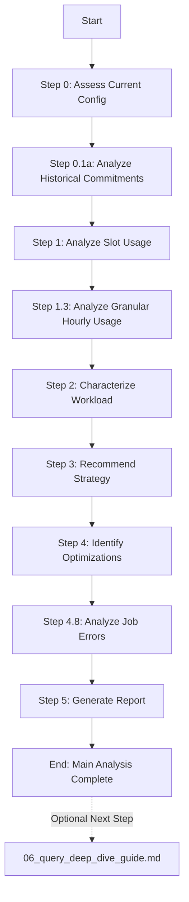

# BigQuery FinOps Optimizer Integration Plan

This document outlines a plan to integrate valuable queries from the `bigquery-utils` repository into the LLM-based FinOps optimizer (`bq_finops_cookbook`).

## Executive Summary

The goal is to enhance the existing `finops_prompt.md` with more detailed historical analysis, deeper job-level troubleshooting capabilities, and more granular utilization breakdowns. This will evolve the framework from a high-level strategic recommender into a comprehensive, multi-layered analysis tool.

---

## 1. Proposed Additions

The following new capabilities will be added to `finops_prompt.md`.

### Addition 1: Historical Commitment Analysis

-   **Capability:** Analyze the history of monthly and annual slot commitments.
-   **Source File:** `bigquery-utils/dashboards/system_tables/sql/daily_commitments.sql`
-   **Benefit:** Provides crucial context on how slot capacity has evolved. Our current framework only sees the *current* state, which can be misleading. This helps answer questions like, "Is our current under-utilization a recent problem, or has it been happening for months?"
-   **Integration Point:** Add as a new **Step 0.1a** in `finops_prompt.md`, right after checking for current reservations.
-   **New SQL Query:**
    ```sql
    -- Step 0.1a: Analyze Historical Slot Commitments
    -- Source: bigquery-utils/dashboards/system_tables/sql/daily_commitments.sql
    -- Provides a daily time-series of active monthly/annual slot commitments.
    WITH
      commitments AS (
        SELECT
          change_timestamp,
          EXTRACT(DATE FROM change_timestamp) AS start_date,
          IFNULL(
            LEAD(DATE_SUB(EXTRACT(DATE FROM change_timestamp), INTERVAL 1 DAY))
              OVER (PARTITION BY state ORDER BY change_timestamp),
            CURRENT_DATE()) AS stop_date,
          SUM(CASE WHEN action IN ('CREATE', 'UPDATE') THEN slot_count ELSE slot_count * -1 END)
            OVER (
              PARTITION BY state
              ORDER BY change_timestamp ROWS BETWEEN UNBOUNDED PRECEDING AND CURRENT ROW
            ) AS slot_cummulative,
          ROW_NUMBER()
            OVER (
              PARTITION BY EXTRACT(DATE FROM change_timestamp)
              ORDER BY change_timestamp DESC
            ) AS rn
        FROM
          `region-{region_name}`.INFORMATION_SCHEMA.CAPACITY_COMMITMENT_CHANGES_BY_PROJECT
        WHERE
          state = 'ACTIVE' AND commitment_plan != 'FLEX'
      ),
      results AS (SELECT * FROM commitments WHERE rn = 1),
      days AS (
        SELECT day
        FROM (SELECT start_date, stop_date FROM results),
        UNNEST(GENERATE_DATE_ARRAY(start_date, stop_date)) day
      )
    SELECT
      TIMESTAMP(day) as date,
      LAST_VALUE(slot_cummulative IGNORE NULLS) OVER(ORDER BY day) as committed_slots
    FROM days
    LEFT JOIN results ON day = DATE(change_timestamp)
    ORDER BY date;
    ```

### Addition 2: Job Error Rate Analysis

-   **Capability:** Identify and categorize common job errors.
-   **Source File:** `bigquery-utils/dashboards/system_tables/sql/job_error.sql`
-   **Benefit:** Uncovers hidden costs and reliability issues. A high error rate can waste compute and developer time. This allows the LLM to provide actionable recommendations to improve query stability.
-   **Integration Point:** Add as a new **Step 4.8** in the "Optimization Recommendations" section.
-   **New SQL Query:**
    ```sql
    -- Step 4.8: Analyze Job Error Patterns
    -- Source: bigquery-utils/dashboards/system_tables/sql/job_error.sql
    -- Identifies the most common reasons for query failures.
    SELECT
      error_result.reason,
      error_result.message,
      COUNT(*) AS error_count
    FROM
      `region-{region_name}`.INFORMATION_SCHEMA.JOBS_BY_PROJECT
    WHERE
      creation_time BETWEEN TIMESTAMP_SUB(CURRENT_TIMESTAMP(), INTERVAL 30 DAY) AND CURRENT_TIMESTAMP()
      AND error_result.reason IS NOT NULL
      AND job_type = 'QUERY'
    GROUP BY 1, 2
    ORDER BY error_count DESC
    LIMIT 10;
    ```

### Addition 3: Query Deep-Dive Guide (Optional Next Step)

**Status: REJECTED** ❌

-   **Capability:** Provide a separate guide for detailed query-level performance analysis.
-   **Source File:** `bigquery-utils/dashboards/system_tables/sql/job_analyzer_slow.sql`
-   **Reason for Rejection:** This feature crosses the line into query optimization rather than workload management. The framework's north star is to recommend workload management strategies (on-demand, baseline, autoscaling, hybrid), not to perform detailed query-level performance tuning. Including this would dilute the focus and scope of the tool.
-   **Alternative:** Users needing query-level optimization can refer directly to the bigquery-utils repository or use BigQuery's built-in query execution details.

---

## 2. Proposed Replacements

The queries in `bigquery-utils` are often more robust and detailed. We can replace some of our existing queries to improve the quality of the analysis.

### Replacement 1: Daily/Hourly Utilization Query

-   **Current Query:** `daily_utilization.sql` and `hourly_utilization.sql` in `bigquery-utils` are more granular.
-   **Proposed Change:** Replace the existing **Step 1.3** ("Analyze Usage Patterns by Time") with a query that provides a more detailed breakdown.
-   **Benefit:** This allows the LLM to analyze usage not just by time, but also by `project`, `user`, and `job_type`, leading to more specific recommendations.
-   **New Query for Step 1.3:**
    ```sql
    -- Step 1.3: Analyze Hourly Usage Patterns by Project, User, and Job Type
    -- Source: Adapted from bigquery-utils/dashboards/system_tables/sql/hourly_utilization.sql
    SELECT
      TIMESTAMP_TRUNC(period_start, HOUR) AS usage_hour,
      project_id,
      user_email,
      job_type,
      SUM(period_slot_ms) / (1000 * 60 * 60) AS hourly_slot_usage
    FROM
      `region-{region_name}`.INFORMATION_SCHEMA.JOBS_TIMELINE_BY_PROJECT
    WHERE
      period_start BETWEEN TIMESTAMP_SUB(CURRENT_TIMESTAMP(), INTERVAL 30 DAY) AND CURRENT_TIMESTAMP()
      AND (statement_type != 'SCRIPT' OR statement_type IS NULL)
    GROUP BY 1, 2, 3, 4
    ORDER BY usage_hour, hourly_slot_usage DESC;
    ```

---

## 3. Updated Workflow

The new analysis flow will incorporate these steps, making it more thorough while maintaining focus on workload management strategy.



---

## 4. Impact on Output

The final reports will be enhanced as follows:

-   **`00_current_configuration.md`:** Will now include a section on "Historical Slot Commitments" with a summary of how capacity has changed over time.
-   **`03_usage_patterns.md`:** Will provide a more granular breakdown of peak usage, attributing it to specific users or job types.
-   **`04_optimization_opportunities.md`:** Will include a new "Job Error Analysis" section with a table of common errors and their frequencies.
-   **`05_final_recommendation.md`:** The recommendations will be more context-aware, considering historical trends and error patterns. Will include a reference to the optional query deep-dive guide in the "Next Steps" section.
-   **`06_query_deep_dive_guide.md` (New):** An optional guide for users who need to perform detailed query-level performance analysis after completing the main workload management analysis.

This integration will create a more powerful and insightful FinOps tool while maintaining laser focus on the primary goal: recommending the optimal workload management strategy.
