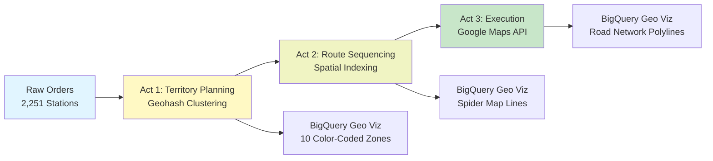

# Strategy to Street: Route Optimization Demo

This project demonstrates a **Hybrid Logistics Architecture** that leverages **BigQuery** for high-scale territory planning (Macro) and **Google Maps Platform** for high-precision operational routing (Micro).

## Use Case

A logistics company needs to optimize delivery routes for a fleet of vehicles. The solution combines:

- **BigQuery Geospatial:** Territory assignment and route sequencing using spatial indexing
- **BigQuery ML:** Advanced clustering using K-Means (optional)
- **Google Maps API:** Real-world road network optimization via Remote Functions

## Dataset

This demo uses the public **NYC Citibike Stations** dataset:
- **Table:** `bigquery-public-data.new_york_citibike.citibike_stations`
- **Records:** 2,318 stations (2,251 active)
- **Manhattan Subset:** 741 stations in the demo area

## Prerequisites

1. **Google Cloud Project** with billing enabled
2. **APIs Enabled:**
   - BigQuery API
   - Cloud Functions API (for Maps integration)
   - Google Maps Directions API (for Maps integration)
3. **Permissions:**
   - BigQuery Data Editor
   - BigQuery Job User
   - Cloud Functions Developer (for Maps integration)
4. **Tools:**
   - `gcloud` CLI (for Cloud Function deployment)

## Demo Architecture



## Quick Start

### Option 1: Geohash-Based Clustering (Recommended for Demo)

This approach uses spatial indexing for instant territory assignment without requiring model training.

```bash
# Run the geohash clustering demo
bq query --use_legacy_sql=false < sql/01_geohash_clustering.sql
```

### Option 2: BQML K-Means Clustering (Advanced)

This approach uses machine learning for more balanced territories but requires model creation.

```bash
# Step 1: Create the K-Means model (one-time setup)
bq query --use_legacy_sql=false < sql/00_bqml_kmeans_clustering.sql

# Step 2: Use the model for clustering
# (See sql/00_bqml_kmeans_clustering.sql for usage examples)
```

## Demo Scenarios

### Scenario 1: Fleet Territory Planning

**Goal:** Assign 500 stations to 10 delivery trucks

```bash
bq query --use_legacy_sql=false < sql/01_geohash_clustering.sql
```

**What it shows:**
- Instant territory assignment using geohash prefixes
- Balanced distribution across geographic zones
- Visual output: 10 color-coded clusters

### Scenario 2: Route Sequencing

**Goal:** Order stops within each territory for efficient routing

```bash
bq query --use_legacy_sql=false < sql/02_route_sequencing.sql
```

**What it shows:**
- Spatial indexing creates logical visit sequences
- ST_MAKELINE connects stops into routes
- Visual output: Spider map with straight-line routes

### Scenario 3: Nearest Neighbor Solver

**Goal:** Demonstrate procedural TSP solving in BigQuery

```bash
bq query --use_legacy_sql=false < sql/03_nearest_neighbor_solver.sql
```

**What it shows:**
- Greedy nearest-neighbor algorithm
- BigQuery scripting capabilities (LOOP, variables)
- Optimized path for a single vehicle

### Scenario 4: Combined Visualization

**Goal:** Show all layers together in BigQuery Geo Viz

```bash
bq query --use_legacy_sql=false < sql/04_combined_visualization.sql
```

**What it shows:**
- Layer 1: Individual stops (points)
- Layer 2: Territory boundaries (clusters)
- Layer 3: Route paths (lines)

### Scenario 5: Google Maps Integration

**Goal:** Get real road-network routes using the Maps API

**Prerequisites:**
1. Deploy the Cloud Function (see below)
2. Create BigQuery Remote Function connection
3. Update project/dataset names in SQL

```bash
bq query --use_legacy_sql=false < sql/05_maps_api_integration.sql
```

**What it shows:**
- BigQuery hands off optimized routes to Maps API
- Maps API returns traffic-aware, road-network polylines
- Visual comparison: Straight lines vs. actual roads

## Google Maps API Integration Setup

### Step 1: Deploy Cloud Function

```bash
cd cloud_function

# Set your configuration
export PROJECT_ID="your-project-id"
export REGION="us-central1"
export MAPS_API_KEY="your-maps-api-key"

# Deploy using the provided script
chmod +x deploy.sh
./deploy.sh
```

Or deploy manually:

```bash
gcloud functions deploy optimize-route \
  --gen2 \
  --runtime=python311 \
  --region=us-central1 \
  --source=. \
  --entry-point=optimize_route \
  --trigger-http \
  --allow-unauthenticated \
  --set-env-vars MAPS_API_KEY=${MAPS_API_KEY}
```

### Step 2: Create BigQuery Connection

1. Go to BigQuery Console
2. Click **+ ADD** > **Connections to external data sources**
3. Select **Cloud Resource**
4. Connection ID: `gmaps_conn`
5. Region: `us` (or your preferred region)
6. Click **Create**
7. Copy the **Service Account** shown in the connection details

### Step 3: Grant Permissions

```bash
# Grant the BigQuery connection service account permission to invoke the function
gcloud functions add-invoker-policy-binding optimize-route \
  --region=us-central1 \
  --member="serviceAccount:SERVICE_ACCOUNT_FROM_STEP_2"
```

### Step 4: Update SQL Script

Edit `sql/05_maps_api_integration.sql` and replace:
- `your_project` with your GCP project ID
- `your_dataset` with your BigQuery dataset name
- `your_connection_id` with `gmaps_conn`
- Cloud Function endpoint URL

## Visualization Options

### Option 1: BigQuery Geo Viz (Primary)

1. Go to [BigQuery Geo Viz](https://bigquerygeoviz.appspot.com/)
2. Authorize your project
3. Paste any of the SQL queries
4. Click **Run**
5. Configure styling:
   - **Geometry column:** `geometry`
   - **Fill color:** Data-driven, field `truck_id` or `zone_id`, function `categorical`
   - **Fill opacity:** 0.8
   - **Stroke color:** `#ffffff`
   - **Stroke width:** 1

### Option 2: Looker Studio

1. Create a new Looker Studio report
2. Add BigQuery as data source
3. Use **Custom Query** and paste the SQL
4. Add a **Geo Chart** visualization
5. Configure:
   - **Geo dimension:** `geometry`
   - **Color dimension:** `truck_id` or `zone_id`

### Option 3: Deck.gl (Advanced)

For interactive 3D visualizations, export results and use [deck.gl](https://deck.gl/):

```javascript
import {DeckGL, GeoJsonLayer} from 'deck.gl';

const layer = new GeoJsonLayer({
  id: 'routes',
  data: 'results.geojson',
  getLineColor: d => colorScale(d.properties.truck_id),
  getLineWidth: 3
});
```

## Demo Presentation Flow

Use the narrative in `slides.md` for presenting this demo:

1. **Slide 1:** Introduce the "Logistics Scale Paradox"
2. **Slide 2:** Show the hybrid architecture diagram
3. **Slide 3:** Run Act 1 (Territory Planning) - show clustering
4. **Slide 4:** Run Act 2 (Route Sequencing) - show spider map
5. **Slide 5:** Run Act 3 (Maps Integration) - show road network comparison
6. **Slide 6:** Discuss business value (cost, speed, simplicity)

## Key Talking Points

### BigQuery Strengths (Macro)
- **Scale:** Process millions of points in seconds
- **Cost:** Fractions of a cent per query
- **Speed:** Instant clustering and sequencing
- **Integration:** Native SQL, no data movement

### Google Maps Strengths (Micro)
- **Precision:** Real road network with traffic
- **Optimization:** TSP solver with waypoint reordering
- **Reality:** Accounts for one-way streets, U-turns, restrictions

### Hybrid Architecture Benefits
- **Cost Efficiency:** Only send optimized candidates to paid API
- **Scalability:** Re-plan entire fleet in seconds
- **Simplicity:** End-to-end pipeline in SQL

## SQL Functions Reference

| Function | Purpose | Example |
|----------|---------|---------|
| `ST_GEOGPOINT(lng, lat)` | Create geography point | `ST_GEOGPOINT(-73.99, 40.75)` |
| `ST_GEOHASH(geog, precision)` | Generate geohash string | `ST_GEOHASH(location, 10)` |
| `ST_MAKELINE(array<geog>)` | Create line from points | `ST_MAKELINE(ARRAY_AGG(location))` |
| `ST_LENGTH(geog)` | Calculate geodesic length (meters) | `ST_LENGTH(route) / 1000` |
| `ST_DISTANCE(geog1, geog2)` | Distance between points (meters) | `ST_DISTANCE(a, b)` |
| `ST_LINEFROMENCODEDPOLYLINE(str)` | Decode Maps API polyline | `ST_LINEFROMENCODEDPOLYLINE(encoded)` |

## Troubleshooting

### Issue: "Remote function call failed"

**Checklist:**
1. Cloud Function is deployed and accessible
2. BigQuery connection is created in the same region
3. Service account has "Cloud Functions Invoker" role
4. Function endpoint URL is correct in SQL

### Issue: "No results in Geo Viz"

**Checklist:**
1. Query returns a `geometry` column
2. Geometry column contains valid GEOGRAPHY values
3. Try zooming out on the map
4. Check for NULL geometries: `WHERE geometry IS NOT NULL`

## Cost Estimation

### BigQuery Costs
- **Query processing:** ~$5 per TB scanned
- **Demo queries:** Scan ~1 MB each = $0.000005 per query
- **Storage:** First 10 GB free

### Google Maps API Costs
- **Directions API:** $5 per 1,000 requests
- **Waypoint optimization:** Included in Directions API
- **Demo usage:** ~10 requests = $0.05

**Total demo cost:** < $0.10

## Next Steps

1. **Production Deployment:**
   - Use Secret Manager for API keys
   - Implement rate limiting on Cloud Function
   - Add error handling and retry logic
   - Set up monitoring and alerting

2. **Advanced Features:**
   - Time windows for deliveries
   - Vehicle capacity constraints
   - Multi-depot routing
   - Real-time traffic integration

3. **Integration:**
   - Export routes to fleet management systems
   - Schedule daily route optimization
   - Build dashboards in Looker Studio
   - Create mobile apps for drivers

## Resources

- [BigQuery Geospatial Functions](https://cloud.google.com/bigquery/docs/reference/standard-sql/geography_functions)
- [BigQuery ML K-Means](https://cloud.google.com/bigquery/docs/reference/standard-sql/bigqueryml-syntax-create-kmeans)
- [Google Maps Directions API](https://developers.google.com/maps/documentation/directions)
- [BigQuery Remote Functions](https://cloud.google.com/bigquery/docs/remote-functions)
- [BigQuery Geo Viz](https://github.com/GoogleCloudPlatform/bigquery-geo-viz)

## License

This demo is provided as-is for educational purposes.
