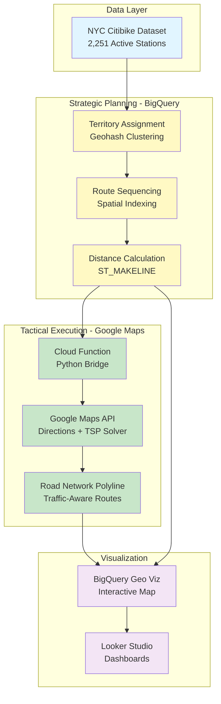
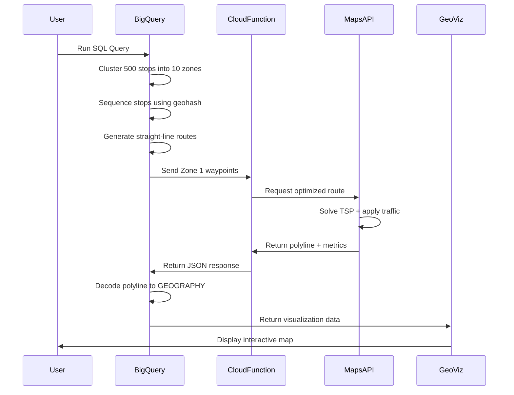
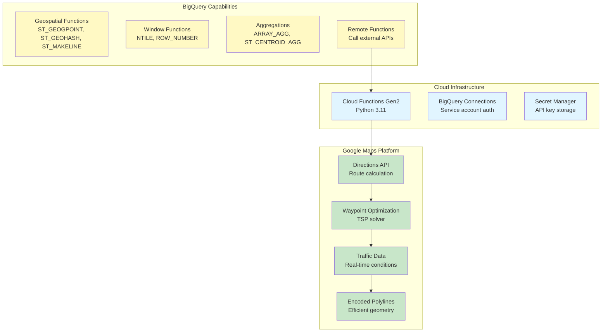
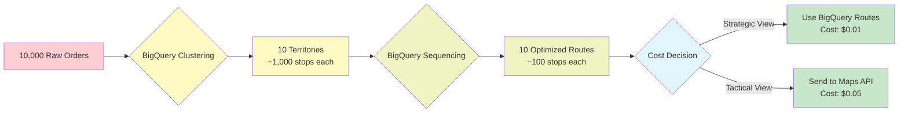

# Hybrid Logistics Architecture

This document provides visual diagrams of the route optimization architecture.

## System Architecture

## Data Flow

## Component Breakdown

```mermaid
graph LR
    subgraph "Act 1: Strategic Planning"
        A1[Raw Data<br/>500 Stations]
        A2[Geohash Clustering<br/>NTILE Function]
        A3[10 Balanced Zones]
        A1 --> A2 --> A3
    end

    subgraph "Act 2: Tactical Sequencing"
        B1[Clustered Stations]
        B2[Spatial Indexing<br/>ST_GEOHASH]
        B3[Ordered Routes<br/>ST_MAKELINE]
        B1 --> B2 --> B3
    end

    subgraph "Act 3: Operational Execution"
        C1[Sequenced Waypoints]
        C2[Remote Function Call]
        C3[Maps API Response]
        C4[Road Network Path]
        C1 --> C2 --> C3 --> C4
    end

    A3 --> B1
    B3 --> C1

    style A1 fill:#e1f5ff
    style A2 fill:#fff9c4
    style A3 fill:#fff9c4
    style B1 fill:#fff9c4
    style B2 fill:#f0f4c3
    style B3 fill:#f0f4c3
    style C1 fill:#c8e6c9
    style C2 fill:#c8e6c9
    style C3 fill:#c8e6c9
    style C4 fill:#c8e6c9
```

## Technology Stack

## Cost Optimization Strategy

## Key Metrics

| Metric | BigQuery (Strategic) | Google Maps (Tactical) |
|--------|---------------------|------------------------|
| **Processing Time** | < 1 second | 2-5 seconds per route |
| **Cost per Query** | $0.000005 | $0.005 per route |
| **Scalability** | Millions of points | < 25 waypoints per request |
| **Accuracy** | Geodesic distance | Road network distance |
| **Traffic Awareness** | No | Yes (real-time) |
| **Use Case** | Planning, budgeting | Driver navigation |

## Demo Scenarios

1. **Scenario 1: Fleet Planning** - Assign 500 stops to 10 trucks (BigQuery only)
2. **Scenario 2: Route Sequencing** - Order stops within territories (BigQuery only)
3. **Scenario 3: TSP Solver** - Nearest neighbor algorithm (BigQuery scripting)
4. **Scenario 4: Combined View** - All layers in one visualization (BigQuery only)
5. **Scenario 5: Hybrid Execution** - Strategic + Tactical (BigQuery + Maps API)
