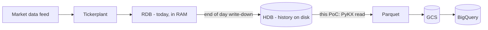

# kdb+ → Parquet → BigQuery (PyKX PoC)

A small, **Python-first** proof of concept for migrating a historical **kdb+ HDB**
into **BigQuery** using only free tooling — no commercial kdb+ add-ons required.

It reproduces a real-world challenge: a **wide (~450-column real table, 428 in
this synthetic copy), very sparse (mostly-null), date-partitioned** order-book
table with **nanosecond timestamps**,
where naively exporting one day to JSON blew up to ~120 GB of RAM. The pipeline
here streams each partition to Parquet in **bounded memory** and loads it into a
partitioned/clustered BigQuery table.

> All data here is **synthetic** and the schema is **anonymised**. Nothing in this
> repo contains customer names or customer data.

---

## Background: kdb+, q, and the HDB

If you have never touched kdb+, this section gives you enough to follow the rest.

- **kdb+** is a high-performance, column-oriented time-series database. It is the
  standard for tick data (trades/quotes/orders) in banks and exchanges.
- **q** is kdb+'s built-in query and vector programming language. It is terse and
  operates on whole columns at once.
- The database has two halves in a typical "tick" setup:
  - **RDB** (real-time database): today's data, held in RAM.
  - **HDB** (historical database): older data, written to disk at end of day.
    **This migration reads the HDB** and lands it in BigQuery.



### Why you cannot just copy the files

An HDB is not one file. On disk it is stored as:

- **Splayed tables** — each column is its own file inside a table directory, so a
  query reads only the columns it needs.
- **Partitioned by date** — one directory per day (e.g. `2024.01.02/`), which is
  how kdb+ scales and prunes by date.
- A **`sym` file** — symbol columns are stored as integer codes that index into
  this shared enumeration file.

Because the on-disk layout and the data types are kdb-specific, you export
through an intermediary (Parquet) rather than copying raw files. See
[Database — tables in the filesystem](https://code.kx.com/q/database/).

### kdb+ traits that drive the conversion

- **symbol**: an interned (enumerated) string -> maps to BigQuery `STRING`.
- **nanosecond timestamps**: kdb keeps nanoseconds; BigQuery `TIMESTAMP` is
  microseconds (see [Timestamp handling](#timestamp-handling-important)).
- **typed nulls** (`0Nj`, `0Nh`, ...): real nulls, not sentinels.
- **epoch is 2000-01-01**, not 1970 (see [Epoch gotcha](#epoch-gotcha-important)).

### Glossary

| Term | Meaning |
|------|---------|
| kdb+ | Columnar time-series database |
| q | kdb+'s query / vector language |
| RDB | Real-time database (today's data, in RAM) |
| HDB | Historical database (on-disk history) — the migration source |
| tickerplant | Process that ingests the feed and forwards to RDB/HDB |
| splayed table | Table stored as one file per column |
| partition | On-disk split, one directory per date |
| symbol | Interned string, stored via the `sym` enumeration file |

### kdb+ to BigQuery concept map

| kdb+ | BigQuery |
|------|----------|
| HDB (on-disk historical database) | dataset + table |
| partition by `date` (directory per day) | date-partitioned table |
| splayed columns (file per column) | Capacitor columnar storage |
| `sym`-enumerated symbol column | plain `STRING` column |
| in-process q query | GoogleSQL query |

---

## Why this approach

Direct kdb+ → BigQuery isn't possible (type mismatches + on-disk *splayed* files).
The standard pattern is an **intermediary file → GCS → BigQuery load job**, and
**Parquet** is the right intermediary:

| Format | Size / 1M rows | Notes |
|--------|----------------|-------|
| kdb+ (on disk) | ~45 MB | source |
| CSV | ~52 MB | bloated, no schema, slow load |
| **Parquet** | **~17 MB** | compressed, columnar, **self-describing schema** |

Parquet is ~3× smaller than CSV and BigQuery reads its schema directly (no
autodetect), so the load is roughly half the end-to-end time of CSV.

For wide tables like this one, follow BigQuery's Parquet input guidance: keep row
size ≤ 50 MB, aim for row groups ≥ 16 MiB, and reduce the page size when a table
has more than 100 columns. This maps to the `PARQUET_ROW_GROUP` knob in `.env`.
See [Loading Parquet data](https://cloud.google.com/bigquery/docs/loading-data-cloud-storage-parquet).

## Options for a Google Cloud engineer (no AquaQ / commercial license)

| Tool | What | License |
|------|------|---------|
| **PyKX + PyArrow** (this PoC) | KX's official Python interface: read HDB → Arrow → Parquet | Free; licensed mode needs a **free** personal `kc.lic` |
| **arrowkdb** | KX's official **native-q** Arrow/Parquet library (`KxSystems/arrowkdb`) | **Free, Apache-2** — the drop-in replacement for AquaQ's commercial `kdb-parquet` |
| `bq load` / BigQuery client | Parquet in GCS → BigQuery | Free, Google-native |
| BigLake / external table | Query Parquet in-place | Free, Google-native |

---

## Setup

Requires [`uv`](https://docs.astral.sh/uv/). The demo commands use Python 3.12.

```bash
# 1. Create the environment and install dependencies
uv venv --python 3.12 .venv
uv sync

# 2. Configure
cp .env.example .env               # then edit .env (see below)

# 3. Google auth (uses your own login — no keys)
gcloud auth application-default login
gcloud config set project <your-project>   # or set GCP_PROJECT in .env

# GCS_BUCKET must already exist in the same location as BQ_LOCATION
gcloud storage buckets create gs://<unique-bucket-name> --location=US
```

### Where to paste your PyKX license

You got a license from KX — provide it in **one** of these ways (both git-ignored):

- **`kc.lic` file (preferred)** → save the binary `kc.lic` as `bq_pykx_copy/kc.lic`.
  The scripts read it via `QLIC`.
- **Base64 string** → open `.env` and set `KDB_LICENSE_B64=<base64 blob>`
  (the scripts decode it to `kc.lic` on first run). Note: the variable is
  `KDB_LICENSE_B64` (kc.lic) / `KDB_K4LICENSE_B64` (k4.lic), per the PyKX docs.

If KX sent only a base64 string and you want the file form, decode it once:
`base64 -d <<< "<blob>" > kc.lic`.

Verify: `uv run python -c "import config, pykx as kx; print('licensed:', kx.licensed)"`
→ should print `licensed: True`.

(Get a free license: <https://kx.com/kdb-insights-personal-edition-license-download/>.
It is **personal/eval, non-commercial** — right for this public demo; a real
customer engagement uses their own commercial kdb+ license.)

---

## Run

```bash
./run_all.sh
```

This replaces the configured `BQ_TABLE`. Use the dedicated
`firm_orderbook_poc` table from `.env.example`, not a production table.

or step by step:

| Step | Script | Does |
|------|--------|------|
| 0 | `00_generate_synthetic_hdb.py` | build synthetic date-partitioned HDB |
| 1 | `01_kdb_to_parquet.py` | chunked HDB → Parquet (bounded memory) |
| 2 | `02_load_bigquery.py` | upload to GCS + load partitioned/clustered BQ table |
| 3 | `03_validate.py` | row / null / **nanosecond-timestamp** parity checks |

Knobs live in `.env`: `POC_ROWS` (worst case ~7,000,000), `POC_DATES`,
`PARQUET_ROW_GROUP` (lower = less peak RAM).

Step 0 recreates `data/hdb`; that directory is generated demo data, not an input
path for a customer HDB. Point the converter at real HDBs through configuration
or orchestration rather than copying them into this generated directory.

---

## Type mapping (kdb+ → BigQuery)

| kdb+ | BigQuery | Handling |
|------|----------|----------|
| `long`/`int`/`short` (`j`/`i`/`h`) | `INT64` | direct; nulls (`0Nj`…) → Arrow null |
| `symbol`/`char` (`s`/`c`) | `STRING` | **kdb symbol null = empty string → converted back to real NULL** |
| `date` (`d`) | `DATE` | direct; the **partition** column |
| `timestamp` (`p`) | see below | precision decision ↓ |

### Timestamp handling (important)

kdb+ timestamps are **nanosecond**; BigQuery `TIMESTAMP` is **microsecond**.

- **Default in this PoC:** plain timestamps (e.g. `inserted_ts`) → BigQuery
  `TIMESTAMP` (microsecond). Human-readable in BQ; the last 3 ns digits are
  dropped.
- **Lossless option (used for event timestamps):** columns flagged
  `is_event_ts_nanos` in `schema.py` are stored as **`INT64` = nanoseconds since
  1970**, preserving full precision. This mirrors the customer's own DDL
  (`timestampNanos INT64`, `..._execution_timestampNanos INT64`, …).

To change a column's behaviour, flip its flag/`bq_type` in `schema.py`; the
conversion logic is in `kdb_utils.arrow_align()` — read the comments there,
they explain the null + timestamp decisions in one place.

### Epoch gotcha (important)

kdb+ timestamps are **nanoseconds since 2000-01-01**, but Arrow / Parquet /
BigQuery use the Unix **1970-01-01** epoch. `chunk_to_arrow()` reads the raw q
timestamp longs before Arrow conversion, applies the checked epoch offset, and
keeps q nulls as Arrow nulls. Timestamp infinities and values that cannot fit in
Unix `INT64` nanoseconds fail explicitly instead of wrapping to an incorrect
date.

### Conversion core and scaling

`01_kdb_to_parquet.py` is the main capability demonstrated by this project. It
first counts the selected partition without projecting all 428 columns:

```q
first exec n from select n:count i from table where date=day
```

It then reads closed, partition-local row windows:

```q
select from table where date=day, i within (start;end)
```

Each window becomes one bounded Arrow table and is streamed into a Parquet
writer. The partition is never represented as one Python or JSON object. Peak
memory therefore follows the configured row-group size rather than total
partition size.

PyKX supports one loaded HDB per process. To scale across tens or hundreds of
HDBs, run one converter process per HDB and control concurrency in an external
worker pool such as Cloud Run Jobs, Batch, Airflow, or a shell scheduler:

```text
HDB A -> converter process -> Parquet
HDB B -> converter process -> Parquet
HDB C -> converter process -> Parquet
```

The converter code stays the same; only HDB paths, schemas, output locations,
and worker concurrency change.

---

## Files

```
pyproject.toml             uv project (deps, ruff, pytest config)
config.py                  env + license wiring (import before pykx!)
schema.py                  anonymised wide/sparse schema + type map
kdb_utils.py               kdb→Arrow conversion (nulls, ns→INT64, µs TIMESTAMP)
00_generate_synthetic_hdb.py
01_kdb_to_parquet.py       ← the memory-efficient core
02_load_bigquery.py
03_validate.py
run_all.sh
tests/                     pytest unit tests (arrow_align, schema)
schema_ref/                (git-ignored) private reference — not published
```

## Development

```bash
uv run ruff format .        # format
uv run ruff check .         # lint
uv run pytest               # unit tests (no kdb+/GCP needed)
uv run pip-audit            # dependency vulnerability scan
```

## Results

End-to-end run on a 428-column synthetic table, 2 partitions × 200,000 rows
(`PARQUET_ROW_GROUP=100000`), loaded into BigQuery on GCP:

| Metric | Value |
|--------|-------|
| Convert peak RAM | **~1.5 GB** (streamed; independent of partition size) |
| Parquet size | ~33.6 MB / 200k rows |
| Convert time | ~22 s / partition |
| BigQuery load | 400,000 rows × 428 cols, partitioned by `date`, clustered by `sym, message_type` |
| Validation | row counts, schema width, representative null counts, and nanosecond INT64 sanity checks pass |

The point: peak memory is bounded by the **row-group size**, not the partition
size — the customer's ~120 GB single-file JSON blow-up does not recur. Raw
per-row Parquet size here is high only because the synthetic data is random
(incompressible); real sparse/mostly-null capture compresses far better.

These are focused PoC sanity checks, not a row-by-row production reconciliation.
Reproduce with `./run_all.sh` (see `data/metrics_convert.json` for raw numbers).

---

## Further reading

**kdb+ / q / PyKX**

- kdb+ architecture (RDB/HDB/tickerplant): <https://code.kx.com/q/architecture/>
- Historical database (HDB): <https://code.kx.com/q/learn/startingkdb/hdb/>
- Database — tables in the filesystem (splayed/partitioned): <https://code.kx.com/q/database/>
- Partitioned tables (Knowledge Base): <https://code.kx.com/q/kb/partition/>
- Datatypes: <https://code.kx.com/q/basics/datatypes/>
- Q for Mortals (free introductory book): <https://code.kx.com/q4m3/>
- PyKX documentation: <https://code.kx.com/pykx/>
- arrowkdb — native-q Arrow/Parquet, free and Apache-2: <https://github.com/KxSystems/arrowkdb>

**BigQuery / data formats**

- Loading Parquet from Cloud Storage: <https://cloud.google.com/bigquery/docs/loading-data-cloud-storage-parquet>
- Introduction to partitioned tables: <https://cloud.google.com/bigquery/docs/partitioned-tables>
- Creating and using clustered tables: <https://cloud.google.com/bigquery/docs/creating-clustered-tables>
- Batch loading data: <https://cloud.google.com/bigquery/docs/batch-loading-data>
- Apache Parquet: <https://parquet.apache.org/>
- PyArrow (Python Arrow bindings): <https://arrow.apache.org/docs/python/>
