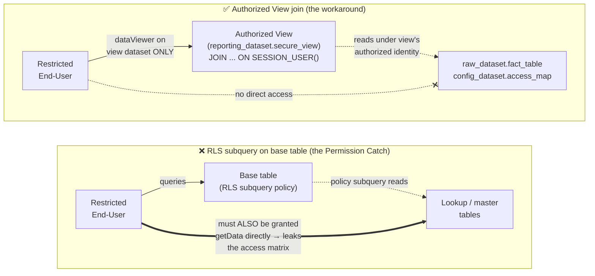

# Dynamic Row-Level Security in BigQuery

A small, self-contained, **end-to-end tested** reference showing how to build
*dynamic* row-level security (RLS) in BigQuery driven by a mapping/lookup table —
so you never hardcode per-user rules into the policy.

It walks from a common anti-pattern (hardcoding each access rule with
`LIMIT 1 OFFSET n`) to scalable, supported patterns, and documents the BigQuery
limitations discovered while testing each approach against the live service.

> All identifiers are generic (a retail `sales` fact table keyed by a STRING
> `store_code`). No customer data or names are included.

## The problem

You have a fact table and you want each user to see only the rows whose key
falls within one or more **value ranges** assigned to them. The assignments live
in a mapping table that you want to edit as *data*, not as DDL:

```
access_map(email, column_name, low_value, high_value)
```

A user may have **any number** of ranges. The policy must evaluate *all* of them
without the policy author knowing the count in advance.

## TL;DR answers

1. **Is a dynamic lookup against a mapping table supported in a Row Access
   Policy?** **Yes.** Row access policy filters support **non-correlated
   subqueries** against other (lookup/dimension) tables, combined with
   `SESSION_USER()`. This is the documented way to replace many policies with one.
2. **Recommended pattern for user-to-value-*range* mappings?** Expand the ranges
   into a discrete allowlist *inside a non-correlated subquery* by joining the
   range table against a **dimension table** of valid keys, then filter with
   `key IN (SELECT ...)`. See [`03_solution_dynamic_range.sql`](./03_solution_dynamic_range.sql).
   This handles N ranges with **zero DDL** when assignments change.
3. **Authorized views / policy tags / separate tables / RLS?** For "same table,
   different users see different rows," **row access policies** are the
   recommended fit. Authorized views trade security review burden for
   flexibility; separate tables give the strongest isolation; **policy tags are
   column-level** (masking), not row-level — not applicable here.
4. **Limitations with `SESSION_USER()` + subqueries?** Several important ones —
   most notably **correlated subqueries referencing the target table are not
   allowed**, and subquery policies are **incompatible with the BigQuery Storage
   Read API**. See [Key findings](#key-findings-verified-against-the-live-service)
   and [Limitations](#limitations-to-be-aware-of).

## What does NOT work (verified)

The intuitive correlated `EXISTS` that references the fact table column inside
the subquery is **rejected by BigQuery**:

```sql
-- ❌ FAILS: "Row access policy ... may not include correlated subqueries
--            involving target table."
FILTER USING (
  EXISTS (
    SELECT 1 FROM access_map m
    WHERE LOWER(m.email) = LOWER(SESSION_USER())
      AND m.column_name = 'store_code'
      AND sales.store_code BETWEEN m.low_value AND m.high_value  -- correlated ref
  )
)
```

Two distinct errors surface from variations of this:

- Referencing the base table by name/alias (`sales.store_code`) →
  `Unrecognized name: sales`. Target-table columns must be **unqualified**.
- Correlating any subquery on a target-table column →
  `Row access policy ... may not include correlated subqueries involving target table.`

## What works (verified)

Convert ranges to a discrete allowlist using a **dimension table** (`store_dim`)
so the subquery never references the fact table:

```sql
CREATE OR REPLACE ROW ACCESS POLICY rap_analyst
ON `project.dataset.sales`
GRANT TO ('user:analyst@example.com')
FILTER USING (
  store_code IN (                       -- unqualified target column
    SELECT d.store_code
    FROM `project.dataset.store_dim` AS d
    JOIN `project.dataset.access_map` AS m
      ON  LOWER(m.email) = LOWER(SESSION_USER())
      AND m.column_name  = 'store_code'
      AND d.store_code BETWEEN m.low_value AND m.high_value
  )
);
```

- One policy, **unlimited ranges**.
- Change access by `INSERT`/`DELETE` on `access_map` — **no policy DDL**.
- The subquery references only lookup/dimension tables → allowed.

For purely **discrete** allowlists (no ranges), the canonical documented form is
even simpler — see [`02_solution_in_subquery.sql`](./02_solution_in_subquery.sql).

## Files

| File | Purpose |
| --- | --- |
| [`00_setup.sql`](./00_setup.sql) | Create dataset, `sales` fact table, `access_map` (ranges), `access_map_discrete`, and `store_dim`; seed data. |
| [`01_current_approach_hardcoded.sql`](./01_current_approach_hardcoded.sql) | The anti-pattern: ranges hardcoded with `ORDER BY ... LIMIT 1 OFFSET n` + `OR`. Works, but does not scale. |
| [`02_solution_in_subquery.sql`](./02_solution_in_subquery.sql) | Documented `IN (SELECT ...)` subquery pattern for **discrete** allowlists. |
| [`03_solution_dynamic_range.sql`](./03_solution_dynamic_range.sql) | **Recommended** dynamic **range** pattern via dimension expansion. |
| [`04_tests.sql`](./04_tests.sql) | Verification queries + a no-RLS "logic-equivalence" check. |
| [`99_cleanup.sql`](./99_cleanup.sql) | Drop policies + dataset. |
| [`run_demo.sh`](./run_demo.sh) | End-to-end driver: applies each policy and queries as two identities to prove per-user filtering. |

## Running it

Prerequisites: `bq` + `gcloud`, and **two authenticated identities** — an admin
(project owner / BigQuery admin) and a restricted end user.

```bash
# Replace placeholders via environment, then run end-to-end:
PROJECT=your-gcp-project \
DATASET=bq_rls_examples \
ADMIN_USER=data-admin@example.com \
ANALYST_USER=analyst@example.com \
bash run_demo.sh demo

# Tear everything down (drops dataset + revokes the analyst's job-user grant):
bash run_demo.sh cleanup
```

The `.sql` files contain placeholders (`<PROJECT_ID>`, `<DATASET>`,
`<ADMIN_USER>`, `<ANALYST_USER>`); `run_demo.sh` substitutes real values at
runtime so the SQL stays publishable. To run a file by hand, substitute the
placeholders yourself.

### Expected result (proves it works)

| Policy in force | admin sees | analyst sees |
| --- | --- | --- |
| Hardcoded (2 ranges) | 14 | 7 |
| IN-subquery (discrete `{A010, 4079}`) | 14 | 2 |
| Dynamic range (2 ranges) | 14 | 7 |
| Dynamic range **after adding a 3rd range, no DDL** | 14 | **9** |
| Hardcoded **after adding a 3rd range** | 14 | 7 ← misses the new rows |

The last two rows are the punchline: the dynamic policy automatically reflects
the new range; the hardcoded policy silently does not.

## Required permissions

- **Policy author** needs `bigquery.rowAccessPolicies.create/update` +
  `setIamPolicy`, and `bigquery.tables.getData` on the **target table and every
  table referenced** by a subquery policy, plus `bigquery.jobs.create`.
  (`roles/bigquery.admin` or `roles/bigquery.dataOwner` cover these.)
- **Querying user** needs `bigquery.tables.getData` (e.g. `roles/bigquery.dataViewer`)
  on the target table **and** the system-managed `roles/bigquery.filteredDataViewer`,
  which is granted **automatically** via the policy grantee list.
  The querying user does **not** need direct access to the lookup/dimension tables.
- Never grant `bigquery.filteredDataViewer` directly through IAM — it is
  system-managed and must come from a row access policy.

## Key findings (verified against the live service)

- Subqueries against **other** tables in a policy filter: **supported**.
- `SESSION_USER()` in a policy filter: **supported** (returns the running
  identity's email; works for user accounts and service accounts).
- Target-table columns must be referenced **unqualified** (no table alias).
- **Correlated** subqueries referencing the **target table**: **not supported**.
  → Correlate against a **dimension table** instead (the pattern in file 03).
- When a table has any policy, principals not covered by a policy see **zero
  rows** — keep an explicit `TRUE`-filter policy for admins/service accounts.

## Limitations to be aware of

- Subquery row access policies are **not compatible with the BigQuery Storage
  Read API** (it only supports simple predicates) — this affects Spark/Dataflow
  connectors, `tabledata.list`, BI Engine, and materialized-view acceleration.
- RLS **does not participate in partition/cluster pruning**; subqueries that
  reference other tables can add to bytes processed/billed.
- Per-policy **100 MB cap** on results from top-level subqueries within a policy.
- Top-level `IN` subqueries don't support `FLOAT`, `STRUCT`, `ARRAY`, `JSON`, or
  `GEOGRAPHY` search values (STRING keys like `store_code` are fine).
- Not compatible with: Legacy SQL, JSON columns, wildcard tables, temporary
  tables, table sampling, the console **Preview** tab, and tables that reference
  other tables that themselves have RLS.
- Quotas: up to **400** policies per table; a query may touch up to **6000**
  policies; DDL rate limits apply (5 CREATE/DROP per policy per 10s).

## Combining RLS with Authorized Views (The Permission Catch)

When combining **Row-Level Security (RLS)** and **Authorized Views** to share filtered datasets with external partners or restricted users, there is a critical IAM constraint regarding subqueries:

> [!WARNING]
> For subquery-based RLS policies (where the policy filters rows using a `SELECT` subquery from a lookup table), **grantees must have direct `bigquery.tables.getData` read permission on both the target table AND the referenced lookup/mapping tables** (`best-practices-row-level-security`).
>
> If you query the base table through an Authorized View, BigQuery **does not bypass** this lookup table permission check. The querying user will still receive an "Access Denied" error if they lack direct read permissions on the mapping/lookup table.

The diagram below contrasts the failing setup (RLS subquery on the base table, which forces direct grants on the lookup/master tables) with the working Authorized View pattern (the view reads sources under its own authorized identity, so the end-user needs zero access to them):



### The Security Vulnerability:
If you grant users read access to the mapping/lookup table to satisfy the RLS requirement, you leak the entire access control matrix, allowing users to see other tenants' mapping records.

### The Workaround (Authorized View Join):
To completely hide the base tables, master tables, and user mapping tables from restricted end-users, **do not use RLS on the base table**. Instead, shift the security filter and join logic into the **Authorized View definition itself**:

1. **No RLS on Base Table:** Keep the raw datasets and mapping tables restricted, granting zero direct permissions to end-users.
2. **Define View with SESSION_USER():** Create an Authorized View that performs the join on `SESSION_USER()`:
   ```sql
   CREATE OR REPLACE VIEW `reporting_dataset.secure_view` AS
   SELECT f.*
   FROM `raw_dataset.fact_table` AS f
   INNER JOIN `config_dataset.access_map` AS m
     ON LOWER(m.email) = LOWER(SESSION_USER())
     AND f.store_code BETWEEN m.low_value AND m.high_value;
   ```
3. **Isolate View Dataset:** Grant end-users the `roles/bigquery.dataViewer` role **only** on the view dataset (`reporting_dataset`).
4. **Authorize the View/Dataset:** Authorize the `reporting_dataset` (or the specific view) on the source `raw_dataset` and `config_dataset`. BigQuery will execute the background join securely using the view's authorized identity, completely hiding the underlying source and mapping tables from the user.

#### CLI: authorize the view's dataset on each source dataset

There is no single `bq` flag for this; you read the source dataset's current
metadata, append the view dataset as an authorized dataset under `access`, and
write it back with `bq update`. Run these as an admin (replace `PROJECT` and the
dataset names with your own):

```bash
# Authorize reporting_dataset on raw_dataset
bq show --format=prettyjson PROJECT:raw_dataset > /tmp/raw_dataset.json
# Add an entry to the "access" array in /tmp/raw_dataset.json, e.g.:
#   {
#     "dataset": {
#       "dataset": { "projectId": "PROJECT", "datasetId": "reporting_dataset" },
#       "targetTypes": ["VIEWS"]
#     }
#   }
bq update --source /tmp/raw_dataset.json PROJECT:raw_dataset

# Repeat for the config (mapping) dataset
bq show --format=prettyjson PROJECT:config_dataset > /tmp/config_dataset.json
# ...append the same authorized-dataset entry, then:
bq update --source /tmp/config_dataset.json PROJECT:config_dataset
```

> Alternatively, in the Cloud Console open each source dataset → **Sharing →
> Authorize Datasets** and add `reporting_dataset` as an authorized dataset. To
> authorize a single view instead of the whole dataset, use **Sharing →
> Authorize Views**.

## Data-modeling note

`store_code` is a STRING, so `BETWEEN` compares **lexicographically**
(e.g. `'4077' < 'A010' < 'Z014'`). Each range is evaluated independently, so
mixing alpha and numeric ranges per user is fine. If any codes are meant to be
numeric, cast or zero-pad consistently to avoid surprises (`'9' > '10'` as
strings).

## References (official docs)

- Introduction to BigQuery row-level security —
  https://cloud.google.com/bigquery/docs/row-level-security-intro
- Use row-level security (create/update/list/delete; subquery & `SESSION_USER()`
  examples) — https://cloud.google.com/bigquery/docs/managing-row-level-security
- Best practices for row-level security —
  https://cloud.google.com/bigquery/docs/best-practices-row-level-security
- Using row-level security with other BigQuery features (Storage Read API,
  pruning, `TRUE` filter, materialized views) —
  https://cloud.google.com/bigquery/docs/using-row-level-security-with-features
- `CREATE ROW ACCESS POLICY` DDL reference —
  https://cloud.google.com/bigquery/docs/reference/standard-sql/data-definition-language#create_row_access_policy_statement
- Quotas & limits (row-level security) —
  https://cloud.google.com/bigquery/quotas#row-level_security
