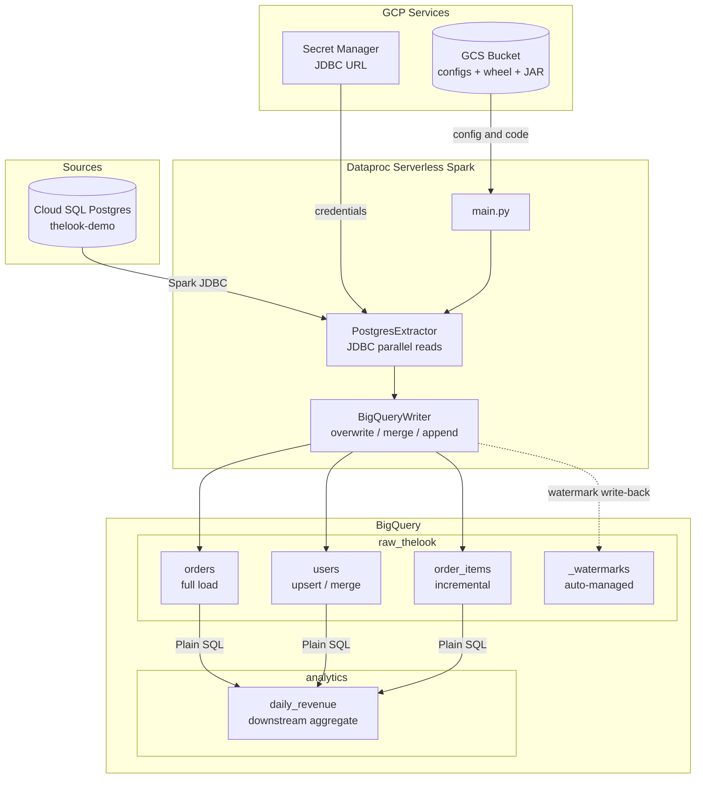
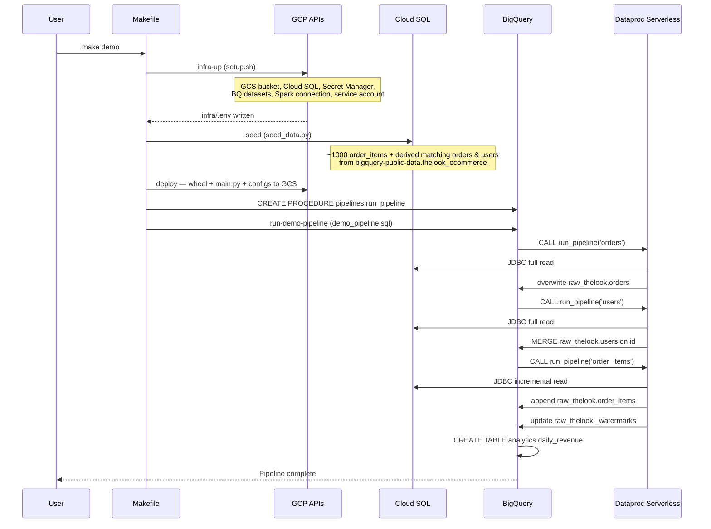

# BigQuery + Dataproc Serverless Spark ETL

A self-contained demo showing how to run a Spark-based ETL pipeline entirely within the BigQuery ecosystem — no Databricks, no persistent Spark clusters, no intermediate file storage.

**What this demonstrates:**

- Extract data from a Cloud SQL Postgres database using Spark JDBC on **Dataproc Serverless** (pay-per-job, no cluster management)
- Load into **BigQuery** natively — with full load, incremental (watermark), and upsert (MERGE) write modes
- Expose the pipeline as a **BigQuery Spark Stored Procedure** so it can be triggered by a plain `CALL` statement — from the BQ console, a SQL script, Dataform, or Cloud Composer
- Run a downstream **BigQuery SQL transform** on top of the ingested data — all in one SQL script

**Estimated demo cost:** ~$0.50–$1.00 (Cloud SQL + Dataproc Serverless + BQ queries for ~1h total)

---

## Architecture



### End-to-end demo flow



### How the pipeline is triggered

The Spark job is registered as a **BigQuery Spark Stored Procedure**. Any tool that can issue a `CALL` statement can trigger it:

```sql
CALL `my-project.pipelines.run_pipeline`(
    'thelook', 'public', 'orders', 'my-bucket', GENERATE_UUID()
);
```

The full 2-step demo (`sql/demo_pipeline.sql`) ingests 3 tables and builds a downstream aggregate — all in SQL, no orchestration tooling required.

### Dual execution modes

The same `pipeline/main.py` runs in two modes without code changes:

| Mode | How | Parameters |
|------|-----|------------|
| **Dataproc Serverless Batch** | `gcloud dataproc batches submit pyspark` | `argparse` CLI args |
| **BigQuery Spark Stored Procedure** | `CALL project.dataset.run_pipeline(...)` | `BIGQUERY_PROC_PARAM.*` env vars (injected by BQ runtime) |

Detection: checks for the `BIGQUERY_PROC_PARAM.*` environment variable prefix that BigQuery Spark injects at runtime. This is more reliable than importing `bigquery.spark.procedure`, which can fail with a protobuf version mismatch inside the BQ Spark runtime.

---

## Quick start (one command)

```bash
GCP_PROJECT=my-project GCP_REGION=us-central1 make demo
```

This runs `infra-up` → `seed` → `deploy` → `run-demo-pipeline` end-to-end.

When done:

```bash
make infra-down   # deletes all GCP resources
```

---

## Step-by-step walkthrough

### Prerequisites

- Python 3.11+, [`uv`](https://docs.astral.sh/uv/)
- `gcloud` CLI authenticated: `gcloud auth login && gcloud auth application-default login`
- A GCP project with a billing account

> **Authentication note:** Local scripts (`seed_data.py`, Makefile targets) use Application Default Credentials (ADC) — set up with `gcloud auth application-default login`. Spark jobs running on Dataproc Serverless use the dedicated service account created by `infra/setup.sh`, not your personal credentials.

### 1. Install dependencies

```bash
uv sync --all-extras
```

### 2. Provision GCP infrastructure

```bash
GCP_PROJECT=my-project GCP_REGION=us-central1 make infra-up
```

Creates and writes all resource names to `infra/.env`:

| Resource | Details |
|----------|---------|
| GCS bucket | Pipeline artifacts: wheel, `main.py`, JDBC JAR, YAML configs |
| Cloud SQL Postgres | `db-f1-micro`, public IP (`0.0.0.0/0` authorized — **demo only, not for production**), 10 GB HDD |
| Secret Manager secret | JDBC URL (host + credentials, never in config files) |
| BQ datasets | `raw_thelook` (ingestion), `analytics` (transforms), `pipelines` (procedure) |
| BQ Spark connection | Links the stored procedure to Dataproc Serverless |
| Service account | Least-privilege SA, IAM roles auto-assigned |

### 3. Seed the source database

```bash
make seed
```

Seeds Cloud SQL Postgres with ~1000 `order_items` rows from `bigquery-public-data.thelook_ecommerce`, then derives the exact set of matching `orders` and `users` rows to maintain referential integrity. The seed script (`scripts/seed_data.py`) is standalone — it does not use any pipeline code.

### 4. Build and deploy

```bash
make deploy
```

Builds the Python wheel, uploads all artifacts to GCS, and creates/replaces the BigQuery Spark Stored Procedure.

### 5. Run the demo pipeline

```bash
make run-demo-pipeline
```

Executes `sql/demo_pipeline.sql` via `bq query`:

**Step 1 — Ingest (Spark):**

```sql
CALL `my-project.pipelines.run_pipeline`('thelook','public','orders','my-bucket', GENERATE_UUID());
CALL `my-project.pipelines.run_pipeline`('thelook','public','users','my-bucket', GENERATE_UUID());
CALL `my-project.pipelines.run_pipeline`('thelook','public','order_items','my-bucket', GENERATE_UUID());
```

Each `CALL` spins up a Dataproc Serverless Spark job, reads from Cloud SQL, and writes to `raw_thelook`.

**Step 2 — Transform (BigQuery SQL, simplified — see `sql/demo_pipeline.sql` for the full query):**

```sql
CREATE OR REPLACE TABLE `my-project.analytics.daily_revenue`
PARTITION BY order_date CLUSTER BY country
AS
SELECT
  DATE(oi.created_at) AS order_date,
  u.country, u.gender, o.status AS order_status,
  COUNT(DISTINCT oi.order_id) AS total_orders,
  ROUND(SUM(oi.sale_price), 2) AS total_revenue
FROM `raw_thelook.order_items` AS oi
INNER JOIN `raw_thelook.orders` AS o USING (order_id)
INNER JOIN `raw_thelook.users`  AS u ON oi.user_id = u.id
GROUP BY 1, 2, 3, 4;
```

### 6. Verify in BigQuery

```sql
-- Ingested tables
SELECT COUNT(*) FROM `my-project.raw_thelook.orders`;
SELECT COUNT(*) FROM `my-project.raw_thelook.users`;
SELECT COUNT(*) FROM `my-project.raw_thelook.order_items`;

-- Watermark (proves incremental tracking state)
SELECT * FROM `my-project.raw_thelook._watermarks`;

-- Downstream aggregate
SELECT * FROM `my-project.analytics.daily_revenue`
ORDER BY order_date DESC, total_revenue DESC
LIMIT 20;
```

### 7. Tear down

```bash
make infra-down
```

Deletes the Cloud SQL instance, GCS bucket, Secret Manager secret, BQ datasets, Spark connection, and service account.

---

## Write modes demonstrated

| Table | Write mode | Behaviour |
|-------|-----------|-----------|
| `orders` | `overwrite` | Full table replacement on every run |
| `users` | `merge` | BQ MERGE DML — upsert on `id`, idempotent |
| `order_items` | `append` + watermark | Only rows newer than last run are extracted |

The watermark for `order_items` is stored in `raw_thelook._watermarks` and updated after each successful write. On first run, all rows are extracted.

---

## Project structure

```
bq_spark_serverless_etl/
├── pipeline/
│   ├── main.py              # Dual entry point: Dataproc CLI + BQ stored proc
│   ├── config.py            # Pydantic v2 config models, GCS YAML loader, Secret Manager
│   ├── registry.py          # Extractor/writer registry
│   ├── extractors/
│   │   ├── base.py          # Abstract BaseExtractor
│   │   └── postgres.py      # JDBC extractor (parallel reads, incremental, watermark)
│   └── writers/
│       ├── base.py          # Abstract BaseWriter
│       └── bigquery.py      # BQ writer (overwrite/append/merge, watermark write-back)
├── configs/
│   ├── demo/
│   │   ├── orders.yaml      # Full load
│   │   ├── users.yaml       # Merge / upsert
│   │   └── order_items.yaml # Incremental
│   └── examples/
│       ├── postgres_to_bq.yaml
│       └── postgres_to_bq_incremental.yaml
├── sql/
│   ├── demo_pipeline.sql         # 2-step demo: 3x CALL + downstream SQL transform
│   └── create_stored_procedures.sql  # CREATE PROCEDURE definition
├── infra/
│   ├── setup.sh             # Provision all GCP resources
│   └── teardown.sh          # Delete all GCP resources
├── examples/
│   ├── quickstart.ipynb     # BQ Studio notebook: Spark Connect interactive walkthrough
│   └── README.md            # Prerequisites and usage guide for the notebook
├── scripts/
│   └── seed_data.py         # Load TheLook data from BQ public dataset -> Cloud SQL
├── tests/
│   ├── test_config.py
│   ├── test_registry.py
│   └── test_postgres_extractor.py
├── pyproject.toml
└── Makefile
```

---

## Config file reference

Config files live at `gs://BUCKET/configs/SOURCE_NAME/DB_NAME/TBL_NAME.yaml`.

```yaml
source:
  type: postgres
  jdbc_url_secret: projects/MY_PROJECT/secrets/MY_SECRET/versions/latest
  table: public.orders
  # Optional: parallel JDBC reads (speeds up large tables)
  # partition_column: order_id
  # lower_bound: 1
  # upper_bound: 100000
  # num_partitions: 10
  fetch_size: 10000

target:
  project: my-gcp-project
  dataset: raw_thelook
  table: orders
  write_mode: overwrite       # overwrite | append | merge
  merge_keys: [id]            # required when write_mode=merge
  partition_field: created_at # optional: BQ time partitioning
  clustering_fields: [status] # optional: BQ clustering (max 4)

extraction:
  mode: full                  # full | incremental
  watermark_column: created_at  # required when mode=incremental
```

---

## Adding a new source type

Three steps, no changes to `main.py`, writers, or SQL:

**Step 1** — Create `pipeline/extractors/mysql.py`:

```python
from pipeline.config import PipelineConfig, resolve_secret
from pipeline.extractors.base import BaseExtractor
from pyspark.sql import DataFrame, SparkSession

class MySQLExtractor(BaseExtractor):
    def extract(self, spark: SparkSession, config: PipelineConfig) -> DataFrame:
        jdbc_url = resolve_secret(config.source.jdbc_url_secret)
        return (
            spark.read.format("jdbc")
            .option("url", jdbc_url)
            .option("driver", "com.mysql.cj.jdbc.Driver")
            .option("dbtable", config.source.table)
            .load()
        )
```

**Step 2** — Add to `SourceType` in `pipeline/config.py`:

```python
class SourceType(str, Enum):
    POSTGRES = "postgres"
    MYSQL    = "mysql"
```

**Step 3** — Register in `pipeline/registry.py`:

```python
from pipeline.extractors.mysql import MySQLExtractor

EXTRACTOR_REGISTRY = {
    SourceType.POSTGRES: PostgresExtractor,
    SourceType.MYSQL:    MySQLExtractor,
}
```

---

## IAM roles

Two service accounts are involved. `infra/setup.sh` creates and configures both automatically.

**Dataproc Serverless batch job SA** (`spark-etl-sa`) — runs the Spark job:

| Role | Purpose |
|------|---------|
| `roles/dataproc.worker` | Submit and run Dataproc Serverless batches |
| `roles/storage.objectAdmin` | Read/write pipeline artifacts in GCS |
| `roles/bigquery.dataEditor` | Read from and write to BigQuery tables |
| `roles/bigquery.jobUser` | Run BigQuery jobs |
| `roles/secretmanager.secretAccessor` | Resolve JDBC URL secrets |
| `roles/logging.logWriter` | Write Spark logs to Cloud Logging |

**BigQuery Spark connection SA** (auto-created by `bq mk --connection`) — used when invoking the stored procedure via `CALL`:

| Role | Purpose |
|------|---------|
| `roles/storage.objectViewer` | Read `main.py`, wheel, and JDBC JAR from GCS |
| `roles/bigquery.dataEditor` | Read from and write to BigQuery tables |
| `roles/bigquery.jobUser` | Run BigQuery jobs triggered by the stored procedure |
| `roles/secretmanager.secretAccessor` | Resolve JDBC URL secrets at procedure runtime |

---

## Makefile reference

| Target | Description |
|--------|-------------|
| `make infra-up` | Provision all GCP resources, write `infra/.env` |
| `make infra-down` | Delete all GCP resources |
| `make seed` | Load TheLook data from BQ public dataset into Cloud SQL |
| `make deploy` | Build wheel + upload to GCS + create BQ stored procedure |
| `make run-demo-pipeline` | Execute `sql/demo_pipeline.sql` via `bq query` |
| `make demo` | End-to-end: `infra-up` + `seed` + `deploy` + `run-demo-pipeline` |
| `make install` | Install all dependencies (`uv sync --all-extras`) |
| `make test` | Run unit tests |
| `make lint` | Run `ruff check` + `ruff format --check` |
| `make clean` | Remove build artifacts |

### Optional `submit-batch` variables

| Variable | Default | Description |
|----------|---------|-------------|
| `RUNTIME_VERSION` | `2.3` | Dataproc Serverless LTS runtime (GA since 2025-05-28) |
| `TTL` | `1h` | Max job lifetime — prevents runaway costs from hung jobs |
| `SERVICE_ACCOUNT` | *(from `infra/.env`)* | Spark job service account |
| `SUBNET` | *(Dataproc default)* | VPC subnet for private networking |
| `HISTORY_SERVER` | *(none)* | Persistent History Server for post-job Spark UI access |
