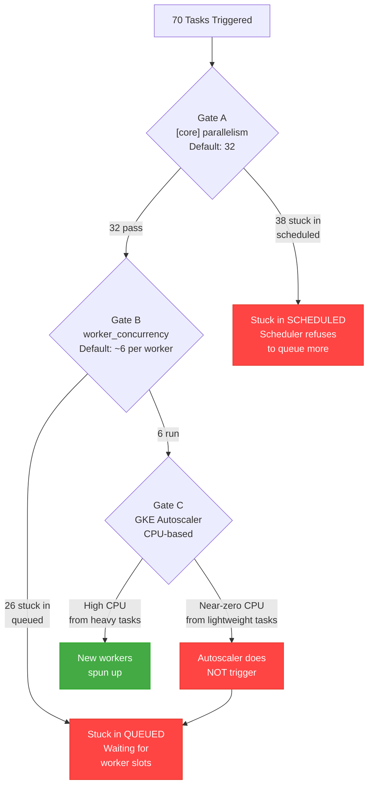
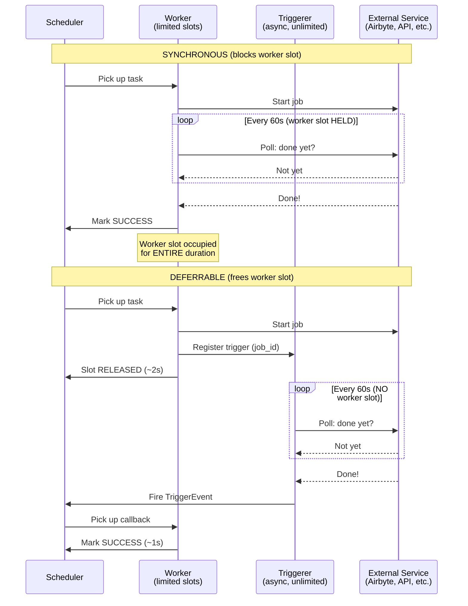
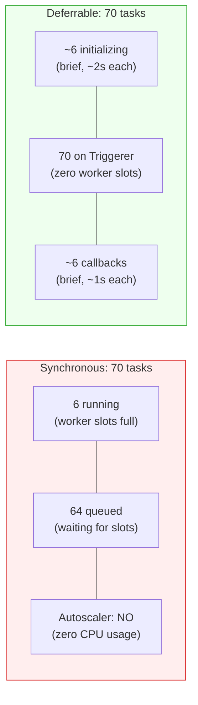
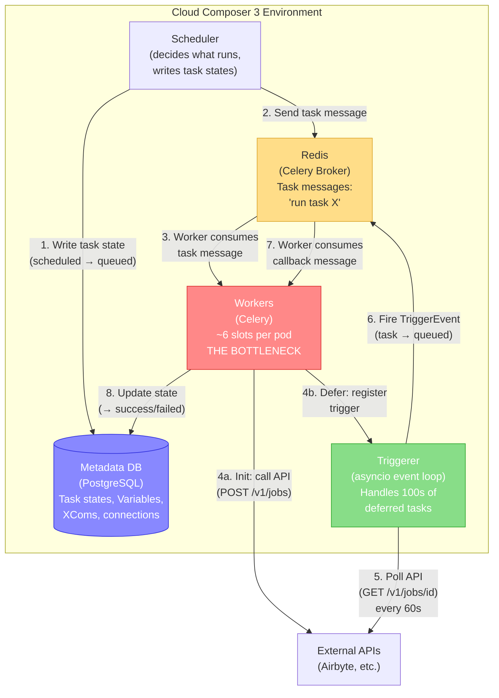
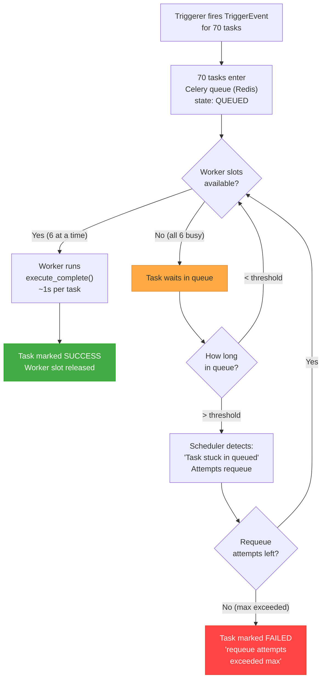
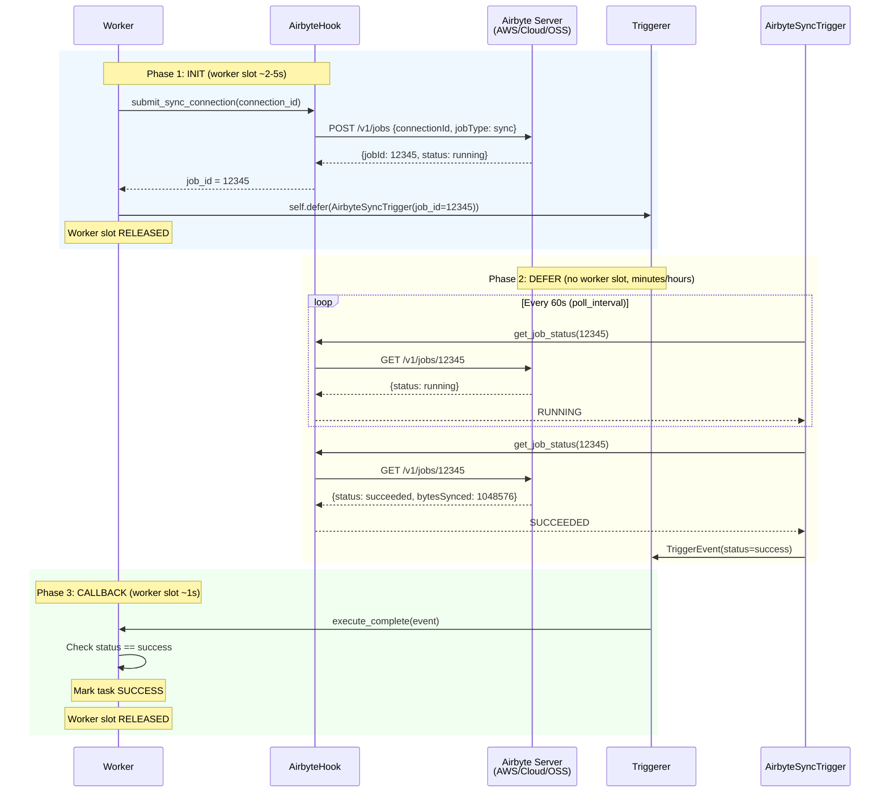
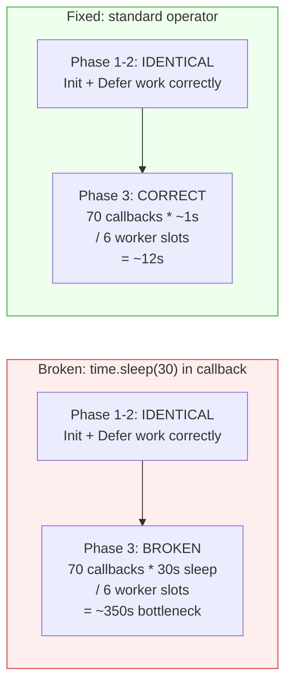

# Cloud Composer 3: Concurrency Bottleneck & Deferrable Operator Resolution

This document explains the concurrency bottleneck that occurs in Cloud Composer 3 when running a high volume of lightweight tasks (API polling, sensors, Airbyte syncs), and how **deferrable operators** resolve it.

## The Problem: Three Concurrency Gates

When tasks are triggered in Cloud Composer 3, they must pass through three sequential bottleneck gates before execution. Any one of these gates can silently block all tasks.



**Gate A: `[core]parallelism`** (default 32) -- Caps total tasks the scheduler will place into the executor queue. With 70 tasks, only 32 pass; the rest stay in `scheduled` state indefinitely.

**Gate B: `[celery]worker_concurrency`** (auto-calculated, ~6 on Small) -- Limits how many tasks a single worker pod runs simultaneously. Even if 32 tasks pass Gate A, only ~6 execute; the rest sit in `queued`.

**Gate C: GKE Autoscaler** -- Monitors CPU to decide whether to spin up more workers. Lightweight tasks (API polling, `time.sleep()`, sensors) consume near-zero CPU, so the autoscaler never triggers. Tasks remain stuck in `queued`.

### Configuration Fix

Override these settings to remove Gates A and B:

| Parameter | Formula | Example (70 tasks, 2 DAGs) |
|:---|:---|:---|
| `[core]parallelism` | `>= total concurrent tasks across all DAGs` | `150` |
| `[core]max_active_tasks_per_dag` | `>= max tasks in any single DAG` | `70` |
| `default_pool` slots | `>= [core]parallelism` | `150` |

But this alone doesn't solve Gate C -- tasks still saturate worker slots. That's where deferrable operators come in.

---

## The Solution: Deferrable Operators

Deferrable operators split task execution into three phases, freeing the worker slot during the long-running wait.

### Lifecycle: Synchronous vs Deferrable



### Worker Slot Usage: 70 Tasks



| Metric | Synchronous | Deferrable |
|:---|:---|:---|
| Worker slots during wait | **70** (all occupied) | **0** (on Triggerer) |
| Workers required | 12+ (autoscaler won't trigger) | **1** |
| Total duration (10-min syncs) | ~2 hours (serial batches) | ~11 minutes (parallel on Triggerer) |
| OOM risk | High (if `worker_concurrency` forced up) | None |

---

## How the Components Work Together

Cloud Composer 3 has five key components. Understanding which component does what -- and where the bottleneck occurs -- is essential for diagnosing concurrency issues.

### Infrastructure Architecture



### Who Calls What in Each Phase

| Phase | Component | What it does | Calls external API? | Worker slot held? |
|:---|:---|:---|:---|:---|
| **Init** | **Worker** | Submits job to external service (e.g., `POST /v1/jobs`), then calls `self.defer()` | **Yes** -- Worker makes the HTTP call | **Yes** (~2-5s) |
| **Defer** | **Triggerer** | Polls job status (e.g., `GET /v1/jobs/{id}`) via asyncio event loop every 60s | **Yes** -- Triggerer makes the HTTP calls | **No** |
| **Callback** | **Worker** | Reads the trigger event, checks status, marks task success or failed | **No** -- just reads the event dict | **Yes** (~1s) |

Key points:
- The **Worker** makes the initial API call (Phase 1). If the external API is slow/stuck, the worker slot is held until the HTTP request times out.
- The **Triggerer** makes all polling calls (Phase 2). If the API is stuck, only that trigger's thread blocks -- other triggers continue running (asyncio). The task stays in `deferred` state until the trigger's timeout fires.
- The **Callback** (Phase 3) does NOT call any external API. It only reads the event from the triggerer and updates the task state. This should take ~1 second.

### The Callback Bottleneck (Why Tasks Get "Stuck in Queued")

When all 70 tasks complete their defer phase and need a worker slot for the callback, they go through the Celery queue (Redis). If workers are busy, tasks wait:



**With correct callbacks (~1s each):** 70 tasks / 6 slots * 1s = ~12 seconds. No task gets stuck.

**With `time.sleep(30)` in callback:** 70 tasks / 6 slots * 30s = ~350 seconds (~6 min). Later tasks wait in `queued` long enough to trigger the "stuck in queued" detection.

**With `time.sleep(180)` in callback (original bug):** 70 tasks / 6 slots * 180s = ~35 minutes. Tasks regularly hit the requeue limit and are marked `failed`.

### Failure Modes

| Failure | Cause | Component affected | Impact |
|:---|:---|:---|:---|
| **External API stuck during init** | Service unresponsive | Worker holds slot until HTTP timeout (default 3600s) | 1 worker slot blocked for up to 1 hour |
| **External API stuck during polling** | Service unresponsive | Triggerer thread blocks | Other triggers unaffected (asyncio isolation). Task stays `deferred` until trigger timeout. |
| **Callback can't get worker slot** | All workers busy (other callbacks or inits) | Redis queue grows | `Task stuck in queued` → requeue attempts → if exceeded: `FAILED` |
| **`time.sleep()` in callback** | Application bug | Worker slot held unnecessarily | Cascading failure: blocks other callbacks → more tasks stuck → more failures |
| **Metadata DB slow** | Heavy Variable/XCom writes, high connection count | Scheduler slows down | Delayed state updates, slow "stuck in queued" detection, scheduler heartbeat warnings |
| **Redis broker overloaded** | Too many queued messages | Task delivery delayed | Rare in Composer 3 (Google-managed). Would manifest as tasks slow to transition from `queued` to `running`. |

---

## Airbyte-Specific Flow

When using `AirbyteTriggerSyncOperator(deferrable=True)`, the deferrable lifecycle applies to Airbyte sync jobs.



### Using the Standard Operator

```python
from airflow.providers.airbyte.operators.airbyte import AirbyteTriggerSyncOperator

sync_task = AirbyteTriggerSyncOperator(
    task_id="airbyte_sync",
    connection_id="<airbyte_connection_uuid>",
    airbyte_conn_id="airbyte_default",
    deferrable=True,                       # Offload polling to Triggerer
    timeout=7200,                          # 2-hour timeout
    wait_seconds=60,                       # Poll interval (non-deferrable only)
    retries=5,                             # Airflow-native retry
    retry_delay=timedelta(minutes=3),      # Backoff between retries
)
```

> **Important:** In deferrable mode, the trigger's `poll_interval` is hardcoded to 60 seconds in the provider ([source](https://airflow.apache.org/docs/apache-airflow-providers-airbyte/stable/_modules/airflow/providers/airbyte/operators/airbyte.html)). The `wait_seconds` parameter only applies in non-deferrable mode. For production Airbyte syncs (5-60+ minutes), 60s polling is appropriate.

### Anti-Pattern: `time.sleep()` in Callbacks

Do NOT call `time.sleep()` inside `execute_complete()` for retry backoff. This blocks a worker slot, defeating the deferrable pattern.

```python
# BAD: blocks worker slot for 3 minutes during retry
def execute_complete(self, context, event=None):
    if event["status"] == "error":
        time.sleep(180)              # Worker slot HELD for 3 minutes!
        return self.execute(context)  # Recursive re-trigger

# GOOD: use Airflow's native retry (no worker slot during backoff)
AirbyteTriggerSyncOperator(
    ...
    deferrable=True,
    retries=5,                        # Airflow manages retry scheduling
    retry_delay=timedelta(minutes=3), # Scheduler waits, NOT the worker
)
```

### Demonstrating the Anti-Pattern

This repository includes two DAGs for a side-by-side comparison:

| DAG | Callback behavior | Expected total time (70 tasks) |
|:---|:---|:---|
| `airbyte_broken_stress_test.py` | `time.sleep(30)` in callback | ~9-10 minutes |
| `airbyte_deferrable_stress_test.py` | Standard operator (~1s callback) | ~4-5 minutes |

Both DAGs use the same mock Airbyte server and the same deferrable pattern for Phase 1 (init) and Phase 2 (defer). The **only** difference is Phase 3 (callback).



To run the comparison:
1. Deploy the mock Airbyte server and set up the environment (see [Running the Airbyte Deferrable Stress Test](#running-the-airbyte-deferrable-stress-test))
2. Upload both DAGs to the DAG bucket:
   ```bash
   gsutil cp dags/airbyte_broken_stress_test.py ${DAG_BUCKET}/
   gsutil cp dags/airbyte_deferrable_stress_test.py ${DAG_BUCKET}/
   ```
3. Trigger `airbyte_broken_stress_test` first, wait for completion (~10 min)
4. Trigger `airbyte_deferrable_stress_test`, wait for completion (~5 min)
5. Compare the total run times and the callback phase duration in the Airflow UI

The broken DAG clearly shows that even when Phase 1-2 (deferral) works correctly, blocking the worker in Phase 3 (callback) undoes all the concurrency gains.

---

## Mock Airbyte Server

For testing the deferrable pattern without a real Airbyte deployment, this repository includes a mock Airbyte API server. See [`mock_airbyte/`](mock_airbyte/) for deployment instructions.

The mock simulates:
- `POST /v1/jobs` -- Creates a sync job (returns `running` status)
- `GET /v1/jobs/{id}` -- Returns `running` for a configurable duration, then `succeeded`
- `GET /v1/health` -- Health check

Deploy to Cloud Run:
```bash
cd mock_airbyte
./deploy.sh <PROJECT_ID> [REGION] [SYNC_DURATION_SECONDS]
```

---

## Running the Airbyte Deferrable Stress Test

Step-by-step guide to run 70 concurrent `AirbyteTriggerSyncOperator(deferrable=True)` tasks against the mock Airbyte server on an existing Cloud Composer 3 environment.

### Prerequisites

- An existing Composer 3 environment (or create one using the notebook Stage 2)
- Configuration overrides already applied: `core-parallelism=150`, `core-max_active_tasks_per_dag=150`
- `gcloud` CLI authenticated with editor/owner access to the project

### Step 1: Deploy Mock Airbyte to Cloud Run (~2 min)

```bash
cd mock_airbyte
./deploy.sh <PROJECT_ID> <REGION> 120

# Example:
# ./deploy.sh my-project us-central1 120
#
# Note the SERVICE_URL from the output, e.g.:
# https://mock-airbyte-xxxxx-uc.a.run.app
```

The `120` sets `SYNC_DURATION_SECONDS` -- how long each mock sync takes before returning `succeeded`. Use `120` for realistic timing (matches the 60s poll interval well).

### Step 2: Install Airbyte Provider (~10-15 min)

This triggers a full environment rebuild (all components restart).

```bash
gcloud composer environments update <ENV> \
    --location=<REGION> \
    --project=<PROJECT_ID> \
    --update-pypi-packages=apache-airflow-providers-airbyte>=5.4.1
```

Wait for the environment state to return to `RUNNING`:
```bash
gcloud composer environments describe <ENV> \
    --location=<REGION> \
    --format="value(state)"
```

### Step 3: Create Airflow Connection (~1 min)

```bash
gcloud composer environments run <ENV> \
    --location=<REGION> \
    connections add -- airbyte_default \
    --conn-type airbyte \
    --conn-host '<SERVICE_URL>/v1'

# Example:
# --conn-host 'https://mock-airbyte-xxxxx-uc.a.run.app/v1'
```

Leave Login (Client ID) and Password (Client Secret) blank -- the mock runs without authentication (Airbyte OSS mode).

### Step 4: Get DAG Bucket and Upload Test DAG (~1 min)

```bash
# Get the DAG bucket path
DAG_BUCKET=$(gcloud composer environments describe <ENV> \
    --location=<REGION> \
    --format="value(config.dagGcsPrefix)")

# Upload the test DAG
gsutil cp dags/airbyte_deferrable_stress_test.py ${DAG_BUCKET}/

# Wait for DAG processor to parse (60-90 seconds)
sleep 90

# Verify the DAG is visible
gcloud composer environments run <ENV> --location=<REGION> \
    dags list -- --output table | grep airbyte
```

### Step 5: Trigger and Monitor (~5 min)

```bash
# Unpause the DAG
gcloud composer environments run <ENV> --location=<REGION> \
    dags unpause -- airbyte_deferrable_stress_test

# Trigger the DAG
gcloud composer environments run <ENV> --location=<REGION> \
    dags trigger -- airbyte_deferrable_stress_test

# Note the run_id from the output (e.g., manual__2026-05-30T07:17:03.527520+00:00)
```

Wait ~5 minutes (init phase + 120s sync + 60s poll interval + callback phase), then check results:

```bash
gcloud composer environments run <ENV> --location=<REGION> \
    tasks states-for-dag-run -- \
    airbyte_deferrable_stress_test "<RUN_ID>" --output table
```

### Expected Results

- **70/70 tasks succeed**
- Each task lifecycle: `queued` -> `running` (init, ~2-5s) -> `deferred` (on triggerer, ~120-180s) -> `queued` (callback pending) -> `running` (callback, ~1s) -> `success`
- Total wall time: ~4-5 minutes
- Worker slots occupied: only ~6 at any moment (for init/callback phases)
- Triggerer handles all 70 tasks concurrently during the defer phase

### Step 6: Cleanup

```bash
# Remove the test DAG
gsutil rm ${DAG_BUCKET}/airbyte_deferrable_stress_test.py

# Remove the Airflow connection
gcloud composer environments run <ENV> --location=<REGION> \
    connections delete -- airbyte_default

# Delete the Cloud Run mock service
gcloud run services delete mock-airbyte \
    --region=<REGION> \
    --project=<PROJECT_ID> \
    --quiet

# (Optional) Remove the Airbyte provider package
gcloud composer environments update <ENV> \
    --location=<REGION> \
    --remove-pypi-packages=apache-airflow-providers-airbyte
```

### Note on Timing

The `AirbyteSyncTrigger`'s `poll_interval` is hardcoded to **60 seconds** in the provider ([source](https://airflow.apache.org/docs/apache-airflow-providers-airbyte/stable/_modules/airflow/providers/airbyte/operators/airbyte.html)). The `wait_seconds` parameter on the operator only applies in non-deferrable mode. This means:

- With `SYNC_DURATION=120s`: each task spends ~120-180s in `deferred` state (2 poll cycles)
- With `SYNC_DURATION=30s`: each task spends ~60-90s in `deferred` state (1 poll cycle, but 30s of wasted wait)

For production Airbyte syncs (5-60+ minutes), the 60s poll interval is negligible overhead. Use `SYNC_DURATION=120` for testing to get realistic behavior.

---

## Repository Structure

```
composer_concurrency_stress_test/
  ARCHITECTURE.md                           # This document
  composer_concurrency_stress_test.ipynb    # End-to-end notebook (TimeDeltaSensor test)
  dags/
    airbyte_broken_stress_test.py           # Anti-pattern demo (time.sleep in callback)
    airbyte_deferrable_stress_test.py       # 70-task Airbyte deferrable test DAG (correct)
  mock_airbyte/
    main.py                                 # Flask mock Airbyte API
    Dockerfile                              # Cloud Run container
    requirements.txt                        # Python dependencies
    deploy.sh                               # Deployment script
```

## References

- [Cloud Composer 3 - Deferrable Operators](https://docs.cloud.google.com/composer/docs/composer-3/use-deferrable-operators)
- [Cloud Composer 3 - Optimize Environments](https://docs.cloud.google.com/composer/docs/composer-3/optimize-environments)
- [Cloud Composer 3 - Override Airflow Configurations](https://docs.cloud.google.com/composer/docs/composer-3/override-airflow-configurations)
- [Apache Airflow - Deferring Tasks](https://airflow.apache.org/docs/apache-airflow/stable/concepts/deferring.html)
- [Airbyte Provider - AirbyteTriggerSyncOperator](https://airflow.apache.org/docs/apache-airflow-providers-airbyte/stable/operators/airbyte.html)
- [Airbyte Provider - Changelog](https://airflow.apache.org/docs/apache-airflow-providers-airbyte/stable/changelog.html)
