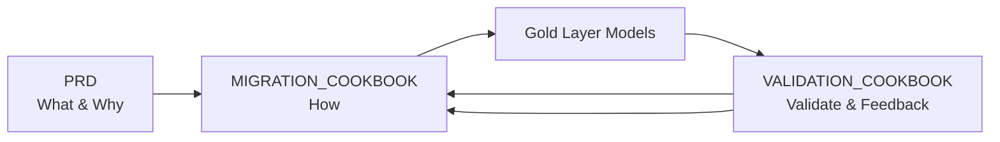

# DBT Gold Layer Migration Cookbook - Template

## Overview

This cookbook provides a systematic approach for migrating DBT silver models to the gold layer, preserving all business logic.

**Key Principle**: Migrate models one at a time, compile, run, validate, then move to the next.

## Configuration

**CRITICAL**: This cookbook uses configuration from `config/migration_config.yaml`.

Before using this template, ensure the config file is properly set up with your project-specific values.

## How to Use This Template

**Prerequisites:**
1. **Configure `config/migration_config.yaml`** - Set your project-specific values
2. **Complete a PRD using `prd_generator/PRD_GENERATOR_COOKBOOK.md`** - REQUIRED before starting migration
3. Review and approve PRD with stakeholders
4. Use this cookbook as implementation guide

**Customization Steps:**
1. The migration_cookbook_generator subagent will replace all `[placeholder]` values
2. Model lists are populated from your PRD
3. Validation queries use config values
4. Follow the sequential migration process one model at a time

**Note**: This is a template. All sections marked with `[brackets]` require customization.

## Project Context

### Business Problem
The `[downstream_model_name]` model ([N] lines) has [X] dependencies including [Y] silver models that contain business logic and transformations.

### Solution
Migrate [N] models to gold layer (`[target_project].[target_dataset]`), replicating all business logic and reading from silver layer (`{{ config.gcp.projects.silver }}`).

### Data Architecture (Bronze/Silver/Gold Medallion)
```
{{ config.gcp.projects.bronze }}   → Bronze layer (raw ingestion)
{{ config.gcp.projects.silver }}   → Silver layer (SOURCE - transformed)
[target_project]                   → Gold layer (TARGET - curated)
```

## Quick Reference

### Migration Variables

```yaml
# Project Configuration (from config/migration_config.yaml)
SOURCE_PROJECT: "{{ config.project.name }}"
TARGET_GCP_PROJECT: "[target_project]"
TARGET_DATASET: "[target_dataset]"
SILVER_GCP_PROJECT: "{{ config.gcp.projects.silver }}"
GOLD_PROJECT: "{{ config.gcp.projects.gold }}"
GOLD_SCHEMA: "{{ config.gcp.schemas.gold }}"
BILLING_PROJECT: "{{ config.gcp.billing_project }}"

# Migration Scope (from PRD)
TOTAL_MODELS: [N]
[CATEGORY_1]_MODELS: [X]
[CATEGORY_2]_MODELS: [Y]
```

### Migration Workflow

```
Step 0: Prerequisites & Setup
    ↓
Step 1: Create Directory Structure
    ↓
Step 2: Migrate Models (One at a Time)
    ↓
Step 3: Update Sources Configuration
    ↓
Step 4: [MANUAL] Update Downstream Models
    ↓
Result: Validated Gold Layer Models
```

## Models to Migrate

| # | Model Name | Source Type | Silver Source | Target | Business Logic |
|---|------------|-------------|---------------|--------|----------------|
| 1 | [model_1_name] | [Silver/Seed] | `{{ config.gcp.projects.silver }}.[schema].[table]` | `[target_project].[target_dataset]` | [Brief description] |
| 2 | [model_2_name] | [Silver/Seed] | `{{ config.gcp.projects.silver }}.[schema].[table]` | `[target_project].[target_dataset]` | [Brief description] |

## Prerequisites

### 3-Way Model Framework



### Project Requirements
- [ ] **config/migration_config.yaml configured**
- [ ] **PRD document created**
- [ ] **VALIDATION_COOKBOOK ready at `migration_validator/VALIDATION_COOKBOOK.md`**
- [ ] Migration scope documented in PRD
- [ ] PRD approved by stakeholders

### Required Access
- BigQuery permissions for `[target_project]` (target gold layer project)
- BigQuery read permissions for `{{ config.gcp.projects.silver }}` (silver)
- DBT CLI access

---

## Step 0: Configuration Setup

### Step 0.1: Verify Configuration

Ensure `config/migration_config.yaml` contains correct values:

```bash
python config/config_loader.py
```

This should display your project configuration summary.

### Step 0.2: Define Migration Parameters

Verify these values from your PRD match the config:

```yaml
# From config/migration_config.yaml
project:
  name: "{{ config.project.name }}"

gcp:
  billing_project: "{{ config.gcp.billing_project }}"
  projects:
    bronze: "{{ config.gcp.projects.bronze }}"
    silver: "{{ config.gcp.projects.silver }}"
    gold: "{{ config.gcp.projects.gold }}"
```

### Step 0.3: Verify PRD Exists

```bash
ls prd_generator/outputs/[model_name]_dbt_refactoring_prd.md
```

---

## Step 1: Create Directory Structure

### Step 1.1: Create Gold Layer Directories

```bash
mkdir -p {{ config.dbt.gold_models }}/[category]
```

### Step 1.2: Verify Directory Structure

```bash
ls -la {{ config.dbt.gold_models }}/
```

---

## Step 2: Migrate Models (ONE AT A TIME)

**CRITICAL**: Complete all steps for each model before moving to the next.

### Step 2.1: Create Gold Model

For each model in the "Models to Migrate" table:

1. **Read the silver model** from `{{ config.dbt.silver_models }}/[model_name].sql`

2. **Create gold model** at `{{ config.dbt.gold_models }}/[category]/[model_name].sql`

3. **Use this structure**:

```sql
{{ config(
    materialized='table',
    partition_by={
        "field": "[partition_field]",
        "data_type": "timestamp",
        "granularity": "day"
    },
    cluster_by=["[cluster_field_1]", "[cluster_field_2]"],
    tags=["gold", "[category]", "[source]"],
    project="[target_project]",
    database="[target_project]",
    schema="[target_dataset]"
) }}

{#
  Gold Model: [model_name]
  Source: {{ config.gcp.projects.silver }}.[schema].[table]
  Business Logic: [description from PRD]
  Created: [date]
#}

WITH source AS (
    -- Read from silver layer
    SELECT *
    FROM `{{ config.gcp.projects.silver }}.[schema].[table]`
),

-- [COPY ALL BUSINESS LOGIC CTEs FROM SILVER MODEL]

renamed AS (
    SELECT
        -- [ALL FIELDS FROM SILVER MODEL]

        -- Audit fields
        CURRENT_TIMESTAMP() AS gold_loaded_at,
        '[source_system]' AS gold_source_system
    FROM [final_cte]
)

SELECT * FROM renamed
```

### Step 2.2: Compile and Run

```bash
# Compile to verify SQL
poetry run dbt compile --select [model_name]

# Run to create table
poetry run dbt run --select [model_name]
```

**Verify in BigQuery**:
```sql
SELECT COUNT(*) FROM `[target_project].[target_dataset].[model_name]`
```

### Step 2.3: Intelligent Validation (Delegate to Subagent)

**CRITICAL**: Use the validation_subagent for comprehensive validation with RCA.

```
Use the validation_subagent to validate:
- New table: `[target_project].[target_dataset].[model_name]`
- Current table: `{{ config.gcp.projects.silver }}.{{ config.gcp.schemas.silver }}.[model_name]`
Using config: config/migration_config.yaml
```

The validation subagent will:
1. Analyze both tables (schema, row counts, key columns)
2. Design intelligent tests (5-20 based on complexity)
3. Generate validation metrics document
4. Create Python validation script
5. Execute validation
6. Generate comprehensive report with deployment decision

**If validation passes** (APPROVED FOR DEPLOYMENT):
- Proceed to Step 2.4

**If validation fails** (NOT READY FOR DEPLOYMENT):
- Review the RCA in validation report
- Proceed to Step 2.3.3

### Step 2.3.3: SQL Refinement Loop (If Validation Failed)

When validation fails, the subagent provides RCA and remediation SQL.

**Refinement Process:**

1. **Review RCA** in validation report:
   - Identify root cause
   - Review investigation SQL results
   - Note remediation SQL provided

2. **Apply Remediation**:
   - Edit `{{ config.dbt.gold_models }}/[category]/[model_name].sql`
   - Apply the remediation SQL changes
   - Document what was changed

3. **Request Confirmation**:
   ```
   I've identified the issue and prepared the following fix:
   - Issue: [description from RCA]
   - Fix: [description of change]
   - Remediation SQL applied: [yes/no]

   Would you like me to proceed with recompiling and re-validating?
   ```

4. **Recompile and Re-run**:
   ```bash
   poetry run dbt compile --select [model_name]
   poetry run dbt run --select [model_name]
   ```

5. **Re-validate**:
   ```
   Use the validation_subagent to validate:
   - New table: `[target_project].[target_dataset].[model_name]`
   - Current table: `{{ config.gcp.projects.silver }}.{{ config.gcp.schemas.silver }}.[model_name]`
   Using config: config/migration_config.yaml
   ```

6. **Document Refinement**:
   - Record iteration in MIGRATION_NOTES.md
   - Note original issue and applied fix

**Iteration Limit**: One refinement attempt per model. If still failing after refinement, escalate for manual review.

### Step 2.4: Document Migration

Add entry to `{{ config.outputs.cookbooks }}/MIGRATION_NOTES.md`:

```markdown
## Migration: [model_name]

### Date: [YYYY-MM-DD]

### Model Details
- **Source Model**: `{{ config.dbt.silver_models }}/[model_name].sql`
- **Gold Model**: `{{ config.dbt.gold_models }}/[category]/[model_name].sql`
- **Target Project**: [target_project]
- **Target Schema**: [target_dataset]
- **Source Data**: `{{ config.gcp.projects.silver }}.[schema].[table]`

### Issues Encountered
[None / Description of issues and resolution]

### Validation Results
- Status: [APPROVED / NOT READY]
- Tests: [X]/[Y] passed
- Refinement iterations: [0 / 1]

### Final Row Count
- Asset table: [X] rows
- Staging table: [Y] rows
- Difference: [Z]%
```

### Step 2.5: Confirm Success Before Next Model

**Checkpoint**: Before moving to the next model, confirm:

- [ ] Gold model created and running
- [ ] Validation APPROVED FOR DEPLOYMENT
- [ ] Documentation updated
- [ ] User confirmed ready for next model

```
Model [model_name] migration complete.

Status: APPROVED FOR DEPLOYMENT
Validation: [X]/[Y] tests passed

Ready to proceed to next model: [next_model_name]?
```

---

## Step 3: Update Sources Configuration

After all models are migrated, update `models/sources/gold_sources.yml`:

```yaml
version: 2

sources:
  - name: gold_[category]
    database: "[target_project]"
    schema: "[target_dataset]"
    tables:
      - name: [model_1_name]
        description: "Migrated from {{ config.gcp.projects.silver }}.{{ config.gcp.schemas.silver }}.[model_1_name]"
      - name: [model_2_name]
        description: "Migrated from {{ config.gcp.projects.silver }}.{{ config.gcp.schemas.silver }}.[model_2_name]"
      # ... additional models
```

---

## Step 3.5: Incremental Testing

Before updating downstream models, validate end-to-end:

```sql
-- Compare silver vs gold layer counts
SELECT
  '[model_name]' AS model,
  (SELECT COUNT(*) FROM `{{ config.gcp.projects.silver }}.{{ config.gcp.schemas.silver }}.[model_name]`) AS silver_count,
  (SELECT COUNT(*) FROM `[target_project].[target_dataset].[model_name]`) AS gold_count
```

---

## Step 4: Update Downstream Models (MANUAL)

**IMPORTANT**: This step requires careful planning and stakeholder coordination.

### Step 4.1: Identify Downstream Models

```bash
# Find models that reference migrated silver models
grep -r "[model_name]" {{ config.dbt.gold_models }}/
```

### Step 4.2: Update References

Change references from:
```sql
-- OLD
{{ ref('[model_name]') }}
```

To:
```sql
-- NEW
{{ source('gold_[category]', '[model_name]') }}
```

### Step 4.3: Verify and Deploy

```bash
# Compile to verify
poetry run dbt compile --select [downstream_model]

# Run with validation
poetry run dbt run --select [downstream_model]
```

---

## Troubleshooting

### Issue 1: Model Compilation Fails

**Symptom**: DBT compile throws error

**Solution**:
1. Check source table exists in silver layer
2. Verify column names match
3. Check Jinja syntax in config block

### Issue 2: Validation Fails

**Symptom**: Validation report shows NOT READY FOR DEPLOYMENT

**Solution**:
1. Review RCA in validation report
2. Check investigation SQL for specific discrepancies
3. Apply remediation SQL
4. Re-run validation

### Issue 3: Row Count Mismatch

**Symptom**: Gold table has different row count

**Solution**:
1. Compare source data timestamps
2. Check deduplication logic
3. Verify WHERE clauses match

### Issue 4: Permission Denied

**Symptom**: Cannot access target project

**Solution**:
1. Verify BigQuery permissions
2. Check billing project is correct: `{{ config.gcp.billing_project }}`
3. Request access if needed

---

## Best Practices

1. **One Model at a Time**: Complete full cycle before next model
2. **Always Validate**: Never skip validation step
3. **Document Everything**: Update MIGRATION_NOTES.md after each model
4. **Preserve Logic**: Copy business logic exactly from silver model
5. **Use Config**: All project names should come from config
6. **Get Confirmation**: Wait for user approval at checkpoints

---

## Appendix A: Common DBT Commands

```bash
# Parse project (regenerate manifest)
poetry run dbt parse

# Compile single model
poetry run dbt compile --select [model_name]

# Run single model
poetry run dbt run --select [model_name]

# Run with dependencies
poetry run dbt run --select +[model_name]

# List model dependencies
poetry run dbt ls --select +[model_name]
```

## Appendix B: Validation Quick Reference

For each model, validation subagent will:
- Generate table analysis JSON
- Create validation metrics document
- Generate Python validation script
- Execute validation
- Generate report with deployment decision

Files created:
```
migration_validator/outputs/[model_name]/
├── [model_name]_table_analysis.json
├── validation_metrics_[model_name].md
└── validation_report_[model_name]_[timestamp].md

migration_validator/scripts/[model_name]/
├── analyze_[model_name]_tables.py
└── validation_script_[model_name].py
```

## Appendix C: Config Reference

All configurable values come from `config/migration_config.yaml`:

| Placeholder | Config Path | Description |
|-------------|-------------|-------------|
| `{{ config.project.name }}` | `project.name` | DBT project name |
| `{{ config.gcp.billing_project }}` | `gcp.billing_project` | Billing project |
| `{{ config.gcp.projects.bronze }}` | `gcp.projects.bronze` | Bronze layer (raw) |
| `{{ config.gcp.projects.silver }}` | `gcp.projects.silver` | Silver layer (transformed) |
| `{{ config.gcp.projects.gold }}` | `gcp.projects.gold` | Gold layer (curated) |
| `{{ config.gcp.schemas.silver }}` | `gcp.schemas.silver` | Silver schema |
| `{{ config.gcp.schemas.gold }}` | `gcp.schemas.gold` | Gold schema |
| `{{ config.dbt.silver_models }}` | `dbt.silver_models` | Silver model path |
| `{{ config.dbt.gold_models }}` | `dbt.gold_models` | Gold model path |

---

**Template Version**: 2.0 (Generic)
**Last Updated**: [Date]
**Status**: Template - Requires Customization
