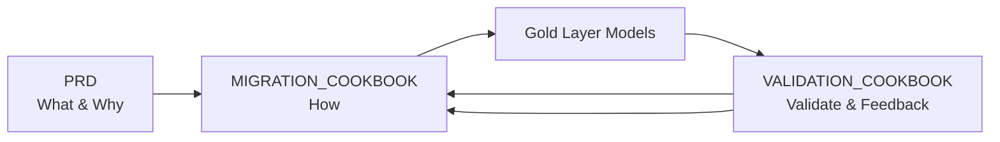

# DBT Gold Layer Migration Cookbook - fct_orders_broken

## Overview

This cookbook provides a systematic approach for refactoring the `fct_orders_broken` model in the gold layer to eliminate reliance on a fragmented intermediate Silver chain.

**Key Principle**: Migrate/Refactor one model at a time, compile, run, validate, then move to the next.

## Configuration

**CRITICAL**: This cookbook uses configuration from `config/migration_config.yaml`.

Before using this template, ensure the config file is properly set up with your project-specific values.

## How to Use This Cookbook

**Prerequisites:**
1. **Configure `config/migration_config.yaml`** - Set your project-specific values
2. **Complete a PRD using `prd_generator/PRD_GENERATOR_COOKBOOK.md`** - REQUIRED before starting migration
3. Review and approve PRD with stakeholders
4. Use this cookbook as implementation guide

**Customization Steps:**
1. The migration_cookbook_generator subagent has replaced all `[placeholder]` values
2. Model lists are populated from your PRD
3. Validation queries use config values
4. Follow the sequential migration process one model at a time

## Project Context

### Business Problem
The `fct_orders_broken` model currently consumes data from `int_orders_final_broken`, which is the end of a chain of 3 single-purpose transformations (`int_orders_cleaned_broken` → `int_orders_enriched_broken` → `int_orders_final_broken`). This pattern is inefficient and identified as "broken".

### Solution
Refactor `fct_orders_broken` to consume data directly from `stg_orders` (in `johanesa-playground-326616.sample_silver`), which encapsulates all the logic of the broken chain in a single, efficient step.

### Data Architecture (Bronze/Silver/Gold Medallion)
```
johanesa-playground-326616   → Bronze layer (raw ingestion)
johanesa-playground-326616   → Silver layer (SOURCE - transformed)
johanesa-playground-326616   → Gold layer (TARGET - curated)
```

## Quick Reference

### Migration Variables

```yaml
# Project Configuration (from config/migration_config.yaml)
SOURCE_PROJECT: "sample_project"
TARGET_GCP_PROJECT: "johanesa-playground-326616"
TARGET_DATASET: "sample_gold"
SILVER_GCP_PROJECT: "johanesa-playground-326616"
GOLD_PROJECT: "johanesa-playground-326616"
GOLD_SCHEMA: "sample_gold"
BILLING_PROJECT: "johanesa-playground-326616"

# Migration Scope (from PRD)
TOTAL_MODELS: 1
GOLD_MODELS: 1
```

### Migration Workflow

```
Step 0: Prerequisites & Setup
    ↓
Step 1: Create/Verify Directory Structure
    ↓
Step 2: Refactor Model
    ↓
Step 3: Update Sources Configuration
    ↓
Step 4: [MANUAL] Update Downstream Models (if any)
    ↓
Result: Validated Gold Layer Model
```

## Models to Migrate

| # | Model Name | Source Type | Silver Source | Target | Business Logic |
|---|------------|-------------|---------------|--------|----------------|
| 1 | fct_orders_broken | Silver | `johanesa-playground-326616.sample_silver.stg_orders` | `johanesa-playground-326616.sample_gold` | Refactor to use stg_orders directly |

## Prerequisites

### 3-Way Model Framework



### Project Requirements
- [x] **config/migration_config.yaml configured**
- [x] **PRD document created**
- [ ] **VALIDATION_COOKBOOK ready at `migration_validator/VALIDATION_COOKBOOK.md`**
- [x] Migration scope documented in PRD
- [x] PRD approved by stakeholders

### Required Access
- BigQuery permissions for `johanesa-playground-326616` (target gold layer project)
- BigQuery read permissions for `johanesa-playground-326616` (silver)
- DBT CLI access

---

## Step 0: Configuration Setup

### Step 0.1: Verify Configuration

Ensure `config/migration_config.yaml` contains correct values:

```bash
python config/config_loader.py
```

This should display your project configuration summary.

### Step 0.2: Define Migration Parameters

Verify these values from your PRD match the config:

```yaml
# From config/migration_config.yaml
project:
  name: "sample_project"

gcp:
  billing_project: "johanesa-playground-326616"
  projects:
    bronze: "johanesa-playground-326616"
    silver: "johanesa-playground-326616"
    gold: "johanesa-playground-326616"
```

### Step 0.3: Verify PRD Exists

```bash
ls prd_generator/outputs/fct_orders_broken_dbt_refactoring_prd.md
```

---

## Step 1: Create Directory Structure

### Step 1.1: Create Gold Layer Directories

```bash
mkdir -p sample_project/models/gold/gold
```

### Step 1.2: Verify Directory Structure

```bash
ls -la sample_project/models/gold/
```

---

## Step 2: Migrate Models (ONE AT A TIME)

**CRITICAL**: Complete all steps for each model before moving to the next.

### Step 2.1: Create/Update Gold Model

1. **Create/Update gold model** at `sample_project/models/gold/fct_orders_broken_migrated.sql` (temporarily using `_migrated` suffix to avoid conflict during validation)

2. **Use this structure** (based on PRD "NEW (Refactored)" SQL):

```sql
{{ config(
    materialized='table',
    partition_by={
        "field": "order_date",
        "data_type": "timestamp",
        "granularity": "day"
    },
    cluster_by=["customer_id", "order_status"],
    tags=["gold", "curated", "fact", "orders", "broken", "demo"],
    project="johanesa-playground-326616",
    schema="sample_gold"
) }}

{#
  Gold Model: fct_orders_broken
  Source: johanesa-playground-326616.sample_silver.stg_orders
  Business Logic: Refactored to eliminate reliance on broken intermediate chain.
  Created: 2026-01-16
#}

WITH orders AS (
    -- REFACTORED: Read from consolidated stg_orders
    SELECT *
    FROM {{ ref('stg_orders') }}
),

customers AS (
    SELECT
        customer_id,
        full_name AS customer_name,
        country_code AS customer_country
    FROM {{ ref('stg_customers') }}
),

order_items AS (
    SELECT *
    FROM {{ ref('stg_order_items') }}
),

-- Aggregate order items per order
order_item_summary AS (
    SELECT
        order_id,
        COUNT(DISTINCT line_id) AS total_line_items,
        SUM(quantity) AS total_units,
        COUNT(DISTINCT product_id) AS unique_products,
        SUM(line_total) AS subtotal,
        SUM(line_total_after_discount) AS subtotal_after_discount,
        SUM(line_total - line_total_after_discount) AS total_discount_amount
    FROM order_items
    GROUP BY order_id
),

-- Final fact table
final AS (
    SELECT
        -- Keys
        o.order_id,
        o.customer_id,
        o.order_date_key,

        -- Customer context
        c.customer_name,
        c.customer_country,

        -- Order details
        o.order_date,
        o.raw_status,
        o.order_status,
        o.status_category,

        -- Financial metrics
        o.total_amount AS order_total_original,
        o.currency AS original_currency,
        o.total_amount_usd AS order_total_usd,
        o.order_size_category,

        -- Line item metrics
        COALESCE(ois.total_line_items, 0) AS total_line_items,
        COALESCE(ois.total_units, 0) AS total_units,
        COALESCE(ois.unique_products, 0) AS unique_products,
        COALESCE(ois.subtotal, 0) AS line_items_subtotal,
        COALESCE(ois.subtotal_after_discount, 0) AS line_items_after_discount,
        COALESCE(ois.total_discount_amount, 0) AS total_discount_amount,

        -- Calculated metrics
        CASE
            WHEN ois.total_units > 0 THEN o.total_amount_usd / ois.total_units
            ELSE 0
        END AS avg_unit_price_usd,

        CASE
            WHEN ois.subtotal > 0 THEN ois.total_discount_amount / ois.subtotal
            ELSE 0
        END AS discount_rate,

        -- Order flags
        CASE WHEN o.order_status = 'COMPLETED' THEN TRUE ELSE FALSE END AS is_completed,
        CASE WHEN o.order_status = 'CANCELLED' THEN TRUE ELSE FALSE END AS is_cancelled,
        CASE WHEN ois.total_discount_amount > 0 THEN TRUE ELSE FALSE END AS has_discount,

        -- Time metrics
        o.created_at AS order_created_at,

        -- Audit fields (gold layer standard)
        CURRENT_TIMESTAMP() AS gold_loaded_at,
        'sample_project' AS gold_source_system

    FROM orders o
    LEFT JOIN customers c ON o.customer_id = c.customer_id
    LEFT JOIN order_item_summary ois ON o.order_id = ois.order_id
)

SELECT * FROM final
```

### Step 2.2: Compile and Run

```bash
# Compile to verify SQL
uv run dbt compile --select fct_orders_broken_migrated

# Run to create table
uv run dbt run --select fct_orders_broken_migrated
```

**Verify in BigQuery**:
```sql
SELECT COUNT(*) FROM `johanesa-playground-326616.sample_gold.fct_orders_broken_migrated`
```

### Step 2.3: Intelligent Validation (Delegate to Subagent)

**CRITICAL**: Use the validation_subagent for comprehensive validation with RCA.

```
Use the validation_subagent to validate:
- New table: `johanesa-playground-326616.sample_gold.fct_orders_broken_migrated`
- Current table: `johanesa-playground-326616.sample_gold.fct_orders_broken`
Using config: config/migration_config.yaml
```

The validation subagent will:
1. Analyze both tables (schema, row counts, key columns)
2. Design intelligent tests (5-20 based on complexity)
3. Generate validation metrics document
4. Create Python validation script
5. Execute validation
6. Generate comprehensive report with deployment decision

**If validation passes** (APPROVED FOR DEPLOYMENT):
- Proceed to Step 2.4

**If validation fails** (NOT READY FOR DEPLOYMENT):
- Review the RCA in validation report
- Proceed to Step 2.3.3

### Step 2.3.3: SQL Refinement Loop (If Validation Failed)

When validation fails, the subagent provides RCA and remediation SQL.

**Refinement Process:**

1. **Review RCA** in validation report:
   - Identify root cause
   - Review investigation SQL results
   - Note remediation SQL provided

2. **Apply Remediation**:
   - Edit `sample_project/models/gold/fct_orders_broken_migrated.sql`
   - Apply the remediation SQL changes
   - Document what was changed

3. **Request Confirmation**:
   ```
   I've identified the issue and prepared the following fix:
   - Issue: [description from RCA]
   - Fix: [description of change]
   - Remediation SQL applied: [yes/no]

   Would you like me to proceed with recompiling and re-validating?
   ```

4. **Recompile and Re-run**:
   ```bash
   uv run dbt compile --select fct_orders_broken_migrated
   uv run dbt run --select fct_orders_broken_migrated
   ```

5. **Re-validate**:
   ```
   Use the validation_subagent to validate:
   - New table: `johanesa-playground-326616.sample_gold.fct_orders_broken_migrated`
   - Current table: `johanesa-playground-326616.sample_gold.fct_orders_broken`
   Using config: config/migration_config.yaml
   ```

6. **Document Refinement**:
   - Record iteration in MIGRATION_NOTES.md
   - Note original issue and applied fix

**Iteration Limit**: One refinement attempt per model. If still failing after refinement, escalate for manual review.

### Step 2.4: Cleanup (Manual)

Once validation is approved:
1. Rename `fct_orders_broken.sql` to `fct_orders_broken_deprecated.sql` (or delete it)
2. Rename `fct_orders_broken_migrated.sql` to `fct_orders_broken.sql`
3. Run `uv run dbt run --select fct_orders_broken` one last time to finalize.

### Step 2.5: Document Migration

Add entry to `code_refactor/outputs/MIGRATION_NOTES.md`:

```markdown
## Migration: fct_orders_broken

### Date: [YYYY-MM-DD]

### Model Details
- **Source Model**: `sample_project/models/silver/stg_orders.sql`
- **Gold Model**: `sample_project/models/gold/fct_orders_broken.sql`
- **Target Project**: johanesa-playground-326616
- **Target Schema**: sample_gold
- **Source Data**: `johanesa-playground-326616.sample_silver.stg_orders`

### Issues Encountered
[None / Description of issues and resolution]

### Validation Results
- Status: [APPROVED / NOT READY]
- Tests: [X]/[Y] passed
- Refinement iterations: [0 / 1]

### Final Row Count
- Asset table: [X] rows
- Staging table: [Y] rows
- Difference: [Z]%
```

### Step 2.6: Confirm Success Before Next Model

**Checkpoint**: Before moving to the next model, confirm:

- [ ] Gold model created and running
- [ ] Validation APPROVED FOR DEPLOYMENT
- [ ] Documentation updated
- [ ] User confirmed ready for next model

```
Model fct_orders_broken migration complete.

Status: APPROVED FOR DEPLOYMENT
Validation: [X]/[Y] tests passed

Ready to proceed?
```

---

## Step 3: Update Sources Configuration

After the model is migrated, update `models/sources/gold_sources.yml` if necessary.

---

## Step 3.5: Incremental Testing

Before updating downstream models, validate end-to-end:

```sql
-- Compare silver vs gold layer counts
SELECT
  'fct_orders_broken' AS model,
  (SELECT COUNT(*) FROM `johanesa-playground-326616.sample_silver.stg_orders`) AS silver_count,
  (SELECT COUNT(*) FROM `johanesa-playground-326616.sample_gold.fct_orders_broken`) AS gold_count
```

---

## Step 4: Update Downstream Models (MANUAL)

**IMPORTANT**: This step requires careful planning and stakeholder coordination.

### Step 4.1: Identify Downstream Models

```bash
# Find models that reference migrated silver models
grep -r "fct_orders_broken" sample_project/models/gold/
```

### Step 4.2: Update References

Change references if necessary.

### Step 4.3: Verify and Deploy

1. **Compile**:
   ```bash
   uv run dbt compile --select [downstream_model]
   ```

2. **Run Model**:
   ```bash
   uv run dbt run --select [downstream_model]
   ```

---

## Troubleshooting

### Issue 1: Model Compilation Fails

**Symptom**: DBT compile throws error

**Solution**:
1. Check source table exists in silver layer
2. Verify column names match
3. Check Jinja syntax in config block

### Issue 2: Validation Fails

**Symptom**: Validation report shows NOT READY FOR DEPLOYMENT

**Solution**:
1. Review RCA in validation report
2. Check investigation SQL for specific discrepancies
3. Apply remediation SQL
4. Re-run validation

### Issue 3: Row Count Mismatch

**Symptom**: Gold table has different row count

**Solution**:
1. Compare source data timestamps
2. Check deduplication logic
3. Verify WHERE clauses match

### Issue 4: Permission Denied

**Symptom**: Cannot access target project

**Solution**:
1. Verify BigQuery permissions
2. Check billing project is correct: `johanesa-playground-326616`
3. Request access if needed

---

## Best Practices

1. **One Model at a Time**: Complete full cycle before next model
2. **Always Validate**: Never skip validation step
3. **Document Everything**: Update MIGRATION_NOTES.md after each model
4. **Preserve Logic**: Copy business logic exactly from silver model
5. **Use Config**: All project names should come from config
6. **Get Confirmation**: Wait for user approval at checkpoints

---

## Appendix A: Common DBT Commands

```bash
# Parse project (regenerate manifest)
uv run dbt parse

# Compile single model
uv run dbt compile --select fct_orders_broken

# Run single model
uv run dbt run --select fct_orders_broken

# Run with dependencies
uv run dbt run --select +fct_orders_broken

# List model dependencies
uv run dbt ls --select +fct_orders_broken
```

## Appendix B: Validation Quick Reference

For each model, validation subagent will:
- Generate table analysis JSON
- Create validation metrics document
- Generate Python validation script
- Execute validation
- Generate report with deployment decision

Files created:
```
migration_validator/outputs/fct_orders_broken/
├── fct_orders_broken_table_analysis.json
├── validation_metrics_fct_orders_broken.md
└── validation_report_fct_orders_broken_[timestamp].md

migration_validator/scripts/fct_orders_broken/
├── analyze_fct_orders_broken_tables.py
└── validation_script_fct_orders_broken.py
```

## Appendix C: Config Reference

All configurable values come from `config/migration_config.yaml`:

| Placeholder | Config Path | Description |
|-------------|-------------|-------------|
| `sample_project` | `project.name` | DBT project name |
| `johanesa-playground-326616` | `gcp.billing_project` | Billing project |
| `johanesa-playground-326616` | `gcp.projects.bronze` | Bronze layer (raw) |
| `johanesa-playground-326616` | `gcp.projects.silver` | Silver layer (transformed) |
| `johanesa-playground-326616` | `gcp.projects.gold` | Gold layer (curated) |
| `sample_silver` | `gcp.schemas.silver` | Silver schema |
| `sample_gold` | `gcp.schemas.gold` | Gold schema |
| `sample_project/models/silver` | `dbt.silver_models` | Silver model path |
| `sample_project/models/gold` | `dbt.gold_models` | Gold model path |

---

**Cookbook Generated**: 2026-01-16
**Status**: Ready for Execution
