<!-- _class: lead -->

# Enterprise Data Contracts on Google Cloud
## Shift-Left Governance, Wire Ingress Gates & Dataplex Auto DQ for Financial Systems

### Battle-Tested Reference Architecture for Electronic Brokerages & Regulated Exchanges

<span class="small">Cloud Data & Analytics Architecture · Capital Markets Reference Use Case<br/>Governed by Open Data Contract Standard (ODCS v3.0) · Open Reference Implementation</span>

---

## The Core Problem: The "Dump-and-Pray" Pipeline Trap

<span class="tagline">"In high-frequency and capital markets systems, discovering schema drift downstream is catastrophic."</span>

<div class="cols">
<div class="pill-con">
<div class="con-title">TRADITIONAL POST-MORTEM MODEL</div>

- **Silent Schema Mutations:** Upstream trading engines alter payloads (e.g. string prices, float volumes), silently corrupting raw data lake tables.
- **Uncontained Blast Radius:** Bad records pollute downstream BigQuery marts, breaking critical surveillance and risk dashboards.
- **Delayed Regulatory Discovery:** Severe SLA violations (e.g. wash trading breaches) are caught weeks late during audit sampling.
- **Costly Remediation:** Engineering teams spend weeks writing bespoke reconciliation scripts, backfilling tables, and re-running pipelines.
</div>
<div class="pill-pro">
<div class="pro-title">SHIFT-LEFT DATA CONTRACT MODEL</div>

- **Perimeter Wire Shield:** Structural schemas are enforced synchronously at the Pub/Sub wire boundary before bad payloads enter the bus.
- **Perimeter Structural Rejection:** Malformed types, missing primary keys, and illegal statuses never touch the streaming bus.
- **Automated DLQ Quarantine:** Storage-level type errors are isolated into Dead-Letter Queues without blocking the highway.
- **In-Database Semantic SLAs:** Continuous Dataplex scans verify financial business rules (anti-wash trading, freshness) in real time.
</div>
</div>

---

## Open Data Contract Standard (ODCS v3.0): Single Source of Truth

<span class="tagline">"One declarative contract compiles into wire schemas, analytical DDL, and data quality specifications."</span>

<div class="cols">
<div class="card">
<div class="card-title">ODCS v3.0 SPECIFICATION PILLARS</div>

- **Identity & Ownership:** Canonical URN (`urn:datacontract:sgx:equity_trades`), contact ownership, and domain scoping.
- **Physical Server Endpoints:** Declarative binding to Pub/Sub topics, schemas, and BigQuery partitioned tables.
- **Strict Data Types:** Field constraints (`required: true`, `primaryKey: true`, logical-to-physical type mapping).
- **Quality Assertions:** Completeness, validity ranges, allowed sets, and custom SQL financial integrity conditions.
- **Service Level Agreements (SLAs):** Strict freshness thresholds (`maxAge: 2h`) anchored to transaction timestamps.
</div>
<div class="card">
<div class="card-title">SHIFT-LEFT COMPILER PIPELINE</div>

```yaml
# contract.odcs.yaml (Unified Source of Truth)
apiVersion: 3.0.0
id: urn:datacontract:sgx:equity_trades
servers:
  production_pubsub: { topic: "equity-trades", ... }
  production_bigquery: { dataset: "market_data", ... }
quality:
  - type: sql_assertion
    description: "Anti-wash trading: buyer != seller"
    rowCondition: "buyer_id != seller_id"
```
```bash
python3 compile_contract.py --contract=contract.odcs.yaml
# Generates:
#  1. schemas/trade_event_v1.avsc       (Pub/Sub Avro)
#  2. sql/create_trades_table.sql        (BigQuery DDL)
#  3. config/dataplex_dq_spec.yaml      (Dataplex DQ)
```
</div>
</div>

---

## End-to-End Architecture: 4 Defense-in-Depth Enforcement Gates

<span class="tagline">"Multi-layered defense combining perimeter wire protection with in-database semantic surveillance."</span>



<span class="small">Dual perimeter gates reject wire malformations; BigQuery Storage Write API ingests at millisecond latency; Dataplex executes serverless SQL SLA checks in-database; Executive KPI Scorecard provides continuous governance.</span>

---

## Gates 1 & 2: Wire-Level Perimeter Defense

<span class="tagline">"Synchronous rejection at the API boundary — stopping invalid payloads before they hit the stream."</span>

<div class="cols">
<div class="card">
<div class="card-title">PUB/SUB SCHEMA REGISTRY (AVRO JSON)</div>

- **Ingress Wire Gate:** The Pub/Sub topic is bound directly to `trade_event_v1.avsc` using JSON encoding.
- **Synchronous HTTP 400:** Producers attempting to publish non-conforming messages receive immediate `INVALID_ARGUMENT`.
- **Zero Bus Contamination:** Bad events never get assigned a `message_id`, consume zero streaming quota, and generate zero storage cost.
- **Dual-Engine Producer Support:** Fully verified using native `google-cloud-pubsub` client library and transparent `gcloud` subprocess fallback.
</div>
<div class="card">
<div class="card-title">DETERMINISTIC TEST VECTORS</div>

| Malformed Vector | Injected Flaw | Perimeter Wire Gate Verdict |
| :--- | :--- | :--- |
| **Missing PK** | Omits required `trade_id` | `HTTP 400 INVALID_ARGUMENT` |
| **Price Type Mismatch** | `"price": "MARKET_CLOSE"` | `HTTP 400 INVALID_ARGUMENT` |
| **Volume Type Mismatch**| `"volume": 100.5` | `HTTP 400 INVALID_ARGUMENT` |
| **Invalid Enum Status** | `"trade_status": "PENDING"`| `HTTP 400 INVALID_ARGUMENT` |

> **Two-Tier Enforcement:** Gate 1 blocks *structural violations* at the wire. Gate 4 catches *semantic violations* (wash trades, price bounds, freshness) in BigQuery.
</div>
</div>

---

## Gate 3: BigQuery Direct Ingestion & Dead-Letter Queue (DLQ)

<span class="tagline">"Zero-ETL streaming ingestion with automated isolation for subtle downstream type failures."</span>

<div class="cols">
<div class="card">
<div class="card-title">STORAGE WRITE API DIRECT INGESTION</div>

- **Zero-ETL Pipeline:** Native Pub/Sub BigQuery Direct Subscription (`--write-metadata`) streams trades into BigQuery with zero intermediate microservices.
- **Sub-Second Analytics:** Events are available for querying in BigQuery partitioned tables within seconds of execution.
- **Metadata Lineage:** Automatically appends `subscription_name`, `message_id`, `publish_time`, and attributes for compliance audits.
- **Scale & Performance:** Seamlessly handles tens of thousands of trades per second without cluster provisioning.
</div>
<div class="card">
<div class="card-title">SUBTLE CORRUPTIONS & DLQ ISOLATION</div>

- **The Type Disparity Trap:** In Avro, `trade_timestamp` is a valid string. In BigQuery DDL, it is `TIMESTAMP NOT NULL`. Passing `"NOT_A_TIMESTAMP"` passes Gate 1 but fails Storage Write API ingestion.
- **Automated Exponential Backoff:** The subscription retries failed writes up to 5 times.
- **Non-Blocking Quarantine:** The failing message is routed to Dead-Letter topic `equity-trades-dlq` and subscriber `equity-trades-dlq-sub`.
- **Stream Continuity:** Main trading event pipeline continues unhindered; corrupted records are preserved for SRE forensics.
</div>
</div>

---

## Gate 4: In-Database Semantic Quality & Anti-Wash Trading

<span class="tagline">"Serverless Dataplex Auto Data Quality continuously evaluates deep regulatory business rules."</span>

<div class="cols">
<div class="card">
<div class="card-title">FINANCIAL INTEGRITY & REGULATORY RULES</div>

- **Anti-Wash Trading Assertion:** Mandated by **FINRA Rule 5210**, **SEC Rule 15c3-5**, and **MAS TRM Section 8**.
  ```sql
  -- Evaluated inside BigQuery via Dataplex Auto DQ:
  rowCondition: "buyer_id != seller_id"
  ```
- **Freshness SLA (< 2 Hours):** Validates trade execution records arrive within SLA windows.
  ```sql
  sqlExpression: "trade_timestamp >= TIMESTAMP_SUB(CURRENT_TIMESTAMP(), INTERVAL 2 HOUR)"
  ```
- **Validity Ranges:** Strict enforcement that execution price > 0 and share volume > 0.
- **Completeness Checks:** Zero-null enforcement on `trade_id`, `instrument_code`, `price`, and `volume`.
</div>
<div class="card">
<div class="card-title">DATAPLEX AUTO DQ EXECUTION ARCHITECTURE</div>

- **In-Database Compute:** Rules execute directly in BigQuery via serverless pushdown; zero data egress or ETL pipelines.
- **Declarative Spec:** Compiled directly from `contract.odcs.yaml` into `config/dataplex_dq_spec.yaml`.
- **Automated Scheduling:** Can be triggered continuously, on schedule, or via API upon batch arrival.
- **Audit Logging:** Scan results are persisted to Cloud Logging and BigQuery historical governance tables.
</div>
</div>

---

## Executive Scorecard: Real-Time Governance & Forensics

<span class="tagline">"Instant visibility for C-Suite risk leaders and deep SQL forensics for data engineering."</span>

<div class="cols">
<div class="card">
<div class="card-title">EXECUTIVE KPI SCORECARD (RAG BANNER)</div>

```text
================================================================================
   DATA CONTRACTS: EXECUTIVE DATA QUALITY SCORECARD
================================================================================
>> Executive KPI Dashboard
   Target:   ${PROJECT_ID}.sgx_market_data.equity_trades
+------------------------------+------------------------------------+---------------+
| Metric / Dimension           | Evaluated Value | SLA Threshold    | Status        |
+------------------------------+-----------------+------------------+---------------+
| Overall Table Health Score   | 55.56%          | 100.00%          | FAIL          |
| Completeness SLA Score       | 100.00%         | 100.00%          | PASS          |
| Validity / Range SLA Score   | 33.33%          | 100.00%          | FAIL          |
| Freshness Latency SLA (2h)   | 0.00%           | 100.00%          | FAIL          |
| Market Integrity (Anti-Wash) | 0.00%           | 100.00%          | FAIL          |
| Regulatory Compliance (RAG)  | RED (CRITICAL: Anti-Wash Breach)   | NON-COMPLIANT |
+------------------------------+-----------------+------------------+---------------+
```
</div>
<div class="card">
<div class="card-title">INSTANT FORENSICS DRILLDOWN QUERIES</div>

Data stewards can immediately run generated debug queries:

- **Anti-Wash Trading Violation Inspection:**
  ```sql
  SELECT * FROM `sgx_market_data.equity_trades`
  WHERE buyer_id = seller_id;
  ```
- **Freshness SLA Breach Inspection:**
  ```sql
  SELECT * FROM `sgx_market_data.equity_trades`
  WHERE trade_timestamp < TIMESTAMP_SUB(CURRENT_TIMESTAMP(), INTERVAL 2 HOUR);
  ```
- **Price / Volume Invalidity Inspection:**
  ```sql
  SELECT * FROM `sgx_market_data.equity_trades`
  WHERE price <= 0.0 OR volume <= 0;
  ```
</div>
</div>

---

## Turnkey Demonstration: Dual Market Profiles

<span class="tagline">"Run offline in 60 seconds with zero GCP credentials, or deploy live to Google Cloud."</span>

<div class="cols">
<div class="card">
<div class="card-title">DUAL MARKET DATA PRESETS</div>

- **`global` (Default):** Electronic Brokerage profile using liquid US tech equities:
  - Tickers: `AAPL`, `GOOGL`, `MSFT`, `NVDA`, `AMZN`
  - Clearing Brokers: `BROKER_ALPHA_01`, `BROKER_ZETA_02`
  - Currency: USD ($)
- **`sgx` (Exchange Profile):** Singapore Exchange institutional profile:
  - Tickers: `D05.SI`, `Z74.SI`, `U11.SI`, `O39.SI`, `C6L.SI`
  - Clearing Brokers: `BROKER_DBS_01`, `BROKER_OCBC_02`
  - Currency: SGD (S$)
</div>
<div class="card">
<div class="card-title">7-STAGE AUTOMATED EXECUTION</div>

```bash
# 60-Second Offline Simulation (Global Default)
./run_demo.sh --simulated

# 60-Second Offline Simulation (SGX Profile)
./run_demo.sh --simulated --preset=sgx

# Live Cloud Deployment (when ready to provision)
./setup.sh --project-id=$PROJECT_ID
./run_demo.sh --live --preset=sgx
./cleanup.sh --project-id=$PROJECT_ID
```

> **Comprehensive Test Coverage:** 147 unit, boundary, and adversarial tests passing 100% across all 5 verification tiers.
</div>
</div>

---

<!-- _class: lead -->

# Summary & Key Takeaways

<div class="cols3">
<div class="card center">
<div class="card-title">SHIFT-LEFT PREVENTATIVE</div>
<p class="small">Enforce at the wire boundary. Blocking malformed structural payloads at Pub/Sub ingress dramatically reduces costly downstream data reconciliation.</p>
</div>
<div class="card center">
<div class="card-title">DECLARATIVE & NATIVE</div>
<p class="small">1 ODCS contract drives Pub/Sub Avro, BigQuery Storage Write API, and Dataplex Auto DQ. Zero custom ETL pipelines or harvesters to maintain.</p>
</div>
<div class="card center">
<div class="card-title">AUDIT & REGULATORY READY</div>
<p class="small">Built-in anti-wash trading assertions and freshness SLAs map directly to FINRA Rule 5210, SEC Rule 15c3-5, BCBS 239, and MAS TRM Section 8.</p>
</div>
</div>

<br/>

### Questions & Discussion
<span class="small">Interactive Demonstration Scripts & Full Source Code: <code>gcp-data-contracts/</code><br/>Pre-compiled Slides: <code>slides/data-contracts-presentation.html</code> & <code>.pdf</code></span>
