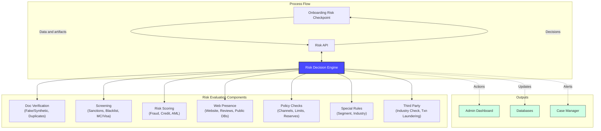
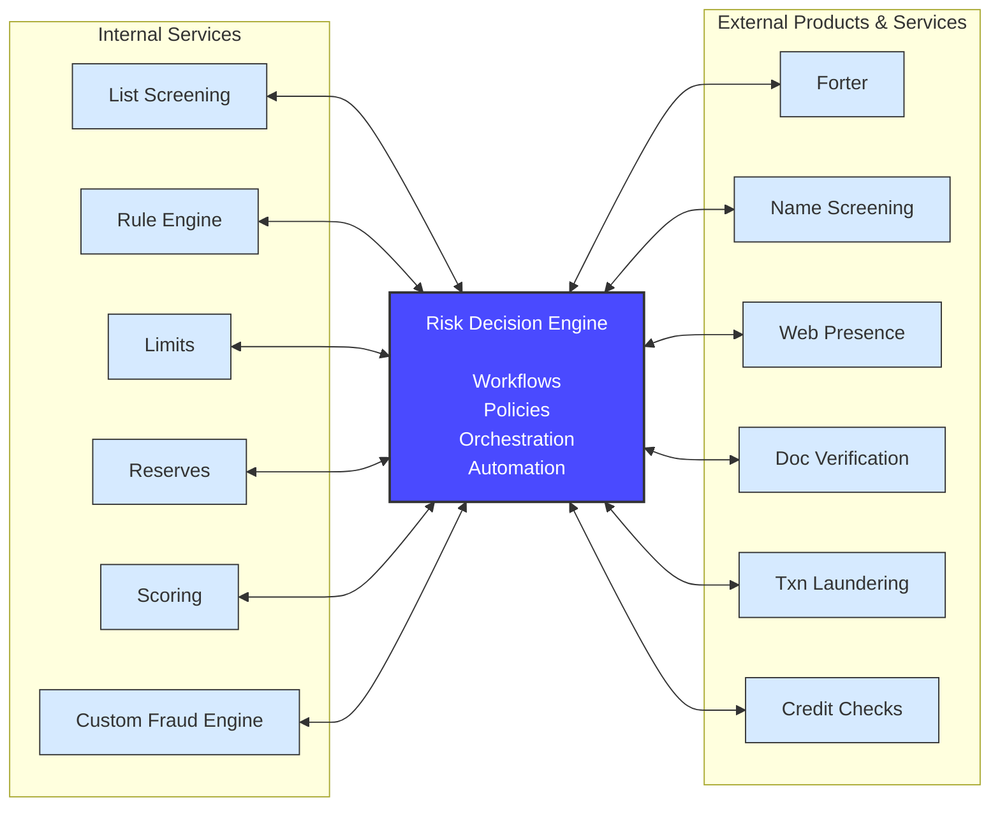

# Risk Management System Architecture Diagrams

This document contains the architectural diagrams for the Risk Management System, illustrating the onboarding process flow and the integration of internal and external services with the Risk Decision Engine.

---

## Diagram 1: Onboarding Process Flow

This diagram illustrates the end-to-end onboarding risk assessment process, showing how the Risk Decision Engine orchestrates various risk evaluation components and produces actionable outputs.

**Key Components:**
- **Process Flow**: The main data flow from onboarding checkpoint through the Risk API to the Decision Engine
- **Risk Evaluation Components**: Seven categories of risk checks performed by the engine
- **Outputs**: Three types of actions taken based on risk decisions

---

## Diagram 2: Risk Decision Engine Integration

This diagram shows the central role of the Risk Decision Engine in orchestrating a combination of internal microservices and external third-party products and services.

**Key Components:**
- **Internal Services**: Six internal microservices that feed data to the Decision Engine
- **Risk Decision Engine**: The core orchestration layer managing workflows, policies, and automation
- **External Products & Services**: Six third-party integrations for specialized risk assessments

**Integration Patterns:**
- Both internal and external services use bidirectional communication (↔) with the Decision Engine

---

## Usage Notes

These diagrams are designed to be embedded in documentation, presentations, or architecture review materials. The Mermaid syntax ensures they can be rendered in:

- GitHub/GitLab markdown files
- Confluence pages (with Mermaid plugin)
- Documentation sites (MkDocs, Docusaurus, etc.)
- Presentation tools that support Mermaid

**Color Scheme:**
- **Blue (#4a4aff)**: Risk Decision Engine (core component)
- **Light Blue (#d6eaff)**: Internal and external services
- **Light Green (#cfffe5)**: Output systems
