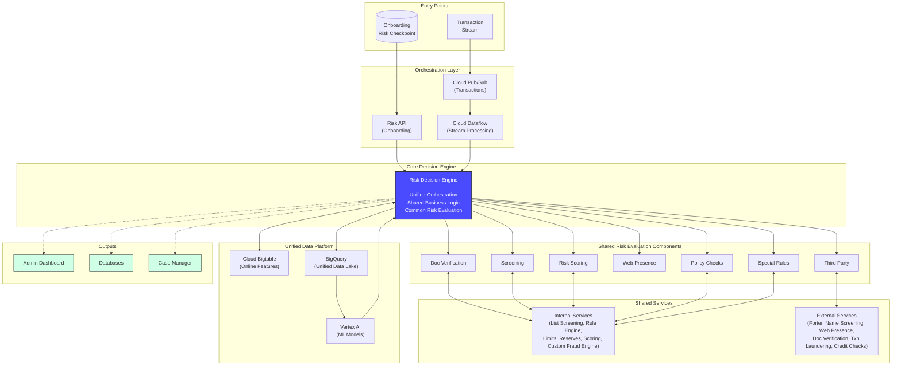
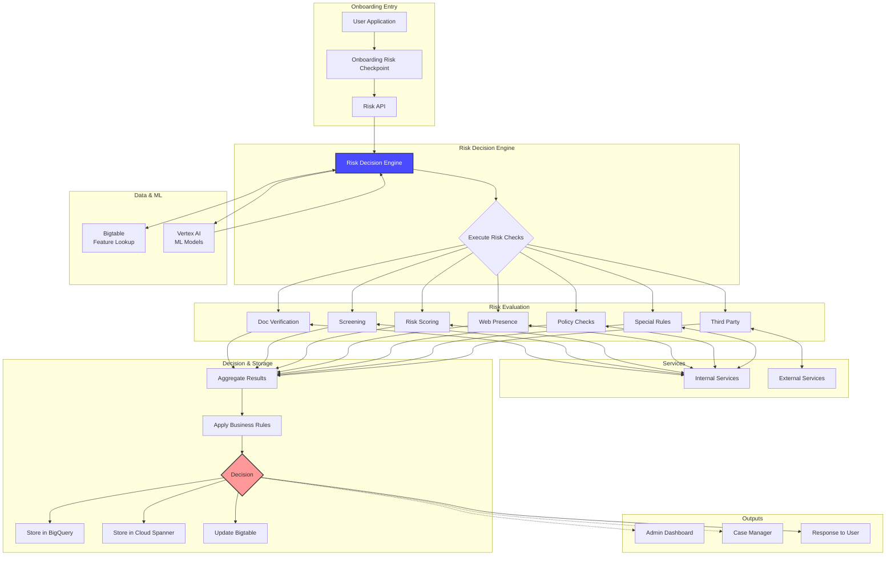
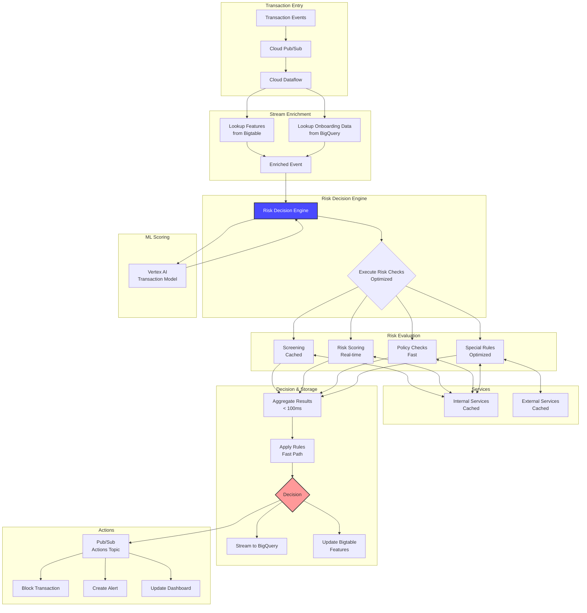
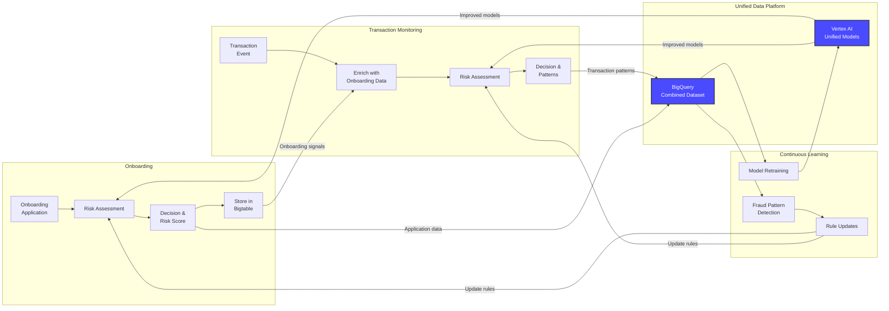

# Architecture & Phased Implementation: Unified Risk Management Platform

This document contains the architectural diagrams and phased implementation roadmap for the Unified Risk Management Platform on Google Cloud, serving both onboarding risk assessment and transaction monitoring use cases.

---

## 1. Unified Platform Architecture Overview

This diagram illustrates how a single platform serves both onboarding and transaction monitoring through shared components and infrastructure.

**Key Architectural Principles:**
- **Single Risk Decision Engine** serves both use cases
- **Shared risk evaluation components** eliminate duplication
- **Unified data platform** enables holistic customer risk profiles
- **Dual entry points** optimized for each use case's requirements
- **Common outputs** provide consistent visibility across use cases

---

## 2. Detailed Data Flow: Onboarding Use Case

This diagram shows the detailed flow for onboarding risk assessment.

**Onboarding Flow Characteristics:**
- **Latency:** 2-5 seconds (comprehensive checks)
- **Volume:** Thousands per day
- **Pattern:** Synchronous request-response
- **Decision:** Approve, Deny, Manual Review
- **Data Storage:** Complete application data

---

## 3. Detailed Data Flow: Transaction Monitoring Use Case

This diagram shows the detailed flow for real-time transaction monitoring.

**Transaction Flow Characteristics:**
- **Latency:** < 100 milliseconds (optimized checks)
- **Volume:** Millions per day
- **Pattern:** Asynchronous streaming
- **Decision:** Allow, Block, Flag
- **Data Storage:** Minimal transaction data

---

## 4. Intelligence Feedback Loops

This diagram illustrates how the unified platform creates powerful feedback loops between use cases.

**Feedback Loop Benefits:**
- Onboarding risk scores inform transaction monitoring
- Transaction patterns update onboarding rules
- Combined data improves model accuracy
- Fraud detected in one use case prevents fraud in the other
- Continuous learning across the entire customer lifecycle

---

## 5. Phased Implementation Roadmap

The implementation follows a four-phase approach, building the unified platform incrementally while delivering value at each stage.

```mermaid
graph TD
    subgraph "Phase 1: Build Unified Foundation (10-12 weeks)"
        direction TB
        P1_Goal["<b>Goal:</b><br/>Establish shared platform infrastructure and core components."]
        P1_Step1["1. Deploy unified Risk Decision Engine (Cloud Run)"]
        P1_Step2["2. Set up unified data platform (BigQuery, Bigtable, Vertex AI)"]
        P1_Step3["3. Implement shared risk evaluation components"]
        P1_Step4["4. Deploy shared internal and external services"]
        P1_Step5["5. Set up monitoring, logging, and observability"]
        P1_Result["<b>Outcome:</b><br/>Unified platform ready to serve both use cases."]

        P1_Goal --> P1_Step1 --> P1_Step2 --> P1_Step3 --> P1_Step4 --> P1_Step5 --> P1_Result
    end

    Phase1_Arrow["<br/>...Foundation is ready...<br/>"]

    subgraph "Phase 2: Launch Onboarding Use Case (8-10 weeks)"
        direction TB
        P2_Goal["<b>Goal:</b><br/>Deploy onboarding risk assessment on the unified platform."]
        P2_Step1["1. Deploy Onboarding Risk Checkpoint and Risk API"]
        P2_Step2["2. Configure risk checks for onboarding use case"]
        P2_Step3["3. Train and deploy onboarding fraud models"]
        P2_Step4["4. Integrate Document AI and identity verification"]
        P2_Step5["5. Run in parallel with legacy system (if applicable)"]
        P2_Step6["6. Cutover onboarding traffic to new platform"]
        P2_Result["<b>Outcome:</b><br/>Onboarding use case live on unified platform."]

        P2_Goal --> P2_Step1 --> P2_Step2 --> P2_Step3 --> P2_Step4 --> P2_Step5 --> P2_Step6 --> P2_Result
    end

    Phase2_Arrow["<br/>...Onboarding is live...<br/>"]

    subgraph "Phase 3: Launch Transaction Monitoring (10-12 weeks)"
        direction TB
        P3_Goal["<b>Goal:</b><br/>Deploy transaction monitoring on the unified platform."]
        P3_Step1["1. Deploy Pub/Sub and Dataflow for transaction stream"]
        P3_Step2["2. Configure optimized risk checks for transactions"]
        P3_Step3["3. Train transaction models using onboarding + transaction data"]
        P3_Step4["4. Implement real-time feature engineering in Bigtable"]
        P3_Step5["5. Run in shadow mode, validate against legacy system"]
        P3_Step6["6. Cutover transaction monitoring to new platform"]
        P3_Result["<b>Outcome:</b><br/>Both use cases live, sharing intelligence."]

        P3_Goal --> P3_Step1 --> P3_Step2 --> P3_Step3 --> P3_Step4 --> P3_Step5 --> P3_Step6 --> P3_Result
    end

    Phase3_Arrow["<br/>...Full platform operational...<br/>"]

    subgraph "Phase 4: Optimize & Scale (8-10 weeks)"
        direction TB
        P4_Goal["<b>Goal:</b><br/>Optimize performance, enable feedback loops, achieve full benefits."]
        P4_Step1["1. Implement intelligence feedback loops"]
        P4_Step2["2. Retrain models on combined onboarding + transaction data"]
        P4_Step3["3. Optimize caching and performance"]
        P4_Step4["4. Deploy multi-region for global scale"]
        P4_Step5["5. Implement advanced analytics and reporting"]
        P4_Step6["6. Decommission legacy systems"]
        P4_Result["<b>Outcome:</b><br/>Fully optimized unified platform delivering maximum value."]

        P4_Goal --> P4_Step1 --> P4_Step2 --> P4_Step3 --> P4_Step4 --> P4_Step5 --> P4_Step6 --> P4_Result
    end

    P1_Result --> Phase1_Arrow --> P2_Goal
    P2_Result --> Phase2_Arrow --> P3_Goal
    P3_Result --> Phase3_Arrow --> P4_Goal

    style P1_Goal fill:#f9f,stroke:#333,stroke-width:2px
    style P2_Goal fill:#f9f,stroke:#333,stroke-width:2px
    style P3_Goal fill:#f9f,stroke:#333,stroke-width:2px
    style P4_Goal fill:#f9f,stroke:#333,stroke-width:2px
```

---

## 6. Phase 1: Build Unified Foundation (10-12 weeks)

### Objectives
- Establish shared platform infrastructure
- Deploy core Risk Decision Engine
- Implement shared risk evaluation components
- Set up unified data platform

### Key Deliverables

**Week 1-3: Infrastructure & Core Engine**
- Provision GCP project and configure IAM
- Deploy Risk Decision Engine on Cloud Run
- Set up API Gateway and networking
- Configure auto-scaling and load balancing
- Implement health checks and monitoring

**Week 4-6: Unified Data Platform**
- Deploy BigQuery datasets and tables
- Set up Bigtable for online features
- Configure Vertex AI workspace
- Implement data pipelines
- Set up data retention and archival policies

**Week 7-9: Shared Risk Components**
- Implement Document Verification (Document AI, Cloud Vision)
- Deploy Screening service (Memorystore, Cloud Spanner)
- Set up Risk Scoring infrastructure (Vertex AI endpoints)
- Implement Web Presence checks (Cloud Functions)
- Deploy Policy Checks service
- Implement Special Rules engine
- Set up Third Party integration framework

**Week 10-12: Services & Observability**
- Deploy all internal services (List Screening, Rule Engine, Limits, Reserves, Scoring, Custom Fraud Engine)
- Integrate external services (Forter, Name Screening, etc.)
- Set up comprehensive monitoring (Cloud Monitoring, Cloud Logging)
- Implement distributed tracing (Cloud Trace)
- Create operational dashboards
- Conduct integration testing

### Success Criteria
- ✅ Risk Decision Engine deployed and operational
- ✅ All shared components functional
- ✅ Unified data platform ready
- ✅ Monitoring and observability configured
- ✅ Integration tests passing

---

## 7. Phase 2: Launch Onboarding Use Case (8-10 weeks)

### Objectives
- Deploy onboarding-specific components
- Configure risk checks for onboarding
- Train and deploy onboarding models
- Go live with onboarding use case

### Key Deliverables

**Week 1-2: Onboarding Entry Points**
- Deploy Onboarding Risk Checkpoint (Cloud Run)
- Deploy Risk API (Cloud Run + API Gateway)
- Implement request validation and routing
- Set up rate limiting and authentication

**Week 3-4: Onboarding Risk Configuration**
- Configure comprehensive risk checks for onboarding
- Set up document verification workflow
- Implement web presence verification
- Configure third-party integrations
- Define onboarding-specific business rules

**Week 5-6: ML Models & Intelligence**
- Train onboarding fraud model on historical data
- Deploy model to Vertex AI endpoint
- Integrate AML AI for compliance
- Set up feature engineering for onboarding
- Implement model monitoring

**Week 7-8: Testing & Validation**
- Run in parallel with legacy system (if applicable)
- Validate decision accuracy
- Performance testing (target: < 5s latency)
- Security testing
- User acceptance testing

**Week 9-10: Go Live**
- Gradual traffic cutover
- Monitor performance and accuracy
- Address any issues
- Full production deployment
- Decommission legacy onboarding system (if applicable)

### Success Criteria
- ✅ Onboarding use case live on unified platform
- ✅ < 5 second latency for 95th percentile
- ✅ > 95% decision accuracy
- ✅ < 5% false positive rate
- ✅ All data flowing to unified data platform

---

## 8. Phase 3: Launch Transaction Monitoring (10-12 weeks)

### Objectives
- Deploy transaction monitoring components
- Leverage onboarding data for enhanced detection
- Optimize for high-throughput, low-latency
- Enable cross-use case intelligence

### Key Deliverables

**Week 1-3: Transaction Stream Infrastructure**
- Deploy Cloud Pub/Sub for transaction events
- Implement Cloud Dataflow for stream processing
- Set up feature enrichment from Bigtable
- Configure streaming to BigQuery
- Implement backpressure handling

**Week 4-6: Transaction Risk Configuration**
- Configure optimized risk checks for transactions
- Implement caching strategy for performance
- Set up real-time screening
- Configure transaction-specific rules
- Optimize for < 100ms latency

**Week 7-9: ML Models & Intelligence**
- Train transaction fraud model using onboarding + transaction data
- Deploy model to Vertex AI endpoint
- Implement real-time feature engineering
- Set up velocity checks and anomaly detection
- Configure model A/B testing

**Week 10-12: Testing & Go Live**
- Run in shadow mode alongside legacy system
- Validate decision accuracy and latency
- Load testing (millions of transactions per day)
- Gradual traffic cutover
- Full production deployment

### Success Criteria
- ✅ Transaction monitoring live on unified platform
- ✅ < 100ms latency for 95th percentile
- ✅ Handling millions of transactions per day
- ✅ Models using onboarding signals as features
- ✅ Both use cases sharing unified data platform

---

## 9. Phase 4: Optimize & Scale (8-10 weeks)

### Objectives
- Enable full intelligence feedback loops
- Optimize performance and cost
- Scale to global deployment
- Achieve maximum platform value

### Key Deliverables

**Week 1-3: Intelligence Feedback Loops**
- Implement onboarding → transaction feedback
- Implement transaction → onboarding feedback
- Set up automated rule updates based on patterns
- Configure continuous model retraining
- Implement fraud typology detection

**Week 4-6: Performance Optimization**
- Optimize caching strategy across use cases
- Fine-tune auto-scaling policies
- Implement advanced query optimization
- Reduce latency through architectural improvements
- Optimize cost through resource right-sizing

**Week 7-8: Global Scale**
- Deploy multi-region architecture
- Implement global load balancing
- Set up cross-region replication
- Configure disaster recovery
- Implement geo-routing

**Week 9-10: Advanced Features & Cleanup**
- Deploy advanced analytics and reporting
- Implement explainable AI for compliance
- Set up automated compliance reporting
- Decommission all legacy systems
- Knowledge transfer and documentation

### Success Criteria
- ✅ Intelligence feedback loops operational
- ✅ Models trained on combined datasets
- ✅ Multi-region deployment complete
- ✅ 40-50% TCO reduction achieved
- ✅ Legacy systems decommissioned

---

## 10. Success Metrics

### Technical Metrics

**Onboarding:**
- Response Time: < 5 seconds (95th percentile)
- Throughput: 10,000+ applications per day
- Uptime: > 99.9%
- Error Rate: < 0.1%

**Transaction Monitoring:**
- Response Time: < 100 milliseconds (95th percentile)
- Throughput: 10,000,000+ transactions per day
- Uptime: > 99.95%
- Error Rate: < 0.01%

**Platform:**
- Data Consistency: 100% across use cases
- Model Retraining: Automated weekly
- Feature Freshness: < 1 minute lag

### Business Metrics

**Risk Management:**
- Fraud Detection Rate: > 95%
- False Positive Rate: < 5%
- Manual Review Rate: < 20%
- Cross-Use Case Detection: 30% improvement

**Operational:**
- TCO Reduction: 40-50% vs separate systems
- Time to Deploy New Check: < 2 weeks
- Incident Response Time: < 15 minutes
- Team Productivity: 50% improvement

**Customer Experience:**
- Onboarding Approval Time: < 10 seconds
- Transaction Decision Time: < 100ms
- Customer Friction: 30% reduction
- Consistent Experience: 100% across touchpoints

---

## 11. Risk Mitigation Strategies

### Technical Risks

**Risk:** Performance degradation when serving both use cases
- **Mitigation:** Separate scaling policies for each use case
- **Mitigation:** Use case specific optimizations (caching, fast paths)
- **Mitigation:** Comprehensive load testing before launch

**Risk:** Data consistency issues across use cases
- **Mitigation:** Strong consistency guarantees in Bigtable
- **Mitigation:** Automated data validation
- **Mitigation:** Comprehensive monitoring and alerting

**Risk:** Complex migration from legacy systems
- **Mitigation:** Phased approach (onboarding first, then transactions)
- **Mitigation:** Parallel running with legacy systems
- **Mitigation:** Automated validation and reconciliation

### Business Risks

**Risk:** Disruption during migration
- **Mitigation:** Zero-downtime deployment strategy
- **Mitigation:** Gradual traffic cutover with rollback capability
- **Mitigation:** 24/7 support during migration periods

**Risk:** Model accuracy issues with combined data
- **Mitigation:** Extensive A/B testing before deployment
- **Mitigation:** Gradual rollout with monitoring
- **Mitigation:** Ability to fall back to use-case-specific models

---

## 12. Post-Launch Optimization

### Continuous Improvement

**Weekly:**
- Review decision accuracy by use case
- Analyze false positive/negative rates
- Monitor model performance
- Review system performance metrics

**Monthly:**
- Retrain models with latest data
- Update business rules based on patterns
- Review external service performance
- Optimize costs and resource allocation

**Quarterly:**
- Comprehensive platform review
- Evaluate new GCP services and features
- Review and update architecture
- Plan new capabilities and enhancements

### Feature Roadmap

**Short Term (3-6 months):**
- Advanced explainability for regulatory compliance
- Real-time model updates
- Enhanced customer journey analytics
- Additional third-party integrations

**Medium Term (6-12 months):**
- Additional use cases (e.g., account monitoring, merchant monitoring)
- Advanced ML techniques (deep learning, graph neural networks)
- Real-time collaboration features for investigators
- Predictive analytics and forecasting

**Long Term (12+ months):**
- Global expansion to additional regions
- Industry-specific risk models
- Advanced automation and AI-driven decisioning
- Integration with additional data sources

---

## 13. Conclusion

This unified platform approach provides a clear path from initial deployment to a fully optimized, global-scale risk management platform serving both onboarding and transaction monitoring use cases.

**Total Timeline:** 36-44 weeks (9-11 months)

**Key Success Factors:**
- Strong executive sponsorship and cross-functional collaboration
- Dedicated engineering team with GCP and risk management expertise
- Phased approach minimizing risk while delivering incremental value
- Comprehensive testing and validation at each phase
- Focus on intelligence sharing and feedback loops

**Platform Benefits:**
- **40-50% TCO reduction** vs separate systems
- **Holistic customer risk profiles** from onboarding through transactions
- **Shared intelligence** improving detection across use cases
- **Faster innovation** with single platform to enhance
- **Simplified operations** with unified monitoring and management

The platform is designed to evolve with your business, supporting new use cases, risk checks, and integration partners without requiring fundamental architectural changes. This is the foundation for a modern, AI-powered risk management capability that will serve your business for years to come.
