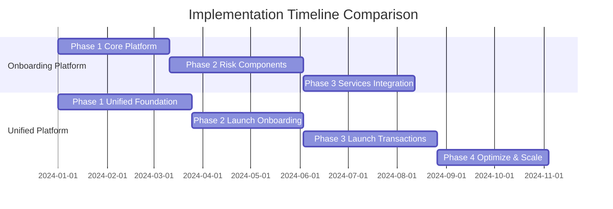

# Platform Comparison: Onboarding vs. Unified Risk Management

This document provides a comprehensive comparison between the two platform approaches to help you choose the right solution for your organization.

---

## Executive Summary

| Aspect | Onboarding Platform | Unified Platform |
|:---|:---|:---|
| **Scope** | Onboarding risk assessment only | Onboarding + Transaction monitoring |
| **Timeline** | 26-32 weeks (6-8 months) | 36-44 weeks (9-11 months) |
| **Investment** | Lower initial investment | Higher initial investment, lower long-term TCO |
| **Complexity** | Simpler, focused implementation | More complex, comprehensive solution |
| **Best For** | Organizations solving onboarding fraud first | Organizations consolidating all risk management |

---

## 1. Detailed Feature Comparison

### 1.1 Use Cases Covered

| Feature | Onboarding Platform | Unified Platform |
|:---|:---:|:---:|
| **Onboarding Risk Assessment** | ✅ Full capability | ✅ Full capability |
| **Transaction Monitoring** | ❌ Not included | ✅ Full capability |
| **Real-time Fraud Detection** | ⚠️ Onboarding only | ✅ Both use cases |
| **AML Compliance** | ✅ Onboarding AML | ✅ Comprehensive AML |
| **Customer Journey Analytics** | ⚠️ Onboarding only | ✅ Complete journey |

### 1.2 Architecture Components

| Component | Onboarding Platform | Unified Platform |
|:---|:---|:---|
| **Risk Decision Engine** | Single-purpose (onboarding) | Dual-purpose (onboarding + transactions) |
| **Entry Points** | Onboarding Risk Checkpoint + Risk API | Checkpoint + API + Pub/Sub + Dataflow |
| **Data Platform** | BigQuery + Cloud Spanner | BigQuery + Bigtable + Cloud Spanner |
| **ML Platform** | Vertex AI (onboarding models) | Vertex AI (unified models + feedback loops) |
| **Stream Processing** | Not required | Cloud Pub/Sub + Dataflow |
| **Feature Store** | Basic (Cloud Spanner) | Advanced (Bigtable + Vertex AI Feature Store) |

### 1.3 Risk Evaluation Components

Both platforms include the same seven risk evaluation categories, but with different optimization levels:

| Component | Onboarding Platform | Unified Platform |
|:---|:---|:---|
| **Document Verification** | Full implementation | Full + transaction receipts |
| **Screening** | Comprehensive | Comprehensive + cached for transactions |
| **Risk Scoring** | Onboarding models | Unified models (onboarding + transaction data) |
| **Web Presence** | Full verification | Full + cached results |
| **Policy Checks** | Onboarding policies | Unified policies (both use cases) |
| **Special Rules** | Onboarding rules | Unified rules (both use cases) |
| **Third Party** | Onboarding integrations | Full integrations (both use cases) |

### 1.4 Data & Intelligence

| Capability | Onboarding Platform | Unified Platform |
|:---|:---|:---|
| **Data Scope** | Onboarding applications only | Onboarding + Transactions |
| **Customer Risk Profile** | Onboarding risk only | Holistic (onboarding + transaction history) |
| **ML Model Training** | Onboarding data only | Combined datasets (more accurate) |
| **Intelligence Feedback** | Not applicable | ✅ Cross-use case learning |
| **Fraud Pattern Detection** | Onboarding patterns only | Comprehensive patterns |

---

## 2. Business Value Comparison

### 2.1 Cost Analysis

| Cost Factor | Onboarding Platform | Unified Platform |
|:---|:---|:---|
| **Initial Investment** | Lower (focused scope) | Higher (comprehensive scope) |
| **Infrastructure Costs** | Moderate | Lower (shared infrastructure) |
| **Operational Costs** | Single platform | 40-50% lower than separate systems |
| **Engineering Resources** | Focused team | Larger team initially, then consolidated |
| **Long-term TCO** | Baseline | 40-50% reduction vs separate systems |

**TCO Comparison:**
- **Onboarding Platform:** If you later add transaction monitoring separately, total cost = 100% + 100% = 200%
- **Unified Platform:** Single platform for both = 100% (50% savings vs separate systems)

### 2.2 Risk Management Improvements

| Metric | Onboarding Platform | Unified Platform |
|:---|:---|:---|
| **Fraud Detection Rate** | > 95% (onboarding) | > 95% (both use cases) + 30% cross-detection |
| **False Positive Rate** | < 5% (onboarding) | < 5% (both) + consistency benefits |
| **Detection Speed** | < 5 seconds (onboarding) | < 5s (onboarding) + < 100ms (transactions) |
| **Risk Profile Completeness** | Onboarding only | Complete customer lifecycle |
| **Threat Response Time** | Onboarding updates only | Cross-use case updates (faster) |

### 2.3 Operational Benefits

| Benefit | Onboarding Platform | Unified Platform |
|:---|:---|:---|
| **Platform Consolidation** | Single onboarding platform | All risk management unified |
| **Team Efficiency** | Focused onboarding team | 50% productivity improvement |
| **Monitoring Complexity** | Single use case | Unified monitoring (simpler) |
| **Deployment Speed** | New onboarding checks: < 2 weeks | New checks benefit both: < 2 weeks |
| **Compliance Reporting** | Onboarding compliance | End-to-end compliance |

### 2.4 Customer Experience Impact

| Impact | Onboarding Platform | Unified Platform |
|:---|:---|:---|
| **Onboarding Speed** | < 10 seconds | < 10 seconds |
| **Transaction Speed** | Not applicable | < 100ms (no customer impact) |
| **Consistency** | Consistent onboarding | Consistent across entire journey |
| **Friction Reduction** | Onboarding friction reduced | 30% overall friction reduction |
| **Customer Satisfaction** | Improved onboarding | Improved end-to-end experience |

---

## 3. Implementation Comparison

### 3.1 Timeline Comparison



**Onboarding Platform:**
- Phase 1: Build Core Platform (8-10 weeks)
- Phase 2: Integrate Risk Components (10-12 weeks)
- Phase 3: Connect Services (8-10 weeks)
- **Total: 26-32 weeks**

**Unified Platform:**
- Phase 1: Build Unified Foundation (10-12 weeks)
- Phase 2: Launch Onboarding (8-10 weeks)
- Phase 3: Launch Transactions (10-12 weeks)
- Phase 4: Optimize & Scale (8-10 weeks)
- **Total: 36-44 weeks**

**Time Difference:** 10-12 weeks additional for unified platform

### 3.2 Complexity Comparison

| Complexity Factor | Onboarding Platform | Unified Platform |
|:---|:---|:---|
| **Architecture Complexity** | Moderate | High |
| **Integration Points** | 12 services | 12 services + streaming |
| **Data Flow Patterns** | Synchronous only | Synchronous + Streaming |
| **Performance Requirements** | < 5s latency | < 5s + < 100ms dual targets |
| **Scaling Considerations** | Single use case | Dual use case optimization |
| **Testing Complexity** | Moderate | High (multiple patterns) |

### 3.3 Risk Mitigation

| Risk | Onboarding Platform | Unified Platform |
|:---|:---|:---|
| **Implementation Risk** | Lower (focused scope) | Higher (broader scope) |
| **Migration Complexity** | Simpler | More complex |
| **Performance Risk** | Single use case | Dual use case balancing |
| **Integration Risk** | Moderate | Higher (more integrations) |
| **Mitigation Strategy** | Phased rollout | Phased + parallel running |

---

## 4. When to Choose Each Approach

### 4.1 Choose Onboarding Platform If:

✅ **Your primary pain point is onboarding fraud**
- High false positive rates in onboarding
- Slow onboarding approval times
- Manual review bottlenecks

✅ **You don't have transaction monitoring needs yet**
- No existing transaction monitoring system
- Transaction fraud is not a current priority
- Focus is on customer acquisition

✅ **You want faster time-to-value**
- Need to solve onboarding fraud quickly (6-8 months)
- Limited resources for larger project
- Want to prove value before expanding

✅ **You have budget constraints**
- Lower initial investment required
- Phased budget allocation
- Can add transaction monitoring later

✅ **Your organization prefers incremental change**
- Risk-averse culture
- Prefer to validate before expanding
- Want to build confidence gradually

### 4.2 Choose Unified Platform If:

✅ **You have both onboarding and transaction fraud issues**
- Need comprehensive risk management
- Want to eliminate silos
- Seeking holistic customer risk profiles

✅ **You're currently running separate systems**
- Onboarding system on AWS
- Transaction monitoring on different platform
- High operational overhead from duplication

✅ **You want maximum long-term value**
- 40-50% TCO reduction vs separate systems
- Willing to invest more upfront for long-term savings
- Strategic platform consolidation

✅ **You value intelligence sharing**
- Want fraud patterns from transactions to inform onboarding
- Need onboarding signals for transaction monitoring
- Seeking continuous learning across use cases

✅ **You're migrating to GCP anyway**
- Already planning data platform migration
- Want to build correctly from the start
- Avoid creating new silos

---

## 5. Migration Path Comparison

### 5.1 From Onboarding Platform to Unified Platform

If you start with the Onboarding Platform and later want to add transaction monitoring:

**Advantages:**
- Proven platform foundation
- Onboarding use case already live
- Reduced risk (incremental approach)

**Challenges:**
- Additional 10-12 weeks for transaction monitoring
- Some re-architecture required
- May need to refactor for dual-use case optimization

**Estimated Additional Effort:**
- Architecture updates: 2-3 weeks
- Transaction monitoring implementation: 10-12 weeks
- Optimization and integration: 4-6 weeks
- **Total: 16-21 weeks additional**

### 5.2 Direct to Unified Platform

Starting directly with the Unified Platform:

**Advantages:**
- Built for both use cases from day one
- No re-architecture needed
- Maximum long-term efficiency

**Challenges:**
- Longer initial timeline (36-44 weeks)
- Higher initial complexity
- Requires more upfront planning

**Risk Mitigation:**
- Phased delivery (onboarding first, then transactions)
- Parallel running with legacy systems
- Comprehensive testing at each phase

---

## 6. Decision Matrix

Use this matrix to evaluate which approach is right for your organization:

| Criteria | Weight | Onboarding Platform Score | Unified Platform Score |
|:---|:---:|:---:|:---:|
| **Speed to Market** | High | 9/10 | 6/10 |
| **Initial Cost** | High | 8/10 | 5/10 |
| **Long-term TCO** | High | 6/10 | 10/10 |
| **Scope Coverage** | Medium | 5/10 | 10/10 |
| **Risk Management Effectiveness** | High | 7/10 | 10/10 |
| **Operational Simplicity** | Medium | 7/10 | 9/10 |
| **Future Scalability** | High | 6/10 | 10/10 |
| **Implementation Risk** | Medium | 8/10 | 6/10 |

**Scoring Guide:**
- 9-10: Excellent
- 7-8: Good
- 5-6: Adequate
- 3-4: Poor
- 1-2: Very Poor

---

## 7. Recommended Approach by Scenario

### Scenario 1: Startup/Scale-up with Onboarding Fraud Issues
**Recommendation:** **Onboarding Platform**
- **Why:** Fast time-to-value, lower initial cost, focused solution
- **Timeline:** 6-8 months to production
- **Future Path:** Add transaction monitoring when needed (16-21 weeks)

### Scenario 2: Established Company with Separate Systems
**Recommendation:** **Unified Platform**
- **Why:** Eliminate duplication, 40-50% TCO reduction, holistic risk management
- **Timeline:** 9-11 months to full production
- **Future Path:** Decommission legacy systems, realize full savings

### Scenario 3: Company Migrating to GCP
**Recommendation:** **Unified Platform**
- **Why:** Build correctly from the start, avoid creating new silos
- **Timeline:** 9-11 months (aligned with migration)
- **Future Path:** Modern, cloud-native risk platform

### Scenario 4: Company with Limited Resources
**Recommendation:** **Onboarding Platform**
- **Why:** Lower initial investment, focused team, manageable scope
- **Timeline:** 6-8 months
- **Future Path:** Expand when resources available

### Scenario 5: Enterprise with Complex Risk Needs
**Recommendation:** **Unified Platform**
- **Why:** Comprehensive solution, intelligence sharing, regulatory compliance
- **Timeline:** 9-11 months
- **Future Path:** Add additional use cases (account monitoring, merchant monitoring)

---

## 8. Key Differentiators Summary

### Onboarding Platform Strengths:
1. ✅ **Faster time-to-value** (6-8 months vs 9-11 months)
2. ✅ **Lower initial investment** (focused scope)
3. ✅ **Simpler implementation** (single use case)
4. ✅ **Lower risk** (proven, incremental approach)
5. ✅ **Easier to staff** (smaller, focused team)

### Unified Platform Strengths:
1. ✅ **40-50% TCO reduction** (vs separate systems)
2. ✅ **Holistic customer risk profiles** (complete journey)
3. ✅ **Intelligence feedback loops** (cross-use case learning)
4. ✅ **Comprehensive fraud detection** (onboarding + transactions)
5. ✅ **Future-proof architecture** (built for scale)
6. ✅ **Operational efficiency** (single platform to manage)
7. ✅ **Better ML models** (trained on combined data)

---

## 9. Financial Comparison (5-Year View)

### Onboarding Platform Path:
```
Year 1: Onboarding Platform Implementation
  - Cost: $X (baseline)
  - Savings: Onboarding efficiency gains

Year 2-3: Add Transaction Monitoring Separately
  - Additional Cost: $X (another platform)
  - Total Running Cost: 2X platforms

Year 4-5: Maintain Two Platforms
  - Ongoing Cost: 2X operational overhead
  - Total 5-Year Cost: ~200% of single platform
```

### Unified Platform Path:
```
Year 1: Unified Platform Implementation
  - Cost: $1.2X (20% more upfront)
  - Savings: None yet (building)

Year 2-5: Single Platform Operations
  - Ongoing Cost: 50% of two platforms
  - Total 5-Year Cost: ~100% (50% savings vs separate)

ROI Breakeven: Month 18-24
```

**5-Year TCO Comparison:**
- **Onboarding Platform (then add transactions):** 200% of baseline
- **Unified Platform:** 100% of baseline
- **Savings:** 50% over 5 years

---

## 10. Conclusion & Recommendations

### Quick Decision Guide:

**Choose Onboarding Platform if:**
- You need a solution in 6-8 months
- Onboarding fraud is your only current priority
- You have budget constraints
- You prefer incremental, lower-risk approach

**Choose Unified Platform if:**
- You have both onboarding and transaction fraud issues
- You're consolidating from separate systems
- You want maximum long-term value (40-50% TCO reduction)
- You're already migrating to GCP
- You can invest 9-11 months for comprehensive solution

### Hybrid Approach:

**Start with Onboarding Platform, Plan for Unified:**
1. Implement Onboarding Platform (26-32 weeks)
2. Prove value and build confidence
3. Plan transaction monitoring addition (16-21 weeks)
4. Achieve unified platform benefits by Month 18-24

This approach balances speed-to-value with long-term strategic goals.

---

## 11. Next Steps

### For Onboarding Platform:
1. Review onboarding platform documentation
2. Assess current onboarding fraud challenges
3. Define success metrics
4. Plan 6-8 month implementation
5. Budget for potential transaction monitoring addition

### For Unified Platform:
1. Review unified platform documentation
2. Assess both onboarding and transaction fraud
3. Evaluate current system duplication costs
4. Plan 9-11 month implementation
5. Budget for comprehensive solution

### Need Help Deciding?
Consider these questions:
1. What is your primary pain point today?
2. Do you have transaction monitoring needs?
3. What is your timeline constraint?
4. What is your budget constraint?
5. Are you migrating to GCP anyway?
6. Do you have separate systems today?

Your answers will guide you to the right choice.
