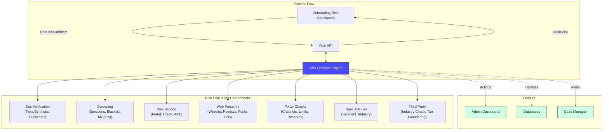
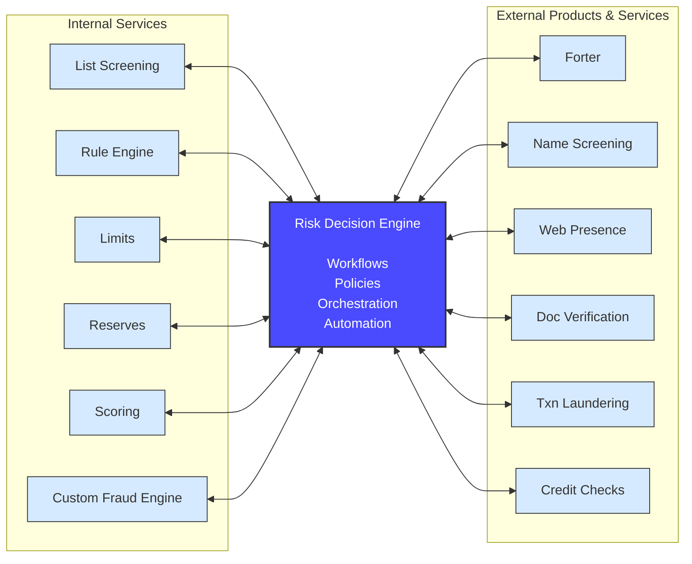

# Architecture & Phased Implementation: Onboarding Risk Assessment Platform

This document contains the architectural diagrams and phased implementation roadmap for the Onboarding Risk Assessment Platform on Google Cloud.

---

## 1. System Architecture Overview

This diagram illustrates the end-to-end onboarding risk assessment process, showing how the Risk Decision Engine orchestrates various risk evaluation components and produces actionable outputs.

### Diagram 1: Onboarding Process Flow

**Key Components:**
- **Process Flow**: The main data flow from onboarding checkpoint through the Risk API to the Decision Engine
- **Risk Evaluation Components**: Seven categories of risk checks performed by the engine
- **Outputs**: Three types of actions taken based on risk decisions

---

## 2. Service Integration Architecture

This diagram shows the central role of the Risk Decision Engine in orchestrating a combination of internal microservices and external third-party products and services.

### Diagram 2: Risk Decision Engine Integration

**Key Components:**
- **Internal Services**: Six internal microservices that provide core risk capabilities
- **Risk Decision Engine**: The core orchestration layer managing workflows, policies, and automation
- **External Products & Services**: Six third-party integrations for specialized risk assessments

**Integration Patterns:**
- Both internal and external services use bidirectional communication (↔) with the Decision Engine
- All services are called in parallel for optimal performance
- Results are aggregated and weighted according to business rules

---

## 3. Phased Implementation Roadmap

The implementation follows a three-phase approach, with each phase delivering concrete value and building upon the previous one. This roadmap is designed to minimize risk while delivering incremental business value.

```mermaid
graph TD
    subgraph "Phase 1: Build Core Platform (8-10 weeks)"
        direction TB
        P1_Goal["<b>Goal:</b><br/>Establish the core platform infrastructure and basic decision flow."]
        P1_Step1["1. Deploy Onboarding Risk Checkpoint (Cloud Run)"]
        P1_Step2["2. Deploy Risk API (Cloud Run + API Gateway)"]
        P1_Step3["3. Deploy Risk Decision Engine (Cloud Run)"]
        P1_Step4["4. Implement basic rule engine and decision logic"]
        P1_Step5["5. Set up output systems (Admin Dashboard, Databases, Case Manager)"]
        P1_Step6["6. Implement monitoring and logging"]
        P1_Result["<b>Outcome:</b><br/>A functioning platform capable of making basic risk decisions."]

        P1_Goal --> P1_Step1 --> P1_Step2 --> P1_Step3 --> P1_Step4 --> P1_Step5 --> P1_Step6 --> P1_Result
    end

    Phase1_Arrow["<br/>...Core platform is operational...<br/>"]

    subgraph "Phase 2: Integrate Risk Evaluation Components (10-12 weeks)"
        direction TB
        P2_Goal["<b>Goal:</b><br/>Add comprehensive risk evaluation capabilities."]
        P2_Step1["1. Integrate Document Verification (Document AI, Cloud Vision)"]
        P2_Step2["2. Implement Screening (sanctions, blacklist, MC/Visa)"]
        P2_Step3["3. Deploy Risk Scoring (Vertex AI models, AML AI)"]
        P2_Step4["4. Add Web Presence checks (Cloud Functions, NL API)"]
        P2_Step5["5. Implement Policy Checks (limits, reserves, channels)"]
        P2_Step6["6. Add Special Rules (segment, industry-specific)"]
        P2_Step7["7. Integrate Third Party services"]
        P2_Result["<b>Outcome:</b><br/>Complete risk evaluation platform with all seven check categories."]

        P2_Goal --> P2_Step1 --> P2_Step2 --> P2_Step3 --> P2_Step4 --> P2_Step5 --> P2_Step6 --> P2_Step7 --> P2_Result
    end

    Phase2_Arrow["<br/>...All risk checks are integrated...<br/>"]

    subgraph "Phase 3: Connect Internal & External Services (8-10 weeks)"
        direction TB
        P3_Goal["<b>Goal:</b><br/>Integrate all internal and external service providers."]
        P3_Step1["1. Connect Internal Services (List Screening, Rule Engine, Limits, Reserves, Scoring, Custom Fraud Engine)"]
        P3_Step2["2. Integrate External Services (Forter, Name Screening, Web Presence, Doc Verification, Txn Laundering, Credit Checks)"]
        P3_Step3["3. Implement parallel execution and result aggregation"]
        P3_Step4["4. Add caching and performance optimization"]
        P3_Step5["5. Implement advanced decision logic and weighting"]
        P3_Step6["6. Conduct load testing and performance tuning"]
        P3_Step7["7. Go live with full production traffic"]
        P3_Result["<b>Outcome:</b><br/>Production-ready platform handling all onboarding applications with comprehensive risk assessment."]

        P3_Goal --> P3_Step1 --> P3_Step2 --> P3_Step3 --> P3_Step4 --> P3_Step5 --> P3_Step6 --> P3_Step7 --> P3_Result
    end

    P1_Result --> Phase1_Arrow --> P2_Goal
    P2_Result --> Phase2_Arrow --> P3_Goal

    style P1_Goal fill:#f9f,stroke:#333,stroke-width:2px
    style P2_Goal fill:#f9f,stroke:#333,stroke-width:2px
    style P3_Goal fill:#f9f,stroke:#333,stroke-width:2px
```

---

## 4. Phase 1: Build Core Platform (8-10 weeks)

### Objectives
- Establish the foundational infrastructure on Google Cloud
- Deploy the three core components (Checkpoint, API, Engine)
- Implement basic decision logic
- Set up monitoring and observability

### Key Deliverables

**Week 1-2: Infrastructure Setup**
- Provision GCP project and configure IAM
- Set up VPC, subnets, and network security
- Deploy Cloud Run services for Checkpoint, API, and Engine
- Configure API Gateway for external access
- Set up Cloud Spanner database

**Week 3-4: Core Components**
- Implement Onboarding Risk Checkpoint service
- Implement Risk API service with routing logic
- Implement Risk Decision Engine with basic orchestration
- Create basic rule engine for decision logic
- Implement request/response handling

**Week 5-6: Output Systems**
- Set up BigQuery for data warehousing
- Configure Pub/Sub topics for event streaming
- Deploy Cloud Functions for case management integration
- Create Looker Studio dashboards for admin visibility
- Implement audit logging to Cloud Logging

**Week 7-8: Testing & Validation**
- Unit testing for all components
- Integration testing for end-to-end flow
- Load testing for performance validation
- Security testing and vulnerability scanning
- Documentation and runbooks

### Success Criteria
- ✅ All core components deployed and operational
- ✅ Basic decision flow working end-to-end
- ✅ Monitoring and alerting configured
- ✅ < 5 second response time for 95th percentile
- ✅ 99.9% uptime for all services

---

## 5. Phase 2: Integrate Risk Evaluation Components (10-12 weeks)

### Objectives
- Add all seven risk evaluation categories
- Integrate Google Cloud AI services
- Implement parallel execution of risk checks
- Optimize for performance and accuracy

### Key Deliverables

**Week 1-2: Document Verification**
- Integrate Document AI for document parsing
- Integrate Cloud Vision API for fraud detection
- Implement duplicate detection logic
- Set up Cloud Storage for document archival

**Week 3-4: Screening**
- Build sanctions list screening capability
- Implement blacklist checking
- Integrate MC/Visa compliance verification
- Set up Memorystore for high-performance lookups

**Week 5-6: Risk Scoring**
- Train and deploy fraud detection models on Vertex AI
- Integrate credit risk scoring
- Configure Anti-Money Laundering AI
- Implement score aggregation logic

**Week 7-8: Web Presence & Policy Checks**
- Deploy Cloud Functions for web scraping
- Integrate Natural Language API for review analysis
- Implement policy validation logic
- Configure limit and reserve checking

**Week 9-10: Special Rules & Third Party**
- Build configurable rule engine for special cases
- Implement segment and industry-specific rules
- Integrate third-party verification services
- Add transaction laundering detection

**Week 11-12: Testing & Optimization**
- End-to-end testing of all risk checks
- Performance optimization and caching
- Accuracy validation and tuning
- Load testing with realistic traffic patterns

### Success Criteria
- ✅ All seven risk evaluation categories operational
- ✅ Parallel execution of risk checks implemented
- ✅ < 5 second response time maintained
- ✅ > 95% accuracy in fraud detection
- ✅ < 5% false positive rate

---

## 6. Phase 3: Connect Internal & External Services (8-10 weeks)

### Objectives
- Integrate all internal microservices
- Connect all external service providers
- Implement advanced decision logic
- Optimize for production scale

### Key Deliverables

**Week 1-3: Internal Services Integration**
- Connect List Screening service
- Integrate Rule Engine service
- Connect Limits service
- Integrate Reserves service
- Connect Scoring service
- Integrate Custom Fraud Engine service
- Implement service health monitoring

**Week 4-6: External Services Integration**
- Integrate Forter for fraud prevention
- Connect Name Screening service
- Integrate Web Presence verification
- Connect Doc Verification service
- Integrate Txn Laundering detection
- Connect Credit Checks service
- Implement API rate limiting and retry logic

**Week 7-8: Advanced Features**
- Implement weighted decision logic
- Add machine learning-based decision optimization
- Configure A/B testing framework
- Implement feature flags for gradual rollout
- Add advanced caching strategies

**Week 9-10: Production Readiness**
- Comprehensive load testing (10x expected traffic)
- Disaster recovery testing
- Security penetration testing
- Performance tuning and optimization
- Production deployment and cutover

### Success Criteria
- ✅ All internal and external services integrated
- ✅ < 3 second response time for 95th percentile
- ✅ 99.95% uptime SLA achieved
- ✅ Handling 10,000+ applications per hour
- ✅ < 3% false positive rate
- ✅ > 98% fraud detection rate

---

## 7. Risk Mitigation Strategies

### Technical Risks

**Risk:** Service integration failures
- **Mitigation:** Implement circuit breakers and fallback logic
- **Mitigation:** Use Cloud Tasks for reliable async processing
- **Mitigation:** Comprehensive integration testing before production

**Risk:** Performance degradation under load
- **Mitigation:** Horizontal auto-scaling with Cloud Run
- **Mitigation:** Multi-tier caching strategy
- **Mitigation:** Regular load testing and capacity planning

**Risk:** Data security and compliance issues
- **Mitigation:** Encryption at rest and in transit
- **Mitigation:** Regular security audits
- **Mitigation:** Compliance validation with Security Command Center

### Business Risks

**Risk:** High false positive rates impacting customer experience
- **Mitigation:** Gradual rollout with A/B testing
- **Mitigation:** Continuous model tuning based on feedback
- **Mitigation:** Manual review queue for borderline cases

**Risk:** Integration delays with external providers
- **Mitigation:** Early engagement with provider technical teams
- **Mitigation:** Parallel development of mock services
- **Mitigation:** Phased integration approach

---

## 8. Success Metrics

### Technical Metrics
- **Response Time:** < 5 seconds (95th percentile)
- **Uptime:** > 99.9% availability
- **Throughput:** 10,000+ applications per hour
- **Error Rate:** < 0.1% system errors

### Business Metrics
- **Approval Rate:** 70-80% auto-approved
- **False Positive Rate:** < 5%
- **Fraud Detection Rate:** > 95%
- **Manual Review Rate:** < 20%
- **Time to Decision:** < 10 seconds average

### Operational Metrics
- **Cost per Decision:** < $0.10
- **Team Productivity:** 50% reduction in manual reviews
- **Time to Add New Check:** < 2 weeks
- **Incident Response Time:** < 15 minutes

---

## 9. Post-Launch Optimization

### Continuous Improvement
- Weekly review of decision accuracy
- Monthly model retraining with new data
- Quarterly review of external service performance
- Bi-annual architecture review

### Feature Enhancements
- Advanced ML models for specific fraud patterns
- Real-time model updates based on emerging threats
- Enhanced explainability for regulatory compliance
- Integration with additional data sources

### Scaling Considerations
- Multi-region deployment for global coverage
- Advanced caching for frequently accessed data
- Database sharding for high-volume scenarios
- CDN integration for static content

---

## 10. Conclusion

This phased implementation approach provides a clear path from initial deployment to production-ready platform. Each phase delivers concrete business value while building the foundation for subsequent phases.

**Total Timeline:** 26-32 weeks (6-8 months)

**Key Success Factors:**
- Strong executive sponsorship and cross-functional collaboration
- Dedicated engineering team with GCP expertise
- Early engagement with internal and external service providers
- Rigorous testing and validation at each phase
- Continuous monitoring and optimization

The platform is designed to evolve with your business needs, supporting increasing volumes and new risk assessment capabilities without requiring fundamental architectural changes.
