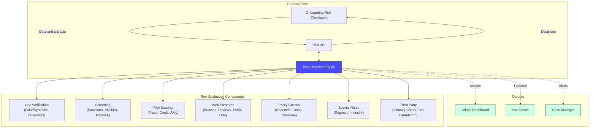
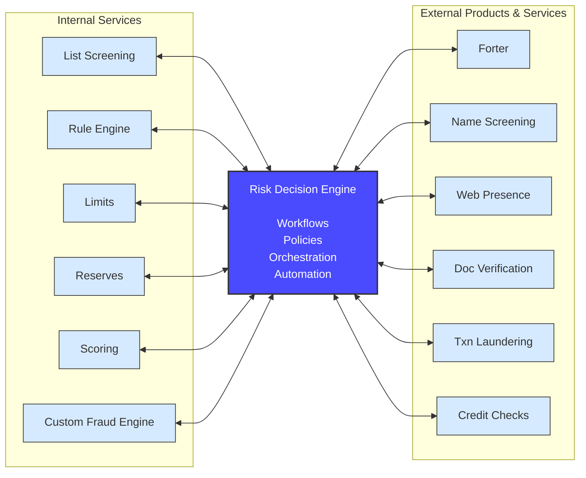

# Technical Narrative: Onboarding Risk Assessment Platform on Google Cloud

This document provides a detailed technical guide for implementing the onboarding risk assessment platform on Google Cloud. It translates the business vision into a concrete engineering plan, focusing on component architecture, integration patterns, and implementation approach.

The core objective is to build a real-time, orchestrated risk assessment system that evaluates onboarding applications through seven comprehensive risk categories while integrating both internal services and external providers.

---

## 1. System Architecture Overview

The platform is built around a central **Risk Decision Engine** that orchestrates all risk evaluation activities. Applications flow through an **Onboarding Risk Checkpoint** to a **Risk API**, which coordinates with the engine to perform comprehensive risk assessment and deliver decisions to downstream systems.



---

## 2. Core Components

### 2.1 Onboarding Risk Checkpoint

**Purpose:** Entry point for all onboarding applications, collecting user/merchant data and artifacts.

**Implementation on GCP:**
- **Cloud Run** service exposing REST API endpoints
- Receives onboarding requests from web/mobile applications
- Validates input data and formats requests for the Risk API
- Implements rate limiting and request authentication

**Key Responsibilities:**
- Input validation and sanitization
- Data collection (personal info, business details, documents)
- Request formatting and enrichment
- Response handling and user communication

### 2.2 Risk API

**Purpose:** Orchestration layer that coordinates between the checkpoint and the Risk Decision Engine.

**Implementation on GCP:**
- **Cloud Run** service with API Gateway for external access
- Manages request routing and load balancing
- Handles synchronous and asynchronous decision flows
- Implements circuit breakers for resilience

**Key Responsibilities:**
- Request routing to Risk Decision Engine
- Response aggregation and formatting
- Error handling and retry logic
- API versioning and backward compatibility

### 2.3 Risk Decision Engine

**Purpose:** Core orchestration engine that coordinates all risk evaluation components and makes final decisions.

**Implementation on GCP:**
- **Cloud Run** containerized application
- Stateless design for horizontal scalability
- Configuration-driven rule engine
- Workflow orchestration using Cloud Workflows (optional)

**Key Responsibilities:**
- Coordinate parallel execution of risk checks
- Aggregate scores and signals from all components
- Apply business rules and decision logic
- Generate final decision (Approve, Deny, Review)
- Trigger appropriate actions based on decision

**Decision Logic:**
```
1. Receive enriched application data from Risk API
2. Execute risk checks in parallel:
   - Document Verification
   - Screening
   - Risk Scoring
   - Web Presence
   - Policy Checks
   - Special Rules
   - Third Party
3. Aggregate results and scores
4. Apply decision rules:
   - If any critical failure → DENY
   - If high-risk score → REVIEW
   - If all checks pass → APPROVE
5. Send decision to outputs
6. Return response to Risk API
```

---

## 3. Risk Evaluation Components

### 3.1 Document Verification

**Capabilities:**
- Detect fake or synthetic identity documents
- Identify duplicate document submissions
- Validate document authenticity

**GCP Implementation:**
- **Document AI** for document parsing and validation
- **Cloud Vision API** for image quality and tampering detection
- **Cloud Storage** for secure document storage
- **Cloud Spanner** for duplicate detection tracking

**Integration Pattern:**
```
Risk Decision Engine → Document AI API → Validation Results
                    → Cloud Vision API → Fraud Signals
                    → Cloud Spanner Query → Duplicate Check
```

### 3.2 Screening

**Capabilities:**
- Sanctions list screening
- Blacklist checking
- Payment network (MC/Visa) compliance verification

**GCP Implementation:**
- **Cloud Spanner** for list storage
- **Memorystore (Redis)** for high-performance lookups
- Integration with external screening providers via **API Gateway**

**Integration Pattern:**
```
Risk Decision Engine → Memorystore Lookup → Sanctions Check
                    → Cloud Spanner Query → Blacklist Check
                    → External API → MC/Visa Verification
```

### 3.3 Risk Scoring

**Capabilities:**
- Fraud risk assessment
- Credit risk evaluation
- AML risk scoring

**GCP Implementation:**
- **Vertex AI** endpoints for ML model serving
- **BigQuery ML** for model training and batch scoring
- **Anti-Money Laundering AI** for AML risk assessment

**Integration Pattern:**
```
Risk Decision Engine → Vertex AI Endpoint → Fraud Score
                    → Vertex AI Endpoint → Credit Score
                    → AML AI API → AML Risk Score
```

### 3.4 Web Presence

**Capabilities:**
- Business website verification
- Online review analysis
- Public database checks

**GCP Implementation:**
- **Cloud Functions** for web scraping and analysis
- **Natural Language API** for review sentiment analysis
- Integration with third-party data providers

**Integration Pattern:**
```
Risk Decision Engine → Cloud Function → Website Verification
                    → NL API → Review Analysis
                    → External API → Public DB Check
```

### 3.5 Policy Checks

**Capabilities:**
- Channel-specific requirement validation
- Transaction limit enforcement
- Reserve requirement verification

**GCP Implementation:**
- **Cloud Spanner** for policy configuration storage
- **Cloud Run** service for policy evaluation
- **Secret Manager** for sensitive policy parameters

**Integration Pattern:**
```
Risk Decision Engine → Cloud Spanner Query → Policy Rules
                    → Policy Service → Limit Validation
                    → Policy Service → Reserve Check
```

### 3.6 Special Rules

**Capabilities:**
- Segment-specific risk rules
- Industry-specific compliance requirements
- Custom business logic

**GCP Implementation:**
- **Cloud Run** service with configurable rule engine
- **Cloud Spanner** for rule configuration
- **Cloud Logging** for rule execution audit trail

**Integration Pattern:**
```
Risk Decision Engine → Rule Engine → Segment Rules
                    → Rule Engine → Industry Rules
                    → Rule Engine → Custom Logic
```

### 3.7 Third Party

**Capabilities:**
- Industry-specific verification
- Transaction laundering detection
- Additional specialized checks

**GCP Implementation:**
- **API Gateway** for third-party integrations
- **Cloud Tasks** for asynchronous third-party calls
- **Memorystore** for response caching

**Integration Pattern:**
```
Risk Decision Engine → API Gateway → Industry Check
                    → API Gateway → Txn Laundering
                    → API Gateway → Specialized Checks
```

---

## 4. Service Integration Architecture

The Risk Decision Engine integrates with both internal services and external providers through a standardized interface.



### 4.1 Internal Services

**List Screening:**
- **Implementation:** Cloud Run service with Cloud Spanner backend
- **Purpose:** Check against proprietary watchlists and blocklists
- **Integration:** Synchronous API calls with sub-100ms latency

**Rule Engine:**
- **Implementation:** Cloud Run service with configurable rules in Cloud Spanner
- **Purpose:** Execute business rules and policies
- **Integration:** Synchronous API calls with rule evaluation results

**Limits:**
- **Implementation:** Cloud Run service with Cloud Spanner
- **Purpose:** Enforce transaction and exposure limits
- **Integration:** Synchronous API calls with limit validation

**Reserves:**
- **Implementation:** Cloud Run service with financial data in Cloud Spanner
- **Purpose:** Validate reserve requirements
- **Integration:** Synchronous API calls with reserve status

**Scoring:**
- **Implementation:** Vertex AI endpoints with custom models
- **Purpose:** Generate proprietary risk scores
- **Integration:** Synchronous API calls to ML endpoints

**Custom Fraud Engine:**
- **Implementation:** Cloud Run service with proprietary fraud detection
- **Purpose:** Advanced fraud detection capabilities
- **Integration:** Synchronous API calls with fraud signals

### 4.2 External Products & Services

**Forter:**
- **Integration:** REST API via API Gateway
- **Purpose:** Advanced fraud prevention and risk assessment
- **Pattern:** Synchronous calls with timeout handling

**Name Screening:**
- **Integration:** REST API via API Gateway
- **Purpose:** Global sanctions and PEP screening
- **Pattern:** Synchronous calls with caching in Memorystore

**Web Presence:**
- **Integration:** REST API via API Gateway
- **Purpose:** Business verification and reputation analysis
- **Pattern:** Asynchronous calls via Cloud Tasks for long-running checks

**Doc Verification:**
- **Integration:** REST API via API Gateway
- **Purpose:** Identity document authentication
- **Pattern:** Synchronous calls with document upload to Cloud Storage

**Txn Laundering:**
- **Integration:** REST API via API Gateway
- **Purpose:** Transaction laundering detection
- **Pattern:** Synchronous calls with historical data analysis

**Credit Checks:**
- **Integration:** REST API via API Gateway
- **Purpose:** Credit risk assessment
- **Pattern:** Synchronous calls with credit bureau APIs

---

## 5. Output Systems

### 5.1 Admin Dashboard

**Purpose:** Real-time visibility into onboarding decisions and risk trends.

**GCP Implementation:**
- **Looker Studio** for dashboards and reporting
- **BigQuery** as data warehouse for analytics
- **Pub/Sub** for real-time event streaming to dashboard

**Data Flow:**
```
Risk Decision Engine → Pub/Sub Topic → Dataflow → BigQuery → Looker Studio
```

### 5.2 Databases

**Purpose:** Persistent storage of decisions, scores, and audit trails.

**GCP Implementation:**
- **Cloud Spanner** for transactional data
- **BigQuery** for analytical data and long-term storage

**Data Flow:**
```
Risk Decision Engine → Cloud Spanner (immediate persistence)
                    → Pub/Sub → BigQuery (analytical storage)
```

### 5.3 Case Manager

**Purpose:** Automatic case creation for applications requiring manual review.

**GCP Implementation:**
- **Cloud Functions** triggered by Pub/Sub events
- Integration with case management system via API
- **Cloud Tasks** for reliable case creation

**Data Flow:**
```
Risk Decision Engine → Pub/Sub Topic (review-cases)
                    → Cloud Function → Case Management API
                    → Cloud Tasks (retry logic)
```

---

## 6. Data Flow and Processing

### 6.1 Synchronous Decision Flow

```
1. Application submitted to Onboarding Risk Checkpoint
2. Checkpoint validates and forwards to Risk API
3. Risk API sends to Risk Decision Engine
4. Engine executes risk checks in parallel (2-5 seconds)
5. Engine aggregates results and makes decision
6. Decision sent to outputs (Admin, DB, Case Manager)
7. Response returned to Risk API
8. Risk API returns decision to Checkpoint
9. Checkpoint communicates result to user
```

**Target Latency:** < 5 seconds for 95th percentile

### 6.2 Asynchronous Processing

For long-running checks (e.g., comprehensive web presence analysis):

```
1. Risk Decision Engine initiates async check via Cloud Tasks
2. Returns preliminary decision to user
3. Async check completes and updates decision in background
4. If decision changes, trigger notification workflow
```

---

## 7. Security and Compliance

### 7.1 Data Protection

- **Encryption at rest:** All data encrypted using Cloud KMS
- **Encryption in transit:** TLS 1.3 for all API communications
- **PII handling:** Sensitive data tokenized using Cloud DLP
- **Access control:** IAM policies with least privilege principle

### 7.2 Audit and Compliance

- **Audit logging:** All decisions logged to Cloud Logging
- **Data lineage:** Complete tracking of data flow through system
- **Compliance reporting:** Automated reports from BigQuery
- **Data retention:** Configurable retention policies in Cloud Storage

### 7.3 Security Monitoring

- **Security Command Center:** Unified security posture management
- **Cloud Armor:** DDoS protection and WAF
- **VPC Service Controls:** Network perimeter security
- **Secret Manager:** Secure credential management

---

## 8. Scalability and Performance

### 8.1 Horizontal Scaling

- **Cloud Run:** Auto-scales based on request volume
- **Memorystore:** Redis cluster for high-throughput caching
- **BigQuery:** Automatically scales for analytical queries
- **Pub/Sub:** Handles millions of messages per second

### 8.2 Performance Optimization

- **Caching strategy:** Multi-tier caching (Memorystore, CDN)
- **Parallel execution:** Risk checks executed concurrently
- **Connection pooling:** Efficient database connection management
- **Request batching:** Batch external API calls where possible

### 8.3 Reliability

- **Multi-region deployment:** Active-active across regions
- **Circuit breakers:** Prevent cascade failures
- **Retry logic:** Exponential backoff for transient failures
- **Health checks:** Automated monitoring and alerting

---

## 9. Monitoring and Observability

### 9.1 Metrics

- **Cloud Monitoring:** System and application metrics
- **Custom metrics:** Decision latency, approval rates, fraud detection rates
- **SLI/SLO tracking:** Service level indicators and objectives
- **Alerting:** Automated alerts for anomalies and threshold breaches

### 9.2 Logging

- **Cloud Logging:** Centralized log aggregation
- **Structured logging:** JSON format for easy parsing
- **Log-based metrics:** Derive metrics from log patterns
- **Log retention:** Configurable retention for compliance

### 9.3 Tracing

- **Cloud Trace:** Distributed tracing across services
- **Request correlation:** Track requests end-to-end
- **Performance analysis:** Identify bottlenecks
- **Dependency mapping:** Visualize service dependencies

---

## 10. Deployment and CI/CD

### 10.1 Infrastructure as Code

- **Terraform:** Infrastructure provisioning and management
- **Cloud Build:** Automated build and deployment pipelines
- **Artifact Registry:** Container image storage
- **Cloud Deploy:** Progressive delivery and rollbacks

### 10.2 Testing Strategy

- **Unit tests:** Component-level testing
- **Integration tests:** Service integration testing
- **Load tests:** Performance and scalability validation
- **Chaos engineering:** Resilience testing

### 10.3 Deployment Strategy

- **Blue-green deployment:** Zero-downtime deployments
- **Canary releases:** Gradual rollout with monitoring
- **Feature flags:** Runtime feature toggling
- **Rollback procedures:** Automated rollback on failures

---

## 11. Cost Optimization

### 11.1 Resource Optimization

- **Right-sizing:** Appropriate resource allocation for workloads
- **Auto-scaling:** Scale down during low traffic periods
- **Committed use discounts:** Long-term resource commitments
- **Spot instances:** Use preemptible VMs where appropriate

### 11.2 Data Optimization

- **BigQuery partitioning:** Reduce query costs
- **Data lifecycle policies:** Automatic data archival
- **Compression:** Reduce storage costs
- **Query optimization:** Efficient SQL queries

### 11.3 API Optimization

- **Caching:** Reduce external API calls
- **Batching:** Combine multiple requests
- **Rate limiting:** Prevent unnecessary API usage
- **Response filtering:** Request only needed data

---

## 12. Conclusion

This technical architecture provides a comprehensive, scalable, and secure foundation for onboarding risk assessment on Google Cloud. The platform leverages managed services to minimize operational overhead while maintaining flexibility for custom business logic.

Key technical advantages:
- **Serverless architecture:** Automatic scaling and reduced operational burden
- **Microservices design:** Independent scaling and deployment of components
- **API-first approach:** Easy integration with internal and external services
- **Cloud-native:** Leverages GCP's managed services for reliability and performance
- **Security by design:** Built-in security controls and compliance features

The platform is designed to evolve with your business needs, supporting new risk checks, integration partners, and decision logic without requiring architectural changes.

---

## 13. Google Cloud Services Reference

This section provides a comprehensive overview of all Google Cloud services used in the Onboarding Risk Assessment Platform, organized by category.

| Service Name | Category | Primary Use Case | Component(s) Using It | Notes |
|:---|:---|:---|:---|:---|
| **Cloud Run** | Compute & Application | Application hosting | Onboarding Risk Checkpoint, Risk API, Risk Decision Engine, Internal Services | Serverless container platform with auto-scaling |
| **Cloud Functions** | Compute & Application | Event-driven processing | Web scraping, case management triggers | Serverless functions for specific tasks |
| **Cloud Workflows** | Compute & Application | Workflow orchestration | Risk Decision Engine (optional) | Complex decision flow orchestration |
| **Vertex AI** | AI & Machine Learning | ML model serving | Risk Scoring (fraud, credit models) | Managed ML platform for custom models |
| **BigQuery ML** | AI & Machine Learning | Model training | Risk Scoring | SQL-based model training |
| **Anti-Money Laundering AI** | AI & Machine Learning | AML risk assessment | Risk Scoring | Pre-trained AML models |
| **Document AI** | AI & Machine Learning | Document parsing | Document Verification | Identity document processing |
| **Cloud Vision API** | AI & Machine Learning | Image analysis | Document Verification | Fraud detection, tampering detection |
| **Natural Language API** | AI & Machine Learning | Text analysis | Web Presence | Review sentiment analysis |
| **Cloud Spanner** | Data Storage & Databases | Transactional data | Databases output, Limits, Reserves, duplicate tracking, policy config, rule config, screening lists | Globally distributed relational database |
| **BigQuery** | Data Storage & Databases | Data warehouse | Analytics, model training, long-term storage | Serverless data warehouse |
| **Memorystore (Redis)** | Data Storage & Databases | High-performance caching | Screening, external service caching | Managed Redis for sub-ms lookups |
| **Cloud Storage** | Data Storage & Databases | Object storage | Document archival, data retention | Secure file storage |
| **API Gateway** | Networking & API Management | API management | Risk API, third-party integrations | External API access and routing |
| **Cloud Tasks** | Networking & API Management | Async task processing | Third-party calls, case creation | Reliable job execution |
| **Cloud Pub/Sub** | Networking & API Management | Event streaming | Output systems, real-time events | Scalable messaging service |
| **Cloud Dataflow** | Data Processing | Stream processing | Output systems (Pub/Sub to BigQuery) | Apache Beam-based data processing |
| **Cloud KMS** | Security & Compliance | Encryption | All data stores | Key management for encryption at rest |
| **Cloud DLP** | Security & Compliance | Data protection | PII tokenization | Sensitive data discovery and protection |
| **Secret Manager** | Security & Compliance | Credential management | Policy Checks, all services | Secure secret storage |
| **Security Command Center** | Security & Compliance | Security posture | Platform-wide | Unified security management |
| **Cloud Armor** | Security & Compliance | DDoS protection | API Gateway | Web application firewall |
| **VPC Service Controls** | Security & Compliance | Network security | Platform-wide | Network perimeter security |
| **IAM** | Security & Compliance | Access control | Platform-wide | Identity and access management |
| **Cloud Monitoring** | Monitoring & Operations | Metrics and monitoring | Platform-wide | System and application metrics |
| **Cloud Logging** | Monitoring & Operations | Log management | Platform-wide, audit trails | Centralized logging |
| **Cloud Trace** | Monitoring & Operations | Distributed tracing | Platform-wide | Request tracing across services |
| **Looker Studio** | Analytics & Visualization | Dashboards | Admin Dashboard | Business intelligence and reporting |
| **Cloud Build** | DevOps & Deployment | CI/CD pipelines | Platform-wide | Automated build and deployment |
| **Artifact Registry** | DevOps & Deployment | Container storage | Platform-wide | Container image management |
| **Cloud Deploy** | DevOps & Deployment | Progressive delivery | Platform-wide | Deployment automation |

**Total: 30 Google Cloud Services**

### Service Categories Summary

- **Compute & Application:** 3 services
- **AI & Machine Learning:** 6 services
- **Data Storage & Databases:** 4 services
- **Networking & API Management:** 3 services
- **Data Processing:** 1 service
- **Security & Compliance:** 7 services
- **Monitoring & Operations:** 3 services
- **Analytics & Visualization:** 1 service
- **DevOps & Deployment:** 3 services

### Key Architectural Patterns

1. **Serverless-First:** Leverages Cloud Run and Cloud Functions for compute
2. **Managed AI:** Uses pre-trained models (Document AI, AML AI) alongside custom Vertex AI models
3. **Unified Database:** Cloud Spanner for transactional data, BigQuery for analytical
4. **Security by Design:** Comprehensive security services integrated throughout
5. **Observability:** Full monitoring, logging, and tracing stack
