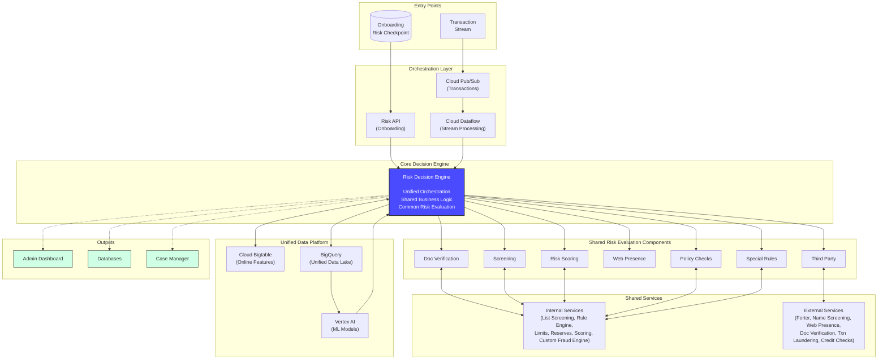

# Technical Narrative: Unified Risk Management Platform on Google Cloud

This document provides a comprehensive technical guide for implementing a unified risk management platform on Google Cloud that serves both onboarding risk assessment and transaction monitoring use cases. It demonstrates how a single platform architecture can efficiently handle both synchronous onboarding decisions and high-throughput transaction stream processing.

The core objective is to build a unified, intelligent platform that eliminates silos, shares intelligence across use cases, and leverages Google Cloud's managed services to accelerate development and reduce operational overhead.

---

## 1. Unified Platform Architecture Overview

The platform is built around a central **Risk Decision Engine** that serves both use cases through different entry points while sharing the same risk evaluation components, services, and data infrastructure.



---

## 2. Dual Entry Points: Onboarding and Transactions

### 2.1 Onboarding Entry Point

**Purpose:** Handle synchronous onboarding applications requiring instant decisions.

**Architecture:**
```
User Application → Onboarding Risk Checkpoint → Risk API → Risk Decision Engine → Decision
```

**Implementation:**
- **Onboarding Risk Checkpoint:** Cloud Run service exposing REST API
- **Risk API:** Cloud Run service with API Gateway
- **Pattern:** Synchronous request-response
- **Latency Target:** < 5 seconds
- **Volume:** Thousands per day

**Request Flow:**
1. User submits onboarding application
2. Checkpoint validates and enriches data
3. Risk API routes to Risk Decision Engine
4. Engine executes risk checks in parallel
5. Decision returned synchronously
6. User receives immediate feedback

### 2.2 Transaction Entry Point

**Purpose:** Handle high-throughput transaction stream requiring sub-second decisions.

**Architecture:**
```
Transaction Events → Cloud Pub/Sub → Cloud Dataflow → Risk Decision Engine → Decision
```

**Implementation:**
- **Cloud Pub/Sub:** Scalable message ingestion
- **Cloud Dataflow:** Stream processing and enrichment
- **Pattern:** Asynchronous streaming
- **Latency Target:** < 100 milliseconds
- **Volume:** Millions per day

**Request Flow:**
1. Transaction event published to Pub/Sub
2. Dataflow enriches with features from Bigtable
3. Enriched event sent to Risk Decision Engine
4. Engine executes risk checks in parallel
5. Decision published to action topic
6. Downstream systems act on decision

---

## 3. Unified Risk Decision Engine

The Risk Decision Engine is the core component that serves both use cases through a unified orchestration layer.

### 3.1 Architecture

**Implementation on GCP:**
- **Cloud Run:** Containerized application with auto-scaling
- **Stateless Design:** Enables horizontal scaling
- **Configuration-Driven:** Rules and policies stored in Cloud Spanner
- **Workflow Orchestration:** Cloud Workflows for complex decision flows

### 3.2 Dual-Mode Operation

**Onboarding Mode:**
- Receives synchronous API calls from Risk API
- Executes comprehensive risk checks (2-5 seconds acceptable)
- Returns detailed decision with explanations
- Stores complete application data

**Transaction Mode:**
- Receives enriched events from Dataflow
- Executes optimized risk checks (< 100ms target)
- Returns binary decision (allow/block)
- Stores minimal transaction data

### 3.3 Shared Decision Logic

```python
class RiskDecisionEngine:
    def evaluate_risk(self, context):
        # Determine use case
        use_case = context.get('use_case')  # 'onboarding' or 'transaction'

        # Execute risk checks in parallel
        results = self.execute_parallel_checks(context, use_case)

        # Aggregate scores
        risk_score = self.aggregate_scores(results)

        # Apply business rules
        decision = self.apply_rules(risk_score, context, use_case)

        # Trigger outputs
        self.send_to_outputs(decision, context)

        return decision

    def execute_parallel_checks(self, context, use_case):
        # Shared checks for both use cases
        checks = [
            self.check_screening(context),
            self.check_scoring(context),
            self.check_policy(context),
            self.check_rules(context)
        ]

        # Use case specific checks
        if use_case == 'onboarding':
            checks.extend([
                self.check_document_verification(context),
                self.check_web_presence(context),
                self.check_third_party(context)
            ])

        # Execute in parallel
        return parallel_execute(checks)
```

---

## 4. Shared Risk Evaluation Components

All seven risk evaluation components serve both use cases with use-case-specific optimizations.

### 4.1 Document Verification

**Onboarding Use:**
- Full document parsing and validation
- Fraud signal detection
- Duplicate checking across all applications

**Transaction Use:**
- Receipt/invoice verification
- Document authenticity for high-value transactions
- Cached results for repeat customers

**GCP Implementation:**
- Document AI for parsing
- Cloud Vision API for fraud detection
- Cloud Spanner for duplicate tracking
- Cloud Storage for document archival

### 4.2 Screening

**Onboarding Use:**
- Comprehensive sanctions screening
- Blacklist checking
- Payment network compliance

**Transaction Use:**
- Real-time sanctions screening
- Cached screening results (with TTL)
- Incremental screening for new entities

**GCP Implementation:**
- Memorystore (Redis) for high-performance lookups
- Cloud Spanner for list storage
- Cloud Functions for list updates

### 4.3 Risk Scoring

**Onboarding Use:**
- Comprehensive fraud assessment
- Credit risk evaluation
- AML risk scoring

**Transaction Use:**
- Real-time fraud scoring
- Velocity checks
- Anomaly detection

**GCP Implementation:**
- Vertex AI endpoints for ML models
- Bigtable for feature storage
- BigQuery for model training
- Anti-Money Laundering AI for AML

**Shared Models:**
```
Customer Risk Model:
- Trained on: Onboarding + Transaction data
- Features: Demographics, behavior, transaction patterns
- Serves: Both use cases

Transaction Fraud Model:
- Trained on: Transaction data + Onboarding signals
- Features: Transaction attributes, customer history, onboarding risk
- Serves: Transaction monitoring

Onboarding Fraud Model:
- Trained on: Onboarding data + Transaction outcomes
- Features: Application attributes, document signals, future transaction behavior
- Serves: Onboarding assessment
```

### 4.4 Web Presence

**Onboarding Use:**
- Comprehensive business verification
- Review analysis
- Public database checks

**Transaction Use:**
- Cached business verification results
- Incremental checks for changes
- Reputation monitoring

**GCP Implementation:**
- Cloud Functions for web scraping
- Natural Language API for sentiment analysis
- Cloud Spanner for caching results

### 4.5 Policy Checks

**Onboarding Use:**
- Channel eligibility
- Initial limit assignment
- Reserve requirements

**Transaction Use:**
- Transaction limit enforcement
- Reserve balance checks
- Channel restrictions

**GCP Implementation:**
- Cloud Spanner for policy configuration
- Cloud Run service for policy evaluation
- Bigtable for customer limits

### 4.6 Special Rules

**Onboarding Use:**
- Segment-specific onboarding rules
- Industry compliance requirements
- Geographic restrictions

**Transaction Use:**
- Segment-specific transaction rules
- Industry-specific limits
- Geographic transaction restrictions

**GCP Implementation:**
- Cloud Run service with rule engine
- Cloud Spanner for rule configuration
- Cloud Logging for audit trail

### 4.7 Third Party

**Onboarding Use:**
- Industry-specific verification
- Credit bureau checks
- Business registry validation

**Transaction Use:**
- Transaction laundering detection
- Real-time fraud signals
- Network intelligence

**GCP Implementation:**
- API Gateway for third-party integrations
- Cloud Tasks for async calls
- Memorystore for response caching

---

## 5. Shared Services Integration

Both internal and external services serve both use cases through standardized interfaces.

### 5.1 Internal Services

**List Screening:**
- **Onboarding:** Check applicant against proprietary lists
- **Transaction:** Check transaction parties against lists
- **Implementation:** Cloud Run + Cloud Spanner + Memorystore

**Rule Engine:**
- **Onboarding:** Execute onboarding-specific rules
- **Transaction:** Execute transaction-specific rules
- **Shared:** Common rule evaluation framework
- **Implementation:** Cloud Run + Cloud Spanner

**Limits:**
- **Onboarding:** Assign initial limits
- **Transaction:** Enforce transaction limits
- **Shared:** Unified limit management
- **Implementation:** Cloud Run + Cloud Spanner

**Reserves:**
- **Onboarding:** Validate reserve requirements
- **Transaction:** Check reserve balance
- **Shared:** Real-time reserve tracking
- **Implementation:** Cloud Run + Cloud Spanner

**Scoring:**
- **Onboarding:** Generate onboarding risk score
- **Transaction:** Generate transaction risk score
- **Shared:** Common scoring models
- **Implementation:** Vertex AI endpoints

**Custom Fraud Engine:**
- **Onboarding:** Detect onboarding fraud patterns
- **Transaction:** Detect transaction fraud patterns
- **Shared:** Proprietary fraud detection logic
- **Implementation:** Cloud Run + custom algorithms

### 5.2 External Services

All external services are integrated through API Gateway with unified error handling, retry logic, and caching.

**Integration Pattern:**
```
Risk Decision Engine → API Gateway → External Service
                    ← Response Cache ← Memorystore
```

**Services:**
- Forter: Fraud prevention for both use cases
- Name Screening: Sanctions and PEP screening
- Web Presence: Business verification
- Doc Verification: Document authentication
- Txn Laundering: Transaction pattern analysis
- Credit Checks: Credit risk assessment

---

## 6. Unified Data Platform

### 6.1 Cloud Bigtable: Online Feature Store

**Purpose:** Serve real-time features for both use cases.

**Schema Design:**
```
Row Key: customer_id#feature_name
Column Families:
- onboarding: Features from onboarding process
- transactions: Aggregated transaction features
- risk: Risk scores and signals
- external: Third-party data
```

**Use Cases:**
- **Onboarding:** Lookup customer history, previous applications
- **Transaction:** Lookup customer profile, transaction velocity
- **Shared:** AML scores, screening results, risk signals

**Performance:**
- Sub-10ms latency for feature lookups
- Millions of reads per second
- Automatic scaling

### 6.2 BigQuery: Unified Data Lake

**Purpose:** Single source of truth for all data and analytics.

**Schema Design:**
```sql
-- Onboarding Applications
CREATE TABLE onboarding_applications (
    application_id STRING,
    customer_id STRING,
    timestamp TIMESTAMP,
    application_data JSON,
    risk_scores JSON,
    decision STRING,
    decision_reason STRING
)
PARTITION BY DATE(timestamp)
CLUSTER BY customer_id;

-- Transactions
CREATE TABLE transactions (
    transaction_id STRING,
    customer_id STRING,
    timestamp TIMESTAMP,
    transaction_data JSON,
    risk_scores JSON,
    decision STRING,
    decision_reason STRING
)
PARTITION BY DATE(timestamp)
CLUSTER BY customer_id;

-- Unified Customer Risk Profile
CREATE VIEW customer_risk_profile AS
SELECT
    customer_id,
    MAX(onboarding_risk_score) as onboarding_risk,
    AVG(transaction_risk_score) as avg_transaction_risk,
    COUNT(DISTINCT CASE WHEN decision = 'BLOCK' THEN transaction_id END) as blocked_transactions,
    MAX(timestamp) as last_activity
FROM (
    SELECT customer_id, risk_scores.fraud_score as onboarding_risk_score,
           NULL as transaction_risk_score, decision, NULL as transaction_id, timestamp
    FROM onboarding_applications
    UNION ALL
    SELECT customer_id, NULL as onboarding_risk_score,
           risk_scores.fraud_score as transaction_risk_score, decision, transaction_id, timestamp
    FROM transactions
)
GROUP BY customer_id;
```

**Use Cases:**
- **Analytics:** Holistic customer journey analysis
- **Model Training:** Combined datasets for ML models
- **Compliance:** Unified audit trail and reporting
- **Business Intelligence:** Dashboards and reports

### 6.3 Vertex AI: Unified ML Platform

**Purpose:** Train and serve ML models for both use cases.

**Model Architecture:**
```
Shared Feature Engineering:
- Customer demographics
- Historical behavior
- Risk signals
- External data

Onboarding Model:
- Input: Application data + Shared features
- Output: Onboarding fraud probability
- Training: Onboarding data + Transaction outcomes

Transaction Model:
- Input: Transaction data + Shared features + Onboarding signals
- Output: Transaction fraud probability
- Training: Transaction data + Onboarding signals

Unified Customer Risk Model:
- Input: All onboarding + transaction data
- Output: Comprehensive customer risk score
- Training: Combined dataset
```

**Implementation:**
- Vertex AI Pipelines for automated training
- Vertex AI Endpoints for model serving
- Vertex AI Feature Store for feature management
- BigQuery ML for rapid prototyping

---

## 7. Data Flow Patterns

### 7.1 Onboarding Data Flow

```
1. Application Submitted
   ↓
2. Onboarding Risk Checkpoint (Cloud Run)
   ↓
3. Risk API (Cloud Run)
   ↓
4. Risk Decision Engine (Cloud Run)
   ├→ Lookup Features (Bigtable)
   ├→ Execute Risk Checks (Parallel)
   ├→ Call ML Models (Vertex AI)
   ├→ Query Services (Internal + External)
   ↓
5. Aggregate & Decide
   ↓
6. Store Decision
   ├→ Cloud Spanner (Transactional)
   ├→ BigQuery (Analytical)
   └→ Bigtable (Features)
   ↓
7. Trigger Outputs
   ├→ Admin Dashboard
   ├→ Case Manager
   └→ Response to User
```

### 7.2 Transaction Data Flow

```
1. Transaction Event
   ↓
2. Cloud Pub/Sub
   ↓
3. Cloud Dataflow
   ├→ Enrich with Features (Bigtable)
   ├→ Enrich with Onboarding Data (BigQuery)
   ↓
4. Risk Decision Engine (Cloud Run)
   ├→ Execute Risk Checks (Parallel, Optimized)
   ├→ Call ML Models (Vertex AI)
   ├→ Query Services (Cached)
   ↓
5. Aggregate & Decide (< 100ms)
   ↓
6. Store Decision
   ├→ BigQuery (Streaming Insert)
   └→ Bigtable (Update Features)
   ↓
7. Publish Decision
   ├→ Pub/Sub (Actions Topic)
   └→ Downstream Systems
```

### 7.3 Intelligence Feedback Loop

```
Onboarding → Transaction:
1. Onboarding decision stored in Bigtable
2. Transaction monitoring reads onboarding risk
3. Transaction model uses onboarding signals as features
4. High-risk onboarding → Enhanced transaction monitoring

Transaction → Onboarding:
1. Transaction patterns analyzed in BigQuery
2. Fraud typologies identified
3. Onboarding rules updated
4. Onboarding models retrained with transaction outcomes

Continuous Learning:
1. Combined dataset in BigQuery
2. Unified models trained on both use cases
3. Models deployed to Vertex AI
4. Both use cases benefit from improved models
```

---

## 8. Performance Optimization

### 8.1 Caching Strategy

**Multi-Tier Caching:**
```
L1: Application Cache (in-memory)
- Hot data: Customer risk scores, recent decisions
- TTL: 1 minute
- Hit rate target: 80%

L2: Memorystore (Redis)
- Warm data: Screening results, external service responses
- TTL: 5-60 minutes
- Hit rate target: 60%

L3: Bigtable
- Cold data: Historical features, aggregates
- TTL: Indefinite
- Hit rate target: 40%
```

### 8.2 Parallel Execution

**Risk Check Parallelization:**
```python
async def execute_risk_checks(context):
    # Execute all checks in parallel
    results = await asyncio.gather(
        check_document_verification(context),
        check_screening(context),
        check_scoring(context),
        check_web_presence(context),
        check_policy(context),
        check_rules(context),
        check_third_party(context)
    )
    return aggregate_results(results)
```

### 8.3 Use Case Specific Optimizations

**Onboarding:**
- Comprehensive checks acceptable (2-5 seconds)
- Full feature computation
- Detailed explanations
- Complete data storage

**Transaction:**
- Optimized checks required (< 100ms)
- Cached features preferred
- Binary decisions
- Minimal data storage

---

## 9. Scalability Architecture

### 9.1 Horizontal Scaling

**Cloud Run:**
- Auto-scales based on request volume
- Separate instances for onboarding and transaction workloads
- Shared container image with configuration-based behavior

**Dataflow:**
- Auto-scales based on Pub/Sub backlog
- Separate pipelines for different transaction types
- Shared processing logic

**Bigtable:**
- Automatic scaling based on load
- Separate node pools for different access patterns
- Replication for high availability

### 9.2 Load Distribution

**Onboarding:**
- Predictable daily patterns
- Lower volume, higher latency tolerance
- Resource allocation: 20% of total capacity

**Transaction:**
- Variable traffic patterns
- High volume, low latency requirement
- Resource allocation: 80% of total capacity

### 9.3 Multi-Region Deployment

**Architecture:**
```
Region 1 (Primary):
- Full platform deployment
- Read/write to all data stores
- Serves both use cases

Region 2 (Secondary):
- Full platform deployment
- Read/write to all data stores
- Active-active for both use cases

Global Load Balancer:
- Routes based on geography
- Health check based failover
- Latency-based routing
```

---

## 10. Security and Compliance

### 10.1 Data Protection

**Encryption:**
- At rest: Cloud KMS for all data stores
- In transit: TLS 1.3 for all communications
- Application-level: Tokenization for PII

**Access Control:**
- IAM policies with least privilege
- Service accounts for inter-service communication
- VPC Service Controls for network perimeter

### 10.2 Audit and Compliance

**Unified Audit Trail:**
```sql
-- Complete customer journey
SELECT
    customer_id,
    'onboarding' as event_type,
    timestamp,
    decision,
    decision_reason
FROM onboarding_applications
WHERE customer_id = 'CUSTOMER_123'

UNION ALL

SELECT
    customer_id,
    'transaction' as event_type,
    timestamp,
    decision,
    decision_reason
FROM transactions
WHERE customer_id = 'CUSTOMER_123'

ORDER BY timestamp;
```

**Compliance Features:**
- Complete data lineage tracking
- Explainable AI for model decisions
- Automated compliance reporting
- Data retention policies

### 10.3 Security Monitoring

- Security Command Center for unified security posture
- Cloud Armor for DDoS protection
- Cloud Logging for security events
- Automated alerting for anomalies

---

## 11. Monitoring and Observability

### 11.1 Unified Metrics

**Platform Metrics:**
- Request volume (onboarding vs transaction)
- Latency (p50, p95, p99)
- Error rates
- Resource utilization

**Business Metrics:**
- Approval rates by use case
- False positive rates
- Fraud detection rates
- Manual review rates

**ML Metrics:**
- Model accuracy
- Feature drift
- Prediction latency
- Model version distribution

### 11.2 Dashboards

**Operational Dashboard:**
- Real-time traffic by use case
- System health indicators
- Error rates and alerts
- Resource utilization

**Business Dashboard:**
- Decision distribution
- Risk score distribution
- Fraud detection trends
- Customer journey analytics

### 11.3 Alerting

**Critical Alerts:**
- System downtime
- High error rates
- Latency SLA breaches
- Security incidents

**Warning Alerts:**
- Elevated false positive rates
- Model performance degradation
- Resource capacity warnings
- External service failures

---

## 12. Cost Optimization

### 12.1 Shared Infrastructure Benefits

**Cost Savings:**
- Single Risk Decision Engine (vs two separate systems)
- Shared data infrastructure (BigQuery, Bigtable)
- Unified ML platform (Vertex AI)
- Consolidated monitoring and operations

**Estimated TCO Reduction:** 40-50% vs separate systems

### 12.2 Resource Optimization

**Compute:**
- Auto-scaling based on actual demand
- Separate scaling policies for each use case
- Spot instances for batch processing

**Storage:**
- BigQuery partitioning and clustering
- Bigtable compaction and garbage collection
- Data lifecycle policies for archival

**Networking:**
- VPC peering to reduce egress costs
- Regional deployment to minimize cross-region traffic
- CDN for static content

---

## 13. Conclusion

This unified platform architecture provides a comprehensive, scalable, and cost-effective foundation for both onboarding risk assessment and transaction monitoring on Google Cloud.

**Key Technical Advantages:**
- **Unified Architecture:** Single platform serving both use cases
- **Shared Intelligence:** Models and features benefit both use cases
- **Optimized Performance:** Use-case-specific optimizations within shared framework
- **Reduced Complexity:** One platform to build, deploy, and maintain
- **Lower TCO:** Shared infrastructure and operations

**Platform Capabilities:**
- Handles thousands of onboarding applications per day (< 5s latency)
- Processes millions of transactions per day (< 100ms latency)
- Provides holistic customer risk profiles
- Enables continuous learning and improvement
- Supports regulatory compliance and audit requirements

The platform is designed to evolve with your business, supporting new use cases, risk checks, and integration partners without requiring fundamental architectural changes.

---

## 14. Google Cloud Services Reference

This section provides a comprehensive overview of all Google Cloud services used in the Unified Risk Management Platform, organized by category.

| Service Name | Category | Primary Use Case | Component(s) Using It | Notes |
|:---|:---|:---|:---|:---|
| **Cloud Run** | Compute & Application | Application hosting | Risk Decision Engine, Risk API, Checkpoint, Internal Services | Serverless container platform with auto-scaling |
| **Cloud Functions** | Compute & Application | Event-driven processing | Web scraping, list updates, case triggers | Serverless functions for specific tasks |
| **Cloud Workflows** | Compute & Application | Workflow orchestration | Risk Decision Engine (optional) | Complex decision flow orchestration |
| **Vertex AI** | AI & Machine Learning | ML model serving | Risk Scoring (onboarding, transaction, unified models) | Managed ML platform for custom models |
| **Vertex AI Pipelines** | AI & Machine Learning | ML workflow automation | Model training automation | Automated ML lifecycle management |
| **Vertex AI Feature Store** | AI & Machine Learning | Feature management | Feature serving for training and prediction | Centralized feature management |
| **BigQuery ML** | AI & Machine Learning | Model training | Rapid prototyping | SQL-based model training |
| **Anti-Money Laundering AI** | AI & Machine Learning | AML risk assessment | Risk Scoring (both use cases) | Pre-trained AML models |
| **Document AI** | AI & Machine Learning | Document parsing | Document Verification (onboarding, transactions) | Identity document processing |
| **Cloud Vision API** | AI & Machine Learning | Image analysis | Document Verification | Fraud detection, tampering detection |
| **Natural Language API** | AI & Machine Learning | Text analysis | Web Presence | Review sentiment analysis |
| **Cloud Spanner** | Data Storage & Databases | Transactional data | Databases output, Limits, Reserves, duplicate tracking, policy config, rule config, screening lists, caching | Globally distributed relational database |
| **BigQuery** | Data Storage & Databases | Unified data warehouse | Analytics, model training, unified data lake | Serverless data warehouse for both use cases |
| **Cloud Bigtable** | Data Storage & Databases | Online feature store | Real-time feature serving for both use cases | NoSQL wide-column database, sub-10ms latency |
| **Memorystore (Redis)** | Data Storage & Databases | High-performance caching | Screening, external service caching, multi-tier cache | Managed Redis for sub-ms lookups |
| **Cloud Storage** | Data Storage & Databases | Object storage | Document archival, data retention | Secure file storage |
| **API Gateway** | Networking & API Management | API management | Risk API, third-party integrations | External API access and routing |
| **Cloud Tasks** | Networking & API Management | Async task processing | Third-party calls, async checks | Reliable job execution |
| **Cloud Pub/Sub** | Networking & API Management | Event streaming | Transaction events, actions topic, outputs | Scalable messaging for both use cases |
| **Cloud Dataflow** | Data Processing | Stream processing | Transaction stream processing, enrichment | Apache Beam-based real-time processing |
| **Cloud KMS** | Security & Compliance | Encryption | All data stores | Key management for encryption at rest |
| **Cloud DLP** | Security & Compliance | Data protection | PII tokenization | Sensitive data discovery and protection |
| **Secret Manager** | Security & Compliance | Credential management | All services | Secure secret storage |
| **Security Command Center** | Security & Compliance | Security posture | Platform-wide | Unified security management |
| **Cloud Armor** | Security & Compliance | DDoS protection | API Gateway | Web application firewall |
| **VPC Service Controls** | Security & Compliance | Network security | Platform-wide | Network perimeter security |
| **IAM** | Security & Compliance | Access control | Platform-wide | Identity and access management |
| **Cloud Monitoring** | Monitoring & Operations | Metrics and monitoring | Platform-wide (both use cases) | System and application metrics |
| **Cloud Logging** | Monitoring & Operations | Log management | Platform-wide, audit trails | Centralized logging |
| **Cloud Trace** | Monitoring & Operations | Distributed tracing | Platform-wide | Request tracing across services |
| **Looker Studio** | Analytics & Visualization | Dashboards | Admin Dashboard (both use cases) | Business intelligence and reporting |
| **Cloud Build** | DevOps & Deployment | CI/CD pipelines | Platform-wide | Automated build and deployment |
| **Artifact Registry** | DevOps & Deployment | Container storage | Platform-wide | Container image management |
| **Cloud Deploy** | DevOps & Deployment | Progressive delivery | Platform-wide | Deployment automation |
| **Cloud Composer** | DevOps & Deployment | Workflow orchestration | Model retraining automation | Managed Apache Airflow |

**Total: 33 Google Cloud Services**

### Service Categories Summary

- **Compute & Application:** 3 services
- **AI & Machine Learning:** 8 services
- **Data Storage & Databases:** 4 services
- **Networking & API Management:** 3 services
- **Data Processing:** 1 service
- **Security & Compliance:** 7 services
- **Monitoring & Operations:** 3 services
- **Analytics & Visualization:** 1 service
- **DevOps & Deployment:** 4 services

### Key Architectural Patterns

1. **Dual-Mode Serverless:** Cloud Run serves both synchronous (onboarding) and asynchronous (transaction) patterns
2. **Unified Data Platform:** BigQuery + Bigtable provide complete data solution for both use cases
3. **Streaming-First for Transactions:** Cloud Pub/Sub + Dataflow enable real-time transaction processing
4. **Shared ML Infrastructure:** Vertex AI serves models for both onboarding and transaction monitoring
5. **Intelligence Feedback Loops:** Unified data enables cross-use case learning and improvement

### Unified Platform Advantages

**Compared to Separate Systems:**
- **Shared Infrastructure:** Single set of services serves both use cases (40-50% cost reduction)
- **Unified Data:** BigQuery and Bigtable enable holistic customer risk profiles
- **Cross-Use Case Intelligence:** Models trained on combined data outperform siloed models
- **Operational Simplicity:** One platform to monitor, secure, and optimize
